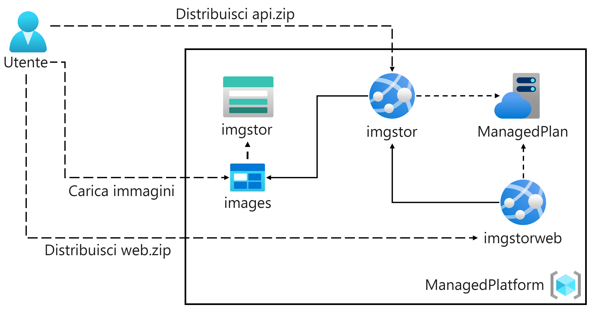
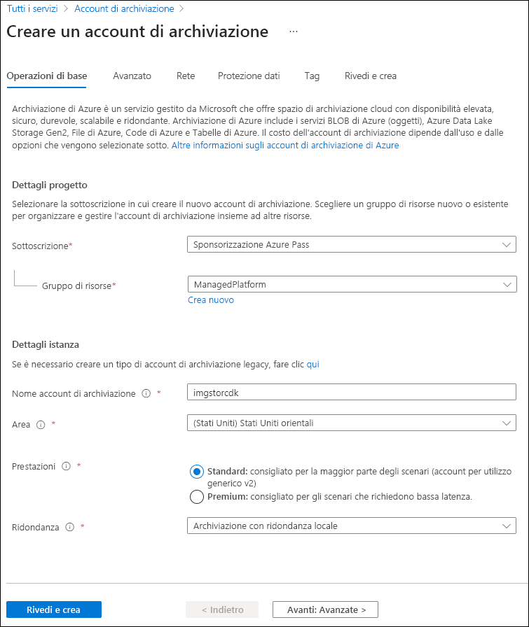
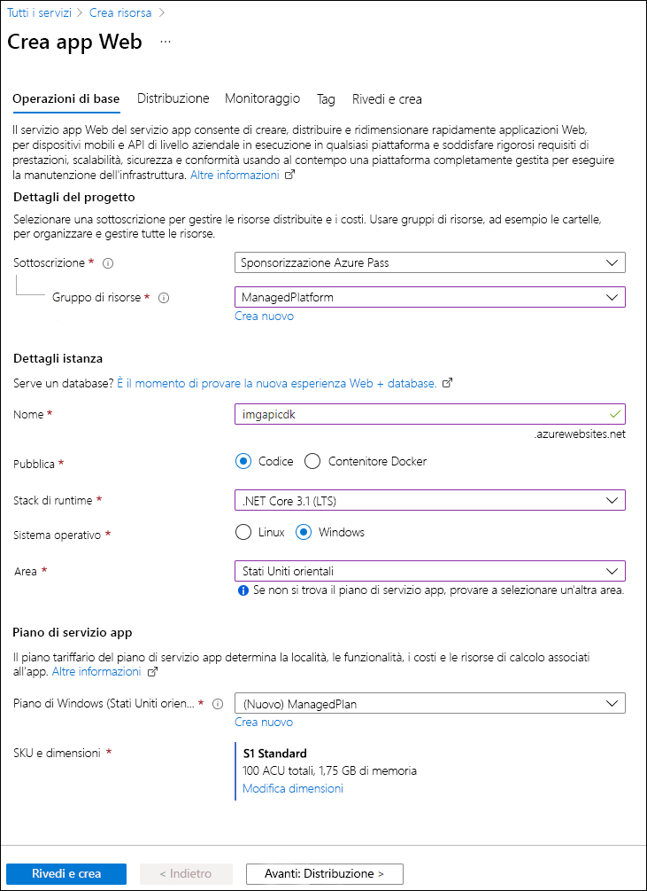
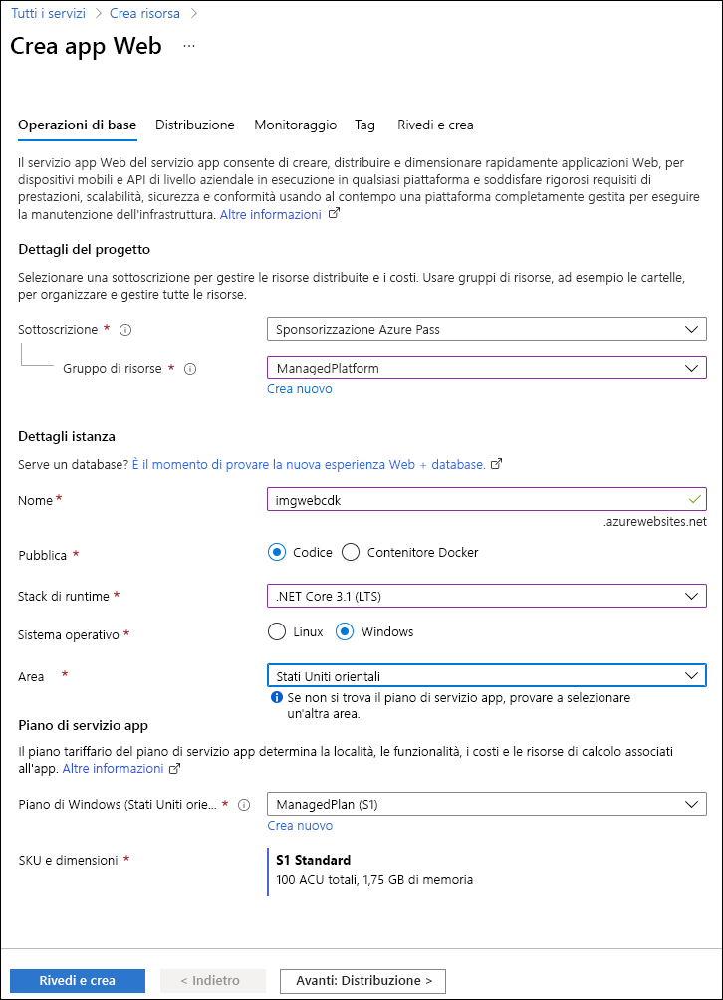

---
lab:
  az204Title: 'Lab 01: Build a web application on Azure platform as a service offerings'
  az204Module: 'Learning Path 01: Implement Azure App Service Web Apps'
---

# Lab 01: Creare un'applicazione Web nell'offerta di piattaforma distribuita come servizio di Azure

## Interfaccia utente di Microsoft Azure

Considerata la natura dinamica degli strumenti cloud di Microsoft, è possibile rilevare modifiche all'interfaccia utente di Azure apportate dopo lo sviluppo di questo contenuto per la formazione. È quindi possibile che le istruzioni e le procedure del lab non siano allineate correttamente.

Microsoft aggiorna questo corso di formazione quando la community segnala le modifiche necessarie. Poiché gli aggiornamenti cloud vengono apportati spesso, tuttavia, è possibile che si rilevino modifiche all'interfaccia utente prima degli aggiornamenti del contenuto per la formazione. **In questo caso, adattarsi alle modifiche e quindi eseguire le operazioni necessarie nei lab.**

## Istruzioni

### Prima di iniziare

#### Accedere all'ambiente lab

Accedere alla macchina virtuale Windows 11 usando le credenziali seguenti:

- Nome utente: `Admin`
- Password: `Pa55w.rd`

> **Nota**: il docente fornirà le istruzioni necessarie per la connessione all'ambiente lab virtuale.

#### Esaminare le applicazioni installate

Trovare la barra delle applicazioni nel desktop di Windows 11. La barra delle applicazioni include le icone per le applicazioni che verranno usate nel lab, tra cui:

- Microsoft Edge
- Esplora file
- Terminale
- Visual Studio Code

## Scenario del lab

In questo lab si esaminerà come creare un'applicazione Web in Azure usando il modello PaaS. Dopo aver creato l'applicazione Web, si apprenderà a caricare i file dell'applicazione Web esistenti usando l'opzione di distribuzione zip Apache Kudu. Verrà quindi visualizzata e testata l'applicazione Web appena distribuita.

<em>Per visualizzare questo video, fare clic con il pulsante destro del mouse su questo **[collegamento al video](https://youtu.be/EiSEcU9qjfo)** e selezionare 'Apri collegamento in una nuova scheda / nuova finestra'.</em>


## Diagramma dell'architettura



### Esercizio 1: Creare un'API back-end usando Archiviazione di Azure e la funzionalità App Web del servizio app di Azure

#### Attività 1: Aprire il portale di Azure

1. Sulla barra delle applicazioni selezionare l'icona di **Microsoft Edge**.

1. Nella finestra del browser passare al portale di Azure in `https://portal.azure.com` e quindi accedere con l'account che verrà usato per questo lab.

   > **Nota**: se si sta eseguendo l'accesso al portale di Azure per la prima volta, verrà visualizzata una presentazione del portale. Per ignorare la presentazione e iniziare a usare il portale, selezionare **Magari più tardi**.

#### Attività 2: Creare un account di archiviazione

1. Nel portale di Azure usare la casella di testo **Cerca risorse, servizi e documentazione** per cercare **Account di archiviazione** e quindi nell'elenco di risultati selezionare **Account di archiviazione**.

1. Nel riquadro **Account di archiviazione** selezionare **+ Crea**.

1. Nella scheda  **Informazioni di base**  del pannello **Crea un account di archiviazione** eseguire le azioni seguenti e selezionare **Rivedi**:

    | Impostazione | Azione |
    |--|--|
    | Elenco a discesa **Sottoscrizione** | Mantenere il valore predefinito |
    | Sezione **Gruppo di risorse** | Selezionare **Crea nuovo**, immettere **ManagedPlatform** e quindi selezionare **OK** |
    | Casella di testo **Nome account di archiviazione**  | Immettere **imgstor**_[nomeutente]_ |
    | Elenco a discesa **Area** | Selezionare **(Stati Uniti) Stati Uniti orientali** |
    | Sezione **Prestazioni** | Selezionare l'opzione **Standard** |
    | Elenco a discesa **Ridondanza** | Selezionare **Archiviazione con ridondanza locale**. |

   Lo screenshot seguente mostra le impostazioni configurate nella scheda **Informazioni di base** del pannello **Crea un account di archiviazione**.

   

1. Nella scheda **Rivedi** esaminare le opzioni selezionate durante i passaggi precedenti.

1. Selezionare **Crea** per creare l'account di archiviazione usando la configurazione specificata.

   > **Nota**: prima di procedere con il lab, attendere il completamento dell'attività di creazione.

1. Nel pannello **Panoramica** selezionare il pulsante **Vai alla risorsa** per passare al pannello dell'account di archiviazione appena creato.

1. Nella sezione  **Sicurezza e rete**  del pannello  **Account di archiviazione**  selezionare **Chiavi di accesso**.

1. Nel pannello **Chiavi di accesso**  esaminare una delle **stringhe di connessione** (usando il pulsante **Mostra**), quindi registrare il valore di una delle caselle **Stringa di connessione**  nel Blocco note. Le **Chiavi** sono chiavi di crittografia gestite dalla piattaforma e **non** vengono usate per questo lab.

   > **Nota**: la stringa di connessione scelta è irrilevante. Sono termini intercambiabili.

1. Aprire Blocco note e quindi incollare il valore della stringa di connessione copiato. Questo valore verrà usato più avanti nel lab.

#### Attività 3: Caricare un BLOB di esempio

1. Nel pannello **Account di archiviazione** selezionare il collegamento **Contenitori** nella sezione **Archiviazione dati**.

1. Nel pannello **Contenitori** selezionare **+ Contenitore**.

1. Nella finestra **Nuovo contenitore** eseguire le azioni seguenti e quindi selezionare **Crea**.

   | Impostazione | Azione |
   | --- | --- |
   | Casella di testo **Nome** | Immettere **images** |

1. Nel pannello **Contenitori** passare al contenitore **immagini** appena creato.

1. Nel pannello **images** selezionare **Carica**.

1. Nella finestra **Carica BLOB** eseguire le azioni seguenti:

    | Impostazione | Azione |
    |--|--|
    | Sezione **File** | Selezionare **Cerca file** o usare la funzionalità di trascinamento della selezione |
    | Finestra **Esplora file** | Passare a **Allfiles (F):\\Allfiles\\Labs\\01\\Starter\\Images**, selezionare il file **grilledcheese.jpg** e quindi selezionare **Apri** |
    | Casella di controllo **Sovrascrivi se i file esistono già** | Assicurarsi che la casella di controllo sia selezionata e quindi selezionare **Carica** |

    > **Nota**: prima di procedere con questo lab, attendere il completamento del caricamento del BLOB.

#### Attività 4: Creare un'app Web

1. Nel riquadro di spostamento del portale di Azure selezionare **Crea una risorsa**.

1. Nel pannello **Crea una risorsa**, nella casella di testo **Cerca servizi e marketplace**, immettere **App Web** e quindi premere INVIO.

1. Nel pannello dei risultati della ricerca **Marketplace** selezionare il risultato **App Web**.

1. Nel pannello **App Web** selezionare **Crea**.

1. Nella scheda **Informazioni di base** del pannello **Crea app Web** eseguire le azioni seguenti e selezionare la scheda **Monitoraggio**:

   | Impostazione                            | Azione                                                                                                  |
   | ---------------------------------- | ------------------------------------------------------------------------------------------------------- |
   | Elenco a discesa **Sottoscrizione**    | Mantenere il valore predefinito                                                                                |
   | Sezione **Gruppo di risorse**         | Selezionare **ManagedPlatform**                                                                              |
   | Casella di testo **Nome**                   | Immettere **imgapi**_[nomeutente]_                                                                            |
   | Sezione **Pubblica**                | Selezionare **Codice**                                                                                         |
   | Elenco a discesa **Stack di runtime**   | Selezionare **.NET 8 (LTS)**                                                                                 |
   | Sezione **Sistema operativo**       | selezionare **Windows**                                                                                      |
   | Elenco a discesa **Area**          | Selezionare l'area **Stati Uniti orientali**                                                                           |
   | Sezione **Piano Windows (Stati Uniti orientali)** | Selezionare **Crea nuovo**, immettere il valore **ManagedPlan** nella casella di testo **Nome** e quindi selezionare **OK** |
   | Sezione **Piano tariffario**           | Selezionare **Standard S1**                                                                                  |

   Lo screenshot seguente mostra le impostazioni configurate nel pannello **Crea app Web**.

   

1. Nella sezione **Abilita Application Insights** della scheda **Monitoraggio** selezionare **No** e quindi selezionare **Rivedi e crea**.

1. Nella scheda **Rivedi e crea** esaminare le opzioni selezionate durante i passaggi precedenti.

1. Selezionare **Crea** per creare l'app Web usando la configurazione specificata.

   > **Nota**: prima di procedere con il lab, attendere la creazione dell'app Web.

1. Nel pannello **Panoramica** selezionare **Vai alla risorsa** per passare al pannello dell'app Web appena creata.

#### Attività 5: Configurare l'app Web

1. Nel pannello **Servizio app** selezionare il collegamento **Variabili di ambiente** nella sezione **Impostazioni**.

1. Nella scheda **Impostazioni app** selezionare **+ Aggiungi**. Immettere le informazioni seguenti nella finestra di dialogo popup **Aggiungi/Modifica impostazione applicazione**:

    | Impostazione | Azione |
    |--|--|
    | Casella di testo **Nome** | Immettere **StorageConnectionString** |
    | Casella di testo **Valore** | Incollare la stringa di connessione dell'archiviazione copiata in precedenza in Blocco note |
    | Casella di controllo **Impostazione slot di distribuzione** | Mantenere il valore predefinito |

1. Selezionare **Applica** per chiudere la finestra di dialogo popup e tornare alla sezione **Impostazioni app**.

1. Nella parte inferiore della sezione **Impostazioni app**, selezionare **Applica**.

   >**Nota:** È possibile che venga visualizzato un avviso che indica che l'app potrebbe essere riavviata durante l'aggiornamento delle impostazioni dell'app. Seleziona **Conferma**. Prima di procedere con il lab, attendere il completamento del salvataggio delle impostazioni dell'applicazione.

1. Per ottenere l'URL del servizio app, passare al collegamento **Panoramica**, copiare il valore dalla sezione **Dominio predefinito** e incollarlo nel Blocco note. Nel Blocco note anteporre `https://` al nome di dominio. Questo valore verrà utilizzato più avanti nel lab.

   > **Nota**: a questo punto, il server Web in questo URL restituirà una pagina Web segnaposto. Non è ancora stato distribuito codice nell'app Web. Il codice verrà distribuito nell'app Web più avanti in questo lab.

#### Attività 6: Distribuire un'applicazione Web `ASP.NET` in App Web

1. Sulla barra delle applicazioni selezionare l'icona di **Visual Studio Code**.

1. Nel menu **File** selezionare **Apri cartella**.

1. Nella finestra **Esplora file** passare a **Allfiles (F):\\Allfiles\\Labs\\01\\Starter\\API** e quindi selezionare **Seleziona cartella**.

   > **Nota**: ignorare eventuali richieste per l'aggiunta degli asset necessari per la compilazione e il debug ed eseguire il comando di ripristino per risolvere le dipendenze non risolte.

1. Nel riquadro  **Esplora risorse**  della finestra di **Visual Studio Code** espandere la cartella  **Controller** e quindi selezionare il file **ImagesController.cs** per aprirlo nell'editor.

1. Nella classe **ImagesController** nell'editor, alla riga 26 osservare il metodo **GetCloudBlobContainer** e il codice usato per recuperare un contenitore.

1. Nella classe **ImagesController** alla riga 36 osservare il metodo **Get** e il codice usato per recuperare tutti i BLOB in modo asincrono dal contenitore **images**.

1. Nella classe **ImagesController** alla riga 68 osservare il metodo **Post** e il codice usato per salvare in modo permanente un'immagine caricata nell'archiviazione.

1. Sulla barra delle applicazioni selezionare l'icona **Terminale**.

1. Nel terminale aperto, immettere il comando seguente e quindi premere INVIO per accedere all'interfaccia della riga di comando di Azure:

   ```
   az login
   ```

1. Nella finestra del browser **Microsoft Edge** immettere l'indirizzo di posta elettronica e la password per l'account Microsoft e quindi selezionare **Accedi**.

1. Tornare alla finestra **Terminale** attualmente aperta. Attendere il completamento del processo di accesso.

1. Nel terminale, immettere il comando seguente e quindi premere INVIO per elencare tutte le app nel gruppo di risorse **ManagedPlatform**:

   ```
   az webapp list --resource-group ManagedPlatform
   ```

1. Immettere il comando seguente e quindi premere INVIO per trovare le app con il prefisso **imgapi\***:

   ```
   az webapp list --resource-group ManagedPlatform --query "[?starts_with(name, 'imgapi')]"
   ```

1. Immettere il comando seguente e quindi premere INVIO per eseguire il rendering solo del nome della singola app con il prefisso **imgapi\***:

   ```
   az webapp list --resource-group ManagedPlatform --query "[?starts_with(name, 'imgapi')].{Name:name}" --output tsv
   ```

1. Immettere il comando seguente e quindi premere INVIO per passare dalla directory corrente alla directory **Allfiles (F):\\Allfiles\\Labs\\01\\Starter\\API** che contiene i file del lab:

   ```
   cd F:\Allfiles\Labs\01\Starter\API\
   ```

1. Immettere il comando seguente e quindi premere INVIO per distribuire il file **api.zip** nell'app Web creata in precedenza in questo lab:

   ```
   az webapp deployment source config-zip --resource-group ManagedPlatform --src api.zip --name <name-of-your-api-app>
   ```

   > **Nota**: sostituire il segnaposto *\<name-of-your-api-app\>* con il nome dell'app Web creata in precedenza in questo lab. Di recente, nei passaggi precedenti, è stata eseguita una query sul nome dell'app.

   Prima di procedere con il lab, attendere, attendere il completamento della distribuzione.

1. Nel riquadro di **spostamento** del portale di Azure selezionare il collegamento **Gruppi di risorse**.

1. Nel pannello **Gruppi di risorse** selezionare il gruppo di risorse **ManagedPlatform** creato in precedenza in questo lab.

1. Nel pannello **ManagedPlatform** selezionare l'app Web **imgapi**_[nomeutente]_ creata in precedenza in questo lab.

1. Nel pannello **Servizio app** selezionare **Sfoglia**.

   > **Nota**: il comando **Sfoglia** eseguirà una richiesta GET nella radice del sito Web, che restituisce una matrice JSON (JavaScript Object Notation). Questa matrice conterrà l'URL per la singola immagine caricata nell'account di archiviazione.

1. Tornare alla finestra del browser contenente il portale di Azure.

1. Chiudere le applicazioni Visual Studio Code e Terminale attualmente in esecuzione.

#### Revisione

In questo esercizio è stata creata un'app Web in Azure e quindi l'applicazione Web `ASP.NET` è stata distribuita in App Web usando l'interfaccia della riga di comando di Azure e l'utilità di distribuzione di file ZIP Apache Kudu.

### Esercizio 2: Creare un'applicazione Web front-end usando App Web di Azure

#### Attività 1: Creare un'app Web

1. Nel riquadro di **spostamento** del portale di Azure selezionare **Crea una risorsa**.

1. Nel pannello **Crea una risorsa**, nella casella di testo **Cerca servizi e marketplace**, immettere **App Web** e quindi premere INVIO.

1. Nel pannello dei risultati della ricerca **Marketplace** selezionare **App Web**.

1. Nel pannello **App Web** selezionare **Crea**.

1. Nella scheda **Informazioni di base** del pannello **Crea app Web** eseguire le azioni seguenti e selezionare la scheda **Monitoraggio**:

   | Impostazione                            | Azione                        |
   | ---------------------------------- | ----------------------------- |
   | Elenco a discesa **Sottoscrizione**    | Mantenere il valore predefinito      |
   | Sezione **Gruppo di risorse**         | Selezionare **ManagedPlatform**    |
   | Casella di testo **Nome**                   | Immettere **imgweb**_[nomeutente]_  |
   | Sezione **Pubblica**                | Selezionare **Codice**               |
   | Elenco a discesa **Stack di runtime**   | Selezionare **.NET 8 (LTS)**       |
   | Sezione **Sistema operativo**       | selezionare **Windows**            |
   | Elenco a discesa **Area**          | Selezionare l'area **Stati Uniti orientali** |
   | Sezione **Piano Windows (Stati Uniti orientali)** | Selezionare **ManagedPlan (S1)**   |

Lo screenshot seguente mostra le impostazioni configurate nel pannello **Crea app Web**.



1. Nella sezione **Abilita Application Insights** della scheda **Monitoraggio** selezionare **No** e quindi selezionare **Rivedi e crea**.

1. Nella scheda **Rivedi e crea** esaminare le opzioni selezionate durante i passaggi precedenti.

1. Selezionare **Crea** per creare l'app Web usando la configurazione specificata.

   > **Nota**: prima di procedere con il lab, attendere il completamento dell'attività di creazione.

1. Nel pannello **Panoramica** selezionare **Vai alla risorsa** per passare al pannello dell'app Web appena creata.

#### Attività 2: Configurare un'app Web

1. Nel pannello **Servizio app** selezionare il collegamento **Variabili di ambiente** nella sezione **Impostazioni**.

1. Nella sezione **Variabili di ambiente** eseguire le azioni seguenti, selezionare **Salva** e quindi selezionare **Continua**:

    | Impostazione | Azione |
    |--|--|
    | Scheda **Impostazioni app** | Selezionare **Nuova impostazione applicazione** |
    | Finestra di dialogo popup **Aggiungi/Modifica impostazione applicazione** | Nella casella di testo **Nome** immettere **ApiUrl** |
    | Casella di testo **Valore** | Immettere l'URL dell'app Web copiato in precedenza in questo lab. **Nota**: assicurarsi di includere il protocollo **https://** nell'URL copiato nella casella di testo **Valore** per l'impostazione dell'applicazione |
    | Casella di controllo **Impostazione slot di distribuzione** | Mantenere il valore predefinito e quindi selezionare **OK** |
    | Fare clic su **Salva** nel menu in alto | In questo modo verrà salvato il valore di configurazione appena immesso |

   > **Nota**: prima di procedere con il lab, attendere il completamento del salvataggio delle impostazioni dell'applicazione.

#### Attività 3: Distribuire un'applicazione Web `ASP.NET` in App Web

1. Sulla barra delle applicazioni selezionare l'icona di **Visual Studio Code**.

1. Nel menu **File** selezionare **Apri cartella**.

1. Nella finestra **Esplora file** passare a **Allfiles (F):\\Allfiles\\Labs\\01\\Starter\\Web** e quindi selezionare **Seleziona cartella**.

   > **Nota**: ignorare eventuali richieste per l'aggiunta degli asset necessari per la compilazione e il debug ed eseguire il comando di ripristino per risolvere le dipendenze non risolte.

1. Nel riquadro  **Esplora risorse**  della finestra di **Visual Studio Code** espandere la cartella  **Pages** e quindi selezionare il file **Index.cshtml.cs** per aprirlo nell'editor.

1. Nella classe **IndexModel** nell'editor, alla riga 30 osservare il metodo **OnGetAsync** e il codice usato per recuperare l'elenco di immagini dall'API.

1. Nella classe **IndexModel** alla riga 41 osservare il metodo **OnPostAsync** e il codice usato per trasmettere in streaming un'immagine caricata all'API back-end.

1. Sulla barra delle applicazioni selezionare l'icona **Terminale**.

1. Nel terminale aperto, immettere il comando seguente e quindi premere INVIO per accedere all'interfaccia della riga di comando di Azure:

   ```
   az login
   ```

1. Nella finestra del browser **Microsoft Edge** immettere l'indirizzo di posta elettronica e la password per l'account Microsoft e quindi selezionare **Accedi**.

1. Tornare alla finestra **Terminale** attualmente aperta. Attendere il completamento del processo di accesso.

1. Immettere il comando seguente e quindi premere INVIO per elencare tutte le app nel gruppo di risorse **ManagedPlatform**:

   ```
   az webapp list --resource-group ManagedPlatform
   ```

1. Immettere il comando seguente e quindi premere INVIO per trovare le app con il prefisso **imgweb\***:

   ```
   az webapp list --resource-group ManagedPlatform --query "[?starts_with(name, 'imgweb')]"
   ```

1. Immettere il comando seguente e quindi premere INVIO per eseguire il rendering solo del nome della singola app con il prefisso **imgweb\***:

   ```
   az webapp list --resource-group ManagedPlatform --query "[?starts_with(name, 'imgweb')].{Name:name}" --output tsv
   ```

1. Immettere il comando seguente e quindi premere INVIO per passare dalla directory corrente alla directory **Allfiles (F):\\Allfiles\\Labs\\01\\Starter\\Web** che contiene i file del lab:

   ```
   cd F:\Allfiles\Labs\01\Starter\Web\
   ```

1. Immettere il comando seguente e quindi premere INVIO per distribuire il file **web.zip** nell'app Web creata in precedenza in questo lab:

   ```
   az webapp deployment source config-zip --resource-group ManagedPlatform --src web.zip --name <name-of-your-web-app>
   ```

   > **Nota**: sostituire il segnaposto *\<name-of-your-web-app\>* con il nome dell'app Web creata in precedenza in questo lab. Di recente, nei passaggi precedenti, è stata eseguita una query sul nome dell'app.

   Prima di procedere con il lab, attendere, attendere il completamento della distribuzione.

1. Nel riquadro di **spostamento** del portale di Azure selezionare **Gruppi di risorse**.

1. Nel pannello **Gruppi di risorse** selezionare il gruppo di risorse **ManagedPlatform** creato in precedenza in questo lab.

1. Nel pannello **ManagedPlatform** selezionare l'app Web **imgweb**_[nomeutente]_ creata in precedenza in questo lab.

1. Nel pannello **Servizio app** selezionare **Sfoglia**.

1. Osservare l'elenco di immagini nella raccolta. La raccolta conterrà una singola immagine caricata nell'archiviazione in precedenza nel lab.

1. Nella pagina Web **Contoso Photo Gallery**, nella sezione **Upload a new image** (Carica una nuova immagine) eseguire le azioni seguenti:

   a. Selezionare **Sfoglia**.

   b. Nella finestra **Esplora file** passare a **Allfiles (F):\\Allfiles\\Labs\\01\\Starter\\Images**, selezionare il file **banhmi.jpg** e quindi selezionare **Apri**.

   c. Selezionare **Carica**.

1. Osservare che l'elenco di immagini della raccolta è stato aggiornato con la nuova immagine.

   > **Nota**: in alcuni rari casi può essere necessario aggiornare la finestra del browser per recuperare la nuova immagine.

1. Tornare alla finestra del browser contenente il portale di Azure.

1. Chiudere le applicazioni Visual Studio Code e Terminale attualmente in esecuzione.

#### Revisione

In questo esercizio è stata creata un'app Web di Azure ed è stato distribuito il codice di un'applicazione Web esistente nella risorsa nel cloud.
