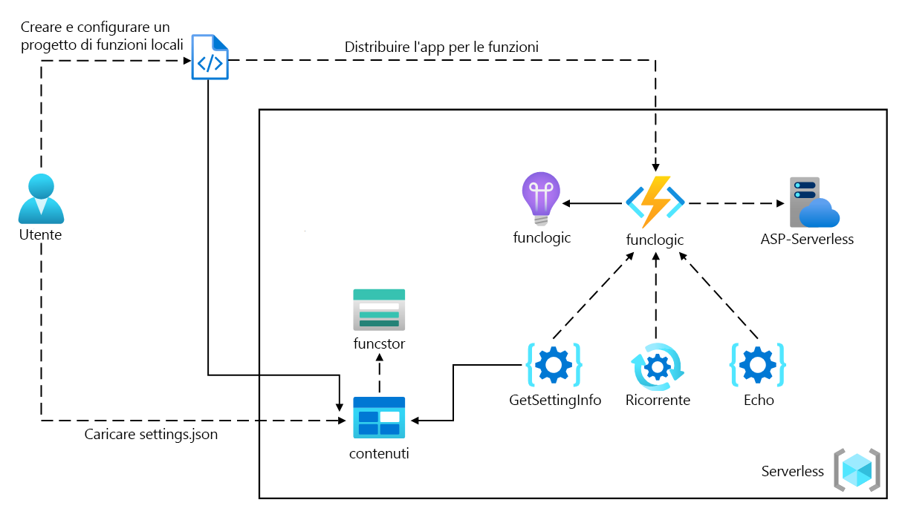
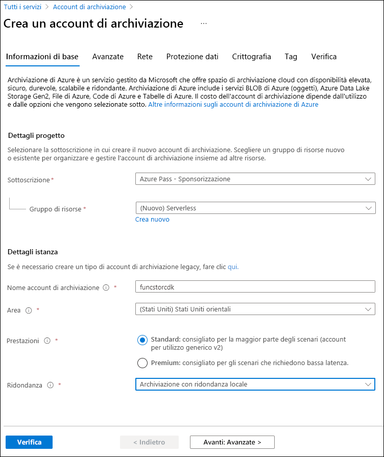
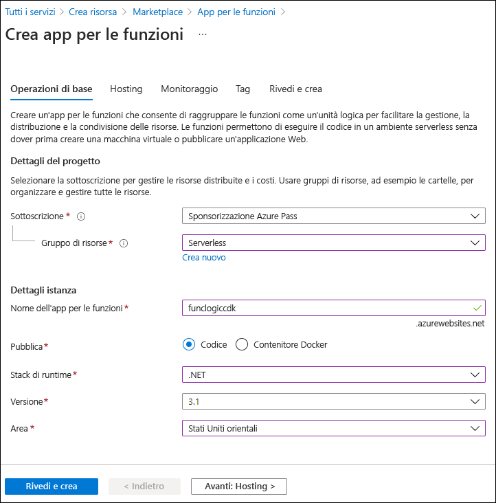

---
lab:
  az204Title: 'Lab 02: Implement task processing logic by using Azure Functions'
  az204Module: 'Learning Path 02: Implement Azure Functions'
---

# Lab 02: Implementare la logica di elaborazione delle attività con Funzioni di Azure

## Interfaccia utente di Microsoft Azure

Considerata la natura dinamica degli strumenti cloud di Microsoft, è possibile rilevare modifiche all'interfaccia utente di Azure apportate dopo lo sviluppo di questo contenuto per la formazione. È quindi possibile che le istruzioni e le procedure del lab non siano allineate correttamente.

Microsoft aggiorna questo corso di formazione quando la community segnala le modifiche necessarie. Poiché gli aggiornamenti cloud vengono apportati spesso, tuttavia, è possibile che si rilevino modifiche all'interfaccia utente prima degli aggiornamenti del contenuto per la formazione. **In questo caso, adattarsi alle modifiche e quindi eseguire le operazioni necessarie nei lab.**

## Istruzioni

### Prima di iniziare

#### Accedere all'ambiente lab

Accedere alla macchina virtuale Windows 11 usando le credenziali seguenti:

- Nome utente: `Admin`
- Password: `Pa55w.rd`

> **Nota**: il docente fornirà le istruzioni necessarie per la connessione all'ambiente lab virtuale.

#### Esaminare le applicazioni installate

Trova la barra delle applicazioni sul desktop di Windows 11. La barra delle applicazioni include le icone per le applicazioni che verranno usate nel lab, tra cui:

- Microsoft Edge
- Esplora file
- Terminale
- Visual Studio Code

## Lab Scenario

In questo lab verrà illustrata la possibilità di creare una semplice funzione di Azure che restituisce testo immesso e inviato alla funzione usando i comandi HTTP POST. Verrà illustrato come la funzione può essere attivata tramite HTTP. 

Verrà inoltre illustrato come eseguire una funzione di Azure impostandola su una pianificazione fissa. La funzione scriverà un messaggio in un log ogni volta che viene attivata la pianificazione.

Infine, verrà illustrato come una funzione di Azure può connettersi ad altre risorse di Azure, ad esempio un account di archiviazione. La funzione si connetterà a un account di archiviazione creato e restituito il contenuto di un file archiviato nell'account di archiviazione di Azure.

<em>Per visualizzare questo video, fare clic con il pulsante destro del mouse su questo **[collegamento al video](https://youtu.be/-3tneDvkYDo)** e selezionare 'Apri collegamento in una nuova scheda / nuova finestra'.</em>

 

### Diagramma dell'architettura



### Esercizio 1: Creare risorse di Azure

#### Attività 1: Aprire il portale di Azure

1. Sulla barra delle applicazioni selezionare l'icona di **Microsoft Edge**.
1. Nella finestra del browser passare al portale di Azure in `https://portal.azure.com`e quindi accedere con l'account che verrà usato per questo lab.

    > **Nota**: se si sta eseguendo l'accesso al portale di Azure per la prima volta, verrà visualizzata una presentazione del portale. Selezionare **Attività iniziali** per ignorare la presentazione e iniziare a usare il portale.

#### Attività 2: Creare un account di archiviazione di Azure

1. Nel portale di Azure usare la casella di testo **Cerca risorse, servizi e documentazione** per cercare **Account di archiviazione** e quindi nell'elenco di risultati selezionare **Account di archiviazione**.

1. Nel riquadro **Account di archiviazione** selezionare **+ Crea**.

1. Nella scheda **Informazioni di base** del pannello **Crea un account di archiviazione** eseguire le azioni seguenti e selezionare **Rivedi**:

    | Impostazione | Azione |
    | -- | -- |
    | Elenco a discesa **Sottoscrizione** | Mantenere il valore predefinito |
    | Sezione **Gruppo di risorse** | Selezionare **Crea nuovo**, immettere **Serverless** e quindi selezionare **OK** |
    | Casella di testo **Nome account di archiviazione**  | Immettere **funcstor**_[nomeutente]_ |
    | Elenco a discesa **Area** | Selezionare **(Stati Uniti) Stati Uniti orientali** |
    | Sezione **Prestazioni** | Selezionare l'opzione **Standard** |
    | Elenco a discesa **Ridondanza** | Selezionare **Archiviazione con ridondanza locale**. |

    Lo screenshot seguente mostra le impostazioni configurate nel pannello **Crea un account di archiviazione**.

    

1. Nella scheda **Rivedi** esaminare le opzioni selezionate durante i passaggi precedenti.

1. Selezionare **Crea** per creare l'account di archiviazione usando la configurazione specificata.

    > **Nota**: prima di procedere con il lab, attendere il completamento dell'attività di creazione.

1. Nel pannello **Panoramica** selezionare il pulsante **Vai alla risorsa** per passare al pannello dell'account di archiviazione appena creato.

1. Nella sezione  **Sicurezza e rete**  del pannello  **Account di archiviazione**  selezionare **Chiavi di accesso**.

1. Nel pannello  **Chiavi di accesso**  selezionare **Mostra chiavi**.

1.  **Nel pannello Chiavi** di accesso esaminare una delle stringhe**di Connessione ion (usando **il pulsante Mostra**) e quindi registrare il valore di una **delle **caselle di stringa** Connessione ion in Blocco note. Le **chiavi**s sono chiavi di crittografia gestite dalla piattaforma e non** vengono **usate per questo lab.

   > **Nota**: la stringa di connessione scelta è irrilevante. Sono termini intercambiabili.

1. Aprire Blocco note e quindi incollare il valore della stringa di connessione copiato. Questo valore verrà usato più avanti nel lab.

#### Attività 3: Creare un'app per le funzioni

1. Nel riquadro di spostamento del portale di Azure selezionare il collegamento **Crea una risorsa**.

1. Nel pannello **Crea una risorsa**, nella casella di testo **Cerca servizi e marketplace** immettere **Funzioni** e quindi premere INVIO.

1. Nel pannello dei risultati della ricerca **Marketplace** selezionare il risultato **App per le funzioni**.

1. Nel pannello **App per le funzioni** selezionare **Crea**.

1. Nel pannello **Crea app** per le funzioni **, nella **scheda Informazioni di base, eseguire le azioni seguenti e quindi selezionare **Avanti: Archiviazione**:

    | Impostazione | Azione |
    | -- | -- |
    | Elenco a discesa **Sottoscrizione** | Mantenere il valore predefinito |
    | Sezione **Gruppo di risorse** | Selezionare **Serverless** |
    | Casella di testo **Nome dell'app per le funzioni**  | Immettere **funclogic**_[nomeutente]_ |
    | Sezione **Pubblica** | Selezionare **Codice** |
    | Elenco a discesa **Stack di runtime** | Selezionare **.NET** |
    | Elenco a discesa **Versione** | Selezionare **8 (LTS), modello di lavoro isolato ** |
    | Elenco a discesa **Area** | Selezionare l'area **Stati Uniti orientali** |
    | Opzione **Sistema operativo** | Selezionare **Linux**. |
    | Elenco a discesa **Tipo di piano** | Selezionare **Consumo (serverless)** |

    Lo screenshot seguente mostra le impostazioni configurate nel pannello **Crea app per le funzioni**.

    

1. **Nella scheda Archiviazione** eseguire le azioni seguenti e quindi selezionare **Rivedi e crea**:

    | Impostazione | Azione |
    | -- | -- |
    | Elenco a discesa **Account di archiviazione** | Selezionare l'account di archiviazione **funcstor**_[nomeutente]_ |

1. Nella scheda **Rivedi e crea** esaminare le opzioni selezionate durante i passaggi precedenti.

1. Selezionare **Crea** per creare l'app per le funzioni usando la configurazione specificata.

    > **Nota**: prima di procedere con il lab, attendere il completamento dell'attività di creazione.

#### Revisione

In questo esercizio sono state create tutte le risorse che verranno usate nel lab.

### Esercizio 2: Configurare un progetto di Funzioni di Azure locale

#### Attività 1: Inizializzare un progetto di funzione

1. Sulla barra delle applicazioni selezionare l'icona **Terminale** .

1. Eseguire il comando seguente per passare dalla directory corrente alla directory vuota **Allfiles (F):\\Allfiles\\Labs\\02\\Starter\\func**:

    ```powershell
    cd F:\Allfiles\Labs\02\Starter\func
    ```

    > **Nota**: in Esplora risorse rimuovere l'attributo **Sola lettura** dal file **F:\\Allfiles\\Labs\\02\\Starter\\func\\.gitignore**.

1. Eseguire il comando seguente per usare Funzioni di Azure **Core Tools** per creare un nuovo progetto di Funzioni di Azure locale nella directory corrente usando il **runtime dotnet-isolated**:

    ```powershell
    func init --worker-runtime dotnet-isolated --target-framework net8.0 --force
    ```

    > **Nota**: è possibile esaminare la documentazione per [creare un nuovo progetto][azure-functions-core-tools-new-project] usando **Azure Functions Core Tools**.
    
1. Chiudere l'applicazione **Terminale** .

#### Attività 2: Configurare una stringa di connessione

1. Nella schermata **Start** selezionare il riquadro **Visual Studio Code**.
1. Nel menu **File** selezionare **Apri cartella**.
1. Nella finestra **Esplora file** visualizzata passare a **Allfiles (F):\\Allfiles\\Labs\\02\\Starter\\func** e quindi selezionare **Seleziona cartella**.
1. Nel riquadro **Esplora risorse** della finestra di **Visual Studio Code** Aprire il file **local.settings.json**.
1. Osservare il valore corrente dell'impostazione **AzureWebJobsStorage**:

    ```json
    "AzureWebJobsStorage": "UseDevelopmentStorage=true",
    ```

1. Cambiare il valore dell'elemento **AzureWebJobsStorage** impostandolo sulla  **stringa di connessione** dell'account di archiviazione registrato in precedenza in questo lab.
1. Salvare il file **local.settings.json**.

#### Attività 3: Compilare e convalidare un progetto

1. Sulla barra delle applicazioni selezionare l'icona **Terminale** .
1. Eseguire il comando seguente per passare dalla directory corrente alla directory **Allfiles (F):\\Allfiles\\Labs\\02\\Starter\\func**:

    ```powershell
    cd F:\Allfiles\Labs\02\Starter\func
    ```

1. Eseguire il comando seguente per **compilare** il progetto .NET:

    ```powershell
    dotnet build
    ```

#### Revisione

In questo esercizio è stato creato un progetto locale che verrà usato per lo sviluppo in Funzioni di Azure.

### Esercizio 3: Creare una funzione attivata da una richiesta HTTP

#### Attività 1: Creare una funzione attivata da HTTP

1. Sulla barra delle applicazioni selezionare l'icona **Terminale** .
1. Eseguire il comando seguente per passare dalla directory corrente alla directory **Allfiles (F):\\Allfiles\\Labs\\02\\Starter\\func**:

    ```powershell
    cd F:\Allfiles\Labs\02\Starter\func
    ```

1. Eseguire il comando seguente per usare **Azure Functions Core Tools** per creare una nuova funzione denominata **Echo** usando il modello **HTTP trigger**:

    ```powershell
    func new --template "HTTP trigger" --name "Echo"
    ```

    > **Nota**: è possibile esaminare la documentazione per [creare una nuova funzione][azure-functions-core-tools-new-function] usando **Azure Functions Core Tools**.

1. Chiudere l'applicazione Terminale** attualmente in esecuzione**.

#### Attività 2: Scrivere il codice della funzione attivata da HTTP

1. Nella schermata **Start** selezionare il riquadro **Visual Studio Code**.
1. Nel menu **File** selezionare **Apri cartella**.
1. Nella finestra **Esplora file** visualizzata passare a **Allfiles (F):\\Allfiles\\Labs\\02\\Starter\\func** e quindi selezionare **Seleziona cartella**.
1. Nel riquadro **Esplora risorse** della finestra di **Visual Studio Code** aprire il file **Echo.cs**.

1. Eliminare tutto il contenuto all'interno del **file Echo.cs** e aggiungere il codice seguente. Definisce una funzione attivata da HTTP denominata "Echo" che accetta una richiesta POST e restituisce il corpo della richiesta. L'interfaccia ILogger viene usata anche per la registrazione delle informazioni. Questa funzione può essere usata per testare richieste e risposte HTTP.

    ```csharp
    using System.Net;
    using Microsoft.Azure.Functions.Worker;
    using Microsoft.Azure.Functions.Worker.Http;
    using Microsoft.Extensions.Logging;
    
    namespace func
    {
        public class Echo
        {
            private readonly ILogger _logger;

            public Echo(ILoggerFactory loggerFactory)
            {
                _logger = loggerFactory.CreateLogger<Echo>();
            }

            [Function("Echo")]
            public HttpResponseData Run([HttpTrigger(AuthorizationLevel.Function, "get", "post")] HttpRequestData req)
            {
                _logger.LogInformation("C# HTTP trigger function processed a request.");

                var response = req.CreateResponse(HttpStatusCode.OK);
                response.Headers.Add("Content-Type", "text/plain; charset=utf-8");

                StreamReader reader = new StreamReader(req.Body);
                string requestBody = reader.ReadToEnd();
                response.WriteString(requestBody);

                return response;
            }
        }
    }
    ```

1. Selezionare **Salva** per salvare le modifiche al file **Echo.cs**.

#### Attività 3: Testare la funzione attivata da HTTP usando curl

1. Sulla barra delle applicazioni selezionare l'icona **Terminale** .
1. Eseguire il comando seguente per passare dalla directory corrente alla directory **Allfiles (F):\\Allfiles\\Labs\\02\\Starter\\func**:

    ```powershell
    cd F:\Allfiles\Labs\02\Starter\func
    ```

1. Eseguire il comando seguente per avviare il progetto di app per le funzioni:

    ```powershell
    func start --build
    ```

    > **Nota**: è possibile esaminare la documentazione per [avviare il progetto di app per le funzioni localmente](https://docs.microsoft.com/azure/azure-functions/functions-develop-local) usando **Azure Functions Core Tools**.
    
1. Nel computer del lab avviare il **Prompt dei comandi**.

1. Eseguire il comando seguente per eseguire il test della **chiamata API REST POST** su `http://localhost:7071/api/echo` con il corpo della richiesta HTTP impostato su un valore numerico pari **a 3**:

   ```powershell
   curl -X POST -i http://localhost:7071/api/echo -d 3
   ```

1. Eseguire il comando seguente per testare la chiamata ALL'API **REST POST** con il corpo della richiesta HTTP impostato su un valore numerico pari **a 5**:`http://localhost:7071/api/echo`

   ```powershell
   curl -X POST -i http://localhost:7071/api/echo -d 5
   ```

1. Eseguire il comando seguente per testare la chiamata ALL'API **REST POST** con il corpo della richiesta HTTP impostato su un valore stringa Hello****:`http://localhost:7071/api/echo`

   ```powershell
   curl -X POST -i http://localhost:7071/api/echo -d "Hello"
   ```

1. Eseguire il comando seguente per testare la chiamata ALL'API **REST POST** con il corpo della richiesta HTTP impostato su un valore JSON (JavaScript Object Notation) di **{"msg": "Successful"}**:`http://localhost:7071/api/echo`

   ```powershell
   curl -X POST -i http://localhost:7071/api/echo -d "{"msg": "Successful"}"
   ```

1. Chiudere tutte le istanze attualmente in esecuzione dell'applicazione **Terminale** e l'applicazione **del prompt dei comandi** .

#### Revisione

In questo esercizio è stata creata una funzione di base che restituisce il contenuto inviato tramite una richiesta HTTP POST.

### Esercizio 4: Creare una funzione che si attiva in base a una pianificazione

#### Attività 1: Creare una funzione attivata in base a una pianificazione

1. Sulla barra delle applicazioni selezionare l'icona **Terminale** .
1. Eseguire il comando seguente per passare dalla directory corrente alla directory **Allfiles (F):\\Allfiles\\Labs\\02\\Starter\\func**:

    ```powershell
    cd F:\Allfiles\Labs\02\Starter\func
    ```

1. Nel terminale eseguire il comando seguente per usare l'Funzioni di Azure **Core Tools** per creare una nuova funzione denominata **Ricorrente** usando il **modello di trigger** Timer:

    ```powershell
    func new --template "Timer trigger" --name "Recurring"
    ```

    > **Nota**: è possibile esaminare la documentazione per [creare una nuova funzione][azure-functions-core-tools-new-function] usando **Azure Functions Core Tools**.
    
1. Chiudere l'applicazione Terminale** attualmente in esecuzione**.

#### Attività 2: Osservare il codice della funzione

1. Nella schermata **Start** selezionare il riquadro **Visual Studio Code**.
1. Nel menu **File** selezionare **Apri cartella**.
1. Nella finestra **Esplora file** visualizzata passare a **Allfiles (F):\\Allfiles\\Labs\\02\\Starter\\func** e quindi selezionare **Seleziona cartella**.
1. Nel riquadro **Esplora risorse** della finestra di **Visual Studio Code** aprire il file **Recurring.cs**.
1. Nell'editor di codice osservare l'implementazione:

    ```csharp
    using System;
    using Microsoft.Azure.Functions.Worker;
    using Microsoft.Extensions.Logging;

    namespace func
    {
        public class Recurring
        {
            private readonly ILogger _logger;

            public Recurring(ILoggerFactory loggerFactory)
            {
                _logger = loggerFactory.CreateLogger<Recurring>();
            }

            [Function("Recurring")]
            public void Run([TimerTrigger("0 */5 * * * *")] TimerInfo myTimer)
            {
                _logger.LogInformation($"C# Timer trigger function executed at: {DateTime.Now}");

                if (myTimer.ScheduleStatus is not null)
                {
                    _logger.LogInformation($"Next timer schedule at: {myTimer.ScheduleStatus.Next}");
                }
            }
        }
    }
    ```

1. Nella riga 17 sostituire `"0 */5 * * * *"` con per `"0 */1 * * * *"` impostare l'intervallo di frequenza ricorrente su 1 minuto anziché 5 minuti e salvare la modifica.

#### Attività 3: Osservare le esecuzioni della funzione

1. Sulla barra delle applicazioni selezionare l'icona **Terminale** .
1. Eseguire il comando seguente per passare dalla directory corrente alla directory **Allfiles (F):\\Allfiles\\Labs\\02\\Starter\\func**:

    ```powershell
    cd F:\Allfiles\Labs\02\Starter\func
    ```

1. Nel terminale eseguire il comando seguente per eseguire il progetto dell'app per le funzioni:

    ```powershell
    func start --build
    ```

    > **Nota**: è possibile esaminare la documentazione per [avviare localmente il progetto di app per le funzioni][azure-functions-core-tools-start-function] usando **Azure Functions Core Tools**.
    
1. Osservare l'esecuzione della funzione che si verifica circa ogni minuto. Ogni esecuzione della funzione deve eseguire il rendering di un messaggio semplice nel log.
1. Chiudere l'applicazione Terminale** attualmente in esecuzione**.
1. Chiudere la finestra di Visual Studio Code.

#### Revisione

In questo esercizio è stata creata una funzione che viene eseguita automaticamente in base a una pianificazione fissa.

### Esercizio 5: Creare una funzione che si integra con altri servizi

#### Attività 1: Caricare il contenuto di esempio in Archiviazione BLOB di Azure

1. Nel riquadro di **spostamento** del portale di Azure selezionare il collegamento **Gruppi di risorse**.
1. Nel pannello **Gruppi di risorse** selezionare il gruppo di risorse **Serverless** creato in precedenza in questo lab.
1. Nel pannello **Serverless** selezionare l'account di archiviazione **funcstor**_[nomeutente]_ creato in precedenza in questo lab.
1. Nel pannello **Account di archiviazione** selezionare il collegamento **Contenitori** nella sezione **Archiviazione dati**.
1. Nella sezione **Contenitori** selezionare **+ Contenitore**.
1. Nella finestra popup **Nuovo contenitore** eseguire le azioni seguenti e quindi selezionare **Crea**:

    | Impostazione | Azione |
    | -- | -- |
    | Casella di testo **Nome**  | Immettere **content** |

1. Tornare alla sezione **Contenitori** e quindi selezionare il contenitore **content** appena creato.
1. Nel pannello **Contenitore** selezionare **Carica**.
1. Nella finestra **Carica BLOB** eseguire le azioni seguenti e quindi selezionare **Carica**:

    | Impostazione | Azione |
    | -- | -- |
    | Sezione **File**  | Selezionare **Sfoglia per i file** o usare la funzionalità di trascinamento della selezione |
    | Finestra **Esplora file**  | Passare a **Allfiles (F):\\Allfiles\\Labs\\02\\Starter**, selezionare il file **settings.json** e quindi selezionare **Apri** |
    | Casella di controllo **Sovrascrivi se i file esistono già** | Assicurarsi che questa casella di controllo sia selezionata |

      > **Nota**: prima di procedere con questo lab, attendere il completamento del caricamento del BLOB.

#### Attività 2: Creare una funzione attivata da HTTP

1. Sulla barra delle applicazioni selezionare l'icona **Terminale** .
1. Eseguire il comando seguente per passare dalla directory corrente alla directory **Allfiles (F):\\Allfiles\\Labs\\02\\Starter\\func**:

    ```powershell
    cd F:\Allfiles\Labs\02\Starter\func
    ```

1. Nel terminale eseguire il comando seguente per usare l'Funzioni di Azure **Core Tools** per creare una nuova funzione denominata **GetSettingInfo** usando il **modello di trigger** HTTP:

    ```powershell
    func new --template "HTTP trigger" --name "GetSettingInfo"
    ```

    > **Nota**: è possibile esaminare la documentazione per [creare una nuova funzione][azure-functions-core-tools-new-function] usando **Azure Functions Core Tools**.
1. Chiudere l'applicazione Terminale** attualmente in esecuzione**.

#### Attività 3: Registrare Archiviazione di Azure estensioni BLOB

1. Sulla barra delle applicazioni selezionare l'icona **Terminale** .
1. Eseguire il comando seguente per passare dalla directory corrente alla directory **Allfiles (F):\\Allfiles\\Labs\\02\\Starter\\func**:

    ```powershell
    cd F:\Allfiles\Labs\02\Starter\func
    ```

1. Nel terminale eseguire il comando seguente per registrare l'estensione [Microsoft.Azure.Functions.Worker.Extensions.Archiviazione](https://www.nuget.org/packages/Microsoft.Azure.Functions.Worker.Extensions.Storage/6.2.0):

    ```powershell
    dotnet add package Microsoft.Azure.Functions.Worker.Extensions.Storage --version 6.2.0
    ```

#### Attività 4: Scrivere codice della funzione attivata da HTTP con input BLOB

1. Nella schermata **Start** selezionare il riquadro **Visual Studio Code**.
1. Nel menu **File** selezionare **Apri cartella**.
1. Nella finestra **Esplora file** visualizzata passare a **Allfiles (F):\\Allfiles\\Labs\\02\\Starter\\func** e quindi selezionare **Seleziona cartella**.
1. Nel riquadro **Esplora risorse** della finestra di **Visual Studio Code** aprire il file **GetSettingInfo.cs**.
1. Sostituire il contenuto del codice generato automaticamente della funzione **GetSettingInfo** a partire dalla riga 17 con il codice seguente:

    ```csharp
            [Function("GetSettingInfo")]
            public HttpResponseData Run([HttpTrigger(AuthorizationLevel.Function, "get", "post")] HttpRequestData req, 
                [BlobInput("content/settings.json", Connection = "AzureWebJobsStorage")] string blobContent
                )
            {
                _logger.LogInformation("C# HTTP trigger function processed a request.");
                _logger.LogInformation($"{blobContent}");

                var response = req.CreateResponse(HttpStatusCode.OK);
                response.Headers.Add("Content-Type", "text/plain; charset=utf-8");
                response.WriteString($"{blobContent}");

                return response;
            }
    ```

1. Esaminare il codice risultante, che deve essere costituito dal contenuto seguente (questo codice restituisce il contenuto di un file JSON in un contenitore Archiviazione BLOB di Azure in risposta a una richiesta HTTP GET):

    ```csharp
    using System.Net;
    using Microsoft.Azure.Functions.Worker;
    using Microsoft.Azure.Functions.Worker.Http;
    using Microsoft.Extensions.Logging;

    namespace func
    {
        public class GetSettingInfo
        {
            private readonly ILogger _logger;

            public GetSettingInfo(ILoggerFactory loggerFactory)
            {
                _logger = loggerFactory.CreateLogger<GetSettingInfo>();
            }

            [Function("GetSettingInfo")]
            public HttpResponseData Run([HttpTrigger(AuthorizationLevel.Function, "get", "post")] HttpRequestData req,
                [BlobInput("content/settings.json", Connection = "AzureWebJobsStorage")] string blobContent
                )
            {
                _logger.LogInformation("C# HTTP trigger function processed a request.");
                _logger.LogInformation($"{blobContent}");

                var response = req.CreateResponse(HttpStatusCode.OK);
                response.Headers.Add("Content-Type", "text/plain; charset=utf-8");
                response.WriteString($"{blobContent}");

                return response;
            }
        }
    }
    ```

1. Selezionare **Salva** per salvare le modifiche al file **GetSettingInfo.cs**.


#### Attività 5: Testare la funzione usando curl

1. Sulla barra delle applicazioni selezionare l'icona **Terminale** .
1. Nel terminale eseguire il comando seguente per eseguire il progetto dell'app per le funzioni:

    ```powershell
    func start --build
    ```

    > **Nota**: è possibile esaminare la documentazione per [avviare localmente il progetto di app per le funzioni][azure-functions-core-tools-start-function] usando **Azure Functions Core Tools**.

1. Nel computer del lab avviare il **Prompt dei comandi**.

1. Eseguire il comando seguente per testare la chiamata all'API **REST GET** su `http://localhost:7071/api/GetSettingInfo`:

   ```powershell
   curl -X GET -i http://localhost:7071/api/GetSettingInfo
   ```

1. Osservare il contenuto JSON della risposta dell'app per le funzioni, che dovrebbe ora includere:

    ```json
    {
        "version": "0.2.4",
        "root": "/usr/libexec/mews_principal/",
        "device": {
            "id": "21e46d2b2b926cba031a23c6919"
        },
        "notifications": {
            "email": "joseph.price@contoso.com",
            "phone": "(425) 555-0162 x4151"
        }
    }
    ```

1. Chiudere tutte le istanze attualmente in esecuzione dell'applicazione **Terminale** e l'applicazione **Command Pormpt** .

#### Revisione

In questo esercizio è stata creata una funzione che restituisce il contenuto di un file JSON da un account di archiviazione.

### Esercizio 6: Distribuire un progetto di funzione locale in un'app di Funzioni di Azure

#### Attività 1: Eseguire la distribuzione usando Azure Functions Core Tools

1. Sulla barra delle applicazioni selezionare l'icona **Terminale** .
1. Eseguire il comando seguente per passare dalla directory corrente alla directory **Allfiles (F):\\Allfiles\\Labs\\02\\Starter\\func**:

    ```powershell
    cd F:\Allfiles\Labs\02\Starter\func
    ```

1. Al prompt dei comandi eseguire il comando seguente per accedere all'interfaccia della riga di comando di Azure:

    ```powershell
    az login
    ```

1. Nella finestra del browser **Microsoft Edge** immettere il nome e la password dell'account Microsoft o Azure Active Directory usato in questo lab, quindi selezionare **Accedi**.
1. Tornare alla finestra terminale** attualmente aperta**. Attendere il completamento del processo di accesso.
1. Nel terminale eseguire il comando seguente per pubblicare il progetto dell'app per le funzioni (sostituire il `<function-app-name>` segnaposto con il nome dell'app per le funzioni creata in precedenza in questo lab):

    ```powershell
    func azure functionapp publish <function-app-name> --dotnet-version 8.0
    ```

    > **Nota**: se, ad esempio, il **Nome dell'app per le funzioni** è **funclogicstudent**, il comando sarà ``func azure functionapp publish funclogicstudent``. È possibile esaminare la documentazione per [pubblicare il progetto di app per le funzioni locale][azure-functions-core-tools-publish-azure] usando **Azure Functions Core Tools**.

1. Prima di procedere con il lab, attendere la finalizzazione della distribuzione.
1. Chiudere l'applicazione Terminale** attualmente in esecuzione**.

#### Attività 2: Convalidare la distribuzione

1. Sulla barra delle applicazioni selezionare l'icona **di Microsoft Edge** e selezionare la scheda che visualizza il portale di Azure.
2. Nel riquadro di **spostamento** del portale di Azure selezionare il collegamento **Gruppi di risorse**.
3. Nel pannello **Gruppi di risorse** selezionare il gruppo di risorse **Serverless** creato in precedenza in questo lab.
4. Nel pannello **Serverless** selezionare l'app per le funzioni **funclogic**_[nomeutente]_ creata in precedenza in questo lab.
5. Nel pannello **Panoramica** in App per le funzioni selezionare il **riquadro Funzioni** .
6. Nel riquadro **Funzioni** selezionare la funzione **GetSettingInfo** esistente.
7. Nel pannello **Funzione** selezionare l'opzione **Codice e test** nella sezione **Sviluppatore**.
8. Nell'editor di funzioni selezionare **Test/Esegui**.
9. Nel riquadro visualizzato automaticamente selezionare **GET** nell'elenco a discesa **Metodo HTTP**.
10. Selezionare **Esegui** per testare la funzione.
11. Nel **contenuto della risposta HTTP** esaminare i risultati dell'esecuzione del test. Il contenuto JSON dovrebbe ora includere il codice seguente:

    ```json
    {
        "version": "0.2.4",
        "root": "/usr/libexec/mews_principal/",
        "device": {
            "id": "21e46d2b2b926cba031a23c6919"
        },
        "notifications": {
            "email": "joseph.price@contoso.com",
            "phone": "(425) 555-0162 x4151"
        }
    }
    ```

#### Revisione

In questo esercizio è stato distribuito un progetto di funzione locale in Funzioni di Azure ed è stato verificato il funzionamento in Azure delle funzioni.
