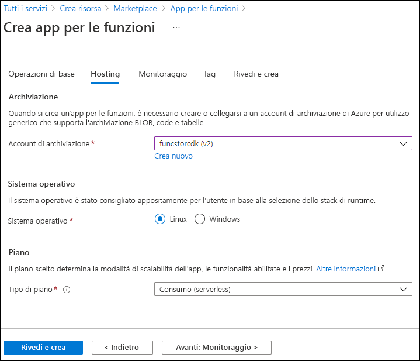

---
lab:
  az204Title: 'Lab 02: Implement task processing logic by using Azure Functions'
  az020Title: 'Lab 02: Implement task processing logic by using Azure Functions'
  az204Module: 'Module 02: Implement Azure Functions'
  az020Module: 'Module 02: Implement Azure Functions'
ms.openlocfilehash: d6de62facd1d4971b013ffac85c4be48f778e784
ms.sourcegitcommit: ddc44a8b5edc7ce2d93849bcab6c6a83dee1c99b
ms.translationtype: HT
ms.contentlocale: it-IT
ms.lasthandoff: 04/29/2022
ms.locfileid: "144404835"
---
# <a name="lab-02-implement-task-processing-logic-by-using-azure-functions"></a>Lab 02: Implementare la logica di elaborazione delle attività con Funzioni di Azure

## <a name="microsoft-azure-user-interface"></a>Interfaccia utente di Microsoft Azure

Considerata la natura dinamica degli strumenti cloud di Microsoft, è possibile rilevare modifiche all'interfaccia utente di Azure apportate dopo lo sviluppo di questo contenuto per la formazione. È quindi possibile che le istruzioni e le procedure del lab non siano allineate correttamente.

Microsoft aggiorna questo corso di formazione quando la community segnala le modifiche necessarie. Poiché gli aggiornamenti cloud vengono apportati spesso, tuttavia, è possibile che si rilevino modifiche all'interfaccia utente prima degli aggiornamenti del contenuto per la formazione. **In questo caso, adattarsi alle modifiche e quindi eseguire le operazioni necessarie nei lab.**

## <a name="instructions"></a>Istruzioni

### <a name="before-you-start"></a>Prima di iniziare

#### <a name="sign-in-to-the-lab-environment"></a>Accedere all'ambiente lab

Accedere alla macchina virtuale Windows 10 usando le credenziali seguenti:

- Nome utente: **Admin**
- Password: **Pa55w.rd**

> **Nota**: il docente fornirà le istruzioni necessarie per la connessione all'ambiente lab virtuale.

#### <a name="review-the-installed-applications"></a>Esaminare le applicazioni installate

Trovare la barra delle applicazioni nel desktop di Windows 10. La barra delle applicazioni include le icone per le applicazioni che verranno usate nel lab, tra cui:

- Microsoft Edge
- Esplora file
- Terminale Windows
- Visual Studio Code

## <a name="architecture-diagram"></a>Diagramma dell'architettura


### <a name="exercise-1-create-azure-resources"></a>Esercizio 1: Creare risorse di Azure

#### <a name="task-1-open-the-azure-portal"></a>Attività 1: Aprire il portale di Azure

1. Sulla barra delle applicazioni selezionare l'icona di **Microsoft Edge**.
1. Nella finestra del browser passare al portale di Azure (<https://portal.azure.com>) e quindi accedere con l'account che verrà usato per questo lab.

    > **Nota**: se si sta eseguendo l'accesso al portale di Azure per la prima volta, verrà visualizzata una presentazione del portale. Selezionare **Attività iniziali** per ignorare la presentazione e iniziare a usare il portale.

#### <a name="task-2-create-an-azure-storage-account"></a>Attività 2: Creare un account di archiviazione di Azure

1. Nel portale di Azure usare la casella di testo **Cerca risorse, servizi e documentazione** per cercare **Account di archiviazione** e quindi nell'elenco di risultati selezionare **Account di archiviazione**.

1. Nel pannello **Account di archiviazione** selezionare **+ Crea**.

1. Nella scheda **Informazioni di base** del pannello **Crea un account di archiviazione** eseguire le azioni seguenti e selezionare **Rivedi e crea**:

    | Impostazione                           | Azione                                                       |
    | --------------------------------- | ------------------------------------------------------------ |
    | Elenco a discesa **Sottoscrizione**   | Mantenere il valore predefinito.                                    |
    | Sezione **Gruppo di risorse**        | Selezionare **Crea nuovo**, immettere **Serverless** e quindi selezionare **OK**. |
    | Casella di testo **Nome account di archiviazione** | Immettere **funcstor** _[nomeutente]_.                              |
    | Elenco a discesa **Area**         | Selezionare **(Stati Uniti) Stati Uniti orientali**.                                     |
    | Sezione **Prestazioni**           | Selezionare l'opzione **Standard**.                              |
    | Elenco a discesa **Ridondanza**     | Selezionare **Archiviazione con ridondanza locale**.                  |

    Lo screenshot seguente mostra le impostazioni configurate nel pannello **Crea un account di archiviazione**.

    

1. Nella scheda **Rivedi e crea** esaminare le opzioni selezionate durante i passaggi precedenti.

1. Selezionare **Crea** per creare l'account di archiviazione usando la configurazione specificata.

    > **Nota**: prima di procedere con il lab, attendere il completamento dell'attività di creazione.

1. Nel pannello **Panoramica** selezionare il pulsante **Vai alla risorsa** per passare al pannello dell'account di archiviazione appena creato.

1. Nella sezione **Sicurezza e rete** del pannello **Account di archiviazione** selezionare **Chiavi di accesso**.

1. Nel pannello **Chiavi di accesso** selezionare **Mostra chiavi**.

1. Esaminare le chiavi e quindi copiare il valore di una delle caselle **Stringa di connessione** negli Appunti.

     > **Nota**: la stringa di connessione scelta è irrilevante. Sono intercambiabili.

1. Aprire Blocco note e quindi incollare il valore della stringa di connessione copiato. Questo valore verrà usato più avanti nel lab.

#### <a name="task-3-create-a-function-app"></a>Attività 3: Creare un'app per le funzioni

1. Nel riquadro di spostamento del portale di Azure selezionare il collegamento **Crea una risorsa**.

1. Nel pannello **Crea una risorsa**, nella casella di testo **Cerca servizi e marketplace** immettere **Funzioni** e quindi premere INVIO.

1. Nel pannello dei risultati della ricerca **Marketplace** selezionare il risultato **App per le funzioni**.

1. Nel pannello **App per le funzioni** selezionare **Crea**.

1. Nella scheda **Informazioni di base** del pannello **Crea app per le funzioni** eseguire le azioni seguenti e selezionare **Avanti: Hosting**:

    | Impostazione                          | Azione                           |
    | -------------------------------- | -------------------------------- |
    | Elenco a discesa **Sottoscrizione**  | Mantenere il valore predefinito.        |
    | Sezione **Gruppo di risorse**       | Selezionare **Serverless**.           |
    | Casella di testo **Nome dell'app per le funzioni**   | Immettere **funclogic** _[nomeutente]_. |
    | Sezione **Pubblica**              | Selezionare **Codice**.                 |
    | Elenco a discesa **Stack di runtime** | Selezionare **.NET**.                |
    | Elenco a discesa **Versione**       | Selezionare **3.1**.                  |
    | Elenco a discesa **Area**        | Selezionare l'area **Stati Uniti orientali**.   |

    Lo screenshot seguente mostra le impostazioni configurate nel pannello **Crea app per le funzioni**.

    

1. Nella scheda **Hosting** eseguire le azioni seguenti e quindi selezionare **Rivedi e crea**:

    | Impostazione                            | Azione                                             |
    | ---------------------------------- | -------------------------------------------------- |
    | Elenco a discesa **Account di archiviazione** | Selezionare l'account di archiviazione **funcstor** _[nomeutente]_. |
    | Sezione **Sistema operativo**       | Selezionare **Linux**.                                  |
    | Elenco a discesa **Tipo di piano**       | Selezionare **Consumo (serverless)**.               |

    Lo screenshot seguente mostra le impostazioni configurate nella scheda **Hosting** del pannello **Crea app per le funzioni**.

    

1. Nella scheda **Rivedi e crea** esaminare le opzioni selezionate durante i passaggi precedenti.

1. Selezionare **Crea** per creare l'app per le funzioni usando la configurazione specificata.

    > **Nota**: prima di procedere con il lab, attendere il completamento dell'attività di creazione.

#### <a name="review"></a>Verifica

In questo esercizio sono state create tutte le risorse che verranno usate nel lab.

### <a name="exercise-2-configure-a-local-azure-functions-project"></a>Esercizio 2: Configurare un progetto di Funzioni di Azure locale

#### <a name="task-1-initialize-a-function-project"></a>Attività 1: Inizializzare un progetto di funzione

1. Sulla barra delle applicazioni selezionare l'icona di **Terminale Windows**.

1. Eseguire il comando seguente per passare dalla directory corrente alla directory vuota **Allfiles (F):\\Allfiles\\Labs\\02\\Starter\\func**:

    ```powershell
    cd F:\Allfiles\Labs\02\Starter\func
    ```

    > **Nota**: in Esplora risorse rimuovere l'attributo **Sola lettura** dal file **F:\\Allfiles\\Labs\\02\\Starter\\func\\.gitignore**.

1. Eseguire il comando seguente per usare **Azure Functions Core Tools** per creare un nuovo progetto di Funzioni di Azure locale nella directory corrente usando il runtime **dotnet**:

    ```powershell
    func init --worker-runtime dotnet --force
    ```

    > **Nota**: è possibile esaminare la documentazione per [creare un nuovo progetto][azure-functions-core-tools-new-project] usando **Azure Functions Core Tools**.
    
1. Chiudere l'applicazione **Terminale Windows**.

#### <a name="task-2-configure-a-connection-string"></a>Attività 2: Configurare una stringa di connessione

1. Nella schermata **Start** selezionare il riquadro **Visual Studio Code**.

1. Nel menu **File** selezionare **Apri cartella**.

1. Nella finestra **Esplora file** visualizzata passare a **Allfiles (F):\\Allfiles\\Labs\\02\\Starter\\func** e quindi selezionare **Seleziona cartella**.

1. Nel riquadro **Esplora risorse** della finestra di **Visual Studio Code** Aprire il file **local.settings.json**.

1. Osservare il valore corrente dell'impostazione **AzureWebJobsStorage**:

    ```json
    "AzureWebJobsStorage": "UseDevelopmentStorage=true",
    ```

1. Aggiornare il valore di **AzureWebJobsStorage** impostandolo sulla **stringa di connessione** dell'account di archiviazione registrato in precedenza in questo lab.

1. Salvare il file **local.settings.json**.

#### <a name="task-3-build-and-validate-a-project"></a>Attività 3: Compilare e convalidare un progetto

1. Sulla barra delle applicazioni selezionare l'icona di **Terminale Windows**.

1. Eseguire il comando seguente per passare dalla directory corrente alla directory **Allfiles (F):\\Allfiles\\Labs\\02\\Starter\\func**:

    ```powershell
    cd F:\Allfiles\Labs\02\Starter\func
    ```

1. Eseguire il comando seguente per **compilare** il progetto .NET Core 3.1:

    ```powershell
    dotnet build
    ```

#### <a name="review"></a>Verifica

In questo esercizio è stato creato un progetto locale che verrà usato per lo sviluppo in Funzioni di Azure.

### <a name="exercise-3-create-a-function-thats-triggered-by-an-http-request"></a>Esercizio 3: Creare una funzione attivata da una richiesta HTTP

#### <a name="task-1-create-an-http-triggered-function"></a>Attività 1: Creare una funzione attivata da HTTP

1. Sulla barra delle applicazioni selezionare l'icona di **Terminale Windows**.

1. Eseguire il comando seguente per passare dalla directory corrente alla directory **Allfiles (F):\\Allfiles\\Labs\\02\\Starter\\func**:

    ```powershell
    cd F:\Allfiles\Labs\02\Starter\func
    ```

1. Eseguire il comando seguente per usare **Azure Functions Core Tools** per creare una nuova funzione denominata **Echo** usando il modello **HTTP trigger**:

    ```powershell
    func new --template "HTTP trigger" --name "Echo"
    ```

    > **Nota**: è possibile esaminare la documentazione per [creare una nuova funzione][azure-functions-core-tools-new-function] usando **Azure Functions Core Tools**.

1. Chiudere l'applicazione **Terminale Windows** attualmente in esecuzione.

#### <a name="task-2-write-http-triggered-function-code"></a>Attività 2: Scrivere il codice della funzione attivata da HTTP

1. Nella schermata **Start** selezionare il riquadro **Visual Studio Code**.

1. Nel menu **File** selezionare **Apri cartella**.

1. Nella finestra **Esplora file** visualizzata passare a **Allfiles (F):\\Allfiles\\Labs\\02\\Starter\\func** e quindi selezionare **Seleziona cartella**.

1. Nel riquadro **Esplora risorse** della finestra di **Visual Studio Code** aprire il file **Echo.cs**.

1. Nell'editor di codice osservare l'implementazione di esempio:

    ```csharp
    using System;
    using System.IO;
    using System.Threading.Tasks;
    using Microsoft.AspNetCore.Mvc;
    using Microsoft.Azure.WebJobs;
    using Microsoft.Azure.WebJobs.Extensions.Http;
    using Microsoft.AspNetCore.Http;
    using Microsoft.Extensions.Logging;
    using Newtonsoft.Json;
    namespace func
    {
        public static class Echo
        {
            [FunctionName("Echo")]
            public static async Task<IActionResult> Run(
                [HttpTrigger(AuthorizationLevel.Function, "get", "post", Route = null)] HttpRequest req,
                ILogger log)
            {
                log.LogInformation("C# HTTP trigger function processed a request.");
                string name = req.Query["name"];
                string requestBody = await new StreamReader(req.Body).ReadToEndAsync();
                dynamic data = JsonConvert.DeserializeObject(requestBody);
                name = name ?? data?.name;
                string responseMessage = string.IsNullOrEmpty(name)
                    ? "This HTTP triggered function executed successfully. Pass a name in the query string or in the request body for a personalized response."
                    : $"Hello, {name}. This HTTP triggered function executed successfully.";
                return new OkObjectResult(responseMessage);
            }
        }
    }
    ```

1. Eliminare tutto il contenuto nel file **Echo.cs**.
1. Aggiungere le righe di codice seguenti per aggiungere **direttive using** per gli spazi dei nomi **Microsoft.AspNetCore.Mvc**, **Microsoft.Azure.WebJobs**, **Microsoft.AspNetCore.Http** e **Microsoft.Extensions.Logging**:

    ```csharp
    using Microsoft.AspNetCore.Mvc;
    using Microsoft.Azure.WebJobs;
    using Microsoft.AspNetCore.Http;
    using Microsoft.Extensions.Logging;
    ```

1. Creare una nuova classe **public static** denominata **Echo**:

    ```csharp
    public static class Echo
    { }
    ```

1. Osservare di nuovo il file **Echo.cs**, che dovrebbe ora includere:

    ```csharp
    using Microsoft.AspNetCore.Mvc;
    using Microsoft.Azure.WebJobs;
    using Microsoft.AspNetCore.Http;
    using Microsoft.Extensions.Logging;
    public static class Echo
    { }
    ```

1. All'interno della classe **Echo** aggiungere il blocco di codice seguente per creare un nuovo metodo **public static** denominato **Run** che restituisce una variabile di tipo **IActionResult** e che accetta inoltre variabili di tipo **HttpRequest** e **ILogger** come parametri denominati *request* e *logger*:

    ```csharp
    public static IActionResult Run(
        HttpRequest request,
        ILogger logger)
    { }
    ```

1. Aggiungere il codice seguente per aggiungere un attributo alla fine del metodo **Run** di tipo **FunctionNameAttribute** con il parametro **name** impostato sul valore **Echo**:

    ```csharp
    [FunctionName("Echo")]
    public static IActionResult Run(
        HttpRequest request,
        ILogger logger)
    { }
    ```

1. Aggiungere il codice seguente per aggiungere un attributo alla fine del parametro **request** di tipo **HttpTriggerAttribute** la cui matrice di parametri **methods** è impostata su un singolo valore **POST**:

    ```csharp
    [FunctionName("Echo")]
    public static IActionResult Run(
        [HttpTrigger("POST")] HttpRequest request,
        ILogger logger)
    { }
    ```

1. Osservare di nuovo il file **Echo.cs**, che dovrebbe ora includere il codice seguente:

    ```csharp
    using Microsoft.AspNetCore.Mvc;
    using Microsoft.Azure.WebJobs;
    using Microsoft.AspNetCore.Http;
    using Microsoft.Extensions.Logging;
    public static class Echo
    {
        [FunctionName("Echo")]
        public static IActionResult Run(
            [HttpTrigger("POST")] HttpRequest request,
            ILogger logger)
        { }
    }
    ```

1. Nel metodo **Run** immettere la riga di codice seguente per registrare un messaggio fisso:

    ```csharp
    logger.LogInformation("Received a request");
    ```

1. Immettere la riga di codice seguente per ripetere il corpo della richiesta HTTP come risposta HTTP:

    ```csharp
    return new OkObjectResult(request.Body);
    ```

1. Osservare di nuovo il file **Echo.cs**, che dovrebbe ora includere il codice seguente:

    ```csharp
    using Microsoft.AspNetCore.Mvc;
    using Microsoft.Azure.WebJobs;
    using Microsoft.AspNetCore.Http;
    using Microsoft.Extensions.Logging;
    public static class Echo
    {
        [FunctionName("Echo")]
        public static IActionResult Run(
            [HttpTrigger("POST")] HttpRequest request,
            ILogger logger)
        {
            logger.LogInformation("Received a request");
            return new OkObjectResult(request.Body);
        }
    }
    ```

1. Selezionare **Salva** per salvare le modifiche al file **Echo.cs**.

#### <a name="task-3-test-the-http-triggered-function-by-using-httprepl"></a>Attività 3: Testare la funzione attivata da HTTP usando httprepl

1. Sulla barra delle applicazioni selezionare l'icona di **Terminale Windows**.

1. Eseguire il comando seguente per passare dalla directory corrente alla directory **Allfiles (F):\\Allfiles\\Labs\\02\\Starter\\func**:

    ```powershell
    cd F:\Allfiles\Labs\02\Starter\func
    ```

1. Eseguire il comando seguente per avviare il progetto di app per le funzioni:

    ```powershell
    func start --build
    ```

    > **Nota**: è possibile esaminare la documentazione per [avviare il progetto di app per le funzioni localmente](https://docs.microsoft.com/azure/azure-functions/functions-develop-local) usando **Azure Functions Core Tools**.
    
1. Sulla barra delle applicazioni selezionare di nuovo l'icona di **Terminale Windows** per aprire una nuova istanza dell'applicazione. Eseguire il comando seguente per passare dalla directory corrente alla directory vuota **Allfiles (F):\\Allfiles\\Labs\\02\\Starter\\func**:

    ```powershell
    cd F:\Allfiles\Labs\02\Starter\func
    ```
    
1. Quando viene visualizzato il prompt dei comandi, eseguire il comando seguente per avviare lo strumento **httprepl**, impostando l'URI (Uniform Resource Identifier) di base su ``http://localhost:7071``:

    ```powershell
    httprepl http://localhost:7071
    ```

    > **Nota**: verrà visualizzato un messaggio di errore dallo strumento **httprepl**. Il messaggio viene visualizzato perché lo strumento cerca un file di definizione Swagger da usare per attraversare l'API. Poiché il progetto di funzione non produce alcun file di definizione Swagger, sarà necessario attraversare manualmente l'API.

1. Quando viene visualizzato il prompt dello strumento, eseguire il comando seguente per passare alla directory **api** relativa:

    ```powershell
    cd api
    ```

1. Eseguire il comando seguente per passare alla directory **echo** relativa:

    ```powershell
    cd echo
    ```

1. Eseguire il comando seguente per lanciare il comando **post**, inviando un corpo della richiesta HTTP impostato su un valore numerico **3** usando l'opzione **\-\-content**:

    ```powershell
    post --content 3
    ```

1. Eseguire il comando seguente per lanciare il comando **post**, inviando un corpo della richiesta HTTP impostato su un valore numerico **5** usando l'opzione **\-\-content**:

    ```powershell
    post --content 5
    ```

1. Eseguire il comando seguente per lanciare il comando **post**, inviando un corpo della richiesta HTTP impostato su un valore stringa **Hello** usando l'opzione **\-\-content**:

    ```powershell
    post --content "Hello"
    ```

1. Eseguire il comando seguente per lanciare il comando **post**, inviando un corpo della richiesta HTTP impostato su un valore JSON (JavaScript Object Notation) **{"msg": "Successful"}** usando l'opzione **\-\-content**:

    ```powershell
    post --content "{"msg": "Successful"}"
    ```

1. Eseguire il comando seguente per chiudere l'applicazione **httprepl**:

    ```powershell
    exit
    ```

1. Chiudere tutte le istanze dell'applicazione **Terminale Windows** attualmente in esecuzione.

#### <a name="review"></a>Verifica

In questo esercizio è stata creata una funzione di base che restituisce il contenuto inviato tramite una richiesta HTTP POST.

### <a name="exercise-4-create-a-function-that-triggers-on-a-schedule"></a>Esercizio 4: Creare una funzione che si attiva in base a una pianificazione

#### <a name="task-1-create-a-schedule-triggered-function"></a>Attività 1: Creare una funzione attivata in base a una pianificazione

1. Sulla barra delle applicazioni selezionare l'icona di **Terminale Windows**.

1. Eseguire il comando seguente per passare dalla directory corrente alla directory **Allfiles (F):\\Allfiles\\Labs\\02\\Starter\\func**:

    ```powershell
    cd F:\Allfiles\Labs\02\Starter\func
    ```

1. Quando viene visualizzato il prompt dei comandi, eseguire il comando seguente per usare **Azure Functions Core Tools** per creare una nuova funzione denominata **Recurring** usando il modello **Timer trigger**:

    ```powershell
    func new --template "Timer trigger" --name "Recurring"
    ```

    > **Nota**: è possibile esaminare la documentazione per [creare una nuova funzione][azure-functions-core-tools-new-function] usando **Azure Functions Core Tools**.
    
1. Chiudere l'applicazione **Terminale Windows** attualmente in esecuzione.

#### <a name="task-2-observe-function-code"></a>Attività 2: Osservare il codice della funzione

1. Nella schermata **Start** selezionare il riquadro **Visual Studio Code**.

1. Nel menu **File** selezionare **Apri cartella**.

1. Nella finestra **Esplora file** visualizzata passare a **Allfiles (F):\\Allfiles\\Labs\\02\\Starter\\func** e quindi selezionare **Seleziona cartella**.

1. Nel riquadro **Esplora risorse** della finestra di **Visual Studio Code** aprire il file **Recurring.cs**.

1. Nell'editor di codice osservare l'implementazione:

    ```csharp
    using System;
    using Microsoft.Azure.WebJobs;
    using Microsoft.Azure.WebJobs.Host;
    using Microsoft.Extensions.Logging;
    namespace func
    {
        public static class Recurring
        {
            [FunctionName("Recurring")]
            public static void Run([TimerTrigger("0 */5 * * * *")]TimerInfo myTimer, ILogger log)
            {
                log.LogInformation($"C# Timer trigger function executed at: {DateTime.Now}");
            }
        }
    }
    ```

#### <a name="task-3-observe-function-runs"></a>Attività 3: Osservare le esecuzioni della funzione

1. Sulla barra delle applicazioni selezionare l'icona di **Terminale Windows**.

1. Eseguire il comando seguente per passare dalla directory corrente alla directory **Allfiles (F):\\Allfiles\\Labs\\02\\Starter\\func**:

    ```powershell
    cd F:\Allfiles\Labs\02\Starter\func
    ```

1. Quando viene visualizzato il prompt dei comandi, eseguire il comando seguente per avviare il progetto di app per le funzioni:

    ```powershell
    func start --build
    ```

    > **Nota**: è possibile esaminare la documentazione per [avviare localmente il progetto di app per le funzioni][azure-functions-core-tools-start-function] usando **Azure Functions Core Tools**.

1. Osservare l'esecuzione della funzione che avviene circa ogni cinque minuti. Ogni esecuzione della funzione deve eseguire il rendering di un messaggio semplice nel log.

1. Chiudere l'applicazione **Terminale Windows** attualmente in esecuzione.

#### <a name="task-4-update-the-function-integration-configuration"></a>Attività 4: Aggiornare la configurazione dell'integrazione della funzione

1. Nella schermata **Start** selezionare il riquadro **Visual Studio Code**.

1. Nel menu **File** selezionare **Apri cartella**.

1. Nella finestra **Esplora file** visualizzata passare a **Allfiles (F):\\Allfiles\\Labs\\02\\Starter\\func** e quindi selezionare **Seleziona cartella**.

1. Nel riquadro **Esplora risorse** della finestra di **Visual Studio Code** aprire il file **Recurring.cs**.

1. Nell'editor di codice osservare la firma del metodo **Run** esistente:

    ```csharp
    [FunctionName("Recurring")]
    public static void Run([TimerTrigger("0 */5 * * * *")]TimerInfo myTimer, ILogger log)
    ```

1. Aggiornare il blocco di codice della firma del metodo **Run** per modificare la pianificazione in modo che venga eseguita una volta ogni **30 secondi**:

    ```csharp
    [FunctionName("Recurring")]
    public static void Run([TimerTrigger("*/30 * * * * *")]TimerInfo myTimer, ILogger log)
    ```

1. Selezionare **Salva** per salvare le modifiche al file **Recurring.cs**.

#### <a name="task-5-observe-function-runs"></a>Attività 5: Osservare le esecuzioni della funzione

1. Sulla barra delle applicazioni selezionare l'icona di **Terminale Windows**.

1. Eseguire il comando seguente per passare dalla directory corrente alla directory **Allfiles (F):\\Allfiles\\Labs\\02\\Starter\\func**:

    ```powershell
    cd F:\Allfiles\Labs\02\Starter\func
    ```

1. Quando viene visualizzato il prompt dei comandi, eseguire il comando seguente per avviare il progetto di app per le funzioni:

    ```powershell
    func start --build
    ```
    
    > **Nota**: è possibile esaminare la documentazione per [avviare localmente il progetto di app per le funzioni][azure-functions-core-tools-start-function] usando **Azure Functions Core Tools**.
    
1. Osservare l'esecuzione della funzione che avviene circa ogni 30 secondi. Ogni esecuzione della funzione deve eseguire il rendering di un messaggio semplice nel log.

1. Chiudere l'applicazione **Terminale Windows** attualmente in esecuzione.

1. Chiudere la finestra di Visual Studio Code.

#### <a name="review"></a>Verifica

In questo esercizio è stata creata una funzione che viene eseguita automaticamente in base a una pianificazione fissa.

### <a name="exercise-5-create-a-function-that-integrates-with-other-services"></a>Esercizio 5: Creare una funzione che si integra con altri servizi

#### <a name="task-1-upload-sample-content-to-azure-blob-storage"></a>Attività 1: Caricare il contenuto di esempio in Archiviazione BLOB di Azure

1. Nel riquadro di **spostamento** del portale di Azure selezionare il collegamento **Gruppi di risorse**.

1. Nel pannello **Gruppi di risorse** selezionare il gruppo di risorse **Serverless** creato in precedenza in questo lab.

1. Nel pannello **Serverless** selezionare l'account di archiviazione **funcstor** _[nomeutente]_ creato in precedenza in questo lab.

1. Nel pannello **Account di archiviazione** selezionare il collegamento **Contenitori** nella sezione **Archiviazione dati**.

1. Nella sezione **Contenitori** selezionare **+ Contenitore**.

1. Nella finestra popup **Nuovo contenitore** eseguire le azioni seguenti e quindi selezionare **Crea**:

    | Impostazione                          | Azione                           |
    | -------------------------------- | -------------------------------- |
    | Casella di testo **Nome**  | Immettere **content**.     |
    | Elenco a discesa **Livello di accesso pubblico**  | Selezionare **Privato (nessun accesso anonimo)** .     |

1. Tornare alla sezione **Contenitori** e quindi selezionare il contenitore **content** appena creato.

1. Nel pannello **Contenitore** selezionare **Carica**.

1. Nella finestra **Carica BLOB** eseguire le azioni seguenti e quindi selezionare **Carica**:

    | Impostazione                          | Azione                           |
    | -------------------------------- | -------------------------------- |
    | Sezione **File**  | Selezionare l'icona **Cartella**.    |
    | Finestra **Esplora file**  | Passare a **Allfiles (F):\\Allfiles\\Labs\\02\\Starter**, selezionare il file **settings.json** e quindi selezionare **Apri**.    |
    | Casella di controllo **Sovrascrivi se i file esistono già**  | Assicurarsi che questa casella di controllo sia selezionata.   |

      > **Nota**: prima di procedere con questo lab, attendere il completamento del caricamento del BLOB.

#### <a name="task-2-create-an-http-triggered-function"></a>Attività 2: Creare una funzione attivata da HTTP

1. Sulla barra delle applicazioni selezionare l'icona di **Terminale Windows**.

1. Eseguire il comando seguente per passare dalla directory corrente alla directory **Allfiles (F):\\Allfiles\\Labs\\02\\Starter\\func**:

    ```powershell
    cd F:\Allfiles\Labs\02\Starter\func
    ```

1. Quando viene visualizzato il prompt dei comandi, eseguire il comando seguente per usare **Azure Functions Core Tools** per creare una nuova funzione denominata **GetSettingInfo** usando il modello **HTTP trigger**:

    ```powershell
    func new --template "HTTP trigger" --name "GetSettingInfo"
    ```

    > **Nota**: è possibile esaminare la documentazione per [creare una nuova funzione][azure-functions-core-tools-new-function] usando **Azure Functions Core Tools**.

1. Chiudere l'applicazione **Terminale Windows** attualmente in esecuzione.

#### <a name="task-3-write-http-triggered-and-blob-inputted-function-code"></a>Attività 3: Scrivere il codice della funzione attivato da HTTP e con input BLOB

1. Nella schermata **Start** selezionare il riquadro **Visual Studio Code**.
1. Nel menu **File** selezionare **Apri cartella**.
1. Nella finestra **Esplora file** visualizzata passare a **Allfiles (F):\\Allfiles\\Labs\\02\\Starter\\func** e quindi selezionare **Seleziona cartella**.
1. Nel riquadro **Esplora risorse** della finestra di **Visual Studio Code** aprire il file **GetSettingInfo.cs**.
1. Nell'editor di codice osservare l'implementazione di esempio:

    ```csharp
    using System;
    using System.IO;
    using System.Threading.Tasks;
    using Microsoft.AspNetCore.Mvc;
    using Microsoft.Azure.WebJobs;
    using Microsoft.Azure.WebJobs.Extensions.Http;
    using Microsoft.AspNetCore.Http;
    using Microsoft.Extensions.Logging;
    using Newtonsoft.Json;
    namespace func
    {
        public static class GetSettingInfo
        {
            [FunctionName("GetSettingInfo")]
            public static async Task<IActionResult> Run(
                [HttpTrigger(AuthorizationLevel.Function, "get", "post", Route = null)] HttpRequest req,
                ILogger log)
            {
                log.LogInformation("C# HTTP trigger function processed a request.");
                string name = req.Query["name"];
                string requestBody = await new StreamReader(req.Body).ReadToEndAsync();
                dynamic data = JsonConvert.DeserializeObject(requestBody);
                name = name ?? data?.name;
                string responseMessage = string.IsNullOrEmpty(name)
                    ? "This HTTP triggered function executed successfully. Pass a name in the query string or in the request body for a personalized response."
                    : $"Hello, {name}. This HTTP triggered function executed successfully.";
                return new OkObjectResult(responseMessage);
            }
        }
    }
    ```

1. Eliminare tutto il contenuto nel file **GetSettingInfo.cs**.

1. Aggiungere le righe di codice seguenti per aggiungere **direttive using** per gli spazi dei nomi **Microsoft.AspNetCore.Http**, **Microsoft.AspNetCore.Mvc** e **Microsoft.Azure.WebJobs**:

    ```csharp
    using Microsoft.AspNetCore.Http;
    using Microsoft.AspNetCore.Mvc;
    using Microsoft.Azure.WebJobs;
    ```

1. Creare una nuova classe **public static** denominata **GetSettingInfo**:

    ```csharp
    public static class GetSettingInfo
    { }
    ```

1. Osservare di nuovo il file **GetSettingInfo.cs**, che dovrebbe ora includere il codice seguente:

    ```csharp
    using Microsoft.AspNetCore.Http;
    using Microsoft.AspNetCore.Mvc;
    using Microsoft.Azure.WebJobs;
    public static class GetSettingInfo
    { }
    ```

1. All'interno della classe **GetSettingInfo** aggiungere il blocco di codice seguente per creare un nuovo metodo con corpo di espressione **public static** denominato **Run** che restituisce una variabile di tipo **IActionResult** e che accetta inoltre variabili di tipo **HttpRequest** e **string** come parametri denominati *request* e *json*:

    ```csharp
    public static IActionResult Run(
        HttpRequest request,
        string json)
        => null;
    ```

    > **Nota**: si sta impostando solo temporaneamente il valore restituito su **null**.

1. Aggiungere il codice seguente per aggiungere un attributo alla fine del metodo **Run** di tipo **FunctionNameAttribute** con il parametro **name** impostato sul valore **GetSettingInfo**:

    ```csharp
    [FunctionName("GetSettingInfo")]
    public static IActionResult Run(
        HttpRequest request,
        string json)
        => null;
    ```

1. Aggiungere il codice seguente per aggiungere un attributo alla fine del parametro **request** di tipo **HttpTriggerAttribute** la cui matrice di parametri **methods** è impostata su un singolo valore **GET**:

    ```csharp
    [FunctionName("GetSettingInfo")]
    public static IActionResult Run(
        [HttpTrigger("GET")] HttpRequest request,
        string json)
        => null;
    ```

1. Aggiungere il codice seguente per aggiungere un attributo alla fine del parametro **json** di tipo **BlobAttribute** con il parametro **blobPath** impostato sul valore **content/settings.json**:

    ```csharp
    [FunctionName("GetSettingInfo")]
    public static IActionResult Run(
        [HttpTrigger("GET")] HttpRequest request,
        [Blob("content/settings.json")] string json)
        => null;
    ```

1. Aggiungere il codice seguente per aggiornare il metodo con corpo di espressione **Run** per restituire una nuova istanza della classe **OkObjectResult** passando il valore del parametro del metodo **json** come unico parametro del costruttore:

    ```csharp
    [FunctionName("GetSettingInfo")]
    public static IActionResult Run(
        [HttpTrigger("GET")] HttpRequest request,
        [Blob("content/settings.json")] string json)
        => new OkObjectResult(json);
    ```

1. Osservare di nuovo il file **GetSettingInfo.cs**, che dovrebbe ora includere il codice seguente:

    ```csharp
    using Microsoft.AspNetCore.Http;
    using Microsoft.AspNetCore.Mvc;
    using Microsoft.Azure.WebJobs;
    public static class GetSettingInfo
    {
        [FunctionName("GetSettingInfo")]
        public static IActionResult Run(
            [HttpTrigger("GET")] HttpRequest request,
            [Blob("content/settings.json")] string json)
            => new OkObjectResult(json);
    }
    ```

1. Selezionare **Salva** per salvare le modifiche al file **GetSettingInfo.cs**.

#### <a name="task-4-register-azure-storage-blob-extensions"></a>Attività 4: Registrare le estensioni BLOB del servizio di archiviazione di Azure

1. Sulla barra delle applicazioni selezionare l'icona di **Terminale Windows**.
1. Eseguire il comando seguente per passare dalla directory corrente alla directory **Allfiles (F):\\Allfiles\\Labs\\02\\Starter\\func**:

    ```powershell
    cd F:\Allfiles\Labs\02\Starter\func
    ```

1. Quando viene visualizzato il prompt dei comandi, eseguire il comando seguente per registrare l'estensione [Microsoft.Azure.WebJobs.Extensions.Storage](https://www.nuget.org/packages/Microsoft.Azure.WebJobs.Extensions.Storage/4.0.4):

    ```powershell
    func extensions install --package Microsoft.Azure.WebJobs.Extensions.Storage --version 4.0.4
    ```

1. Eseguire il comando seguente per compilare il progetto .NET e verificare che le estensioni siano state installate correttamente:

    ```powershell
    dotnet build
    ```

1. Chiudere tutte le istanze dell'applicazione **Terminale Windows** attualmente in esecuzione.

#### <a name="task-5-test-the-function-by-using-httprepl"></a>Attività 5: Testare la funzione usando httprepl

1. Sulla barra delle applicazioni selezionare l'icona di **Terminale Windows**.

1. Eseguire il comando seguente per passare dalla directory corrente alla directory **Allfiles (F):\\Allfiles\\Labs\\02\\Starter\\func**:

    ```powershell
    cd F:\Allfiles\Labs\02\Starter\func
    ```

1. Quando viene visualizzato il prompt dei comandi, eseguire il comando seguente per avviare il progetto di app per le funzioni:

    ```powershell
    func start --build
    ```

    > **Nota**: è possibile esaminare la documentazione per [avviare localmente il progetto di app per le funzioni][azure-functions-core-tools-start-function] usando **Azure Functions Core Tools**.

1. Sulla barra delle applicazioni selezionare di nuovo l'icona di **Terminale Windows** per aprire una nuova istanza dell'applicazione **Terminale Windows**.

1. Quando viene visualizzato il prompt dei comandi, eseguire il comando seguente per avviare lo strumento **httprepl**, impostando l'URI (Uniform Resource Identifier) di base su ``http://localhost:7071``:

    ```powershell
    httprepl http://localhost:7071
    ```

    > **Nota**: verrà visualizzato un messaggio di errore dallo strumento **httprepl**. Il messaggio viene visualizzato perché lo strumento cerca un file di definizione Swagger da usare per attraversare l'API. Poiché il progetto di funzione non produce alcun file di definizione Swagger, sarà necessario attraversare manualmente l'API.

1. Quando viene visualizzato il prompt dello strumento, eseguire il comando seguente per passare all'endpoint **api** relativo:

    ```powershell
    cd api
    ```

1. Eseguire il comando seguente per passare all'endpoint **getsettinginfo** relativo:

    ```powershell
    cd getsettinginfo
    ```

1. Eseguire il comando seguente per lanciare il comando **get** per l'endpoint corrente:

    ```powershell
    get
    ```

1. Osservare il contenuto JSON della risposta dell'app per le funzioni, che dovrebbe ora includere:

    ```json
    {
        "version": "0.2.4",
        "root": "/usr/libexec/mews_principal/",
        "device": {
            "id": "21e46d2b2b926cba031a23c6919"
        },
        "notifications": {
            "email": "joseph.price@contoso.com",
            "phone": "(425) 555-0162 x4151"
        }
    }
    ```

1. Eseguire il comando seguente per chiudere l'applicazione **httprepl**:

    ```powershell
    exit
    ```

1. Chiudere tutte le istanze dell'applicazione **Terminale Windows** attualmente in esecuzione.

#### <a name="review"></a>Verifica

In questo esercizio è stata creata una funzione che restituisce il contenuto di un file JSON nell'archiviazione.

### <a name="exercise-6-deploy-a-local-function-project-to-an-azure-functions-app"></a>Esercizio 6: Distribuire un progetto di funzione locale in un'app di Funzioni di Azure

#### <a name="task-1-deploy-using-the-azure-functions-core-tools"></a>Attività 1: Eseguire la distribuzione usando Azure Functions Core Tools

1. Sulla barra delle applicazioni selezionare l'icona di **Terminale Windows**.
1. Eseguire il comando seguente per passare dalla directory corrente alla directory **Allfiles (F):\\Allfiles\\Labs\\02\\Starter\\func**:

    ```powershell
    cd F:\Allfiles\Labs\02\Starter\func
    ```

1. Quando viene visualizzato il prompt dei comandi, eseguire il comando seguente per accedere all'interfaccia della riga di comando di Azure:

    ```powershell
    az login
    ```

1. Nella finestra del browser **Microsoft Edge** immettere l'indirizzo di posta elettronica e la password per l'account Microsoft e quindi selezionare **Accedi**.

1. Tornare alla finestra **Terminale Windows** attualmente aperta. Attendere il completamento del processo di accesso.

1. Eseguire il comando seguente per pubblicare il progetto di app per le funzioni:

    ```powershell
    func azure functionapp publish <function-app-name>
    ```

    > **Nota**: se, ad esempio, il **Nome dell'app per le funzioni** è **funclogicstudent**, il comando sarà ``func azure functionapp publish funclogicstudent``. È possibile esaminare la documentazione per [pubblicare il progetto di app per le funzioni locale][azure-functions-core-tools-publish-azure] usando **Azure Functions Core Tools**.

1. Prima di procedere con il lab, attendere la finalizzazione della distribuzione.

1. Chiudere l'applicazione **Terminale Windows** attualmente in esecuzione.

#### <a name="task-2-validate-deployment"></a>Attività 2: Convalidare la distribuzione

1. Sulla barra delle applicazioni selezionare l'icona di **Microsoft Edge** e quindi selezionare la scheda contenente il portale di Azure (<https://portal.azure.com>).

1. Nel riquadro di **spostamento** del portale di Azure selezionare il collegamento **Gruppi di risorse**.

1. Nel pannello **Gruppi di risorse** selezionare il gruppo di risorse **Serverless** creato in precedenza in questo lab.

1. Nel pannello **Serverless** selezionare l'app per le funzioni **funclogic** _[nomeutente]_ creata in precedenza in questo lab.

1. Nel pannello **App per le funzioni** selezionare l'opzione **Funzioni** nella sezione **Funzioni**.

1. Nel riquadro **Funzioni** selezionare la funzione **GetSettingInfo** esistente.

1. Nel pannello **Funzione** selezionare l'opzione **Codice e test** nella sezione **Sviluppatore**.

1. Nell'editor di funzioni selezionare **Test/Esegui**.

1. Nella finestra di dialogo popup visualizzata eseguire le azioni seguenti: <!--Conan, as there is only sub step here, can we just combine the two as follows: In the popup dialog that appears, in the **HTTP method** list, select **GET**.-->
    - Nell'elenco **Metodo HTTP** selezionare **GET**.

1. Selezionare **Esegui** per testare la funzione.

1. Osservare i risultati dell'esecuzione dei test. Il contenuto JSON dovrebbe ora includere il codice seguente:

    ```json
    {
        "version": "0.2.4",
        "root": "/usr/libexec/mews_principal/",
        "device": {
            "id": "21e46d2b2b926cba031a23c6919"
        },
        "notifications": {
            "email": "joseph.price@contoso.com",
            "phone": "(425) 555-0162 x4151"
        }
    }
    ```

#### <a name="review"></a>Verifica

In questo esercizio è stato distribuito un progetto di funzione locale in Funzioni di Azure ed è stato verificato il funzionamento in Azure delle funzioni.

### <a name="exercise-7-clean-up-your-subscription"></a>Esercizio 7: Pulire la sottoscrizione

#### <a name="task-1-open-azure-cloud-shell-and-list-resource-groups"></a>Attività 1: Aprire Azure Cloud Shell ed elencare i gruppi di risorse

1.  Nel portale di Azure selezionare l'icona di **Cloud Shell**  per aprire una nuova sessione di Bash. Se in Cloud Shell viene aperta per impostazione predefinita una sessione di PowerShell, selezionare **PowerShell** e nel menu a discesa selezionare **Bash**.

    > **Nota**: se è la prima volta che si avvia **Cloud Shell**, quando viene richiesto di selezionare **Bash** oppure **PowerShell** selezionare **PowerShell**. Quando viene visualizzato il messaggio **Non sono state montate risorse di archiviazione**, selezionare la sottoscrizione usata in questo lab e quindi selezionare **Crea risorsa di archiviazione**.

#### <a name="task-2-delete-a-resource-group"></a>Attività 2: Eliminare un gruppo di risorse

1. Nel riquadro **Cloud Shell** eseguire il comando seguente per eliminare il gruppo di risorse **Serverless**:

    ```powershell
    az group delete --name Serverless --no-wait --yes
    ```

     > **Nota**: il comando viene eseguito in modo asincrono, in base a quanto determinato dal parametro *--no-wait*, quindi, sebbene sia possibile eseguire un altro comando dell'interfaccia della riga di comando di Azure immediatamente dopo nella stessa sessione di Bash, il gruppo di risorse verrà rimosso dopo alcuni minuti.

1. Chiudere il riquadro **Cloud Shell** nel portale.

#### <a name="task-3-close-the-active-application"></a>Attività 3: Chiudere l'applicazione attiva

- Chiudere l'applicazione Microsoft Edge in esecuzione.

#### <a name="review"></a>Verifica

In questo esercizio è stata pulita la sottoscrizione mediante la rimozione del gruppo di risorse usato in questo lab.
