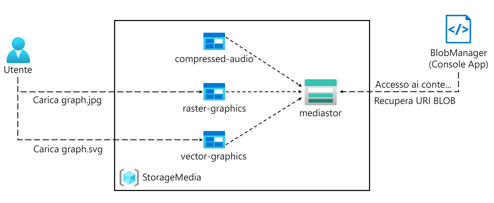
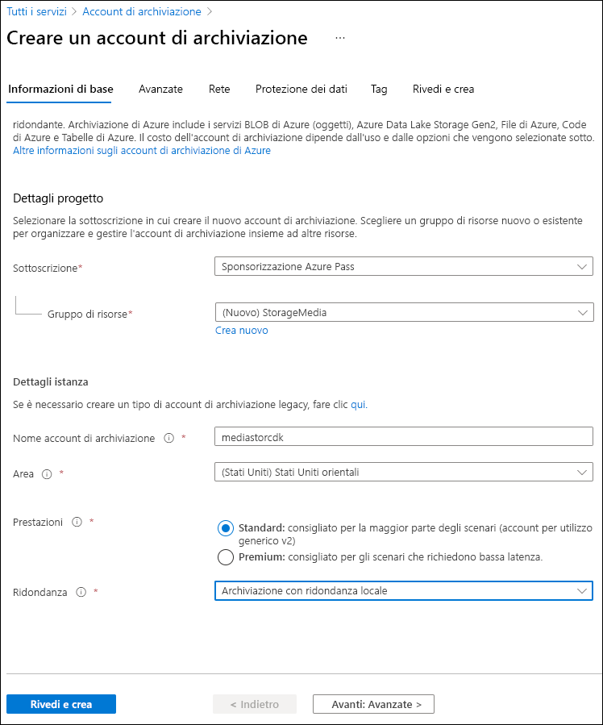
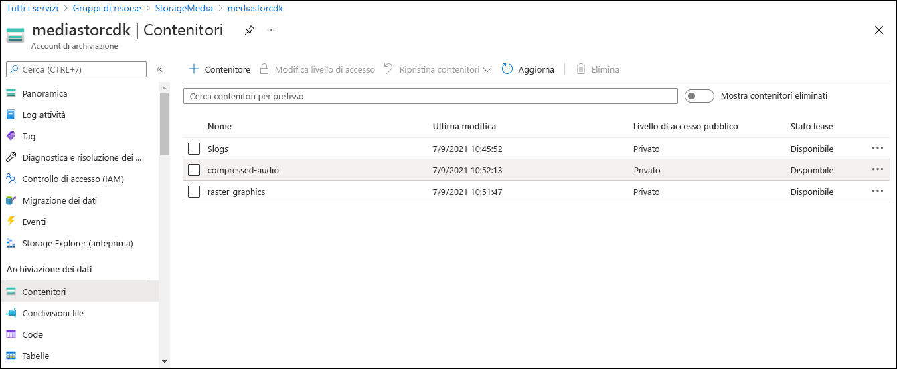

---
lab:
  az204Title: 'Lab 03: Retrieve Azure Storage resources and metadata by using the Azure Storage SDK for .NET'
  az020Title: 'Lab 03: Retrieve Azure Storage resources and metadata by using the Azure Storage SDK for .NET'
  az204Module: 'Module 03: Develop solutions that use blob storage'
  az020Module: 'Module 03: Develop solutions that use blob storage'
---

# <a name="lab-03-retrieve-azure-storage-resources-and-metadata-by-using-the-azure-storage-sdk-for-net"></a>Lab 03: Recuperare le risorse e dei metadati di Archiviazione di Azure usando Azure Storage SDK per .NET

## <a name="microsoft-azure-user-interface"></a>Interfaccia utente di Microsoft Azure

Considerata la natura dinamica degli strumenti cloud di Microsoft, è possibile rilevare modifiche all'interfaccia utente di Azure apportate dopo lo sviluppo di questo contenuto per la formazione. È quindi possibile che le istruzioni e le procedure del lab non siano allineate correttamente.

Microsoft aggiorna questo corso di formazione quando la community segnala le modifiche necessarie. Poiché gli aggiornamenti cloud vengono apportati spesso, tuttavia, è possibile che si rilevino modifiche all'interfaccia utente prima degli aggiornamenti del contenuto per la formazione. **In questo caso, adattarsi alle modifiche e quindi eseguire le operazioni necessarie nei lab.**

## <a name="instructions"></a>Istruzioni

### <a name="before-you-start"></a>Prima di iniziare

#### <a name="sign-in-to-the-lab-environment"></a>Accedere all'ambiente lab

Accedere alla macchina virtuale Windows 10 usando le credenziali seguenti:

-   Nome utente: **Admin**

-   Password: **Pa55w.rd**

> **Nota**: il docente fornirà le istruzioni necessarie per la connessione all'ambiente lab virtuale.

#### <a name="review-the-installed-applications"></a>Esaminare le applicazioni installate

Trovare la barra delle applicazioni nel desktop di Windows 10. La barra delle applicazioni include le icone per le applicazioni che verranno usate nel lab, tra cui:

-   Microsoft Edge

-   Esplora file

## <a name="architecture-diagram"></a>Diagramma dell'architettura



### <a name="exercise-1-create-azure-resources"></a>Esercizio 1: Creare risorse di Azure

#### <a name="task-1-open-the-azure-portal"></a>Attività 1: Aprire il portale di Azure

1.  Sulla barra delle applicazioni selezionare l'icona di **Microsoft Edge**.

1. Nella finestra del browser passare al portale di Azure (<https://portal.azure.com>) e quindi accedere con l'account che verrà usato per questo lab.

   > **Nota**: se si sta eseguendo l'accesso al portale di Azure per la prima volta, verrà visualizzata una presentazione del portale. Selezionare **Attività iniziali** per ignorare la presentazione e iniziare a usare il portale.

#### <a name="task-2-create-a-storage-account"></a>Attività 2: Creare un account di archiviazione

1.  Nel portale di Azure usare la casella di testo **Cerca risorse, servizi e documentazione** per cercare **Account di archiviazione** e quindi nell'elenco di risultati selezionare **Account di archiviazione**.

1.  Nel riquadro **Account di archiviazione** selezionare **+ Crea**.

1.  Nella scheda **Informazioni di base** del pannello **Crea un account di archiviazione** eseguire le azioni seguenti e selezionare **Rivedi e crea**:

   | Impostazione | Azione |
   | -- | -- |
   | Elenco a discesa **Sottoscrizione** | Mantenere il valore predefinito |
   | Sezione **Gruppo di risorse** | Selezionare **Crea nuovo**, immettere **StorageMedia** e quindi selezionare **OK** |
   | Casella di testo **Nome account di archiviazione**  | Immettere **mediastor** _[nomeutente]_ |
   | Elenco a discesa **Area** | Selezionare **(Stati Uniti) Stati Uniti orientali** |
   | Sezione **Prestazioni** | Selezionare l'opzione **Standard** |
   | Elenco a discesa **Ridondanza** | Selezionare **Archiviazione con ridondanza locale** |

   Lo screenshot seguente mostra le impostazioni configurate nel pannello **Crea un account di archiviazione**.
 
   
   
1.  Nella scheda **Rivedi e crea** esaminare le opzioni selezionate durante i passaggi precedenti.

1.  Selezionare **Crea** per creare l'account di archiviazione usando la configurazione specificata.

    > **Nota**: prima di procedere con il lab, attendere il completamento dell'attività di creazione.

1.  Selezionare **Vai alla risorsa**.

1.  Nel pannello  **Account di archiviazione**  selezionare il collegamento  **Endpoint**  nella sezione  **Impostazioni** .

1.  Nella sezione **Endpoint** copiare il valore della casella di testo **Servizio BLOB** negli Appunti.

    > **Nota**: questo valore dell'endpoint verrà utilizzato più avanti nel lab.

1.  Aprire il Blocco note e quindi incollare il valore del servizio BLOB copiato nel Blocco note.

1.  Nella sezione **Sicurezza e rete** del pannello **Account di archiviazione** selezionare **Chiavi di accesso**.

1.  Copiare il valore di **Nome dell'account di archiviazione** negli Appunti e incollarlo nel Blocco note.

1.  Nel pannello **Chiavi di accesso** selezionare **Mostra chiavi**.

1.  Esaminare le chiavi e quindi copiare il valore di una delle caselle **Chiave** negli Appunti.

    > **Nota**: tutti questi valori verranno utilizzati più avanti in questo lab.

#### <a name="review"></a>Verifica

In questo esercizio è stato creato un nuovo account Archiviazione da usare nel resto del lab.

### <a name="exercise-2-upload-a-blob-into-a-container"></a>Esercizio 2: Caricare un BLOB in un contenitore

#### <a name="task-1-create-storage-account-containers"></a>Attività 1: Creare contenitori di account di archiviazione

1. Nel pannello **Account di archiviazione** selezionare il collegamento **Contenitori** nella sezione **Archiviazione dati**.

1. Nella sezione **Contenitori** selezionare **+ Contenitore**.

1. Nella finestra popup **Nuovo contenitore** eseguire le azioni seguenti e quindi selezionare **Crea**:

    | Impostazione | Azione |
    | -- | -- |
    | Casella di testo **Nome** | Immettere **raster-graphics** |
    | Elenco a discesa **Livello di accesso pubblico** | Selezionare **Privato (nessun accesso anonimo)** |

1. Nella sezione **Contenitori** selezionare **+ Contenitore**.

1. Nella finestra popup **Nuovo contenitore** eseguire le azioni seguenti e quindi selezionare **Crea**:

    | Impostazione | Azione |
    | -- | -- |
    | Casella di testo **Nome** | Immettere **compressed-audio** |
    | Elenco a discesa **Livello di accesso pubblico** | Selezionare **Privato (nessun accesso anonimo)** |

1. Nella sezione **Contenitori** osservare l'elenco aggiornato dei contenitori.

    Lo screenshot seguente mostra le impostazioni configurate nel pannello **Crea un account di archiviazione**.

    

#### <a name="task-2-upload-a-storage-account-blob"></a>Attività 2: Caricare un BLOB dell'account di archiviazione

1.  Nella sezione **Contenitori** selezionare il contenitore **raster-graphics** creato di recente.

1.  Nel pannello **Contenitore** selezionare **Carica**.

1.  Nella finestra **Carica BLOB** eseguire le azioni seguenti e quindi selezionare **Carica**:

   | Impostazione | Azione |
   | -- | -- |
   | Sezione **File** | Selezionare l'icona **Cartella** |
   | Finestra **Esplora file** | Passare a **Allfiles (F):\\Allfiles\\Labs\\03\\Starter\\Images**, selezionare il file **graph.jpg** e quindi selezionare **Apri** |
   | Casella di controllo **Sovrascrivi se i file esistono già** | Assicurarsi che la casella di controllo sia selezionata |
   
   > **Nota**: prima di procedere con questo lab, attendere il completamento del caricamento del BLOB.

#### <a name="review"></a>Verifica

In questo esercizio sono stati creati contenitori segnaposto nell'account di archiviazione e quindi uno dei contenitori è stato popolato con un BLOB.

### <a name="exercise-3-access-containers-by-using-the-net-sdk"></a>Esercizio 3: Accedere ai contenitori con .NET SDK

#### <a name="task-1-create-net-project"></a>Attività 1: Creare un progetto .NET

1.  Nella schermata **Start** selezionare il riquadro **Visual Studio Code**.

1.  Nel menu **File** selezionare **Apri cartella**, passare a **Allfiles (F):\\Allfiles\\Labs\\03\\Starter\\BlobManager**, quindi scegliere **Seleziona cartella**.

1.  Nella finestra di **Visual Studio Code**, nella barra dei menu, selezionare **Terminale** e quindi **Nuovo terminale**.

1.  Nel terminale eseguire il comando seguente per creare un nuovo progetto .NET denominato **BlobManager** nella cartella corrente:

    ```
    dotnet new console --framework net6.0 --name BlobManager --output .
    ```

    > **Nota**: il comando **dotnet new** creerà un nuovo progetto **console** in una cartella con lo stesso nome del progetto.

1.  Nel terminale eseguire il comando seguente per importare la versione 12.12.0 di **Azure.Storage.Blobs** da NuGet:

    ```
    dotnet add package Azure.Storage.Blobs --version 12.12.0
    ```

    > **Nota**: il comando **dotnet add package** aggiungerà il pacchetto **Azure.Storage.Blobs** da NuGet. Per altre informazioni, vedere [Azure.Storage.Blobs](https://www.nuget.org/packages/Azure.Storage.Blobs/12.12.0).

1.  Nel terminale eseguire il comando seguente per compilare l'applicazione Web .NET:

    ```
    dotnet build
    ```

1.  Selezionare **Termina il terminale** o l'icona del **Cestino** per chiudere il terminale aperto e tutti i processi associati.

#### <a name="task-2-modify-the-program-class-to-access-storage"></a>Attività 2: Modificare la classe Program per accedere alla risorsa di archiviazione

1.  Nel riquadro **Esplora risorse**  della finestra di **Visual Studio Code** aprire il file **Program.cs**.

1.  Nella scheda dell'editor di codice per il file  **Program.cs** eliminare tutto il codice nel file esistente.

1.  Aggiungere la riga di codice seguente per importare gli spazi dei nomi **Azure.Storage**, **Azure.Storage.Blobs** e **Azure.Storage.Blobs.Models** dal pacchetto **Azure.Storage.Blobs** importato da NuGet:

    ```csharp
    using Azure.Storage;
    using Azure.Storage.Blobs;
    using Azure.Storage.Blobs.Models;
    ```
    
1.  Aggiungere le righe di codice seguenti per aggiungere direttive **using** per gli spazi dei nomi predefiniti che verranno usati in questo file:

    ```csharp
    using System;
    using System.Threading.Tasks;
    ```

1.  Immettere il codice seguente per creare una nuova classe **Program**:

    ```csharp
    public class Program
    {
    }
    ```

1.  Nella classe **Program** immettere la riga di codice seguente per creare una nuova costante di tipo stringa denominata **blobServiceEndpoint**:

    ```csharp
    private const string blobServiceEndpoint = "";
    ```

1.  Aggiornare la costante di tipo stringa **blobServiceEndpoint** impostandone il valore sull' **Endpoint di servizio BLOB primario** dell'account di archiviazione registrato in precedenza in questo lab.

1.  Nella classe **Program** immettere la riga di codice seguente per creare una nuova costante di tipo stringa denominata **storageAccountName**:

    ```csharp
    private const string storageAccountName = "";
    ```

1.  Aggiornare la costante di tipo stringa **storageAccountName** impostandone il valore sul  **nome** dell'account di archiviazione registrato in precedenza in questo lab.

1.  Nella classe **Program** immettere la riga di codice seguente per creare una nuova costante di tipo stringa denominata **storageAccountKey**:

    ```csharp
    private const string storageAccountKey = "";
    ```

1.  Aggiornare la costante di tipo stringa **storageAccountKey** impostandone il valore sulla  **chiave** dell'account di archiviazione registrato in precedenza in questo lab.

1.  Nella classe **Program** immettere il codice seguente per creare un nuovo metodo **Main** asincrono:

    ```csharp
    public static async Task Main(string[] args)
    {
    }
    ```

1.  Esaminare il file **Program.cs**, che ora dovrebbe includere:

    ```csharp
    using Azure.Storage;
    using Azure.Storage.Blobs;
    using Azure.Storage.Blobs.Models;
    using System;
    using System.Threading.Tasks;    
    public class Program
    {
        private const string blobServiceEndpoint = "<primary-blob-service-endpoint>";
        private const string storageAccountName = "<storage-account-name>";
        private const string storageAccountKey = "<key>";    
        public static async Task Main(string[] args)
        {
        }
    }
    ```

#### <a name="task-3-connect-to-the-azure-storage-blob-service-endpoint"></a>Attività 3: Connettersi all'endpoint del servizio BLOB di Archiviazione di Azure

1.  Nel metodo **Main** aggiungere la riga di codice seguente per creare una nuova istanza della classe **StorageSharedKeyCredential** usando le costanti **storageAccountName** e **storageAccountKey** come parametri del costruttore:

    ```csharp
    StorageSharedKeyCredential accountCredentials = new StorageSharedKeyCredential(storageAccountName, storageAccountKey);
    ```

1.  Nel metodo **Main** aggiungere la riga di codice seguente per creare una nuova istanza della classe **BlobServiceClient** usando la costante **blobServiceEndpoint** e la variabile *accountCredentials* come parametri del costruttore:

    ```csharp
    BlobServiceClient serviceClient = new BlobServiceClient(new Uri(blobServiceEndpoint), accountCredentials);
    ```

1.  Nel metodo **Main** aggiungere la riga di codice seguente per richiamare il metodo **GetAccountInfoAsync** della classe **BlobServiceClient** per recuperare i metadati dell'account dal servizio:

    ```csharp
    AccountInfo info = await serviceClient.GetAccountInfoAsync();
    ```
    
1.  Nel metodo **Main** aggiungere la riga di codice seguente per eseguire il rendering di un messaggio di benvenuto:

    ```csharp
    await Console.Out.WriteLineAsync($"Connected to Azure Storage Account");
    ```
    
1.  Nel metodo **Main** aggiungere la riga di codice seguente per eseguire il rendering del nome dell'account di archiviazione:

    ```csharp
    await Console.Out.WriteLineAsync($"Account name:\t{storageAccountName}");
    ```
    
1.  Nel metodo **Main** aggiungere la riga di codice seguente per eseguire il rendering del tipo di account di archiviazione:

    ```csharp
    await Console.Out.WriteLineAsync($"Account kind:\t{info?.AccountKind}");
    ```
    
1.  Nel metodo **Main** aggiungere la riga di codice seguente per eseguire il rendering dello SKU attualmente selezionato per l'account di archiviazione:

    ```csharp
    await Console.Out.WriteLineAsync($"Account sku:\t{info?.SkuName}");
    ```

1.  Esaminare il metodo **Main**, che ora dovrebbe includere:

    ```csharp
    public static async Task Main(string[] args)
    {
        StorageSharedKeyCredential accountCredentials = new StorageSharedKeyCredential(storageAccountName, storageAccountKey);
        BlobServiceClient serviceClient = new BlobServiceClient(new Uri(blobServiceEndpoint), accountCredentials);
        AccountInfo info = await serviceClient.GetAccountInfoAsync();
        await Console.Out.WriteLineAsync($"Connected to Azure Storage Account");
        await Console.Out.WriteLineAsync($"Account name:\t{storageAccountName}");
        await Console.Out.WriteLineAsync($"Account kind:\t{info?.AccountKind}");
        await Console.Out.WriteLineAsync($"Account sku:\t{info?.SkuName}");
    }
    ```

1.  Salvare il file **Program.cs** .

1.  Nella finestra di **Visual Studio Code**, nella barra dei menu, selezionare **Terminale** e quindi **Nuovo terminale**.

1.  Nel terminale eseguire il comando seguente per eseguire l'applicazione Web .NET:

    ```
    dotnet run
    ```

    > **Nota**: se si verificano errori di compilazione, esaminare il file **Program.cs** nella cartella **Allfiles (F):\\Allfiles\\Labs\\03\\Solution\\BlobManager**.

1.  Osservare l'output dell'applicazione console attualmente in esecuzione. L'output contiene i metadati per l'account di archiviazione recuperato dal servizio.

1.  Selezionare **Termina il terminale** o l'icona del **Cestino** per chiudere il terminale aperto e tutti i processi associati.

#### <a name="task-4-enumerate-the-existing-containers"></a>Attività 4: Enumerare i contenitori esistenti

1.  Nella classe **Program** immettere il codice seguente per creare un nuovo metodo **statico privato** denominato **EnumerateContainersAsync**, asincrono e con un singolo tipo di parametro **BlobServiceClient**:

    ```csharp
    private static async Task EnumerateContainersAsync(BlobServiceClient client)
    {        
    }
    ```

1.  Nel metodo **EnumerateContainersAsync** immettere il codice seguente per creare un ciclo **foreach** asincrono che esegue l'iterazione sui risultati di una chiamata del metodo **GetBlobContainersAsync** della classe **BlobServiceClient**:

    ```csharp
    await foreach (BlobContainerItem container in client.GetBlobContainersAsync())
    {
    }
    ```

1.  All'interno del ciclo **foreach** immettere il codice seguente per stampare il nome di ogni contenitore:

    ```csharp
    await Console.Out.WriteLineAsync($"Container:\t{container.Name}");
    ```

1.  Esaminare il metodo **EnumerateContainersAsync**, che ora dovrebbe includere:

    ```csharp
    private static async Task EnumerateContainersAsync(BlobServiceClient client)
    {        
        await foreach (BlobContainerItem container in client.GetBlobContainersAsync())
        {
            await Console.Out.WriteLineAsync($"Container:\t{container.Name}");
        }
    }
    ```

1.  Nel metodo **Main** immettere il codice seguente alla fine del metodo per richiamare il metodo **EnumerateContainersAsync**, passando la variabile *serviceClient* come parametro:

    ```csharp
    await EnumerateContainersAsync(serviceClient);
    ```

1.  Osservare il file **Program.cs**, che ora dovrebbe includere:
    ```csharp
    using Azure.Storage;
    using Azure.Storage.Blobs;
    using Azure.Storage.Blobs.Models;
    using System;
    using System.Threading.Tasks;
    
    public class Program
    {
        private const string blobServiceEndpoint = "your blobServiceEndpoint";
        private const string storageAccountName = "your storageAccountName";
        private const string storageAccountKey = "your storageAccountKey";    
        public static async Task Main(string[] args)
        {
            StorageSharedKeyCredential accountCredentials = new StorageSharedKeyCredential(storageAccountName, storageAccountKey);
            BlobServiceClient serviceClient = new     BlobServiceClient(new Uri(blobServiceEndpoint), accountCredentials);
            AccountInfo info = await serviceClient.GetAccountInfoAsync();
            await Console.Out.WriteLineAsync($"Connected to Azure Storage Account");
            await Console.Out.WriteLineAsync($"Account name:\t{storageAccountName}");
            await Console.Out.WriteLineAsync($"Account kind:\t{info?.AccountKind}");
            await Console.Out.WriteLineAsync($"Account sku:\t{info?.SkuName}");
            await EnumerateContainersAsync(serviceClient);
        }        
        private static async Task EnumerateContainersAsync(BlobServiceClient client)
        {        
            await foreach (BlobContainerItem container in client.GetBlobContainersAsync())
            {
                await Console.Out.WriteLineAsync($"Container:\t{container.Name}");
            }
    }
    }
    ```

1.  Salvare il file **Program.cs** .

1.  Nella finestra di **Visual Studio Code**, nella barra dei menu, selezionare **Terminale** e quindi **Nuovo terminale**.

1.  Nel terminale eseguire il comando seguente per eseguire l'applicazione Web .NET:

    ```
    dotnet run
    ```

    > **Nota**: se si verificano errori di compilazione, esaminare il file **Program.cs** nella cartella **Allfiles (F):\\Allfiles\\Labs\\03\\Solution\\BlobManager**.

1.  Osservare l'output dell'applicazione console attualmente in esecuzione. L'output aggiornato include un elenco di tutti i contenitori esistenti nell'account.

1.  Selezionare **Termina il terminale** o l'icona del **Cestino** per chiudere il terminale aperto e tutti i processi associati.

#### <a name="review"></a>Verifica

In questo esercizio è stato eseguito l'accesso ai contenitori esistenti usando Azure Storage SDK.

### <a name="exercise-4-retrieve-blob-uniform-resource-identifiers-uris-by-using-the-net-sdk"></a>Esercizio 4: Recuperare gli URI (Uniform Resource Identifier) dei BLOB con .NET SDK

#### <a name="task-1-enumerate-the-blobs-in-an-existing-container-by-using-the-sdk"></a>Attività 1: Enumerare i BLOB in un contenitore esistente usando l'SDK

1.  Nella classe **Program** immettere il codice seguente per creare un nuovo metodo **statico privato** denominato **EnumerateBlobsAsync**, asincrono e con due tipi di parametro, ovvero **BlobServiceClient** e **string**:

    ```csharp
    private static async Task EnumerateBlobsAsync(BlobServiceClient client, string containerName)
    {      
    }
    ```

1.  Nel metodo **EnumerateBlobsAsync** immettere il codice seguente per ottenere una nuova istanza della classe **BlobContainerClient** usando il metodo **GetBlobContainerClient** della classe **BlobServiceClient**, passando il parametro **containerName**:

    ```csharp
    BlobContainerClient container = client.GetBlobContainerClient(containerName);
    ```

1.  Nel metodo **EnumerateBlobsAsync** immettere il codice seguente per eseguire il rendering del nome del contenitore che verrà enumerato:

    ```csharp
    await Console.Out.WriteLineAsync($"Searching:\t{container.Name}");
    ```

1.  Nel metodo **EnumerateBlobsAsync** immettere il codice seguente per creare un ciclo **foreach** asincrono che esegue l'iterazione sui risultati di una chiamata del metodo **GetBlobsAsync** della classe **BlobContainerClient**:

    ```csharp
    await foreach (BlobItem blob in container.GetBlobsAsync())
    {        
    }
    ```

1.  All'interno del ciclo **foreach** immettere il codice seguente per stampare il nome di ogni BLOB:

    ```csharp
     await Console.Out.WriteLineAsync($"Existing Blob:\t{blob.Name}");
    ```

1.  Esaminare il metodo **EnumerateBlobsAsync**, che ora dovrebbe includere:

    ```csharp
    private static async Task EnumerateBlobsAsync(BlobServiceClient client, string containerName)
    {      
        BlobContainerClient container = client.GetBlobContainerClient(containerName);
        await Console.Out.WriteLineAsync($"Searching:\t{container.Name}");
        await foreach (BlobItem blob in container.GetBlobsAsync())
        {        
             await Console.Out.WriteLineAsync($"Existing Blob:\t{blob.Name}");
        }
    }
    ```

1.  Nel metodo **Main** immettere il codice seguente alla fine del metodo per creare una variabile denominata *existingContainerName* con un valore **raster-graphics**:

    ```csharp
    string existingContainerName = "raster-graphics";
    ```

1.  Nel metodo **Main** immettere il codice seguente alla fine del metodo per richiamare il metodo **EnumerateBlobsAsync**, passando le variabili *serviceClient* ed *existingContainerName* come parametri:

    ```csharp
    await EnumerateBlobsAsync(serviceClient, existingContainerName);
    ```

1.  Osservare il file **Program.cs**, che ora dovrebbe includere:
    ```csharp
    using Azure.Storage;
    using Azure.Storage.Blobs;
    using Azure.Storage.Blobs.Models;
    using System;
    using System.Threading.Tasks;    
    public class Program
    {
        private const string blobServiceEndpoint = "your blobServiceEndpoint";
        private const string storageAccountName = "your storageAccountName";
        private const string storageAccountKey = "your storageAccountKey";    
        public static async Task Main(string[] args)
        {
            StorageSharedKeyCredential accountCredentials = new StorageSharedKeyCredential(storageAccountName, storageAccountKey);
            BlobServiceClient serviceClient = new   BlobServiceClient(new Uri(blobServiceEndpoint), accountCredentials);
            AccountInfo info = await serviceClient.GetAccountInfoAsync();
            await Console.Out.WriteLineAsync($"Connected to Azure Storage Account");
            await Console.Out.WriteLineAsync($"Account name:\t{storageAccountName}");
            await Console.Out.WriteLineAsync($"Account kind:\t{info?.AccountKind}");
            await Console.Out.WriteLineAsync($"Account sku:\t{info?.SkuName}");
            await EnumerateContainersAsync(serviceClient);
            string existingContainerName = "raster-graphics";
            await EnumerateBlobsAsync(serviceClient, existingContainerName);
        }        
        private static async Task EnumerateContainersAsync(BlobServiceClient client)
        {        
            await foreach (BlobContainerItem container in client.GetBlobContainersAsync())
            {
                await Console.Out.WriteLineAsync($"Container:\t{container.Name}");
            }
        }        
        private static async Task EnumerateBlobsAsync(BlobServiceClient client, string containerName)
        {      
            BlobContainerClient container = client.GetBlobContainerClient(containerName);await Console.Out.WriteLineAsync($"Searching:\t{container.Name}");
            await foreach (BlobItem blob in container.GetBlobsAsync())
            {        
                await Console.Out.WriteLineAsync($"Existing Blob:\t{blob.Name}");
            }
        }
    }
    ```

1.  Salvare il file **Program.cs** .

1.  Nella finestra di **Visual Studio Code**, nella barra dei menu, selezionare **Terminale** e quindi **Nuovo terminale**.

1.  Nel terminale eseguire il comando seguente per eseguire l'applicazione Web .NET:

    ```
    dotnet run
    ```

    > **Nota**: se si verificano errori di compilazione, esaminare il file **Program.cs** nella cartella **Allfiles (F):\\Allfiles\\Labs\\03\\Solution\\BlobManager**.

1.  Osservare l'output dell'applicazione console attualmente in esecuzione. L'output aggiornato include i metadati relativi al contenitore e ai BLOB esistenti.

1.  Selezionare **Termina il terminale** o l'icona del **Cestino** per chiudere il terminale aperto e tutti i processi associati.

#### <a name="task-2-create-a-new-container-by-using-the-sdk"></a>Attività 2: Creare un nuovo contenitore usando l'SDK

1.  Nella classe **Program** immettere il codice seguente per creare un nuovo metodo **statico privato** denominato **GetContainerAsync**, asincrono e con due tipi di parametro, ovvero **BlobServiceClient** e **string**:

    ```csharp
    private static async Task<BlobContainerClient> GetContainerAsync(BlobServiceClient client, string containerName)
    {      
    }
    ```

1.  Nel metodo **GetContainerAsync** immettere il codice seguente per ottenere una nuova istanza della classe **BlobContainerClient** usando il metodo **GetBlobContainerClient** della classe **BlobServiceClient**, passando il parametro **containerName**:

    ```csharp
    BlobContainerClient container = client.GetBlobContainerClient(containerName);
    ```

1.  Nel metodo **GetContainerAsync** immettere il codice seguente per richiamare il metodo **CreateIfNotExistsAsync** della classe **BlobContainerClient**:

    ```csharp
    await container.CreateIfNotExistsAsync(PublicAccessType.Blob);
    ```

1.  Nel metodo **GetContainerAsync** immettere il codice seguente per eseguire il rendering del nome del contenitore che verrà potenzialmente creato:

    ```csharp
    await Console.Out.WriteLineAsync($"New Container:\t{container.Name}");
    ```

1.  Nel metodo **GetContainerAsync** immettere il codice seguente per restituire l'istanza della classe **BlobContainerClient** denominata **container** come risultato del metodo **GetContainerAsync**:

    ```csharp
    return container;
    ```

1.  Esaminare il metodo **GetContainerAsync**, che ora dovrebbe includere:

    ```csharp
    private static async Task<BlobContainerClient> GetContainerAsync(BlobServiceClient client, string containerName)
    {      
        BlobContainerClient container = client.GetBlobContainerClient(containerName);
        await container.CreateIfNotExistsAsync(PublicAccessType.Blob);
        await Console.Out.WriteLineAsync($"New Container:\t{container.Name}");        
        return container;
    }
    ```

1.  Nel metodo **Main** immettere il codice seguente alla fine del metodo per creare una variabile denominata *newContainerName* con un valore **vector-graphics**:

    ```csharp
    string newContainerName = "vector-graphics";
    ```

1.  Nel metodo **Main** immettere il codice seguente alla fine del metodo per richiamare il metodo **GetContainerAsync**, per passare le variabili *serviceClient* e *newContainerName* come parametri e per archiviare il risultato in una variabile denominata *containerClient* di tipo **BlobContainerClient**:

    ```csharp
    BlobContainerClient containerClient = await GetContainerAsync(serviceClient, newContainerName);
    ```

1.  Esaminare il file **Program.cs**, che ora dovrebbe includere:
    ```csharp
    using Azure.Storage;
    using Azure.Storage.Blobs;
    using Azure.Storage.Blobs.Models;
    using System;
    using System.Threading.Tasks;    
    public class Program
    {
        private const string blobServiceEndpoint = "your blobServiceEndpoint";
        private const string storageAccountName = "your storageAccountName";
        private const string storageAccountKey = "your storageAccountKey";
        public static async Task Main(string[] args)
        {
            StorageSharedKeyCredential accountCredentials = new StorageSharedKeyCredential(storageAccountName, storageAccountKey);
            BlobServiceClient serviceClient = new BlobServiceClient(new Uri(blobServiceEndpoint), accountCredentials);
            AccountInfo info = await serviceClient.GetAccountInfoAsync();
            await Console.Out.WriteLineAsync($"Connected to Azure Storage Account");
            await Console.Out.WriteLineAsync($"Account name:\t{storageAccountName}");
            await Console.Out.WriteLineAsync($"Account kind:\t{info?.AccountKind}");
            await Console.Out.WriteLineAsync($"Account sku:\t{info?.SkuName}");
            await EnumerateContainersAsync(serviceClient);
            string existingContainerName = "raster-graphics";
            await EnumerateBlobsAsync(serviceClient, existingContainerName);
            string newContainerName = "vector-graphics";
            BlobContainerClient containerClient = await GetContainerAsync(serviceClient, newContainerName);
        }        
        private static async Task EnumerateContainersAsync(BlobServiceClient client)
        {        
            await foreach (BlobContainerItem container in client.GetBlobContainersAsync())
            {
                await Console.Out.WriteLineAsync($"Container:\t{container.Name}");
            }
        }        
        private static async Task EnumerateBlobsAsync(BlobServiceClient client, string containerName)
        {      
            BlobContainerClient container = client.GetBlobContainerClient(containerName);await Console.Out.WriteLineAsync($"Searching:\t{container.Name}");
            await foreach (BlobItem blob in container.GetBlobsAsync())
            {        
                await Console.Out.WriteLineAsync($"Existing Blob:\t{blob.Name}");
            }
        }        
        private static async Task<BlobContainerClient> GetContainerAsync(BlobServiceClient client, string containerName)
        {      
            BlobContainerClient container = client.GetBlobContainerClient(containerName);
            await container.CreateIfNotExistsAsync(PublicAccessType.Blob);
            await Console.Out.WriteLineAsync($"New Container:\t{container.Name}");
            return container;
        }
    }
    ```

1.  Salvare il file **Program.cs** .

1.  Nella finestra di **Visual Studio Code**, nella barra dei menu, selezionare **Terminale** e quindi **Nuovo terminale**.

1.  Nel terminale eseguire il comando seguente per eseguire l'applicazione Web .NET:

    ```
    dotnet run
    ```

    > **Nota**: se si verificano errori di compilazione, esaminare il file **Program.cs** nella cartella **Allfiles (F):\\Allfiles\\Labs\\03\\Solution\\BlobManager**.

1.  Osservare l'output dell'applicazione console attualmente in esecuzione. L'output aggiornato include i metadati relativi al contenitore e ai BLOB esistenti.

1.  Selezionare **Termina il terminale** o l'icona del **Cestino** per chiudere il terminale aperto e tutti i processi associati.

#### <a name="task-3-upload-a-new-blob-by-using-the-portal"></a>Attività 3: Caricare un nuovo BLOB tramite il portale

1.  Nel riquadro di **spostamento** del portale di Azure selezionare il collegamento **Gruppi di risorse**.

1.  Nel pannello **Gruppi di risorse** selezionare il gruppo di risorse **StorageMedia** creato in precedenza in questo lab.

1.  Nel pannello **StorageMedia** selezionare l'account di archiviazione **mediastor** _[nomeutente]_ creato in precedenza in questo lab.

1.  Nel pannello **Account di archiviazione** selezionare il collegamento **Contenitori** nella sezione **Archiviazione dati**.

1.  Nella sezione **Contenitori** selezionare il contenitore **vector-graphics** appena creato. Potrebbe essere necessario aggiornare la pagina per osservare il nuovo contenitore.

1.  Nel pannello **Contenitore** selezionare **Carica**.

1.  Nella finestra **Carica BLOB** eseguire le azioni seguenti e quindi selezionare **Carica**:

    | Impostazione | Azione |
    | -- | -- |
    | Nella sezione **File** selezionare l'icona **Cartella** |
    | Finestra **Esplora file** |  **Allfiles (F):\\Allfiles\\Labs\\03\\Starter\\Images**, selezionare il file **graph.svg** e quindi **Apri** |
    | Casella di controllo **Sovrascrivi se i file esistono già** | Assicurarsi che la casella di controllo sia selezionata |

    > **Nota**: prima di procedere con questo lab, attendere il completamento del caricamento del BLOB.

#### <a name="task-4-access-blob-uri-by-using-the-sdk"></a>Attività 4: Accedere all'URI del BLOB usando l'SDK

1.  Tornare alla finestra di **Visual Studio Code**.

1.  Nella classe **Program** immettere il codice seguente per creare un nuovo metodo **statico privato** denominato **GetBlobAsync**, asincrono e con due tipi di parametro, ovvero **BlobContainerClient** e **string**:

    ```csharp
    private static async Task<BlobClient> GetBlobAsync(BlobContainerClient client, string blobName)
    {      
    }
    ```

1.  Nel metodo **GetBlobAsync** immettere il codice seguente per ottenere una nuova istanza della classe **BlobClient** usando il metodo **GetBlobClient** della classe **BlobContainerClient**, passando il parametro **blobName**:

    ```csharp
    BlobClient blob = client.GetBlobClient(blobName);
    ```

1.  Nel metodo **GetBlobAsync** immettere il codice seguente per eseguire il rendering del nome del BLOB a cui è stato fatto riferimento:

    ```csharp
    await Console.Out.WriteLineAsync($"Blob Found:\t{blob.Name}");
    ```

1.  Nel metodo **GetBlobAsync** immettere il codice seguente per restituire l'istanza della classe **BlobClient** denominata **blob** come risultato del metodo **GetBlobAsync**:

    ```csharp
    return blob;
    ```

1.  Esaminare il metodo **GetBlobAsync**, che ora dovrebbe includere:

    ```csharp
    private static async Task<BlobClient> GetBlobAsync(BlobContainerClient client, string blobName)
    {      
        BlobClient blob = client.GetBlobClient(blobName);
        await Console.Out.WriteLineAsync($"Blob Found:\t{blob.Name}");
        return blob;
    }
    ```

1.  Nel metodo **Main** immettere il codice seguente alla fine del metodo per creare una variabile denominata *uploadedBlobName* con un valore **graph.svg**:

    ```csharp
    string uploadedBlobName = "graph.svg";
    ```

1.  Nel metodo **Main** immettere il codice seguente alla fine del metodo per richiamare il metodo **GetBlobAsync**, passando le variabili *containerClient* e *uploadedBlobName* come parametri e per archiviare il risultato in una variabile denominata *blobClient* di tipo **BlobClient**:

    ```csharp
    BlobClient blobClient = await GetBlobAsync(containerClient, uploadedBlobName);
    ```

1.  Nel metodo **Main** immettere il codice seguente alla fine del metodo per eseguire il rendering della proprietà **Uri** della variabile *blobClient*:

    ```csharp
    await Console.Out.WriteLineAsync($"Blob Url:\t{blobClient.Uri}");
    ```

1.  Osservare il file **Program.cs**, che ora dovrebbe includere:
    ```csharp
    using Azure.Storage;
    using Azure.Storage.Blobs;
    using Azure.Storage.Blobs.Models;
    using System;
    using System.Threading.Tasks;    
    public class Program
    {
        private const string blobServiceEndpoint = "your blobServiceEndpoint";
        private const string storageAccountName = "your storageAccountName";
        private const string storageAccountKey = "your storageAccountKey";    
        public static async Task Main(string[] args)
        {
            StorageSharedKeyCredential accountCredentials = new StorageSharedKeyCredential(storageAccountName, storageAccountKey);
            BlobServiceClient serviceClient = new BlobServiceClient(new Uri(blobServiceEndpoint), accountCredentials);
            AccountInfo info = await serviceClient.GetAccountInfoAsync();
            await Console.Out.WriteLineAsync($"Connected to Azure Storage Account");
            await Console.Out.WriteLineAsync($"Account name:\t{storageAccountName}");
            await Console.Out.WriteLineAsync($"Account kind:\t{info?.AccountKind}");
            await Console.Out.WriteLineAsync($"Account sku:\t{info?.SkuName}");
            await EnumerateContainersAsync(serviceClient);
            string existingContainerName = "raster-graphics";
            await EnumerateBlobsAsync(serviceClient, existingContainerName);
            string newContainerName = "vector-graphics";
            BlobContainerClient containerClient = await GetContainerAsync(serviceClient, newContainerName);
            string uploadedBlobName = "graph.svg";
            BlobClient blobClient = await GetBlobAsync(containerClient, uploadedBlobName);
            await Console.Out.WriteLineAsync($"Blob Url:\t{blobClient.Uri}");
        }        
        private static async Task EnumerateContainersAsync(BlobServiceClient client)
        {        
            await foreach (BlobContainerItem container in client.GetBlobContainersAsync())
            {
                await Console.Out.WriteLineAsync($"Container:\t{container.Name}");
            }
        }        
        private static async Task EnumerateBlobsAsync(BlobServiceClient client, string containerName)
        {      
            BlobContainerClient container = client.GetBlobContainerClient(containerName);
            await Console.Out.WriteLineAsync($"Searching:\t{container.Name}");
            await foreach (BlobItem blob in container.GetBlobsAsync())
            {        
                await Console.Out.WriteLineAsync($"Existing Blob:\t{blob.Name}");
            }
        }        
        private static async Task<BlobContainerClient> GetContainerAsync(BlobServiceClient client, string containerName)
        {      
            BlobContainerClient container = client.GetBlobContainerClient(containerName);

            await container.CreateIfNotExistsAsync(PublicAccessType.Blob);
            await Console.Out.WriteLineAsync($"New Container:\t{container.Name}");
            return container;
        }        
        private static async Task<BlobClient> GetBlobAsync(BlobContainerClient client, string blobName)
        {      
            BlobClient blob = client.GetBlobClient(blobName);
            await Console.Out.WriteLineAsync($"Blob Found:\t{blob.Name}");
            return blob;
        }
    }
    ```

1.  Salvare il file **Program.cs** .

1.  Nella finestra di **Visual Studio Code** attivare il menu di scelta rapida per il riquadro **Esplora risorse** e quindi selezionare **Apri nel terminale integrato**.

1.  Dal prompt dei comandi aperto usare il comando seguente per eseguire l'applicazione Web .NET:

    ```
    dotnet run
    ```

    > **Nota**: se si verificano errori di compilazione, esaminare il file **Program.cs** nella cartella **Allfiles (F):\\Allfiles\\Labs\\03\\Solution\\BlobManager**.

1.  Osservare l'output dell'applicazione console attualmente in esecuzione. L'output aggiornato include l'URL finale per accedere al BLOB online. Registrare il valore di questo URL da usare in un secondo momento nel lab.

    > **Nota**: l'URL sarà probabilmente simile alla stringa seguente: `https://mediastor*[yourname]*.blob.core.windows.net/vector-graphics/graph.svg`

1.  Selezionare **Termina il terminale** o l'icona del **Cestino** per chiudere il terminale aperto e tutti i processi associati.

#### <a name="task-5-test-the-uri-by-using-a-browser"></a>Attività 5: Testare l'URI usando un browser

1.  Sulla barra delle applicazioni attivare il menu di scelta rapida per l'icona di **Microsoft Edge** e quindi selezionare **Nuova finestra**.

1.  Nella nuova finestra del browser fare riferimento all'URL copiato in precedenza in questo lab per il BLOB.

1.  Si noterà ora il file SVG (Scalable Vector Graphics) nella finestra del browser.

#### <a name="review"></a>Verifica

In questo esercizio sono stati creati contenitori e sono stati gestiti BLOB usando Storage SDK.

### <a name="exercise-5-clean-up-your-subscription"></a>Esercizio 5: Pulire la sottoscrizione

#### <a name="task-1-open-azure-cloud-shell"></a>Attività 1: Aprire Azure Cloud Shell

1.  Nel portale di Azure selezionare l'icona di **Cloud Shell**  per aprire una nuova sessione di Bash. Se in Cloud Shell viene aperta per impostazione predefinita una sessione di PowerShell, selezionare **PowerShell** e nel menu a discesa selezionare **Bash**.

    > **Nota**: se è la prima volta che si avvia **Cloud Shell**, quando viene richiesto di selezionare **Bash** oppure **PowerShell** selezionare **PowerShell**. Quando viene visualizzato il messaggio **Non sono state montate risorse di archiviazione**, selezionare la sottoscrizione usata in questo lab e quindi selezionare **Crea risorsa di archiviazione**.

#### <a name="task-2-delete-a-resource-group"></a>Attività 2: Eliminare un gruppo di risorse

1.  Nel riquadro **Cloud Shell** eseguire il comando seguente per eliminare il gruppo di risorse **StorageMedia**:

    ```
    az group delete --name StorageMedia --no-wait --yes
    ```
     > **Nota**: il comando viene eseguito in modo asincrono, in base a quanto determinato dal parametro *--no-wait*, quindi, sebbene sia possibile eseguire un altro comando dell'interfaccia della riga di comando di Azure immediatamente dopo nella stessa sessione Bash, il gruppo di risorse verrà effettivamente rimosso dopo alcuni minuti.

1.  Chiudere il riquadro **Cloud Shell** nel portale.

1.  Chiudere Visual Studio Code.

#### <a name="task-3-close-the-active-application"></a>Attività 3: Chiudere l'applicazione attiva

- Chiudere l'applicazione Microsoft Edge in esecuzione.

#### <a name="review"></a>Verifica

In questo esercizio è stata pulita la sottoscrizione mediante la rimozione del gruppo di risorse usato in questo lab.
