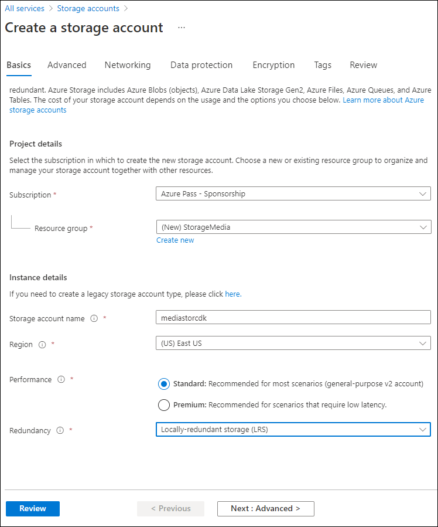

---
lab:
  az204Title: 'Lab 03: Retrieve Azure Storage resources and metadata by using the Azure Storage SDK for .NET'
  az204Module: 'Learning Path 03: Develop solutions that use blob storage'
---

# Lab 03: Recuperare le risorse e dei metadati di Archiviazione di Azure usando Azure Storage SDK per .NET

## Interfaccia utente di Microsoft Azure

Considerata la natura dinamica degli strumenti cloud di Microsoft, è possibile rilevare modifiche all'interfaccia utente di Azure apportate dopo lo sviluppo di questo contenuto per la formazione. È quindi possibile che le istruzioni e le procedure del lab non siano allineate correttamente.

Microsoft aggiorna questo corso di formazione quando la community segnala le modifiche necessarie. Poiché gli aggiornamenti cloud vengono apportati spesso, tuttavia, è possibile che si rilevino modifiche all'interfaccia utente prima degli aggiornamenti del contenuto per la formazione. **In questo caso, adattarsi alle modifiche e quindi eseguire le operazioni necessarie nei lab.**

## Istruzioni

### Prima di iniziare

#### Accedere all'ambiente lab

Accedere alla macchina virtuale Windows 10 usando le credenziali seguenti:

- Nome utente: `Admin`
- Password: `Pa55w.rd`

> **Nota**: il docente fornirà le istruzioni necessarie per la connessione all'ambiente lab virtuale.

#### Esaminare le applicazioni installate

Trovare la barra delle applicazioni nel desktop di Windows 10. La barra delle applicazioni include le icone per le applicazioni che verranno usate nel lab, tra cui:

-   Microsoft Edge
-   Esplora file

## Lab Scenario

In questo lab si apprenderà come usare Archiviazione di Azure SDK per accedere ai contenitori Archiviazione di Azure all'interno di un'applicazione C#. Si apprenderà anche come accedere ai metadati ed esporre informazioni sull'URI per ottenere l'accesso al contenuto dei contenitori nell'account di archiviazione. 

<em>Per visualizzare questo video, fare clic con il pulsante destro del mouse su questo **[collegamento al video](https://youtu.be/UtDXcgLv8BQ)** e selezionare 'Apri collegamento in una nuova scheda / nuova finestra'.</em>

 

## Diagramma dell'architettura


### Esercizio 1: Creare risorse di Azure

#### Attività 1: Aprire il portale di Azure

1. Sulla barra delle applicazioni selezionare l'icona di **Microsoft Edge**.

1. Nella finestra del browser passare al portale di Azure in `https://portal.azure.com`e quindi accedere con l'account che verrà usato per questo lab.

   > **Nota**: se si sta eseguendo l'accesso al portale di Azure per la prima volta, verrà visualizzata una presentazione del portale. Selezionare **Attività iniziali** per ignorare la presentazione e iniziare a usare il portale.

#### Attività 2: Creare un account di archiviazione

1. Nel portale di Azure usare la casella di testo **Cerca risorse, servizi e documentazione** per cercare **Account di archiviazione** e quindi nell'elenco di risultati selezionare **Account di archiviazione**.

1. Nel riquadro **Account di archiviazione** selezionare **+ Crea**.

1. Nel pannello **Crea un account** di archiviazione eseguire le azioni seguenti nella **scheda Informazioni di base** :

   | Impostazione | Azione |
   | -- | -- |
   | Elenco a discesa **Sottoscrizione** | Mantenere il valore predefinito |
   | Sezione **Gruppo di risorse** | Selezionare **Crea nuovo**, immettere **StorageMedia** e quindi selezionare **OK** |
   | Casella di testo **Nome account di archiviazione**  | Immettere **mediastor**_[nomeutente]_ |
   | Elenco a discesa **Area** | Selezionare **(Stati Uniti) Stati Uniti orientali** |
   | Sezione **Prestazioni** | Selezionare l'opzione **Standard** |
   | Elenco a discesa **Ridondanza** | Selezionare **Archiviazione con ridondanza locale** |

   Lo screenshot seguente mostra le impostazioni configurate nel pannello **Crea un account di archiviazione**.
 
   

1. Nella scheda Avanzate** verificare che **sia selezionata l'opzione **Consenti l'abilitazione dell'accesso anonimo nei singoli contenitori**. Controllare l'impostazione se non è abilitata.
    
1. Nella scheda **Rivedi** esaminare le opzioni selezionate durante i passaggi precedenti.

1. Selezionare **Crea** per creare l'account di archiviazione usando la configurazione specificata.

    > **Nota**: prima di procedere con il lab, attendere il completamento dell'attività di creazione.

1. Selezionare **Vai alla risorsa**.

1. Nel pannello  **Account di archiviazione**  selezionare il collegamento  **Endpoint**  nella sezione  **Impostazioni** .

1. Nella sezione **Endpoint** copiare il valore della casella di testo **Servizio BLOB** negli Appunti.

    > **Nota**: questo valore dell'endpoint verrà utilizzato più avanti nel lab.

1. Aprire il Blocco note e quindi incollare il valore del servizio BLOB copiato nel Blocco note.

1. Nella sezione **Sicurezza e rete** del pannello **Account di archiviazione** selezionare **Chiavi di accesso**.

1. Copiare il valore di **Nome dell'account di archiviazione** negli Appunti e incollarlo nel Blocco note.

1. Nel pannello **Chiavi di accesso** selezionare **Mostra chiavi**.

1. Esaminare le chiavi e quindi copiare il valore di una delle caselle **Chiave** negli Appunti.

    > **Nota**: tutti questi valori verranno utilizzati più avanti in questo lab.

#### Revisione

In questo esercizio è stato creato un nuovo account Archiviazione da usare nel resto del lab.

### Esercizio 2: Caricare un BLOB in un contenitore

#### Attività 1: Creare contenitori di account di archiviazione

1. Nel pannello **Account di archiviazione** selezionare il collegamento **Contenitori** nella sezione **Archiviazione dati**.

1. Nella sezione **Contenitori** selezionare **+ Contenitore**.

1. Nella finestra popup **Nuovo contenitore** eseguire le azioni seguenti e quindi selezionare **Crea**:

    | Impostazione | Azione |
    | -- | -- |
    | Casella di testo **Nome** | Immettere **raster-graphics** |
    | Elenco a discesa **Livello di accesso pubblico** | Selezionare **Privato (nessun accesso anonimo)** |

1. Nella sezione **Contenitori** selezionare **+ Contenitore**.

1. Nella finestra popup **Nuovo contenitore** eseguire le azioni seguenti e quindi selezionare **Crea**:

    | Impostazione | Azione |
    | -- | -- |
    | Casella di testo **Nome** | Immettere **compressed-audio** |
    | Elenco a discesa **Livello di accesso pubblico** | Selezionare **Privato (nessun accesso anonimo)** |

1. Nella sezione **Contenitori** osservare l'elenco aggiornato dei contenitori.

    Lo screenshot seguente mostra le impostazioni configurate nel pannello **Crea un account di archiviazione**.

    

#### Attività 2: Caricare un BLOB dell'account di archiviazione

1. Nella sezione **Contenitori** selezionare il contenitore **raster-graphics** creato di recente.

1.  Nel pannello **Contenitore** selezionare **Carica**.

1.  Nella finestra **Carica BLOB** eseguire le azioni seguenti e quindi selezionare **Carica**:

   | Impostazione | Azione |
   | -- | -- |
   | Sezione **File** | Selezionare **Sfoglia per i file** o usare la funzionalità di trascinamento della selezione |
   | Finestra **Esplora file** | Passare a **Allfiles (F):\\Allfiles\\Labs\\03\\Starter\\Images**, selezionare il file **graph.jpg** e quindi selezionare **Apri** |
   | Casella di controllo **Sovrascrivi se i file esistono già** | Assicurarsi che la casella di controllo sia selezionata |
   
   > **Nota**: prima di procedere con questo lab, attendere il completamento del caricamento del BLOB.

#### Revisione

In questo esercizio sono stati creati contenitori segnaposto nell'account di archiviazione e quindi uno dei contenitori è stato popolato con un BLOB.

### Esercizio 3: Accedere ai contenitori con .NET SDK

#### Attività 1: Creare un progetto .NET

1. Nella schermata **Start** selezionare il riquadro **Visual Studio Code**.

1. Nel menu **File** selezionare **Apri cartella**, passare a **Allfiles (F):\\Allfiles\\Labs\\03\\Starter\\BlobManager**, quindi scegliere **Seleziona cartella**.

1. Nella finestra di **Visual Studio Code**, nella barra dei menu, selezionare **Terminale** e quindi **Nuovo terminale**.

1. Nel terminale eseguire il comando seguente per creare un nuovo progetto .NET denominato **BlobManager** nella cartella corrente:

    ```
    dotnet new console --framework net6.0 --name BlobManager --output .
    ```

    > **Nota**: il comando **dotnet new** creerà un nuovo progetto **console** in una cartella con lo stesso nome del progetto.

1. Nel terminale eseguire il comando seguente per importare la versione 12.12.0 di **Azure.Archiviazione. ** BLOB da NuGet:

    ```
    dotnet add package Azure.Storage.Blobs --version 12.12.0
    ```

    > **Nota**: il comando **dotnet add package** aggiungerà il pacchetto **Azure.Storage.Blobs** da NuGet. Per altre informazioni, vedere [Azure.Storage.Blobs](https://www.nuget.org/packages/Azure.Storage.Blobs/12.12.0).

1. Nel terminale eseguire il comando seguente per compilare l'applicazione Web .NET:

    ```
    dotnet build
    ```

1. Selezionare **Termina il terminale** o l'icona del **Cestino** per chiudere il terminale aperto e tutti i processi associati.

#### Attività 2: Modificare la classe Program per accedere alla risorsa di archiviazione

1. Nel riquadro **Esplora risorse**  della finestra di **Visual Studio Code** aprire il file **Program.cs**.

1. Nella scheda dell'editor di codice per il file  **Program.cs** eliminare tutto il codice nel file esistente.

1. Aggiungere il codice seguente:

    ```csharp
    using Azure.Storage;
    using Azure.Storage.Blobs;
    using Azure.Storage.Blobs.Models;
    using System;
    using System.Threading.Tasks;    
    public class Program
    {
        //Update the blobServiceEndpoint value that you recorded previously in this lab.        
        private const string blobServiceEndpoint = "<primary-blob-service-endpoint>";

        //Update the storageAccountName value that you recorded previously in this lab.
        private const string storageAccountName = "<storage-account-name>";

        //Update the storageAccountKey value that you recorded previously in this lab.
        private const string storageAccountKey = "<key>";    


        //The following code to create a new asynchronous Main method
        public static async Task Main(string[] args)
        { 
        }
    }
    ```

1. Aggiornare la costante di tipo stringa **blobServiceEndpoint** impostandone il valore sull' **Endpoint di servizio BLOB primario** dell'account di archiviazione registrato in precedenza in questo lab.

1. Aggiornare la costante di tipo stringa **storageAccountName** impostandone il valore sul  **nome** dell'account di archiviazione registrato in precedenza in questo lab.

1. Aggiornare la costante di tipo stringa **storageAccountKey** impostandone il valore sulla  **chiave** dell'account di archiviazione registrato in precedenza in questo lab.
  

#### Attività 3: Connettersi all'endpoint del servizio BLOB di Archiviazione di Azure

1. **Nel metodo Main** aggiungere il codice seguente:
  
    ```csharp
     public static async Task Main(string[] args)
    {
        //The following line of code to create a new instance of the StorageSharedKeyCredential class by using the storageAccountName and storageAccountKey constants as constructor parameters
        StorageSharedKeyCredential accountCredentials = new StorageSharedKeyCredential(storageAccountName, storageAccountKey);

        //The following line of code to create a new instance of the BlobServiceClient class by using the blobServiceEndpoint constant and the accountCredentials variable as constructor parameters
        BlobServiceClient serviceClient = new BlobServiceClient(new Uri(blobServiceEndpoint), accountCredentials);

        //The following line of code to invoke the GetAccountInfoAsync method of the BlobServiceClient class to retrieve account metadata from the service
        AccountInfo info = await serviceClient.GetAccountInfoAsync();

        //Render a welcome message
        await Console.Out.WriteLineAsync($"Connected to Azure Storage Account");

        //Render the storage account's name
        await Console.Out.WriteLineAsync($"Account name:\t{storageAccountName}");

        //Render the type of storage account
        await Console.Out.WriteLineAsync($"Account kind:\t{info?.AccountKind}");

        //Render the currently selected stock keeping unit (SKU) for the storage account
        await Console.Out.WriteLineAsync($"Account sku:\t{info?.SkuName}");
    }
    ```

1. Salvare il file **Program.cs** .

1. Nella finestra di **Visual Studio Code**, nella barra dei menu, selezionare **Terminale** e quindi **Nuovo terminale**.

1. Nel terminale eseguire il comando seguente per eseguire l'applicazione Web .NET:

    ```
    dotnet run
    ```

    > **Nota**: se si verificano errori di compilazione, esaminare il file **Program.cs** nella cartella **Allfiles (F):\\Allfiles\\Labs\\03\\Solution\\BlobManager**.

1. Osservare l'output dell'applicazione console attualmente in esecuzione. L'output contiene i metadati per l'account di archiviazione recuperato dal servizio.

1. Selezionare **Termina il terminale** o l'icona del **Cestino** per chiudere il terminale aperto e tutti i processi associati.

#### Attività 4: Enumerare i contenitori esistenti

1. Nella classe **Program** immettere il codice seguente per creare un nuovo metodo **statico privato** denominato **EnumerateContainersAsync**, asincrono e con un singolo tipo di parametro **BlobServiceClient**:
   
    ```csharp
    private static async Task EnumerateContainersAsync(BlobServiceClient client)
    {   
        /*Create an asynchronous foreach loop that iterates over the results of 
            an invocation of the GetBlobContainersAsync method of the BlobServiceClient class. */    
        await foreach (BlobContainerItem container in client.GetBlobContainersAsync())
        {   
            //Print the name of each container
            await Console.Out.WriteLineAsync($"Container:\t{container.Name}");
        }
    }
    ```

1. Nel metodo **Main** immettere il codice seguente alla fine del metodo per richiamare il metodo **EnumerateContainersAsync**, passando la variabile *serviceClient* come parametro:

    ```csharp
    await EnumerateContainersAsync(serviceClient);
    ```

1. Osservare il file **Program.cs**, che ora dovrebbe includere:
    ```csharp
    using Azure.Storage;
    using Azure.Storage.Blobs;
    using Azure.Storage.Blobs.Models;
    using System;
    using System.Threading.Tasks;
    
    public class Program
    {
        private const string blobServiceEndpoint = "your blobServiceEndpoint";
        private const string storageAccountName = "your storageAccountName";
        private const string storageAccountKey = "your storageAccountKey";    
        public static async Task Main(string[] args)
        {
            StorageSharedKeyCredential accountCredentials = new StorageSharedKeyCredential(storageAccountName, storageAccountKey);
            BlobServiceClient serviceClient = new     BlobServiceClient(new Uri(blobServiceEndpoint), accountCredentials);
            AccountInfo info = await serviceClient.GetAccountInfoAsync();
            await Console.Out.WriteLineAsync($"Connected to Azure Storage Account");
            await Console.Out.WriteLineAsync($"Account name:\t{storageAccountName}");
            await Console.Out.WriteLineAsync($"Account kind:\t{info?.AccountKind}");
            await Console.Out.WriteLineAsync($"Account sku:\t{info?.SkuName}");

            /* To invoke the EnumerateContainersAsync method, 
            passing in the serviceClient variable as a parameter */
            await EnumerateContainersAsync(serviceClient);
        }        
        private static async Task EnumerateContainersAsync(BlobServiceClient client)
        {        
            await foreach (BlobContainerItem container in client.GetBlobContainersAsync())
            {
                await Console.Out.WriteLineAsync($"Container:\t{container.Name}");
            }
    }
    }
    ```

1. Salvare il file **Program.cs** .

1. Nella finestra di **Visual Studio Code**, nella barra dei menu, selezionare **Terminale** e quindi **Nuovo terminale**.

1. Nel terminale eseguire il comando seguente per eseguire l'applicazione Web .NET:

    ```
    dotnet run
    ```

    > **Nota**: se si verificano errori di compilazione, esaminare il file **Program.cs** nella cartella **Allfiles (F):\\Allfiles\\Labs\\03\\Solution\\BlobManager**.

1. Osservare l'output dell'applicazione console attualmente in esecuzione. L'output aggiornato include un elenco di tutti i contenitori esistenti nell'account.

1. Selezionare **Termina il terminale** o l'icona del **Cestino** per chiudere il terminale aperto e tutti i processi associati.

#### Revisione

In questo esercizio è stato eseguito l'accesso ai contenitori esistenti usando Azure Storage SDK.

### Esercizio 4: Recuperare gli URI (Uniform Resource Identifier) dei BLOB con .NET SDK

#### Attività 1: Enumerare i BLOB in un contenitore esistente usando l'SDK

1. Nella classe **Program** immettere il codice seguente per creare un nuovo metodo **statico privato** denominato **EnumerateBlobsAsync**, asincrono e con due tipi di parametro, ovvero **BlobServiceClient** e **string**:
  
    ```csharp
    private static async Task EnumerateBlobsAsync(BlobServiceClient client, string containerName)
    {   
        /* Get a new instance of the BlobContainerClient class by using the
           GetBlobContainerClient method of the BlobServiceClient class, 
           passing in the containerName parameter */   
        BlobContainerClient container = client.GetBlobContainerClient(containerName);

        /* Render the name of the container that will be enumerated */
        await Console.Out.WriteLineAsync($"Searching:\t{container.Name}");

        /* Create an asynchronous foreach loop that iterates over the results of
            an invocation of the GetBlobsAsync method of the BlobContainerClient class */
        await foreach (BlobItem blob in container.GetBlobsAsync())
        {     
            //Print the name of each blob    
            await Console.Out.WriteLineAsync($"Existing Blob:\t{blob.Name}");
        }
    }
    ```

1. Nel metodo **Main** immettere il codice seguente alla fine del metodo per creare una variabile denominata *existingContainerName* con un valore **raster-graphics**:

    ```csharp
    string existingContainerName = "raster-graphics";
    ```

1. Nel metodo **Main** immettere il codice seguente alla fine del metodo per richiamare il metodo **EnumerateBlobsAsync**, passando le variabili *serviceClient* ed *existingContainerName* come parametri:

    ```csharp
    await EnumerateBlobsAsync(serviceClient, existingContainerName);
    ```

1. Osservare il file **Program.cs**, che ora dovrebbe includere:
    ```csharp
    using Azure.Storage;
    using Azure.Storage.Blobs;
    using Azure.Storage.Blobs.Models;
    using System;
    using System.Threading.Tasks;    
    public class Program
    {
        private const string blobServiceEndpoint = "your blobServiceEndpoint";
        private const string storageAccountName = "your storageAccountName";
        private const string storageAccountKey = "your storageAccountKey";    
        public static async Task Main(string[] args)
        {
            StorageSharedKeyCredential accountCredentials = new StorageSharedKeyCredential(storageAccountName, storageAccountKey);
            BlobServiceClient serviceClient = new   BlobServiceClient(new Uri(blobServiceEndpoint), accountCredentials);
            AccountInfo info = await serviceClient.GetAccountInfoAsync();
            await Console.Out.WriteLineAsync($"Connected to Azure Storage Account");
            await Console.Out.WriteLineAsync($"Account name:\t{storageAccountName}");
            await Console.Out.WriteLineAsync($"Account kind:\t{info?.AccountKind}");
            await Console.Out.WriteLineAsync($"Account sku:\t{info?.SkuName}");
            await EnumerateContainersAsync(serviceClient);
            string existingContainerName = "raster-graphics";
            await EnumerateBlobsAsync(serviceClient, existingContainerName);
        }        
        private static async Task EnumerateContainersAsync(BlobServiceClient client)
        {        
            await foreach (BlobContainerItem container in client.GetBlobContainersAsync())
            {
                await Console.Out.WriteLineAsync($"Container:\t{container.Name}");
            }
        }        
        private static async Task EnumerateBlobsAsync(BlobServiceClient client, string containerName)
        {      
            BlobContainerClient container = client.GetBlobContainerClient(containerName);
            await Console.Out.WriteLineAsync($"Searching:\t{container.Name}");
            await foreach (BlobItem blob in container.GetBlobsAsync())
            {        
                await Console.Out.WriteLineAsync($"Existing Blob:\t{blob.Name}");
            }
        }
    }
    ```

1. Salvare il file **Program.cs** .

1. Nella finestra di **Visual Studio Code**, nella barra dei menu, selezionare **Terminale** e quindi **Nuovo terminale**.

1. Nel terminale eseguire il comando seguente per eseguire l'applicazione Web .NET:

    ```
    dotnet run
    ```

    > **Nota**: se si verificano errori di compilazione, esaminare il file **Program.cs** nella cartella **Allfiles (F):\\Allfiles\\Labs\\03\\Solution\\BlobManager**.

1. Osservare l'output dell'applicazione console attualmente in esecuzione. L'output aggiornato include i metadati relativi al contenitore e ai BLOB esistenti.

1. Selezionare **Termina il terminale** o l'icona del **Cestino** per chiudere il terminale aperto e tutti i processi associati.

#### Attività 2: Creare un nuovo contenitore usando l'SDK

1. Nella classe **Program** immettere il codice seguente per creare un nuovo metodo **statico privato** denominato **GetContainerAsync**, asincrono e con due tipi di parametro, ovvero **BlobServiceClient** e **string**:

    ```csharp
    private static async Task<BlobContainerClient> GetContainerAsync(BlobServiceClient client, string containerName)
    {   
        /* Get a new instance of the BlobContainerClient class by using the
            GetBlobContainerClient method of the BlobServiceClient class,
            passing in the containerName parameter */   
        BlobContainerClient container = client.GetBlobContainerClient(containerName);

        /* Invoke the CreateIfNotExistsAsync method of the BlobContainerClient class */
        await container.CreateIfNotExistsAsync(PublicAccessType.Blob);

        /* Render the name of the container that was potentially created */
        await Console.Out.WriteLineAsync($"New Container:\t{container.Name}");

        /* Return the container as the result of the GetContainerAsync */        
        return container;
    }
    ```

1. Nel metodo **Main** immettere il codice seguente alla fine del metodo per creare una variabile denominata *newContainerName* con un valore **vector-graphics**:

    ```csharp
    string newContainerName = "vector-graphics";
    ```

1. Nel metodo **Main** immettere il codice seguente alla fine del metodo per richiamare il metodo **GetContainerAsync**, per passare le variabili *serviceClient* e *newContainerName* come parametri e per archiviare il risultato in una variabile denominata *containerClient* di tipo **BlobContainerClient**:

    ```csharp
    BlobContainerClient containerClient = await GetContainerAsync(serviceClient, newContainerName);
    ```

1. Esaminare il file **Program.cs**, che ora dovrebbe includere:
    ```csharp
    using Azure.Storage;
    using Azure.Storage.Blobs;
    using Azure.Storage.Blobs.Models;
    using System;
    using System.Threading.Tasks;    
    public class Program
    {
        private const string blobServiceEndpoint = "your blobServiceEndpoint";
        private const string storageAccountName = "your storageAccountName";
        private const string storageAccountKey = "your storageAccountKey";
        public static async Task Main(string[] args)
        {
            StorageSharedKeyCredential accountCredentials = new StorageSharedKeyCredential(storageAccountName, storageAccountKey);
            BlobServiceClient serviceClient = new BlobServiceClient(new Uri(blobServiceEndpoint), accountCredentials);
            AccountInfo info = await serviceClient.GetAccountInfoAsync();
            await Console.Out.WriteLineAsync($"Connected to Azure Storage Account");
            await Console.Out.WriteLineAsync($"Account name:\t{storageAccountName}");
            await Console.Out.WriteLineAsync($"Account kind:\t{info?.AccountKind}");
            await Console.Out.WriteLineAsync($"Account sku:\t{info?.SkuName}");
            await EnumerateContainersAsync(serviceClient);
            string existingContainerName = "raster-graphics";
            await EnumerateBlobsAsync(serviceClient, existingContainerName);
            string newContainerName = "vector-graphics";
            BlobContainerClient containerClient = await GetContainerAsync(serviceClient, newContainerName);
        }        
        private static async Task EnumerateContainersAsync(BlobServiceClient client)
        {        
            await foreach (BlobContainerItem container in client.GetBlobContainersAsync())
            {
                await Console.Out.WriteLineAsync($"Container:\t{container.Name}");
            }
        }        
        private static async Task EnumerateBlobsAsync(BlobServiceClient client, string containerName)
        {      
            BlobContainerClient container = client.GetBlobContainerClient(containerName);
            await Console.Out.WriteLineAsync($"Searching:\t{container.Name}");
            await foreach (BlobItem blob in container.GetBlobsAsync())
            {        
                await Console.Out.WriteLineAsync($"Existing Blob:\t{blob.Name}");
            }
        }        
        private static async Task<BlobContainerClient> GetContainerAsync(BlobServiceClient client, string containerName)
        {      
            BlobContainerClient container = client.GetBlobContainerClient(containerName);
            await container.CreateIfNotExistsAsync(PublicAccessType.Blob);
            await Console.Out.WriteLineAsync($"New Container:\t{container.Name}");
            return container;
        }
    }
    ```

1. Salvare il file **Program.cs** .

1. Nella finestra di **Visual Studio Code**, nella barra dei menu, selezionare **Terminale** e quindi **Nuovo terminale**.

1. Nel terminale eseguire il comando seguente per eseguire l'applicazione Web .NET:

    ```
    dotnet run
    ```

    > **Nota**: se si verificano errori di compilazione, esaminare il file **Program.cs** nella cartella **Allfiles (F):\\Allfiles\\Labs\\03\\Solution\\BlobManager**.

1. Osservare l'output dell'applicazione console attualmente in esecuzione. L'output aggiornato include i metadati relativi al contenitore e ai BLOB esistenti.

1. Selezionare **Termina il terminale** o l'icona del **Cestino** per chiudere il terminale aperto e tutti i processi associati.

#### Attività 3: Caricare un nuovo BLOB tramite il portale

1. Nel riquadro di **spostamento** del portale di Azure selezionare il collegamento **Gruppi di risorse**.

1. Nel pannello **Gruppi di risorse** selezionare il gruppo di risorse **StorageMedia** creato in precedenza in questo lab.

1. Nel pannello **StorageMedia** selezionare l'account di archiviazione **mediastor**_[nomeutente]_ creato in precedenza in questo lab.

1. Nel pannello **Account di archiviazione** selezionare il collegamento **Contenitori** nella sezione **Archiviazione dati**.

1. Nella sezione **Contenitori** selezionare il contenitore **vector-graphics** appena creato. Potrebbe essere necessario aggiornare la pagina per osservare il nuovo contenitore.

1.  Nel pannello **Contenitore** selezionare **Carica**.

1.  Nella finestra **Carica BLOB** eseguire le azioni seguenti e quindi selezionare **Carica**:

    | Impostazione | Azione |
    | -- | -- |
    | Sezione **File** | Selezionare **Sfoglia per i file** o usare la funzionalità di trascinamento della selezione |
    | Finestra **Esplora file** |  **Allfiles (F):\\Allfiles\\Labs\\03\\Starter\\Images**, selezionare il file **graph.svg** e quindi **Apri** |
    | Casella di controllo **Sovrascrivi se i file esistono già** | Assicurarsi che la casella di controllo sia selezionata |

    > **Nota**: prima di procedere con questo lab, attendere il completamento del caricamento del BLOB.

#### Attività 4: Accedere all'URI del BLOB usando l'SDK

1. Tornare alla finestra di **Visual Studio Code**.

1. Nella classe **Program** immettere il codice seguente per creare un nuovo metodo **statico privato** denominato **GetBlobAsync**, asincrono e con due tipi di parametro, ovvero **BlobContainerClient** e **string**:
   
    ```csharp
    private static async Task<BlobClient> GetBlobAsync(BlobContainerClient client, string blobName)
    {      
        BlobClient blob = client.GetBlobClient(blobName);
        bool exists = await blob.ExistsAsync();
        if (!exists)
        {
            await Console.Out.WriteLineAsync($"Blob {blob.Name} not found!");
            
        }
        else
            await Console.Out.WriteLineAsync($"Blob Found, URI:\t{blob.Uri}");
        return blob;
    }
    ```

1. Nel metodo **Main** immettere il codice seguente alla fine del metodo per creare una variabile denominata *uploadedBlobName* con un valore **graph.svg**:

    ```csharp
    string uploadedBlobName = "graph.svg";
    ```

1. Nel metodo **Main** immettere il codice seguente alla fine del metodo per richiamare il metodo **GetBlobAsync**, passando le variabili *containerClient* e *uploadedBlobName* come parametri e per archiviare il risultato in una variabile denominata *blobClient* di tipo **BlobClient**:

    ```csharp
    BlobClient blobClient = await GetBlobAsync(containerClient, uploadedBlobName);
    ```

1. Nel metodo **Main** immettere il codice seguente alla fine del metodo per eseguire il rendering della proprietà **Uri** della variabile *blobClient*:

    ```csharp
    await Console.Out.WriteLineAsync($"Blob Url:\t{blobClient.Uri}");
    ```

1. Osservare il file **Program.cs**, che ora dovrebbe includere:
    ```csharp
    using Azure.Storage;
    using Azure.Storage.Blobs;
    using Azure.Storage.Blobs.Models;
    using System;
    using System.Threading.Tasks;    
    public class Program
    {
        private const string blobServiceEndpoint = "your blobServiceEndpoint";
        private const string storageAccountName = "your storageAccountName";
        private const string storageAccountKey = "your storageAccountKey";    
        public static async Task Main(string[] args)
        {
            StorageSharedKeyCredential accountCredentials = new StorageSharedKeyCredential(storageAccountName, storageAccountKey);
            BlobServiceClient serviceClient = new BlobServiceClient(new Uri(blobServiceEndpoint), accountCredentials);
            AccountInfo info = await serviceClient.GetAccountInfoAsync();
            await Console.Out.WriteLineAsync($"Connected to Azure Storage Account");
            await Console.Out.WriteLineAsync($"Account name:\t{storageAccountName}");
            await Console.Out.WriteLineAsync($"Account kind:\t{info?.AccountKind}");
            await Console.Out.WriteLineAsync($"Account sku:\t{info?.SkuName}");
            await EnumerateContainersAsync(serviceClient);
            string existingContainerName = "raster-graphics";
            await EnumerateBlobsAsync(serviceClient, existingContainerName);
            string newContainerName = "vector-graphics";
            BlobContainerClient containerClient = await GetContainerAsync(serviceClient, newContainerName);
            string uploadedBlobName = "graph.svg";
            BlobClient blobClient = await GetBlobAsync(containerClient, uploadedBlobName);
            await Console.Out.WriteLineAsync($"Blob Url:\t{blobClient.Uri}");
        }        
        private static async Task EnumerateContainersAsync(BlobServiceClient client)
        {        
            await foreach (BlobContainerItem container in client.GetBlobContainersAsync())
            {
                await Console.Out.WriteLineAsync($"Container:\t{container.Name}");
            }
        }        
        private static async Task EnumerateBlobsAsync(BlobServiceClient client, string containerName)
        {      
            BlobContainerClient container = client.GetBlobContainerClient(containerName);
            await Console.Out.WriteLineAsync($"Searching:\t{container.Name}");
            await foreach (BlobItem blob in container.GetBlobsAsync())
            {        
                await Console.Out.WriteLineAsync($"Existing Blob:\t{blob.Name}");
            }
        }        
        private static async Task<BlobContainerClient> GetContainerAsync(BlobServiceClient client, string containerName)
        {      
            BlobContainerClient container = client.GetBlobContainerClient(containerName);

            await container.CreateIfNotExistsAsync(PublicAccessType.Blob);
            await Console.Out.WriteLineAsync($"New Container:\t{container.Name}");
            return container;
        }        
        private static async Task<BlobClient> GetBlobAsync(BlobContainerClient client, string blobName)
        {      
            BlobClient blob = client.GetBlobClient(blobName);
            bool exists = await blob.ExistsAsync();
            if (!exists)
            {
                await Console.Out.WriteLineAsync($"Blob {blob.Name} not found!");
                
            }
            else
                await Console.Out.WriteLineAsync($"Blob Found, URI:\t{blob.Uri}");
            return blob;
        }
    }
    ```

1. Salvare il file **Program.cs** .

1. Nella finestra di **Visual Studio Code**, nella barra dei menu, selezionare **Terminale** e quindi **Nuovo terminale**.

1. Nel terminale eseguire il comando seguente per eseguire l'applicazione Web .NET:

    ```
    dotnet run
    ```

    > **Nota**: se si verificano errori di compilazione, esaminare il file **Program.cs** nella cartella **Allfiles (F):\\Allfiles\\Labs\\03\\Solution\\BlobManager**.

1. Osservare l'output dell'applicazione console attualmente in esecuzione. L'output aggiornato include l'URL finale per accedere al BLOB online. Registrare il valore di questo URL da usare in un secondo momento nel lab.

    > **Nota**: l'URL sarà probabilmente simile alla stringa seguente: `https://mediastor*[yourname]*.blob.core.windows.net/vector-graphics/graph.svg`

1. Selezionare **Termina il terminale** o l'icona del **Cestino** per chiudere il terminale aperto e tutti i processi associati.

#### Attività 5: Testare l'URI usando un browser

1. Sulla barra delle applicazioni attivare il menu di scelta rapida per l'icona di **Microsoft Edge** e quindi selezionare **Nuova finestra**.

1. Nella nuova finestra del browser fare riferimento all'URL copiato in precedenza in questo lab per il BLOB.

1. Si noterà ora il file SVG (Scalable Vector Graphics) nella finestra del browser.

#### Revisione

In questo esercizio sono stati creati contenitori e sono stati gestiti BLOB usando Storage SDK.
