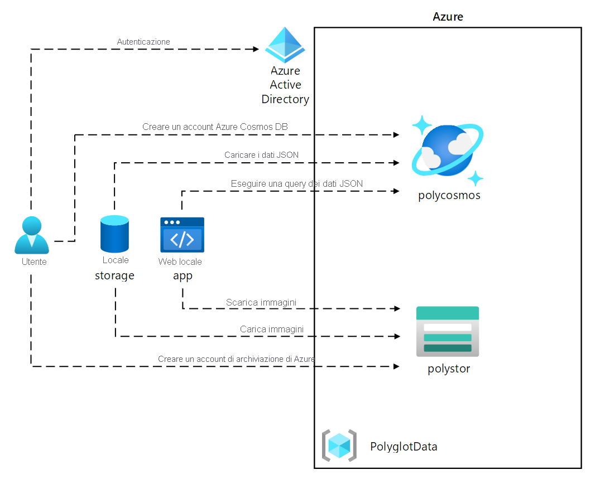
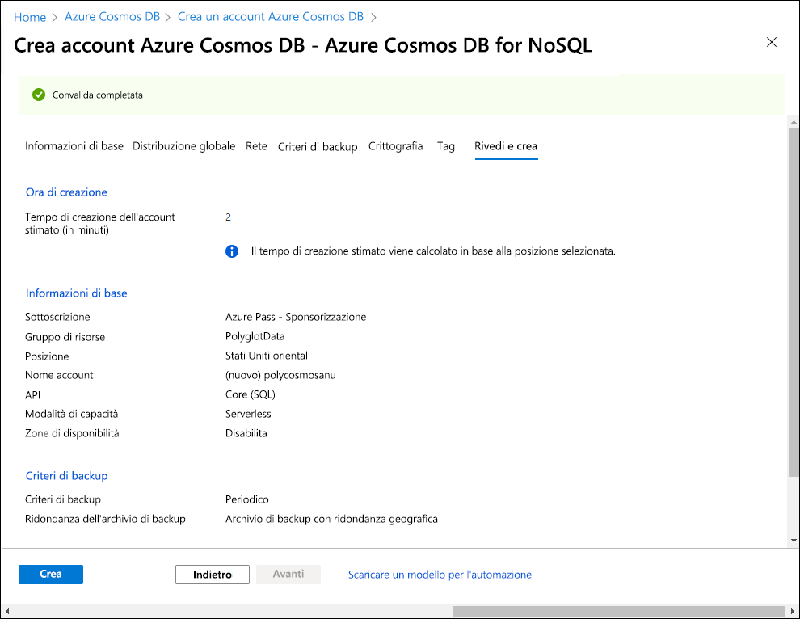
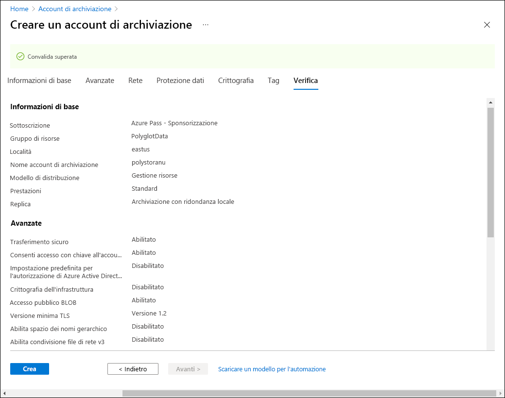

---
lab:
  az204Title: 'Lab 04: Construct a polyglot data solution'
  az020Title: 'Lab 04: Construct a polyglot data solution'
  az204Module: 'Module 04: Develop solutions that use Cosmos DB storage'
  az020Module: 'Module 04: Develop solutions that use Cosmos DB storage'
---

# <a name="lab-04-construct-a-polyglot-data-solution"></a>Lab 04: Costruire una soluzione dati polyglot

## <a name="microsoft-azure-user-interface"></a>Interfaccia utente di Microsoft Azure

Considerata la natura dinamica degli strumenti cloud di Microsoft, è possibile rilevare modifiche all'interfaccia utente di Azure apportate dopo lo sviluppo di questo contenuto per la formazione. È quindi possibile che le istruzioni e le procedure del lab non siano allineate correttamente.

Microsoft aggiorna questo corso di formazione quando la community segnala le modifiche necessarie. Poiché gli aggiornamenti cloud vengono apportati spesso, tuttavia, è possibile che si rilevino modifiche all'interfaccia utente prima degli aggiornamenti del contenuto per la formazione. **In questo caso, adattarsi alle modifiche e quindi eseguire le operazioni necessarie nei lab.**

## <a name="instructions"></a>Istruzioni

### <a name="before-you-start"></a>Prima di iniziare

#### <a name="sign-in-to-the-lab-environment"></a>Accedere all'ambiente lab

Accedere alla macchina virtuale Windows 10 usando le credenziali seguenti:
    
-   Nome utente: **Admin**

-   Password: **Pa55w.rd**

> **Nota**: il docente fornirà le istruzioni necessarie per la connessione all'ambiente lab virtuale.

#### <a name="review-the-installed-applications"></a>Esaminare le applicazioni installate

Trovare la barra delle applicazioni nel desktop di Windows 10. La barra delle applicazioni include le icone per le applicazioni che verranno usate nel lab, tra cui:
    
-   Microsoft Edge

-   Esplora file

-   Visual Studio Code

## <a name="architecture-diagram"></a>Diagramma dell'architettura



### <a name="exercise-1-creating-data-store-resources-in-azure"></a>Esercizio 1: Creazione di risorse dell'archivio dati in Azure

#### <a name="task-1-open-the-azure-portal"></a>Attività 1: Aprire il portale di Azure

1.  Sulla barra delle applicazioni selezionare l'icona di **Microsoft Edge**.

1.  Nella finestra aperta del browser passare al portale di Azure ([portal.azure.com](https://portal.azure.com)) e quindi accedere con l'account che si userà per questo lab.

    > **Nota**: se si sta eseguendo l'accesso al portale di Azure per la prima volta, verrà visualizzata una presentazione del portale. Selezionare **Attività iniziali** per ignorare la presentazione e iniziare a usare il portale.

#### <a name="task-2-create-an-azure-cosmos-db-account-resource"></a>Attività 2: Creare una risorsa dell'account Azure Cosmos DB

1.  Nel portale di Azure usare la casella di testo **Cerca risorse, servizi e documentazione** per cercare **Azure Cosmos DB** e quindi nell'elenco di risultati selezionare **Azure Cosmos DB**.

1.  Nel riquadro **Azure Cosmos DB** selezionare **+ Crea**.

1.  Nel riquadro **Seleziona l'opzione API** selezionare **Crea** nella casella **Azure Cosmos DB for NoSQL**.

1.  Nella scheda **Informazioni di base** della pagina **Crea account Azure Cosmos DB - Azure Cosmos DB for NoSQL** eseguire le azioni seguenti e quindi selezionare **Rivedi e crea**:

    | Impostazione | Azione |
    | -- | -- |
    | Elenco **Sottoscrizioni** | Mantieni impostazioni predefinite |
    | Sezione **Gruppo di risorse**  | Selezionare **Crea nuovo** |
    | Casella di testo **Nome** | Immettere **Polyglotdata** e selezionare **OK** |
    | Casella di testo **AccountName** | Immettere **polycosmos** _[nomeutente]_ |
    | Elenco a discesa **Posizione** | Selezionare un'area di Azure più vicina alla posizione del computer lab e in cui è possibile creare un account Cosmos DB |
    | Sezione **Modalità di capacità**  | Selezionare **Serverless** |
    
    Lo screenshot seguente mostra le impostazioni configurate nella pagina **Crea account Azure Cosmos DB - Azure Cosmos DB for NoSQL**.
    
    
    
1.  Nella scheda **Rivedi e crea** della pagina **Crea account Azure Cosmos DB - Azure Cosmos DB for NoSQL** esaminare le opzioni selezionate durante i passaggi precedenti. 

1.  Selezionare **Crea** per creare l'account Azure Cosmos DB usando la configurazione specificata.

    > **Nota**: prima di procedere con il lab, attendere il completamento dell'attività di creazione.

1.  Selezionare **Vai alla risorsa**.

1.  Nel riquadro **Account Azure Cosmos DB** trovare la sezione **Impostazioni** e quindi selezionare il collegamento **Chiavi** .

1.  Nel riquadro **Chiavi** registrare i valori delle caselle di testo **URI**, **CHIAVE PRIMARIA** e **STRINGA DI CONNESSIONE PRIMARIA** nella scheda **Chiavi di lettura/scrittura**. Questi valori verranno utilizzati più avanti in questo lab.

#### <a name="task-3-create-an-azure-storage-account-resource"></a>Attività 3: Creare una risorsa dell'account di archiviazione di Azure

1.  Nel portale di Azure usare la casella di testo **Cerca risorse, servizi e documentazione** per cercare **Account di archiviazione** e quindi nell'elenco di risultati selezionare **Account di archiviazione**.

1.  Nel riquadro **Account di archiviazione** selezionare **+ Crea**.

1.  Nella scheda **Informazioni principali** del pannello **Crea un account di archiviazione** eseguire le azioni seguenti e selezionare **Rivedi**:


    | Impostazione | Azione |
    | -- | -- |
    | Elenco **Sottoscrizioni** | Mantieni impostazioni predefinite |
    | Sezione **Gruppo di risorse** | Selezionare **PolyglotData** |
    | Casella di testo **Nome account di archiviazione** | Immettere **polystor** _[nomeutente]_ |
    | Elenco a discesa **Area**  | Selezionare la stessa area in cui è stato creato l'account Cosmos DB in precedenza in questo esercizio |
    | Sezione **Prestazioni**  | selezionare **Standard** |
    | Elenco a discesa **Ridondanza**  | Selezionare **Archiviazione con ridondanza locale**. |
    
    
    Lo screenshot seguente mostra le impostazioni configurate nel pannello **Crea un account di archiviazione**.
          
     
     
1.  Nella scheda **Rivedi** del pannello **Crea un account di archiviazione** esaminare le opzioni selezionate durante i passaggi precedenti.

1.  Selezionare **Crea** per creare l'account di archiviazione usando la configurazione specificata.

    > **Nota**: prima di procedere con il lab, attendere il completamento dell'attività di creazione.

#### <a name="review"></a>Verifica

In questo esercizio sono state create le risorse di Azure necessarie per la soluzione dati polyglot che verrà implementata in questo lab. Le risorse di Azure create includono un account Azure Cosmos DB e un account di archiviazione di Azure.

### <a name="exercise-2-review-and-upload-data"></a>Esercizio 2: Esaminare e caricare i dati

#### <a name="task-1-upload-images-to-azure-blob-storage"></a>Attività 1: Caricare immagini in Archiviazione BLOB di Azure

1.  Nel riquadro di spostamento del portale di Azure tornare al pannello **Account di archiviazione** e quindi selezionare l'account di archiviazione **polystor** _[nomeutente]_ creato nell'esercizio precedente di questo lab.

1.  Nel pannello dell'account di archiviazione **polystor** _[nomeutente]_ selezionare il collegamento **Contenitori** nella sezione **Archiviazione dati**.

1.  Nella sezione **Contenitori** selezionare **+ Contenitore**.

1.  Nella finestra popup **Nuovo contenitore** eseguire le azioni seguenti e quindi selezionare **Crea**:

    | Impostazione | Azione |
    | -- | -- |
    | Casella di testo **Nome** | Immettere **images** |
    | Elenco a discesa **Livello di accesso pubblico** | Selezionare **BLOB (accesso in lettura anonimo solo per i BLOB)** |
    
   
1.  Nella sezione **Contenitori** selezionare il contenitore **images** appena creato.

1.  Trovare la sezione **Impostazioni** nel pannello **Contenitore** e quindi selezionare il collegamento **Proprietà**.

1.  Nel riquadro **Proprietà** prendere nota del valore nella casella di testo **URL** e registrarlo. Questo valore verrà usato più avanti nel lab.

1.  Trovare e selezionare il collegamento **Panoramica** nel pannello.
1.  Nel pannello selezionare **Carica**.

1.  Nella finestra **Carica BLOB** eseguire le azioni seguenti:
    
    a.  Nella sezione **File** selezionare l'icona **Cartella**.
    
    b.  Nella finestra **Esplora file** passare a **Allfiles (F):\\Allfiles\\Labs\\04\\Starter\\Images**, selezionare tutti i 42 file immagine **.jpg** e quindi selezionare **Apri**.
    
    c.  Assicurarsi che sia selezionata l'opzione **Sovrascrivi se i file esistono già** e quindi selezionare **Carica**.

    > **Nota**: prima di procedere con questo lab, attendere il completamento del caricamento di tutti i BLOB.

#### <a name="task-2-review-json-data"></a>Attività 2: Esaminare i dati JSON

1.  Dal computer del lab avviare Visual Studio Code.

1.  Dal menu **File** selezionare **Apri file**, passare a **Allfiles (F):\\Allfiles\\Labs\\04\\Starter\\AdventureWorks\\AdventureWorks.Upload**, selezionare **models.json** e quindi **Apri**.

1.  Esaminare il formato del file **models.json** e notare che contiene una matrice di oggetti JSON, con una matrice annidata di oggetti che fanno parte della proprietà **Products**.

    > **Nota**: determina le classi che verranno definite per deserializzare il contenuto del file JSON prima di caricarlo in una raccolta Cosmos DB.

1.  Nel file **models.json** si noti che una delle proprietà è denominata **Category**.

    > **Nota**: si userà la proprietà **Category** per definire il partizionamento della raccolta di Cosmos DB.

1.  Chiudere Visual Studio Code.

#### <a name="task-3-create-a-cosmos-db-database-and-collection-and-perform-a-json-data-upload"></a>Attività 3: Creare un database e una raccolta Cosmos DB ed eseguire un caricamento di dati JSON

1.  Nella schermata **Start** selezionare il riquadro **Visual Studio Code**.

1.  Dal menu **File** selezionare **Apri cartella**.

1.  Nella finestra **Esplora file** visualizzata passare a **Allfiles (F):\\Allfiles\\Labs\\04\\Starter\\AdventureWorks** e quindi selezionare **Seleziona cartella**.

1.  Nella finestra di **Visual Studio Code**, nella barra dei menu, selezionare **Terminale** e quindi **Nuovo terminale**.

1.  Nel terminale verificare che la directory corrente sia impostata su **AdventureWorks** (o modificarla in caso contrario), quindi eseguire il comando seguente per commutare il contesto del terminale sulla cartella **AdventureWorks.Upload**:

    ```
    cd .\AdventureWorks.Upload\
    ```

    > **Nota**: prima di eseguire il passaggio successivo, aprire Esplora risorse e rimuovere l'attributo **Sola lettura** dal file **Allfiles (F):\\Allfiles\\Labs\\04\\Starter\\AdventureWorks\\AdventureWorks.Upload\\AdventureWorks.Upload.csproj**

1.  Dal prompt del terminale eseguire il comando seguente per aggiungere la libreria client .NET di Azure Cosmos DB al progetto attualmente aperto:

    ```
    dotnet add package Microsoft.Azure.Cosmos --version 3.28.0
    ```

    > **Nota**: il comando **dotnet add package** aggiungerà il pacchetto **Microsoft.Azure.Cosmos** da **NuGet**. Per altre informazioni, vedere [Microsoft.Azure.Cosmos](https://www.nuget.org/packages/Microsoft.Azure.Cosmos).

1.  Osservare i risultati della compilazione stampata nel terminale. La compilazione dovrebbe essere completata correttamente senza errori o messaggi di avviso.

1.  Nel riquadro **Esplora risorse** della finestra di **Visual Studio Code** espandere il progetto **AdventureWorks.Upload**.

1.  Aprire il file **Program.cs**.

1.  Nel file **Program.cs** esaminare le direttive **using** e notare che includono **Microsoft.Azure.Cosmos**, **System.IO**, **System.Text.Json**, **System.Threading.Tasks** e **System.Collections.Generic**. Ciò consente il caricamento asincrono di elementi JSON da un file locale nel computer lab a una raccolta in un database Cosmos DB.

1.  Nella riga 14 del file **Program.cs** impostare il valore di **EndpointUrl** sostituendo la stringa vuota con la proprietà **URI** dell'account Cosmos DB registrato in precedenza in questo lab. Assicurarsi che il valore sia racchiuso tra virgolette doppie.

1.  Nella riga 15 impostare il valore di **AuthorizationKey** sostituendo la stringa vuota con la proprietà **PRIMARY KEY** dell'account Cosmos DB registrato in precedenza in questo lab. Assicurarsi che il valore sia racchiuso tra virgolette doppie.

1.  Nella riga 18 impostare il valore di **PartitionKey** sostituendo la stringa vuota con **"/Category"** .

1.  Alla riga 19 impostare il valore di **JsonFilePath** sostituendo la stringa vuota con **"F:\\\\Allfiles\\\\Labs\\\\04\\\\Starter\\\\AdventureWorks\\\\AdventureWorks.Upload\\\\models.json"** .

1.  All'interno del blocco try si noti la chiamata del metodo **CreateDatabaseIfNotExistsAsync** della classe **CosmosClient**. Verrà creato un database, se non ne esiste già uno.

1.  Si noti la chiamata del metodo **DefineContainer** della classe **Database**. Verrà creato un contenitore che ospiterà gli elementi JSON, se non ne esiste già uno.

    > **Nota**: il metodo **DefineContainer** include un'opzione di riduzione dei costi che consente di modificare i criteri di indicizzazione predefiniti (indicizzazione automatica di tutti gli attributi).

1.  Si noti l'istruzione **using** che si basa su un oggetto **StreamReader** per leggere elementi JSON da un file di testo e deserializzarli in oggetti della classe **Model** definiti ulteriormente nel file **Program.cs**.

1.  Si noti il ciclo foreach che esegue la reiterazione della raccolta di oggetti deserializzati e li inserisce in modo asincrono nella raccolta di destinazione.

1.  Esaminare le classi **Model** e **Product** che riflettono il formato degli oggetti archiviati nel file in formato JSON esaminato in precedenza in questo lab.

1.  Salvare e chiudere il file **Program.cs**.

    > **Nota**: selezionare **Sovrascrivere** se è stata visualizzata una richiesta indicante che il file è di sola lettura.

1. Nel terminale eseguire il comando seguente per ripristinare eventuali pacchetti NuGet mancanti e compilare il progetto nella cartella:

    ```
    dotnet build
    ```

    > **Nota**: il comando **dotnet build** ripristina automaticamente tutti i pacchetti NuGet mancanti prima di compilare tutti i progetti nella cartella.

1.  Dal prompt del terminale eseguire il comando seguente per eseguire l'applicazione console .NET Core:

    ```
    dotnet run
    ```

    > **Nota**: il comando **dotnet run** compila automaticamente le modifiche al progetto e quindi avvia l'applicazione Web senza un debugger collegato. Il comando restituisce i messaggi che indicano lo stato di avanzamento del caricamento dei dati, inclusi il numero di elementi inseriti nella raccolta di destinazione e la durata dell'operazione di inserimento.

1.  Osservare i risultati dell'esecuzione del comando stampato nel terminale. L'esecuzione dovrebbe essere completata correttamente, visualizzando il messaggio che indica che nella raccolta di destinazione di Cosmos DB sono stati inseriti 119 elementi.

1.  Selezionare **Termina il terminale** (l'icona del **Cestino**) per chiudere il riquadro del terminale e tutti i processi associati.

#### <a name="task-4-validate-json-data-upload"></a>Attività 4: Convalidare il caricamento dei dati JSON

1.  Nel computer del lab passare alla finestra del browser **Microsoft Edge** in cui è visualizzato il portale di Azure.

1. Nel portale di Azure selezionare la casella di testo **Cerca risorse, servizi e documentazione**, nell'elenco **Risorse recenti** selezionare l'account di Azure Cosmos DB **polycosmos** _[nomeutente]_ creato in precedenza in questo lab.

1.  Nel riquadro **Account Azure Cosmos DB** trovare e selezionare il collegamento  **Esplora dati**.

1.  Nel riquadro **Esplora dati** espandere il nodo **Retail**.

1.  Espandere il nodo di contenitore **Online** e quindi selezionare **Nuova query SQL**.

    > **Nota**: l'etichetta per questa opzione potrebbe essere nascosta. È possibile visualizzare le etichette passando il puntatore sulle icone del riquadro **Esplora dati**.

1.  Nella scheda query immettere il testo seguente:

    ```sql
    SELECT * FROM models
    ```

1.  Selezionare **Esegui query** e quindi osservare l'elenco di elementi JSON restituiti dalla query.

1.  Nell'editor di query sostituire il testo esistente con il seguente:

    ```sql
    SELECT VALUE COUNT(1) FROM models
    ```

1.  Selezionare **Esegui query**e quindi osservare il risultato dell'operazione di aggregazione **COUNT**.

1.  Tornare alla finestra di **Visual Studio Code**.

#### <a name="review"></a>Verifica

In questo esercizio è stato usato .NET SDK per Azure Cosmos DB per inserire dati in Azure Cosmos DB. L'applicazione Web che verrà implementata successivamente userà questi dati.

### <a name="exercise-3-configure-a-net-web-application"></a>Esercizio 3: Configurare un'applicazione Web .NET

#### <a name="task-1-update-references-to-data-stores-and-build-the-web-application"></a>Attività 1: Aggiornare i riferimenti agli archivi dati e compilare l'applicazione Web

1.  Nel riquadro **Esplora risorse** della finestra di **Visual Studio Code** espandere il progetto **AdventureWorks.Web**.

1.  Aprire il file **appsettings.json**.

1.  Nell'oggetto JSON alla riga 3 trovare il percorso **ConnectionStrings.AdventureWorksCosmosContext**. Si noti che il valore corrente è vuoto:

    ```json
    "ConnectionStrings": {
        "AdventureWorksCosmosContext": "",
    },
    ```

1.  Aggiornare il valore della proprietà **AdventureWorksCosmosContext** impostandone il valore sulla  **STRINGA DI CONNESSIONE PRIMARIA** dell'account Azure Cosmos DB registrato in precedenza in questo lab.

1.  Nell'oggetto JSON alla riga 6 trovare il percorso **Settings.BlobContainerUrl**. Si noti che il valore corrente è vuoto:

    ```json
    "Settings": {
        "BlobContainerUrl": "",
        ...
    }
    ```

1.  Aggiornare la proprietà **BlobContainerUrl** impostandone il valore sulla proprietà  **URL** del contenitore BLOB di archiviazione di Azure denominato **images** registrato in precedenza in questo lab.

1.  Salvare il file **appsettings.json** e chiuderlo.

    > **Nota**: selezionare **Sovrascrivere** se è stata visualizzata una richiesta indicante che il file è di sola lettura.

1.  Nella finestra di **Visual Studio Code** selezionare **AdventureWorks.Context**, attivare il menu di scelta rapida e quindi selezionare **Apri nel terminale integrato**.

    > **Nota**: prima di eseguire il passaggio successivo, aprire Esplora risorse e rimuovere l'attributo di sola lettura dal file **Allfiles (F):\Allfiles\Labs\04\Starter\AdventureWorks\AdventureWorks.Context\AdventureWorks.Context.csproj**

1.  Dal prompt del terminale verificare che la directory corrente sia impostata su **AdventureWorks.Context** (o modificarla in caso contrario), quindi eseguire il comando seguente per importare **Microsoft.Azure.Cosmos** da NuGet:

    ```
    dotnet add package Microsoft.Azure.Cosmos --version 3.28.0
    ```

1.  Dal prompt del terminale eseguire il comando seguente per compilare l'applicazione Web .NET:

    ```
    dotnet build
    ```

1.  Osservare i risultati della compilazione stampata nel terminale. La compilazione dovrebbe essere completata correttamente senza errori o messaggi di avviso.

#### <a name="task-2-configure-connectivity-to-azure-cosmos-db"></a>Attività 2: Configurare la connettività ad Azure Cosmos DB

1.  Nel riquadro **Esplora risorse** della finestra di **Visual Studio Code** espandere il progetto **AdventureWorks.Context**.

1.  Dal menu di scelta rapida del nodo cartelle **AdventureWorks.Context** selezionare **Nuovo file**.

1.  Al prompt del nuovo file immettere **AdventureWorksCosmosContext.cs**.

1.  Nella scheda dell'editor di codice per il file **AdventureWorksCosmosContext.cs** aggiungere le righe di codice seguenti per importare lo spazio dei nomi **AdventureWorks.Models** dal progetto **AdventureWorks.Models** a cui si fa riferimento:

    ```csharp
    using AdventureWorks.Models;
    ```

1.  Aggiungere le righe di codice seguenti per importare gli spazi dei nomi **Microsoft.Azure.Cosmos** e **Microsoft.Azure.Cosmos.Linq** dal pacchetto **Microsoft.Azure.Cosmos** importato da NuGet:

    ```csharp
    using Microsoft.Azure.Cosmos;
    using Microsoft.Azure.Cosmos.Linq;
    ```

1.  Aggiungere le righe di codice seguenti per aggiungere direttive **using** per gli spazi dei nomi predefiniti che verranno usati da questo file:

    ```csharp
    using System;
    using System.Collections.Generic;
    using System.Linq;
    using System.Threading.Tasks;
    ```

1.  Immettere il codice seguente per aggiungere un blocco dello spazio dei nomi **AdventureWorks.Context**:

    ```csharp
    namespace AdventureWorks.Context
    {
    }
    ```

1.  Nello spazio dei nomi **AdventureWorks.Context** immettere il codice seguente per creare una nuova classe **AdventureWorksCosmosContext**:

    ```csharp
    public class AdventureWorksCosmosContext
    {
    }
    ```

1.  Aggiornare la dichiarazione della classe **AdventureWorksCosmosContext** aggiungendo una specifica che indica che questa classe implementerà l'interfaccia **IAdventureWorksProductContext**:

    ```csharp
    public class AdventureWorksCosmosContext : IAdventureWorksProductContext
    {
    }
    ```

1.  All'interno della classe **AdventureWorksCosmosContext** immettere il codice seguente per creare una nuova variabile *Container* di sola lettura denominata **_container**:

    ```csharp
    private readonly Container _container;
    ```

1.  All'interno della classe **AdventureWorksCosmosContext** aggiungere un nuovo costruttore con la firma seguente:

    ```csharp
    public AdventureWorksCosmosContext(string connectionString, string database = "Retail", string container = "Online")
    {
    }
    ```

1.  All'interno del costruttore aggiungere il blocco di codice seguente per creare una nuova istanza della classe **CosmosClient** e quindi ottenere sia un'istanza **Database** che un'istanza **Container** dal client:

    ```csharp
    _container = new CosmosClient(connectionString)
        .GetDatabase(database)
        .GetContainer(container);
    ```

1.  All'interno della classe **AdventureWorksCosmosContext** aggiungere un nuovo metodo **FindModelAsync** con la firma seguente:

    ```csharp
    public async Task<Model> FindModelAsync(Guid id)
    {
    }
    ```

1.  All'interno del metodo **FindModelAsync** aggiungere i blocchi di codice seguenti per creare una query LINQ, trasformarla in un iteratore, eseguire l'iterazione sul set di risultati e quindi restituire il singolo elemento nel set di risultati:

    ```csharp
    var iterator = _container.GetItemLinqQueryable<Model>()
        .Where(m => m.id == id)
        .ToFeedIterator<Model>();
    List<Model> matches = new List<Model>();
    while (iterator.HasMoreResults)
    {
        var next = await iterator.ReadNextAsync();
        matches.AddRange(next);
    }
    return matches.SingleOrDefault();
    ```

1.  All'interno della classe **AdventureWorksCosmosContext** aggiungere un nuovo metodo **GetModelsAsync** con la firma seguente:

    ```csharp
    public async Task<List<Model>> GetModelsAsync()
    {
    }
    ```

1.  All'interno del metodo **GetModelsAsync** aggiungere i blocchi di codice seguenti per eseguire una query SQL, ottenere l'iteratore dei risultati della query, eseguire l'iterazione sul set di risultati e quindi restituire l'unione di tutti i risultati:

    ```csharp
    string query = $@"SELECT * FROM items";
    var iterator = _container.GetItemQueryIterator<Model>(query);
    List<Model> matches = new List<Model>();
    while (iterator.HasMoreResults)
    {
        var next = await iterator.ReadNextAsync();
        matches.AddRange(next);
    }
    return matches;
    ```

1.  All'interno della classe **AdventureWorksCosmosContext** aggiungere un nuovo metodo **FindProductAsync** con la firma seguente:

    ```csharp
    public async Task<Product> FindProductAsync(Guid id)
    {
    }
    ```

1.  All'interno del metodo **FindProductAsync** aggiungere i blocchi di codice seguenti per eseguire una query SQL, ottenere l'iteratore dei risultati della query, eseguire l'iterazione sul set di risultati e quindi restituire il singolo elemento nel set di risultati:

    ```csharp
    string query = $@"SELECT VALUE products
                        FROM models
                        JOIN products in models.Products
                        WHERE products.id = '{id}'";
    var iterator = _container.GetItemQueryIterator<Product>(query);
    List<Product> matches = new List<Product>();
    while (iterator.HasMoreResults)
    {
        var next = await iterator.ReadNextAsync();
        matches.AddRange(next);
    }
    return matches.SingleOrDefault();
    ```

1.  Salvare e chiudere il file **AdventureWorksCosmosContext.cs** .
   
1.  Dal prompt del terminale, con la directory corrente impostata su **AdventureWorks.Context**, eseguire il comando seguente per compilare l'applicazione Web .NET:

    ```
    dotnet build
    ```

    > **Nota**: se sono presenti errori di compilazione, esaminare il file **AdventureWorksCosmosContext.cs** nella cartella **Allfiles (F):\\Allfiles\\Labs\\04\\Solution\\AdventureWorks\\AdventureWorks.Context**.

#### <a name="task-3-review-the-net-application-startup-logic"></a>Attività 3: Esaminare la logica di avvio dell'applicazione .NET

1.  Nel riquadro **Esplora risorse** della finestra di **Visual Studio Code** espandere il progetto **AdventureWorks.Web**.

1.  Aprire il file **Startup.cs.**

1.  Nella classe **Startup** prendere nota del metodo **ConfigureProductService** esistente:

    ```csharp
    public void ConfigureProductService(IServiceCollection services)
    {
        services.AddScoped<IAdventureWorksProductContext, AdventureWorksCosmosContext>(provider =>
            new AdventureWorksCosmosContext(
                _configuration.GetConnectionString(nameof(AdventureWorksCosmosContext))
            )
        );
    }
    ```

    > **Nota**: il servizio del prodotto usa Cosmos DB come database.

1.  Chiudere il file **Startup.cs** senza apportare modifiche.

#### <a name="task-4-validate-that-the-net-application-successfully-connects-to-data-stores"></a>Attività 4: Verificare che l'applicazione .NET si connetta correttamente agli archivi dati

1.  Nel prompt del terminale di Visual Studio Code eseguire il comando seguente per commutare il contesto del terminale sulla cartella **AdventureWorks.Web**:

    ```
    cd ..\AdventureWorks.Web\
    ```

1.  Dal prompt del terminale eseguire il comando seguente per eseguire l'applicazione Web ASP.NET:

    ```
    dotnet run
    ```

    > **Nota**: il comando **dotnet run** compila automaticamente le modifiche al progetto e quindi avvia l'applicazione Web senza un debugger collegato. Il comando restituisce l'URL dell'applicazione in esecuzione e tutte le porte assegnate.

1.  Sulla barra delle applicazioni selezionare l'icona di **Microsoft Edge**.

1.  Nella finestra del browser aperta passare all'applicazione Web attualmente in esecuzione (<http://localhost:5000>).

1.  Nell'applicazione Web osservare l'elenco dei modelli visualizzati nella prima pagina.

1.  Trovare il modello **Touring-1000** e quindi selezionare **Visualizza dettagli**.

1.  Nella pagina dei dettagli del prodotto **Touring-1000** esaminare l'elenco delle opzioni.

1.  Chiudere la finestra del browser che visualizza l'applicazione Web.

1.  Passare alla finestra di **Visual Studio Code** e quindi selezionare **Termina il terminale** (l'icona del **Cestino**) per chiudere il terminale attualmente aperto e tutti i processi associati.

#### <a name="review"></a>Verifica

In questo esercizio è stato scritto codice C# per eseguire query su una raccolta di Azure Cosmos DB usando .NET SDK.

### <a name="exercise-4-clean-up-your-subscription"></a>Esercizio 4: Pulire la sottoscrizione 

#### <a name="task-1-open-azure-cloud-shell"></a>Attività 1: Aprire Azure Cloud Shell

1.  Nel portale di Azure selezionare l'icona di **Cloud Shell**  per aprire una nuova sessione di Bash. Se in Cloud Shell viene aperta per impostazione predefinita una sessione di PowerShell, selezionare **PowerShell** e nel menu a discesa selezionare **Bash**.

     > **Nota**: se è la prima volta che si avvia **Cloud Shell**, quando viene richiesto di selezionare **Bash** oppure **PowerShell** selezionare **PowerShell**. Quando viene visualizzato il messaggio **Non sono state montate risorse di archiviazione**, selezionare la sottoscrizione usata in questo lab, quindi selezionare **Crea risorsa di archiviazione**.

#### <a name="task-2-delete-resource-groups"></a>Attività 2: Eliminare i gruppi di risorse

1.  Nel riquadro **Cloud Shell** eseguire il comando seguente per eliminare il gruppo di risorse **PolyglotData**:

    ```
    az group delete --name PolyglotData --no-wait --yes
    ```
    
     > *Nota*: il comando viene eseguito in modo asincrono, come determinato dal parametro **--no-wait**. Anche se sarà possibile eseguire un altro comando dell'interfaccia della riga di comando di Azure nella stessa sessione Bash immediatamente dopo l'esecuzione di questo comando, saranno necessari alcuni minuti prima che i gruppi di risorse vengano effettivamente rimossi.
  
1.  Chiudere il riquadro **Cloud Shell** nel portale.

#### <a name="task-3-close-the-active-applications"></a>Attività 3: Chiudere le applicazioni attive

1.  Chiudere l'applicazione Microsoft Edge in esecuzione.

1.  Chiudere l'applicazione Visual Studio Code in esecuzione.

#### <a name="review"></a>Verifica

In questo esercizio è stata pulita la sottoscrizione mediante la rimozione dei gruppi di risorse usati in questo lab.
