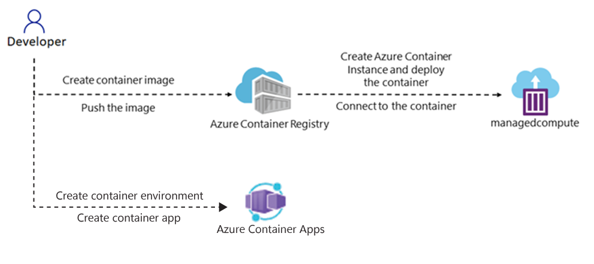

---
lab:
  az204Title: 'Lab 05: Deploy compute workloads by using images and containers'
  az204Module: 'Learning Path 05: Implement containerized solutions'
---

# Lab 05: Distribuire carichi di lavoro di calcolo usando immagini e contenitori

## Interfaccia utente di Microsoft Azure

Considerata la natura dinamica degli strumenti cloud di Microsoft, è possibile rilevare modifiche all'interfaccia utente di Azure apportate dopo lo sviluppo di questo contenuto per la formazione. È quindi possibile che le istruzioni e le procedure del lab non siano allineate correttamente.

Microsoft aggiorna questo corso di formazione quando la community segnala le modifiche necessarie. Poiché gli aggiornamenti cloud vengono apportati spesso, tuttavia, è possibile che si rilevino modifiche all'interfaccia utente prima degli aggiornamenti del contenuto per la formazione. **In questo caso, adattarsi alle modifiche e quindi eseguire le operazioni necessarie nei lab.**

## Istruzioni

### Prima di iniziare

#### Accedere all'ambiente lab

Accedere alla macchina virtuale Windows 10 usando le credenziali seguenti:

- Nome utente: `Admin`
- Password: `Pa55w.rd`

> **Nota**: il docente fornirà le istruzioni necessarie per la connessione all'ambiente lab virtuale.

#### Esaminare le applicazioni installate

Trovare la barra delle applicazioni nel desktop di Windows 10. La barra delle applicazioni include le icone per le applicazioni che verranno usate nel lab, tra cui:

-   Microsoft Edge
-   Esplora file

## Lab Scenario

In questo lab si esaminerà come creare e distribuire contenitori nella Registro Azure Container usando un'applicazione .NET e i file Docker. Distribuire anche una soluzione in contenitori in App Azure Container.

## Diagramma dell'architettura




### Esercizio 1: Creare un'immagine del contenitore Docker e distribuirla in Registro Azure Container

#### Attività 1: Aprire il portale di Azure

1. Sulla barra delle applicazioni selezionare l'icona di **Microsoft Edge**.

1. Nella finestra del browser aperto passare al portale di Azure in `https://portal.azure.com`e quindi accedere con l'account che verrà usato per questo lab.

   > **Nota**: se si sta eseguendo l'accesso al portale di Azure per la prima volta, verrà visualizzata una presentazione del portale. Selezionare **Attività iniziali** per ignorare la presentazione e iniziare a usare il portale.

#### Attività 2: Creare un gruppo di risorse

1. Nel riquadro di spostamento del portale di Azure usare la casella di testo **Cerca risorse, servizi e documentazione** per cercare **Gruppo di risorse** e quindi nell'elenco di risultati selezionare **Gruppi di risorse**.

1. Nel pannello **Gruppi di risorse** selezionare **Crea**.

1. Nella scheda **Dati principali** del pannello **Crea un gruppo di risorse** eseguire le azioni seguenti e selezionare **Rivedi e crea**:

    | Impostazione | Azione |
    | -- | -- |
    | Elenco a discesa **Sottoscrizione** | Mantenere il valore predefinito  |
    | Casella di testo **Gruppo di risorse** | Immettere **ContainerCompute** |
    | Elenco a discesa **Area** | Selezionare **(Stati Uniti) Stati Uniti orientali** |

    Lo screenshot seguente mostra le impostazioni configurate nel pannello **Crea un gruppo di risorse**.

    

1. Nella scheda **Rivedi e crea** esaminare le opzioni selezionate durante i passaggi precedenti.

1. Selezionare **Crea** per creare il gruppo di risorse usando la configurazione specificata.  

    > **Nota**: prima di procedere con il lab, attendere il completamento dell'attività di creazione.


#### Attività 3: Aprire Cloud Shell ed editor

1. Nel portale di Azure selezionare l'icona di **Cloud Shell**  per aprire una nuova sessione di PowerShell. Se in Cloud Shell viene aperta per impostazione predefinita una sessione di PowerShell, selezionare **PowerShell** e nel menu a discesa selezionare **Bash**.

    > **Nota**: l'icona **Cloud Shell** è rappresentata da un segno di maggiore (\>) e un carattere di sottolineatura (\_).

    > **Nota**: se è la prima volta che si avvia **Cloud Shell**, quando viene richiesto di selezionare **Bash** o **PowerShell** selezionare **Bash**. Quando viene visualizzato il messaggio **Non sono state montate risorse di archiviazione**, selezionare la sottoscrizione usata in questo lab e quindi selezionare **Crea risorsa di archiviazione**.  

1. Nel prompt dei comandi **Cloud Shell** nel portale eseguire questo comando per passare dalla directory radice alla directory **\~/clouddrive**:

    ```
    cd ~/clouddrive
    ```

1. Eseguire il comando seguente per creare una nuova directory denominata **ipcheck** nella directory **\~/clouddrive**:

    ```
    mkdir ipcheck
    ```

1. Eseguire il comando seguente per modificare la directory attiva da **\~/clouddrive** a **\~/clouddrive/ipcheck**:

    ```
    cd ~/clouddrive/ipcheck
    ```

1. Usare il comando seguente per creare una nuova applicazione console .NET nella directory corrente:

    ```
    dotnet new console --output . --name ipcheck --framework net7.0
    ```

1. Usare il comando seguente per creare un nuovo file nella directory **\~/clouddrive/ipcheck** denominata **Dockerfile**:

    ```
    touch Dockerfile
    ```

1. Eseguire il comando seguente per aprire l'editor grafico incorporato nel contesto della directory corrente:

    ```
    code .
    ```

#### Attività 4: Creare e testare un'applicazione .NET

1. Nel riquadro **FILES** dell'editor grafico selezionare il file **Program.cs** per aprirlo nell'editor.

1. Eliminare l'intero contenuto del file **Program.cs**.

1. Copiare il codice seguente e incollarlo nel file **Program.cs**:

    ```csharp
    public class Program
    {
        public static void Main(string[] args)
        {        
            // Check if network is available
            if (System.Net.NetworkInformation.NetworkInterface.GetIsNetworkAvailable())
            {
                System.Console.WriteLine("Current IP Addresses:");

                // Get host entry for current hostname
                string hostname = System.Net.Dns.GetHostName();
                System.Net.IPHostEntry host = System.Net.Dns.GetHostEntry(hostname);
                
                // Iterate over each IP address and render their values
                foreach(System.Net.IPAddress address in host.AddressList)
                {
                    System.Console.WriteLine($"\t{address}");
                }
            }
            else
            {
                System.Console.WriteLine("No Network Connection");
            }
        }
    }
    ```

1. Salvare il file **Program.cs** usando il menu nell'editor grafico o i tasti di scelta rapida CTRL+S.  Non chiudere l'editor grafico.

1. Di nuovo nel prompt dei comandi usare il comando seguente per eseguire l'applicazione:

    ```
    dotnet run
    ```

1. Esaminare i risultati dell'esecuzione. Per l'istanza di Cloud Shell deve essere elencato almeno un indirizzo IP.

1. Nel riquadro **FILES** dell'editor selezionare il file **Dockerfile** per aprirlo nell'editor.

1. Copiare e incollare il codice seguente nel file **Dockerfile**:

    ```
    # Start using the .NET 6 SDK container image
    FROM mcr.microsoft.com/dotnet/sdk:7.0 AS build

    # Change current working directory
    WORKDIR /app

    # Copy existing files from host machine
    COPY . ./

    # Publish application to the "out" folder
    RUN dotnet publish --configuration Release --output out

    # Start container by running application DLL
    ENTRYPOINT ["dotnet", "out/ipcheck.dll"]
    ```

1. Salvare il file **Dockerfile** usando il menu nell'editor grafico o i tasti di scelta rapida CTRL+S.

1. Lasciare aperto Cloud Shell per l'attività successiva.

#### Attività 5: Creare una risorsa del Registro Container

1. Al prompt dei comandi di **Cloud Shell** nel portale eseguire il comando seguente per creare una variabile con un valore univoco per la risorsa Registro contenitori: 

    ```bash
    registryName=conregistry$RANDOM
    ```

1. Al prompt dei comandi di **Cloud Shell** nel portale eseguire il comando seguente per verificare che il nome creato nel passaggio precedente sia disponibile: 

    ```bash
    az acr check-name --name $registryName
    ```

    Se il nome risulta disponibile, continuare con il passaggio successivo. Se il nome non è disponibile, eseguire nuovamente il comando nel passaggio precedente e verificare nuovamente la disponibilità.

1. Al prompt dei comandi di **Cloud Shell** nel portale eseguire il comando seguente per creare una risorsa Registro contenitori: 

    ```bash
    az acr create --resource-group ContainerCompute --name $registryName --sku Basic
    ```

    > **Nota**: prima di procedere con il lab, attendere il completamento dell'attività di creazione.

#### Attività 6: Archiviare i metadati del Registro Container

1. Al prompt dei comandi di **Cloud Shell** nel portale eseguire il comando seguente per ottenere un elenco di tutti i registri contenitori nella sottoscrizione:

    ```
    az acr list
    ```

1. Eseguire il comando seguente, assicurandosi di visualizzare il nome del registro come output. Se non viene visualizzato alcun output diverso da '[]', attendere un minuto e provare a eseguire di nuovo il comando.

    ```
    az acr list --query "max_by([], &creationDate).name" --output tsv
    ```

1. Esegui questo comando:

    ```
    acrName=$(az acr list --query "max_by([], &creationDate).name" --output tsv)
    ```

1. Esegui questo comando:

    ```
    echo $acrName
    ```

#### Attività 7: Distribuire un'immagine del contenitore Docker in Registro Contenitori

1. Eseguire il comando seguente per modificare la directory attiva da **\~/** a **\~/clouddrive/ipcheck**:

    ```
    cd ~/clouddrive/ipcheck
    ```

1. Eseguire il comando seguente per ottenere il contenuto della directory corrente:

    ```
    dir
    ```

1. Eseguire il comando seguente per caricare il codice sorgente nel registro contenitori e compilare l'immagine del contenitore come attività di Registro Container:

    ```
    az acr build --registry $acrName --image ipcheck:latest .
    ```

    > **Nota**: prima di procedere con il lab, attendere il completamento dell'attività di compilazione.

1. Chiudere il riquadro **Cloud Shell** nel portale.

#### Attività 8: Convalidare l'immagine del contenitore nel Registro Container

1. Nel riquadro di **spostamento** del portale di Azure selezionare il collegamento **Gruppi di risorse**.

1. Nel pannello **Gruppi di risorse** selezionare il gruppo di risorse **ContainerCompute** creato in precedenza in questo lab.

1. Nel pannello **ContainerCompute** selezionare il registro contenitori creato in precedenza in questo lab.

1. Nella sezione **Servizi** del pannello **Registro container** selezionare il collegamento **Repository**.

1. Nella sezione **Repository** selezionare il repository di immagini del contenitore **ipcheck** e quindi selezionare il tag **latest**.

1. Esaminare i metadati per la versione dell'immagine del contenitore con il tag **latest**.

    > **Nota**: è anche possibile selezionare il collegamento **ID esecuzione** per trovare i metadati relativi all'attività di compilazione.

#### Rivedi

In questo esercizio è stata creata un'applicazione console .NET per visualizzare l'indirizzo IP corrente di un computer. Il file **Dockerfile** è stato quindi aggiunto all'applicazione per essere convertito in un'immagine del contenitore Docker. Infine, l'immagine del contenitore è stata distribuita in Registro Container.

### Esercizio 2: Distribuire un'istanza del contenitore di Azure

#### Attività 1: Abilitare l'utente amministratore in Registro Container

1. **Nel gruppo di risorse ContainerCompute** selezionare il registro contenitori creato in precedenza in questo lab e quindi selezionare il **pannello Chiavi** di accesso.

1. Attivare o disattivare l'opzione nella sezione utente amministratore per abilitare l'utente amministratore per questo registro contenitori.

#### Attività 2: Distribuire automaticamente un'immagine del contenitore in un'istanza del contenitore di Azure

1. Nella sezione **Servizi** del pannello **Registro container** selezionare il collegamento **Repository**.

1. Nella sezione **Repository** selezionare il repository di immagini del contenitore **ipcheck**.

1. Nel pannello **Repository** selezionare il menu con i puntini di sospensione associato alla voce del tag **latest** e quindi selezionare **Esegui istanza**.

1. Nel pannello **Crea istanza di Container** eseguire le azioni seguenti e selezionare **Crea**:

    | Impostazione | Azione |
    | -- | -- |
    | Casella di testo **Nome contenitore** | Immettere **managedcompute** |
    | Casella di testo **Immagine contenitore** | Mantenere il valore predefinito |
    | Sezione **Tipo di sistema operativo** | Selezionare **Linux**. |
    | Casella di testo **Sottoscrizione** | Mantenere il valore predefinito |
    | Elenco a discesa **Gruppo di risorse** | Selezionare **ContainerCompute**. |
    | Elenco a discesa **Posizione** | Selezionare **Stati Uniti orientali**. |
    | Elenco a discesa **Numero di core** | Selezionare **2**. |
    | Casella di testo **Memoria (GB)** | Immettere **4**. |
    | Sezione **Indirizzo IP pubblico** | Selezionare **No** |

    Lo screenshot seguente mostra le impostazioni configurate nel pannello **Crea istanza di Container**.

    

    > **Nota**: attendere la creazione dell'istanza del contenitore prima di continuare con questo lab.

#### Attività 3: Distribuire manualmente un'immagine del contenitore in Istanze di Container

1. Nel riquadro di **spostamento** del portale di Azure selezionare il collegamento **Crea una risorsa**.

1. Nel pannello **Crea una risorsa**, nella casella di testo **Cerca servizi e marketplace**, immettere **istanze di Container** e quindi premere INVIO.

1. Nel pannello dei risultati della ricerca **Marketplace** selezionare il risultato **Istanze di Container**.

1. Nel pannello **Istanze di Container** selezionare **Crea**.

1. Nella scheda **Dati principali** del pannello **Crea istanza di Container** eseguire le azioni seguenti e selezionare **Rivedi e crea**:

    | Impostazione | Azione |
    | -- | -- |
    | Elenco a discesa **Sottoscrizione** | Mantenere il valore predefinito |
    | Elenco a discesa **Gruppo di risorse** | Selezionare **ContainerCompute**. |
    | Casella di testo **Nome contenitore**  | Immettere **manualcompute** |
    | Elenco a discesa **Area** | Selezionare **(Stati Uniti) Stati Uniti orientali** |
    | Sezione **Origine immagine** | Selezionare **Registro Azure Container** |
    | Elenco a discesa **Registro** | Selezionare la risorsa **Registro Azure Container** creata in precedenza in questo lab |
    | Elenco a discesa **Immagine** | Selezionare **ipcheck** |
    | Elenco a discesa **Tag immagine** | Selezionare **latest** |
    | **Dimensioni : core**  | Immettere **2** |
    | **Dimensioni: memoria (GiB)** | Immettere **4**. |

    Lo screenshot seguente mostra le impostazioni configurate nel pannello **Crea istanza di Container**.

    

1. Nella scheda **Rivedi e crea** esaminare le opzioni selezionate.

1. Selezionare **Crea** per creare l'istanza di contenitore usando la configurazione specificata.  

    > **Nota**: attendere la creazione dell'istanza del contenitore prima di continuare con questo lab.


#### Attività 4: Verificare che l'istanza di contenitore sia stata eseguita correttamente

1. Nel riquadro di spostamento del portale di Azure selezionare il collegamento **Gruppi di risorse**.

1. Nel pannello **Gruppi di risorse** selezionare il gruppo di risorse **ContainerCompute** creato in precedenza in questo lab.

1. Nel pannello **ContainerCompute** selezionare l'istanza di contenitore **manualcompute** creata in precedenza in questo lab.

1. Nella sezione **Impostazioni** del pannello **Istanze di Container** selezionare il collegamento **Contenitori**.

1. Nella sezione **Contenitori** esaminare l'elenco di **eventi**.

1. Selezionare la scheda **Log** e quindi esaminare i log di testo dall'istanza di contenitore.

> **Nota**: è anche possibile trovare gli **eventi** e i **log** dall'istanza di contenitore **managedcompute**.

> **Nota**: a questo punto è possibile che **manualcompute** e **managedcompute** non contengano eventi.

> **Nota**: al termine dell'esecuzione dell'applicazione, il contenitore termina perché ha completato il lavoro. Per l'istanza di contenitore creata manualmente, è stato indicato che un'uscita riuscita era accettabile, quindi il contenitore è stato eseguito una sola volta. L'istanza creata automaticamente non offriva questa opzione e presuppone che il contenitore sia sempre in esecuzione, quindi si noteranno ripetuti riavvii del contenitore.

#### Rivedi

In questo esercizio sono stati usati più metodi per distribuire un'immagine del contenitore in un'istanza di Azure Container. Usando il metodo manuale è stato possibile personalizzare ulteriormente la distribuzione ed eseguire applicazioni basate su attività come parte di un'esecuzione del contenitore.


### Esercizio 3: Creare un ambiente app contenitore sicuro e distribuire l'app contenitore.

#### Attività 1: Preparare l'ambiente

1. Accedi al portale di Azure.

1. Selezionare l'icona **cloud shell** , selezionare l'ambiente **Bash** .

1. **Nel prompt dei comandi di Cloud Shell** nel portale eseguire il comando seguente per installare l'estensione App Azure Container per l'interfaccia della riga di comando: 

    ```bash
    az extension add --name containerapp --upgrade
    ```

1. Eseguire il comando seguente per registrare lo spazio dei nomi Microsoft.App: 

    ```bash
    az provider register --namespace Microsoft.App
    ```
   
   > **Nota**: le risorse di App Azure Container sono state migrate dallo **spazio dei nomi Microsoft.Web** allo spazio dei **nomi Microsoft.App** .

1. Eseguire il comando seguente per registrare il **provider Microsoft.OperationalInsights** per l'area di lavoro Log Analytics di Monitoraggio di Azure, se non è stato usato in precedenza: 

    ```bash
    az provider register --namespace Microsoft.OperationalInsights
    ```

    > **Nota**: la registrazione dello spazio dei **nomi Microsoft.App** e **Microsoft.OperationalInsights** può richiedere alcuni minuti.

1. Impostare le variabili di ambiente usate più avanti in questo esercizio. 
   
   ```bash
     myRG=ContainerCompute
     myAppContEnv=az204-env-$RANDOM
    ```

Con l'interfaccia della riga di comando aggiornata e le variabili di ambiente create, è possibile creare un ambiente app contenitore e distribuire l'app contenitore.

#### Attività 2: Creare un ambiente

Un ambiente di App contenitore di Azure crea un limite sicuro intorno a un gruppo di app contenitore. Le app contenitore nello stesso ambiente vengono distribuite nella stessa rete virtuale e scrivono log nella stessa area di lavoro Log Analytics.

1. **Nel prompt dei comandi di Cloud Shell** nel portale eseguire il comando seguente per creare un ambiente usando il `az containerapp env` comando create: 

    ```bash
    az containerapp env create \
        --name $myAppContEnv \
        --resource-group $myRG \
        --location eastus
    ```

#### Attività 3: Creare un'app contenitore

Al termine della distribuzione dell'ambiente dell'app contenitore, distribuire un'immagine del contenitore in App Azure Container.

1. **Nel prompt dei comandi di Cloud Shell** nel portale eseguire il comando seguente per distribuire un'immagine del contenitore di app di esempio usando il `az containerapp create` comando : 

    ```bash
    az containerapp create \
        --name my-container-app \
        --resource-group $myRG \
        --environment $myAppContEnv \
        --image mcr.microsoft.com/azuredocs/containerapps-helloworld:latest \
        --target-port 80 \
        --ingress 'external' \
        --query properties.configuration.ingress.fqdn
    ```
Impostando `--ingress` su `external`, si rende disponibile l'app contenitore per le richieste pubbliche. Il comando restituisce un collegamento per accedere all'app.

1. Selezionare il collegamento restituito dal comando `az containerapp create` per verificare che l'app contenitore sia in esecuzione.

