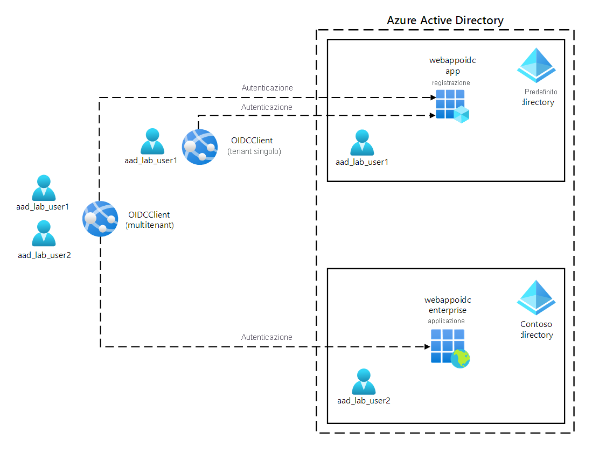
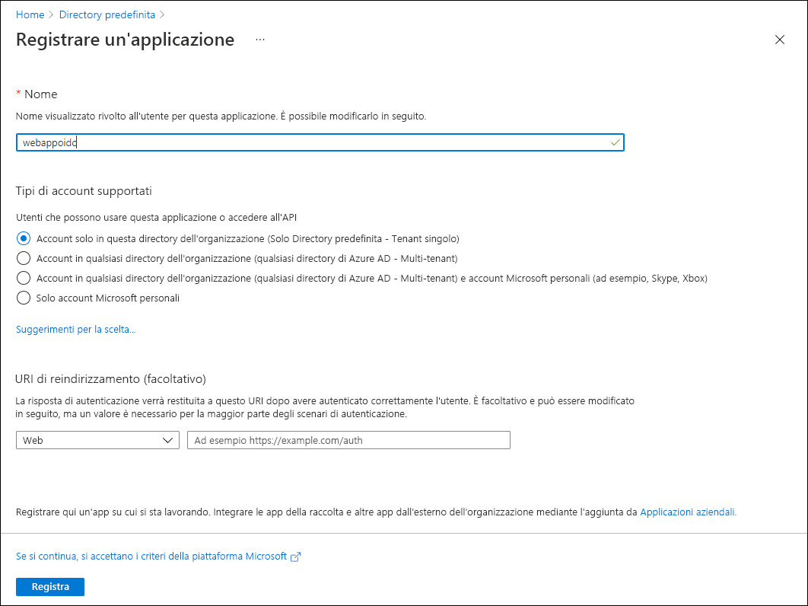
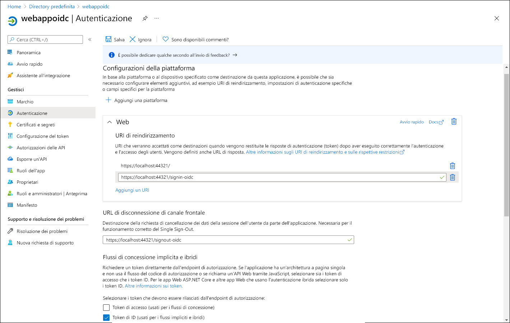
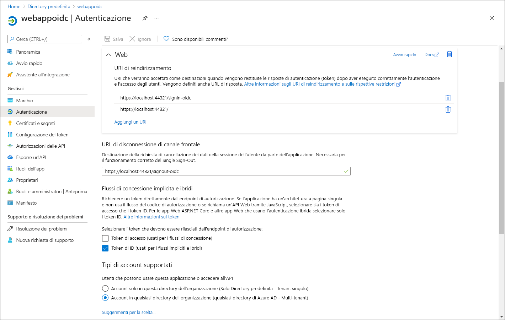

---
lab:
  az204Title: 'Lab 06: Authenticate by using OpenID Connect, MSAL, and .NET SDKs'
  az020Title: 'Lab 06: Authenticate by using OpenID Connect, MSAL, and .NET SDKs'
  az204Module: 'Module 06: Implement user authentication and authorization'
  az020Module: 'Module 06: Implement user authentication and authorization'
ms.openlocfilehash: 7b4ef25924a63d3bb28a8dd5632e9f35e5b4ba52
ms.sourcegitcommit: ddc44a8b5edc7ce2d93849bcab6c6a83dee1c99b
ms.translationtype: HT
ms.contentlocale: it-IT
ms.lasthandoff: 04/29/2022
ms.locfileid: "144404775"
---
# <a name="lab-06-authenticate-by-using-openid-connect-msal-and-net-sdks"></a>Lab 06: Eseguire l'autenticazione con OpenID Connect, MSAL e SDK .NET

## <a name="microsoft-azure-user-interface"></a>Interfaccia utente di Microsoft Azure

Considerata la natura dinamica degli strumenti cloud di Microsoft, è possibile rilevare modifiche all'interfaccia utente di Azure apportate dopo lo sviluppo di questo contenuto per la formazione. È quindi possibile che le istruzioni e le procedure del lab non siano allineate correttamente.

Microsoft aggiorna questo corso di formazione quando la community segnala le modifiche necessarie. Poiché gli aggiornamenti cloud vengono apportati spesso, tuttavia, è possibile che si rilevino modifiche all'interfaccia utente prima degli aggiornamenti del contenuto per la formazione. **In questo caso, adattarsi alle modifiche e quindi eseguire le operazioni necessarie nei lab.**

## <a name="instructions"></a>Istruzioni

### <a name="before-you-start"></a>Prima di iniziare

#### <a name="sign-in-to-the-lab-environment"></a>Accedere all'ambiente lab

Accedere alla macchina virtuale Windows 10 usando le credenziali seguenti:
    
-   Nome utente: **Admin**

-   Password: **Pa55w.rd**

> **Nota**: il docente fornirà le istruzioni necessarie per la connessione all'ambiente lab virtuale.

#### <a name="review-the-installed-applications"></a>Esaminare le applicazioni installate

Trovare la barra delle applicazioni nel desktop di Windows 10. La barra delle applicazioni include le icone per le applicazioni che verranno usate nel lab, tra cui:

-   Microsoft Edge

-   Visual Studio Code

## <a name="ensure-that-your-lab-environment-has-its-time-set-properly-no-delay-according-to-your-timezone"></a>Assicurarsi che l'orario dell'ambiente lab sia impostato correttamente (nessun ritardo in base al fuso orario)

>**Nota:** Se si nota che l'orario dell'ambiente lab è in ritardo, regolare l'ora locale usando il comando di PowerShell seguente per aumentare l'ora di 15 minuti

```powershell
  Set-Date -Adjust (New-TimeSpan -Minutes 15)
```

## <a name="architecture-diagram"></a>Diagramma dell'architettura



### <a name="exercise-1-configure-a-single-tenant-azure-ad-environment"></a>Esercizio 1: Configurare un ambiente di Azure AD a singolo tenant

#### <a name="task-1-open-the-azure-portal"></a>Attività 1: Aprire il portale di Azure

1. Sulla barra delle applicazioni selezionare l'icona di **Microsoft Edge**.

1. Nella finestra aperta del browser passare al portale di Azure ([portal.azure.com](https://portal.azure.com)) e quindi accedere con l'account che si userà per questo lab.

    > **Nota**: se si sta eseguendo l'accesso al portale di Azure per la prima volta, verrà visualizzata una presentazione del portale. Selezionare **Attività iniziali** per ignorare la presentazione e iniziare a usare il portale.

#### <a name="task-2-register-an-application-in-azure-ad"></a>Attività 2: Registrare un'applicazione in Azure AD

1.  Nel portale di Azure usare la casella di testo **Cerca risorse, servizi e documentazione** per cercare **Azure Active Directory** e nell'elenco di risultati selezionare **Azure Active Directory**.

    > **Nota**: la sessione del browser verrà reindirizzata al pannello del tenant di Azure Active Directory (Azure AD) associato alla sottoscrizione di Azure.

1.  Nel pannello **Azure Active Directory** selezionare **Registrazioni app** nella sezione **Gestisci**.

1.  Nella sezione **Registrazioni app** selezionare **+ Nuova registrazione**.

1.  Nella sezione **Registra un'applicazione** eseguire le azioni seguenti e quindi selezionare **Registra**:

    | Impostazione | Azione |
    | --- | --- |
    | Casella di testo **Nome** | Immettere **webappoidc** |
    | Elenco **Tipi di account supportati** | Selezionare **Account solo in questa directory dell'organizzazione (Solo Directory predefinita - Tenant singolo)** |

    Lo screenshot seguente mostra le impostazioni configurate nella sezione **Registra un'applicazione**.

     

#### <a name="task-3-record-unique-identifiers"></a>Attività 3: Registrare gli identificatori univoci

1.  Nel pannello di registrazione dell'applicazione **webappoidc** selezionare **Panoramica**.

1.  Nella sezione **Panoramica** trovare e registrare il valore della casella di testo **ID applicazione (client)** . Questo valore verrà utilizzato più avanti nel lab.

1.  Nella sezione **Panoramica** trovare e registrare il valore della casella di testo **ID della directory (tenant)** . Questo valore verrà utilizzato più avanti nel lab.

#### <a name="task-4-configure-the-application-authentication-settings"></a>Attività 4: Configurare le impostazioni di autenticazione dell'applicazione

1.  Nel pannello di registrazione dell'applicazione **webappoidc** selezionare **Autenticazione** nella sezione **Gestisci**.

1.  Nella sezione **Autenticazione** eseguire le azioni seguenti e selezionare **Configura**:

    | Impostazione | Azione |
    | --- | --- |
    | Sezione **Configurazioni della piattaforma** | Selezionare **+ Aggiungi una piattaforma** |
    | Pannello **Configura le piattaforme**  | Selezionare **Web** |
    | Casella di testo **URI di reindirizzamento** | Immettere `https://localhost:44321/` |
    | Casella di testo **Front-channel logout URL** (URL disconnessione frontchannel)   | Immettere `https://localhost:44321/signout-oidc` |
        
1. Nella sezione **Configurazioni della piattaforma** visualizzata di nuovo selezionare **Aggiungi un URI** e quindi immettere `https://localhost:44321/signin-oidc`.

1. Nella sezione **Implicit grant and hybrid flows** (Concessione implicita e flussi ibridi) selezionare **ID tokens (used for implicit and hybrid  flows)** (ID token - Usati per flussi impliciti e ibridi). 

1. Selezionare **Salva**.

    Lo screenshot seguente mostra le impostazioni configurate nel pannello **Autenticazione**.

     
       

#### <a name="task-5-create-an-azure-ad-user"></a>Attività 5: Creare un utente di Azure AD

1.  Nel portale di Azure selezionare l'icona di **Cloud Shell**  per aprire una nuova sessione di PowerShell. Se in Cloud Shell viene aperta per impostazione predefinita una sessione di Bash, selezionare **Bash** e nel menu a discesa selezionare **PowerShell**.

    > **Nota**: se è la prima volta che si avvia **Cloud Shell**, quando viene richiesto di selezionare **Bash** oppure **PowerShell** selezionare **PowerShell**. Quando viene visualizzato il messaggio **Non sono state montate risorse di archiviazione**, selezionare la sottoscrizione usata in questo lab e quindi selezionare **Crea risorsa di archiviazione**.

1.  Nel riquadro **Cloud Shell** eseguire il comando seguente per accedere al tenant di Azure AD associato alla sottoscrizione di Azure:

    ```powershell
    Connect-AzureAD
    ```

1.  Eseguire il comando seguente per recuperare e visualizzare il nome di dominio DNS (Domain Name System) del tenant di Azure AD:

    ```powershell
    $aadDomainName = ((Get-AzureAdTenantDetail).VerifiedDomains)[0].Name
    $aadDomainName
    ```

    > **Nota**: registrare il valore del nome di dominio DNS. Questo valore verrà utilizzato più avanti nel lab.

1.  Eseguire i comandi seguenti per creare utenti di Azure AD che verranno usati per testare l'autenticazione di Azure AD:

    ```powershell
    $passwordProfile = New-Object -TypeName Microsoft.Open.AzureAD.Model.PasswordProfile
    $passwordProfile.Password = 'Pa55w.rd1234'
    $passwordProfile.ForceChangePasswordNextLogin = $false
    New-AzureADUser -AccountEnabled $true -DisplayName 'aad_lab_user1' -PasswordProfile $passwordProfile -MailNickName 'aad_lab_user1' -UserPrincipalName "aad_lab_user1@$aadDomainName" 
    ```

1.  Eseguire il comando seguente per identificare il nome dell'entità utente (UPN; User Principal Name) dell'utente di Azure AD appena creato:

    ```powershell
    (Get-AzureADUser -Filter "MailNickName eq 'aad_lab_user1'").UserPrincipalName
    ```

    > **Nota**: registrare il nome dell'entità utente. Questo valore verrà utilizzato più avanti nel lab.

1.  Chiudere il riquadro Cloud Shell.

#### <a name="review"></a>Verifica

In questo esercizio è stata registrata un'applicazione di Azure AD a singolo tenant ed è stato creato un account utente di Azure AD.

### <a name="exercise-2-create-a-single-tenant-aspnet-core-web-app"></a>Esercizio 2: Creare un'app Web ASP.NET Core a singolo tenant

#### <a name="task-1-create-an-aspnet-core-web-app-project"></a>Attività 1: Creare un progetto di app Web ASP.NET Core

1.  Nel computer lab avviare **Terminale Windows**.

1.  Dal prompt dei comandi eseguire i comandi seguenti per creare e impostare la directory di lavoro su **Allfiles (F):\\Allfiles\\Labs\\06\\Starter\\OIDCClient**:

    ```powershell
    F:
    md "F:\Allfiles\Labs\06\Starter\OIDCClient"
    ```

1.  Eseguire i comandi seguenti per creare una nuova app Web .NET Core basata sul modello MVC (Model View Controller). Sostituire i segnaposto `<application_ID>`, `<tenant_ID>` e `<domain_Name>` con i valori corrispondenti registrati in precedenza in questo lab:

    ```powershell
    dotnet new mvc --auth SingleOrg --client-id <application_ID> --tenant-id <tenant_ID> --domain <domain_Name>
    ```

1.  Nel computer del lab avviare Visual Studio Code.

1.  Dal menu **File** selezionare **Apri cartella**.

1.  Nella finestra **Esplora file** passare ad **Allfiles (F):\\Allfiles\\Labs\\06\\Starter\\OIDCClient** e quindi selezionare **Seleziona cartella**.

1.  Nel riquadro **Esplora risorse** di Visual Studio Code esaminare la struttura di cartella generata automaticamente che rappresenta un'app Web MVC.

1.  Passare alla cartella **Proprietà**, aprire il file **launchSettings.json** e quindi applicare le modifiche seguenti:

    
    | Sezione | Proprietà  | Valore |
    | --- | --- | --- |
    | **iisSettings** | **sslPort** | **44321** |
    | **OIDCClient**  | **applicationUrl** | `https://localhost:44321` |

    > **Nota**: i numeri di porta devono corrispondere al valore specificato durante la creazione della registrazione dell'app di Azure AD.

1.  Salvare e chiudere il file.

1.  Nel riquadro **Esplora risorse** di Visual Studio Code selezionare **OIDCClient.csproj**.

1.  Assicurarsi che il valore dell'elemento `<TargetFramework>` sia impostato su **netcoreapp3.1**.

1.  Impostare la versione dei pacchetti NuGet `Microsoft.AspNetCore.Authentication.JwtBearer` e `Microsoft.AspNetCore.Authentication.OpenIdConnect` su **3.1.18**.

1.  Impostare la versione dei pacchetti NuGet `Microsoft.Identity.Web` e `Microsoft.Identity.Web.UI` su **0.3.1-preview**.

1.  Rimuovere a voce `<WebProject_DirectoryAccessLevelKey>0</WebProject_DirectoryAccessLevelKey>`.

1.  Rimuovere a voce `<PackageReference Include="Microsoft.AspNetCore.Authentication.AzureAD.UI" Version="3.1.7" />`.

1.  Verificare che il contenuto del file **OIDCClient.csproj** sia simile all'elenco seguente (il valore di `UserSecretsId` sarà diverso) e salvare le modifiche.

    ```csharp
    <Project Sdk="Microsoft.NET.Sdk.Web">
      <PropertyGroup>
        <TargetFramework>netcoreapp3.1</TargetFramework>
        <UserSecretsId>aspnet-OIDCClient-737DEB13-25D4-4C52-93C5-F485367E3C8C</UserSecretsId>
      </PropertyGroup>
      <ItemGroup>
        <PackageReference Include="Microsoft.AspNetCore.Authentication.JwtBearer" Version="3.1.18" NoWarn="NU1605" />
        <PackageReference Include="Microsoft.AspNetCore.Authentication.OpenIdConnect" Version="3.1.18" NoWarn="NU1605" />
        <PackageReference Include="Microsoft.Identity.Web" Version="0.3.1-preview" />
        <PackageReference Include="Microsoft.Identity.Web.UI" Version="0.3.1-preview" />
      </ItemGroup>
    </Project>
    ```

1.  Chiudere il file **OIDCClient.csproj**.

1.  Passare alla cartella **Views\Shared** e quindi aprire il file **_LoginPartial.cshtml**.

1.  Sostituire `AzureAD` con `MicrosoftIdentity` nella riga seguente:

    ```csharp
    <a class="nav-link text-dark" asp-area="AzureAD" asp-controller="Account" asp-action="SignOut">Sign out</a>`
    ```

1.  Sostituire `AzureAD` con `MicrosoftIdentity` nella riga seguente:

    ```csharp
    <a class="nav-link text-dark" asp-area="AzureAD" asp-controller="Account" asp-action="SignIn">Sign in</a>
    ```

1.  Salvare e chiudere il file.

1.  Aprire il file **appsettings.json** ed esaminare il contenuto dell'oggetto **AzureAd**, inclusi gli elementi seguenti:

    | Elemento | valore |
    | --- | --- |
    | `Instance` | `https://login.microsoftonline.com/` |
    | `Domain` | Dominio DNS principale del tenant di Azure AD associato alla sottoscrizione di Azure. |
    | `TenantId` | GUID del tenant di Azure AD. |
    | `ClientId` | ID applicazione (client) dell'applicazione registrata nel tenant di Azure AD. |
    | `CallbackPath` | `/signin-oidc` |

1.  Chiudere il file senza apportare modifiche.

1.  Nel riquadro **Esplora risorse** di Visual Studio Code selezionare **Startup.cs**.

1.  Rimuovere la direttiva `using Microsoft.AspNetCore.Authentication.AzureAD.UI;`.

1.  Aggiungere le direttive **using** seguenti direttamente dopo la voce rimossa nel passaggio precedente:

    ```csharp
    using Microsoft.AspNetCore.Authentication.OpenIdConnect;
    using Microsoft.Identity.Web;
    using Microsoft.Identity.Web.UI;
    ```

1.  Rimuovere le righe seguenti:

    ```csharp
    services.AddAuthentication(AzureADDefaults.AuthenticationScheme)
      .AddAzureAD(options => Configuration.Bind("AzureAd", options));
    ```

1.  Sostituire le righe rimosse nel passaggio precedente con le righe seguenti:

    ```csharp
    services.AddAuthentication(OpenIdConnectDefaults.AuthenticationScheme)
      .AddMicrosoftIdentityWebApp(Configuration.GetSection("AzureAd"));
    ```

1.  Rimuovere la riga seguente:

    ```csharp
    services.AddRazorPages();
    ```

1.  Sostituire la riga rimossa nel passaggio precedente con le righe seguenti:

    ```csharp
    services.AddRazorPages()
      .AddMicrosoftIdentityUI();
    ```

1.  Salvare e chiudere il file.

### <a name="task-2-test-the-single-tenant-web-app-in-a-single-tenant-scenario"></a>Attività 2: Testare l'app Web a singolo tenant in uno scenario a singolo tenant

1.  Nella finestra di **Visual Studio Code** attivare il menu di scelta rapida del riquadro **Esplora risorse** e quindi selezionare **Apri nel terminale integrato**.

1.  Eseguire il comando seguente per compilare l'app Web .NET:

    ```
    dotnet build
    ```

    > **Nota**: se si verificano errori di compilazione, esaminare i file nella cartella **Allfiles (F):\\Allfiles\\Labs\\06\\Solution\\OIDCClient**.

1.  Eseguire il comando seguente per generare un certificato autofirmato e configurare il computer locale in modo che lo ritenga attendibile:

    ```
    dotnet dev-certs https --trust
    ```

1.  Quando viene richiesto di installare il certificato generato automaticamente, selezionare **Sì**.

1.  Dal prompt del terminale eseguire il comando seguente per eseguire l'app Web .NET:

    ```
    dotnet run
    ```

1.  Avviare il browser Microsoft Edge in modalità **InPrivate** e quindi passare all'URL `https://localhost:44321`.

1.  Se viene visualizzato il messaggio **Your connection isn't private** (La connessione non è privata), selezionare **Avanzate** e quindi selezionare il collegamento **Continue to localhost (unsafe)** (Passa a localhost - Non sicuro).

1.  Nella finestra aperta del browser, quando richiesto, eseguire l'autenticazione usando il nome dell'entità utente dell'account **aad_lab_user1** di Azure AD creato in precedenza in questo lab con **Pa55w.rd1234** come password.

    > **Nota**: se viene visualizzata la finestra **Aiutaci a proteggere il tuo account**, selezionare **Ignora per adesso**.

1.  La finestra del browser aprirà automaticamente la pagina Web **Autorizzazioni richieste**.

1.  Esaminare le autorizzazioni richieste, che includono **Visualizza il profilo di base** e **Conservazione dell'accesso ai dati per cui è stato autorizzato l'accesso**.

1.  Selezionare **Accetto**.

1.  Esaminare la home page **Introduzione** del sito di destinazione visualizzato dal browser e verificare che il nome dell'entità utente dell'account **aad_user1** di Azure AD venga visualizzato nella finestra del browser.

1.  Nella pagina **Introduzione** selezionare **Disconnetti**.

1.  Quando viene richiesto di selezionare l'account da disconnettere, selezionare l'account **aad_lab_user1** di Azure AD. Si verrà reindirizzati automaticamente alla pagina **Disconnesso**.

1.  Lasciare aperta l'istanza del browser Microsoft Edge in cui è visualizzata la pagina **Disconnesso**.

#### <a name="review"></a>Verifica 

In questo esercizio è stata implementata un'app Web a singolo tenant in un ambiente di Azure a singolo tenant.

### <a name="exercise-3-configure-a-multitenant-azure-ad-environment"></a>Esercizio 3: Configurare un ambiente di Azure AD multi-tenant

#### <a name="task-1-create-an-azure-ad-tenant"></a>Attività 1: Creare un tenant di Azure AD

1.  Passare all'istanza del browser Microsoft Edge browser in cui è visualizzato il portale di Azure.

1.  Nel portale di Azure passare al pannello **Azure Active Directory**.

1.  Nel pannello **Azure Active Directory** selezionare **Gestisci i tenant** e quindi selezionare **+ Crea**.

1.  Nella scheda **Informazioni di base** del pannello **Crea un tenant** verificare che l'opzione **Azure Active Directory** sia selezionata e quindi selezionare **Avanti: Configurazione >** .

1.  Nella scheda **Configurazione** del pannello **Crea un tenant** specificare le impostazioni seguenti:

    | Impostazione | Valore |
    | --- | --- |
    | Nome organizzazione | **Contoso** |
    | Nome di dominio iniziale | Qualsiasi nome DNS valido costituito da lettere minuscole e cifre e che inizia con una lettera. |
    | Paese/Area geografica | Nome del paese o dell'area geografica. |

1.  Selezionare **Rivedi e crea** e quindi **Crea**.

1.  Se richiesto, nella pagina **Dimostra che non sei un robot** immettere il codice fornito e quindi selezionare **Invia**.

1.  Attendere il completamento del provisioning e quindi selezionare il collegamento **Contoso** per passare al pannello in cui sono visualizzate le proprietà del tenant di Azure AD Contoso.

1.  Nel pannello **Panoramica** del tenant di Azure AD identificare e registrare il valore della relativa proprietà **ID tenant**. Questo valore verrà utilizzato più avanti nel lab.

#### <a name="task-2-create-an-azure-ad-user"></a>Attività 2: Creare un utente di Azure AD

1.  Nella finestra del web browser in cui è visualizzato il portale di Azure selezionare l'icona **Directories + subscriptions** (Directory e sottoscrizioni) sulla barra degli strumenti.

1.  Nel pannello **Impostazioni del portale | Directories + subscriptions** (Directory e sottoscrizioni) selezionare **Cambia** accanto alla voce che rappresenta il tenant di Azure AD associato alla sottoscrizione.

1.  Nel portale di Azure selezionare l'icona di **Cloud Shell** per aprire una nuova sessione di PowerShell. 

1.  Nel riquadro **Cloud Shell** eseguire il comando seguente per accedere al tenant Contoso di Azure AD. Sostituire il segnaposto `<tenant_Id>` con il valore della proprietà ID tenant identificata nell'attività precedente:

    ```powershell
    Import-Module AzureAD.Standard.Preview
    AzureAD.Standard.Preview\Connect-AzureAD -TenantID '<tenant_ID>'
    ```

1.  Tenendo premuto CTRL fare clic sull'URL nell'avviso per aprire una finestra del browser e seguire la procedura per l'autenticazione.  

1.  Eseguire il comando seguente per recuperare il nome di dominio DNS del tenant di Azure AD:

    ```powershell
    $aadDomainName = ((Get-AzureAdTenantDetail).VerifiedDomains)[0].Name
    ```

1.  Eseguire i comandi seguenti per creare utenti di Azure AD che verranno usati per testare l'autenticazione di Azure AD:

    ```powershell
    $passwordProfile = New-Object -TypeName Microsoft.Open.AzureAD.Model.PasswordProfile
    $passwordProfile.Password = 'Pa55w.rd1234'
    $passwordProfile.ForceChangePasswordNextLogin = $false
    New-AzureADUser -AccountEnabled $true -DisplayName 'aad_lab_user2' -PasswordProfile $passwordProfile -MailNickName 'aad_lab_user2' -UserPrincipalName "aad_lab_user2@$aadDomainName"
    ```

1.  Eseguire il comando seguente per identificare il nome dell'entità utente dell'utente di Azure AD appena creato:

    ```powershell
    (Get-AzureADUser -Filter "MailNickName eq 'aad_lab_user2'").UserPrincipalName
    ```

    > **Nota**: registrare il nome dell'entità utente. Questo valore verrà utilizzato più avanti nel lab.

1.  Chiudere il riquadro **Cloud Shell**.

#### <a name="task-3-test-the-single-tenant-web-app-in-a-multitenant-scenario"></a>Attività 3: Testare l'app Web a singolo tenant in uno scenario multi-tenant

1.  Tornare al browser Microsoft Edge, in modalità **InPrivate**, in cui è visualizzata la pagina **Disconnesso** e quindi selezionare **Accedi**.

1.  Nella finestra aperta del browser, quando richiesto, eseguire l'autenticazione usando il nome dell'entità utente dell'account **aad_lab_user2** di Azure AD creato in precedenza in questo esercizio con **Pa55w.rd1234** come password.

1.  Si noti il messaggio di errore che indica che l'account utente usato non esiste nel tenant in cui è registrata l'app Web **webappoidc**.

    > **Nota**: per consentire un accesso riuscito in questo scenario, sarebbe necessario aggiungere prima di tutto questo account come utente esterno al tenant che ospita la registrazione dell'app Web webappoidc.

1.  Chiudere il browser Microsoft Edge in cui è visualizzato il messaggio di errore e quindi tornare alla finestra di **Visual Studio Code**.

1.  Nel riquadro del **terminale** selezionare **Termina il terminale** (icona del **Cestino**) per chiudere il terminare attualmente aperto ed eventuali processi associati.

#### <a name="review"></a>Verifica

In questo esercizio è stato configurato un ambiente multi-tenant di Azure e tale ambiente è stato testato con un'app Web a singolo tenant.

### <a name="exercise-4-configure-a-multitenant-aspnet-core-web-app"></a>Esercizio 4: Configurare un'app Web ASP.NET Core multi-tenant

#### <a name="task-1-configure-the-application-registration-in-azure-ad"></a>Attività 1: Configurare la registrazione dell'applicazione in Azure AD

1.  Passare al portale di Azure e quindi selezionare l'icona **Directories + subscriptions** (Directory e sottoscrizioni) sulla barra degli strumenti.

1.  Nel pannello **Impostazioni del portale | Directories + subscriptions** (Directory e sottoscrizioni) selezionare **Cambia** accanto alla voce che rappresenta il tenant di Azure AD associato alla sottoscrizione.

1.  Nel pannello **Azure Active Directory** selezionare **Registrazioni app** nella sezione **Gestisci**.

1.  Nell'elenco di registrazioni di app selezionare **webappoidc**.

1.  Nel pannello di registrazione dell'applicazione **webappoidc** selezionare **Autenticazione** nella sezione **Gestisci**.

1.  Nella sezione **Tipi di account supportati** selezionare **Account in qualsiasi directory dell'organizzazione (Qualsiasi directory di Azure AD - Multi-tenant)** .

1.  Selezionare **Salva**.

    Lo screenshot seguente mostra le impostazioni configurate nel pannello **Registrazione app**.
          
     

    
#### <a name="task-2-configure-multi-tenancy-support-of-the-aspnet-core-web-app"></a>Attività 2: Configurare il supporto per multi-tenant dell'app Web ASP.NET Core

1.  Nel computer del lab avviare Visual Studio Code.

1.  Aprire il file **appsettings.json**.

1.  Sostituire la riga contenente l'elemento `TenantId` con la riga seguente:

    ```
    "TenantId": "organizations", 
    ```

1.  Salvare e chiudere il file.

### <a name="task-3-test-the-multitenant-web-app-in-a-multitenant-scenario"></a>Attività 3: Testare l'app Web multi-tenant in uno scenario multi-tenant

1.  Nella finestra di **Visual Studio Code** attivare il menu di scelta rapida del riquadro **Esplora risorse** e quindi selezionare **Apri nel terminale integrato**.

1.  Dal prompt del terminale eseguire il comando seguente per eseguire l'app Web .NET:

    ```
    dotnet run
    ```

1.  Avviare il browser Microsoft Edge in modalità **InPrivate** e quindi passare all'URL `https://localhost:44321`.

1.  Se viene visualizzato il messaggio **Your connection isn't private** (La connessione non è privata), selezionare **Avanzate** e quindi selezionare il collegamento **Continue to localhost (unsafe)** (Passa a localhost - Non sicuro).

1.  Nella finestra aperta del browser, quando richiesto, eseguire l'autenticazione usando il nome dell'entità utente dell'account **aad_lab_user1** di Azure AD creato in precedenza in questo lab con **Pa55w.rd1234** come password.

1.  Esaminare la home page **Introduzione** del sito di destinazione visualizzato dal browser e quindi verificare che il nome dell'entità utente dell'account **aad_lab_user1** di Azure AD venga visualizzato nella finestra del browser.

1.  Nella pagina **Introduzione** selezionare **Disconnetti**.

1.  Quando viene richiesto di selezionare l'account da disconnettere, selezionare l'account **aad_lab_user1** di Azure AD. Si verrà reindirizzati automaticamente alla pagina **Disconnesso**.

1.  Nel browser Microsoft Edge in cui viene visualizzata la pagina **Disconnesso** selezionare **Accedi**.

1.  Nella finestra aperta del browser, quando richiesto, eseguire l'autenticazione usando il nome dell'entità utente dell'account **aad_lab_user2** di Azure AD creato in precedenza in questo esercizio con **Pa55w.rd1234** come password.

1.  La finestra del browser aprirà automaticamente la pagina Web **Autorizzazioni richieste**.

1.  Esaminare le autorizzazioni richieste, che includono **Visualizza il profilo di base** e **Conservazione dell'accesso ai dati per cui è stato autorizzato l'accesso**.

1.  Selezionare **Accetto**.

    > **Nota**: l'applicazione viene elencata come non verificata. Questo comportamento è previsto perché l'app di esempio usata in questo lab non è stata sottoposta alla verifica dell'autore. Per altre informazioni, vedere la documentazione Microsoft relativa alla [verifica dell'autore](https://docs.microsoft.com/en-us/azure/active-directory/develop/publisher-verification-overview).

1.  Esaminare la home page **Introduzione** del sito di destinazione visualizzato dal browser e quindi verificare che il nome dell'entità utente dell'account **aad_lab_user2** di Azure AD venga visualizzato nella finestra del browser.

1.  Nella pagina **Introduzione** selezionare **Disconnetti**.

1.  Chiudere il browser Microsoft Edge in modalità **InPrivate** e quindi tornare alla finestra di **Visual Studio Code**.

1.  Nel riquadro del **terminale** selezionare **Termina il terminale** (icona del **Cestino**) per chiudere il terminare attualmente aperto ed eventuali processi associati.

#### <a name="review"></a>Verifica

In questo esercizio è stata implementata un'app Web multi-tenant e tale app è stata testata in un ambiente multi-tenant di Azure.

### <a name="exercise-5-clean-up-your-subscription"></a>Esercizio 5: Pulire la sottoscrizione

#### <a name="task-1-delete-the-application-registration-in-azure-ad"></a>Attività 1: Eliminare la registrazione dell'applicazione in Azure AD

1.  Passare all'istanza del browser Microsoft Edge browser in cui è visualizzato il portale di Azure.

1.  Nel portale di Azure passare al pannello del tenant Contoso di Azure AD. Verrà visualizzato il pannello **Contoso \| Panoramica**.

1.  Nel pannello **Azure Active Directory** selezionare **Applicazioni aziendali** nella sezione **Gestisci**.

1.  Nel pannello **Applicazioni aziendali \| Tutte le applicazioni** selezionare **webappoidc**.

1.  Nel pannello **webappoidc \| Panoramica** selezionare **Proprietà**.

1.  Nel pannello **webappoidc \| Proprietà** selezionare **Elimina** e, quando viene richiesta la conferma, selezionare **Sì**.

1.  Passare al pannello **Utenti \| Tutti gli utenti (anteprima)** del tenant Contoso di Azure AD.

1.  Dall'elenco di utenti selezionare **aad_lab_user2**.

1.  Nel pannello **aad_lab_user2 \| Profilo** selezionare **Elimina** e quindi, quando viene richiesta la conferma, selezionare **Sì**.

1.  Tornare al pannello **Contoso \| Panoramica** e quindi selezionare **Gestisci i tenant**.

1.  Dall'elenco di tenant selezionare la casella di controllo accanto alla voce **Contoso (predefinito)** e quindi selezionare **Elimina**.

1.  Nel pannello **Eliminare il tenant 'Contoso'?** selezionare **Elimina**.

1.  Se necessario, selezionare **Get permission to delete Azure resource** (Ottieni autorizzazione per eliminare la risorsa di Azure) nel pannello **Proprietà** del tenant di Azure AD, in **Gestione degli accessi per le risorse di Azure** selezionare **Sì** e quindi selezionare **Salva**.

1.  Tornare al pannello **Eliminare il tenant 'Contoso'?** , aggiornare la pagina del browser, selezionare **Elimina** e quindi selezionare **Sì** per confermare.

1.  Nel portale di Azure tornare al pannello del tenant di Azure AD associato alla sottoscrizione di Azure.

1.  Nel pannello **Azure Active Directory** selezionare **Registrazioni app** nella sezione **Gestisci**.

1.  Nella sezione **Registrazioni app** selezionare la registrazione dell'applicazione **webappoidc** di Azure AD creata in precedenza in questo lab.

1.  Nella sezione **webappoidc** eseguire le azioni seguenti:

    a. Selezionare **Elimina**.

    b. Nel pannello **Delete app registration** (Elimina registrazione app) selezionare **I understand the implications of deleting this app registration** (Comprendo le implicazioni dell'eliminazione di questa registrazione app) e quindi selezionare **Elimina**.

1.  Passare al pannello **Utenti\| Tutti gli utenti (anteprima)** .

1.  Dall'elenco di utenti selezionare **aad_lab_user1**

1.  Nel pannello **aad_lab_user1 \| Profilo** selezionare **Elimina** e, quando viene richiesta la conferma, selezionare **Sì**.

#### <a name="task-2-close-the-active-applications"></a>Attività 2: Chiudere le applicazioni attive

1.  Chiudere eventuali finestre aperte di Microsoft Edge.

1.  Chiudere Visual Studio Code.

#### <a name="review"></a>Verifica

In questo esercizio è stata pulita la sottoscrizione mediante la rimozione della registrazione dell'applicazione usata nel lab.
