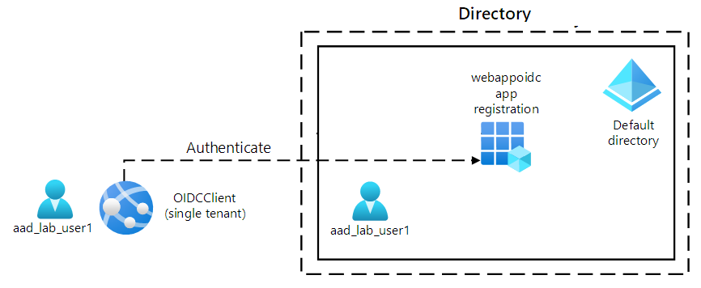

---
lab:
  az204Title: 'Lab 06: Authenticate by using OpenID Connect, MSAL, and .NET SDKs'
  az204Module: 'Learning Path 06: Implement user authentication and authorization'
---

# Lab 06: Eseguire l'autenticazione con OpenID Connect, MSAL e SDK .NET

## Interfaccia utente di Microsoft Azure

Considerata la natura dinamica degli strumenti cloud di Microsoft, è possibile rilevare modifiche all'interfaccia utente di Azure apportate dopo lo sviluppo di questo contenuto per la formazione. È quindi possibile che le istruzioni e le procedure del lab non siano allineate correttamente.

Microsoft aggiorna questo corso di formazione quando la community segnala le modifiche necessarie. Poiché gli aggiornamenti cloud vengono apportati spesso, tuttavia, è possibile che si rilevino modifiche all'interfaccia utente prima degli aggiornamenti del contenuto per la formazione. **In questo caso, adattarsi alle modifiche e quindi eseguire le operazioni necessarie nei lab.**

## Istruzioni

### Prima di iniziare

#### Accedere all'ambiente lab

Accedere alla macchina virtuale Windows 10 usando le credenziali seguenti:

- Nome utente: `Admin`
- Password: `Pa55w.rd`

> **Nota**: il docente fornirà le istruzioni necessarie per la connessione all'ambiente lab virtuale.

#### Esaminare le applicazioni installate

Trovare la barra delle applicazioni nel desktop di Windows 10. La barra delle applicazioni include le icone per le applicazioni che verranno usate nel lab, tra cui:
    
-   Microsoft Edge
-   Visual Studio Code

## Lab Scenario

In questo lab si registrerà un'applicazione in Microsoft Entra ID, si aggiungerà un utente e quindi si testerà l'accesso dell'utente all'applicazione per verificare che Entra ID possa proteggerlo. Si userà anche lo strumento Graph Explorer per compilare e testare le richieste nell'API Graph per un account utente Entra ID.

## Diagramma dell'architettura



### Esercizio 1: Configurare un ambiente Entra ID a tenant singolo

#### Attività 1: Aprire il portale di Azure

1. Sulla barra delle applicazioni selezionare l'icona di **Microsoft Edge**.

1. Nella finestra del browser aperta passare al portale di Azure in `https://portal.azure.com`e quindi accedere con l'account che verrà usato per questo lab.

    > **Nota**: se si sta eseguendo l'accesso al portale di Azure per la prima volta, verrà visualizzata una presentazione del portale. Selezionare **Attività iniziali** per ignorare la presentazione e iniziare a usare il portale.

#### Attività 2: Registrare un'applicazione nella directory Entra ID

1. Nella portale di Azure usare la **casella di testo Cerca risorse, servizi e documenti** per cercare **Entra ID** e, nell'elenco dei risultati, selezionare **Microsoft Entra ID**.

    > **Nota**: reindirizza la sessione del browser al pannello del tenant di Microsoft Entra ID associato alla sottoscrizione di Azure.

1. Nel pannello **Microsoft Entra ID** selezionare **Registrazioni app** nella **sezione Gestisci**.

1. Nella sezione **Registrazioni app** selezionare **+ Nuova registrazione**.

1. Nella sezione **Registra un'applicazione** eseguire le azioni seguenti e quindi selezionare **Registra**:
    
    | Impostazione | Azione |
    | -- | -- |
    | Casella di testo **Nome** | Immettere **webappoidc** |
    | Elenco **Tipi di account supportati** | Selezionare **Account solo in questa directory dell'organizzazione (Solo Directory predefinita - Tenant singolo)** |

    > **Nota**: il nome del tenant potrebbe variare a seconda della sottoscrizione di Azure.
   
    Lo screenshot seguente mostra le impostazioni configurate nella sezione **Registra un'applicazione**.
          
     
      
    
#### Attività 3: Registrare gli identificatori univoci

1. Nel pannello di registrazione dell'applicazione **webappoidc** selezionare **Panoramica**.

1. Nella sezione **Panoramica** trovare e registrare il valore della casella di testo **ID applicazione (client)**. Questo valore verrà utilizzato più avanti nel lab.

1. Nella sezione **Panoramica** trovare e registrare il valore della casella di testo **ID della directory (tenant)**. Questo valore verrà utilizzato più avanti nel lab.

#### Attività 4: Configurare le impostazioni di autenticazione dell'applicazione

1. Nel pannello di registrazione dell'applicazione **webappoidc** selezionare **Autenticazione** nella sezione **Gestisci**.

1. Nella sezione **Autenticazione** eseguire le azioni seguenti e selezionare **Configura**:

    | Impostazione | Azione |
    | -- | -- |
    | Sezione **Configurazioni della piattaforma** | Selezionare **+ Aggiungi una piattaforma** |
    | Pannello **Configura le piattaforme** | Selezionare **Web** |
    | Casella di testo **URI di reindirizzamento** | Immetti `https://localhost:5001/` |
    | Casella di testo **Front-channel logout URL** (URL disconnessione frontchannel) | Immetti `https://localhost:5001/signout-oidc` |
        
1. Nella sezione **Configurazioni della piattaforma** visualizzata di nuovo selezionare **Aggiungi un URI** e quindi immettere `https://localhost:5001/signin-oidc`.

1. Nella sezione **Implicit grant and hybrid flows** (Concessione implicita e flussi ibridi) selezionare **ID tokens (used for implicit and hybrid  flows)** (ID token - Usati per flussi impliciti e ibridi). 

1. Seleziona **Salva**.

    Lo screenshot seguente mostra le impostazioni configurate nel pannello **Autenticazione**.
          
     
       

#### Attività 5: Creare un utente di Azure AD

1. Nel portale di Azure selezionare l'icona di **Cloud Shell**  per aprire una nuova sessione di PowerShell. Se in Cloud Shell viene aperta per impostazione predefinita una sessione di Bash, selezionare **Bash** e nel menu a discesa selezionare **PowerShell**.

     > **Nota**: se è la prima volta che si avvia **Cloud Shell**, quando viene richiesto di selezionare **Bash** oppure **PowerShell** selezionare **PowerShell**. Quando viene visualizzato il messaggio **Non sono state montate risorse di archiviazione**, selezionare la sottoscrizione usata in questo lab e quindi selezionare **Crea risorsa di archiviazione**.

1. Nel riquadro **Cloud Shell** eseguire il comando seguente per accedere al tenant di Azure AD associato alla sottoscrizione di Azure:

    ```powershell
    Connect-AzureAD
    ```

1. Eseguire il comando seguente per recuperare e visualizzare il nome di dominio DNS (Domain Name System) del tenant di Azure AD:

    ```powershell
    $aadDomainName = ((Get-AzureAdTenantDetail).VerifiedDomains)[0].Name
    $aadDomainName
    ```

    > **Nota**: registrare il valore del nome di dominio DNS. Questo valore verrà utilizzato più avanti nel lab.

1. Eseguire i comandi seguenti per creare utenti di Azure AD che verranno usati per testare l'autenticazione di Azure AD:

    ```powershell
    $passwordProfile = New-Object -TypeName Microsoft.Open.AzureAD.Model.PasswordProfile
    $passwordProfile.Password = 'Pa55w.rd1234'
    $passwordProfile.ForceChangePasswordNextLogin = $false
    New-AzureADUser -AccountEnabled $true -DisplayName 'aad_lab_user1' -PasswordProfile $passwordProfile -MailNickName 'aad_lab_user1' -UserPrincipalName "aad_lab_user1@$aadDomainName" 
    ```

1. Eseguire il comando seguente per identificare il nome dell'entità utente (UPN; User Principal Name) dell'utente di Azure AD appena creato:

    ```powershell
    (Get-AzureADUser -Filter "MailNickName eq 'aad_lab_user1'").UserPrincipalName
    ```

    > **Nota**: registrare il nome dell'entità utente. Questo valore verrà utilizzato più avanti nel lab.

1. Chiudere il riquadro Cloud Shell.

#### Rivedi

In questo esercizio è stata registrata un'applicazione di Azure AD a singolo tenant ed è stato creato un account utente di Azure AD.

### Esercizio 2: Creare un'app Web ASP.NET a singolo tenant

#### Attività 1: Creare un progetto di app Web ASP.NET

1. Nel computer del lab avviare il **Prompt dei comandi**.

1. Dal prompt dei comandi eseguire i comandi seguenti per creare e impostare la directory corrente su **Allfiles (F):\\Allfiles\\Labs\\06\\Starter\\OIDCClient**:

    ```cmd
    F:
    cd F:\Allfiles\Labs\06\Starter\OIDCClient
    ```

1. Eseguire i comandi seguenti per creare una nuova app Web .NET Core basata sul modello MVC (Model View Controller). Sostituire i segnaposto `<application_ID>`, `<tenant_ID>` e `<domain_Name>` con i valori corrispondenti registrati in precedenza in questo lab:

    ```cmd
    dotnet new mvc --auth SingleOrg --client-id <application_ID> --tenant-id <tenant_ID> --domain <domain_Name>
    rmdir .\obj /S /Q
    ```
    
    > **Nota**: se si riceve un errore nel terminale, è possibile usare PowerShell. In questo caso rimuovere i `/S /Q` flag ed eseguire di nuovo il comando.

1. Eseguire il comando seguente per avviare Visual Studio Code. 

    ```cmd
    code .
    ```
    > Se viene visualizzata la richiesta **Si considerano attendibili gli autori dei file in questa cartella?** selezionare **Sì, mi fido degli autori**.


1. Nel riquadro **Esplora risorse** di Visual Studio Code esaminare la struttura di cartella generata automaticamente che rappresenta un'app Web MVC.

1. Passare alla cartella **Proprietà**, aprire il file **launchSettings.json** e quindi applicare le modifiche seguenti:

    
    | Sezione | Proprietà | valore |
    | -- | -- | -- |
    | **iisSettings** | **sslPort** | **44321** |
    | **OIDCClient**  | **applicationUrl** | `https://localhost:5001` |
    

    > **Nota**: i numeri di porta devono corrispondere al valore specificato durante la creazione della registrazione dell'app di Azure AD.

1. Salva e chiude il file.

1. Nel riquadro **Esplora risorse** di Visual Studio Code selezionare **OIDCClient.csproj**.

1. Assicurarsi che il valore dell'elemento `<TargetFramework>` sia impostato su **net6.0**.

1. Assicurarsi che la versione dei pacchetti NuGet `Microsoft.AspNetCore.Authentication.JwtBearer` e `Microsoft.AspNetCore.Authentication.OpenIdConnect` sia impostata su **6.0.9**.

1. Impostare la versione dei pacchetti NuGet `Microsoft.Identity.Web` e `Microsoft.Identity.Web.UI` su **1.25.3**.

1. Verificare che il contenuto del file **OIDCClient.csproj** sia simile all'elenco seguente (il valore di `UserSecretsId` sarà diverso) e salvare le modifiche.

    ```csharp
    <Project Sdk="Microsoft.NET.Sdk.Web">
      <PropertyGroup>
        <TargetFramework>net6.0</TargetFramework>
        <UserSecretsId>aspnet-OIDCClient-737DEB13-25D4-4C52-93C5-F485367E3C8C</UserSecretsId>
        <ImplicitUsings>enable</ImplicitUsings>
      </PropertyGroup>

      <ItemGroup>
        <PackageReference Include="Microsoft.AspNetCore.Authentication.JwtBearer" Version="6.0.9" NoWarn="NU1605" />
        <PackageReference Include="Microsoft.AspNetCore.Authentication.OpenIdConnect" Version="6.0.9" NoWarn="NU1605" />
        <PackageReference Include="Microsoft.Identity.Web" Version="1.25.3" />
        <PackageReference Include="Microsoft.Identity.Web.UI" Version="1.25.3" />
      </ItemGroup>
    </Project>
    ```

1. Chiudere il file **OIDCClient.csproj**.

1. Passare alla cartella **Views\Shared** e quindi aprire il file **_LoginPartial.cshtml**.

1. Verificare che l'attributo `asp-area` in ogni elemento span faccia riferimento a `MicrosoftIdentity`, come nella riga seguente:

    ```csharp
    <a class="nav-link text-dark" asp-area="MicrosoftIdentity" asp-controller="Account" asp-action="SignOut">Sign out</a>
    ```

1. Chiudere il file senza apportare modifiche.

1. Aprire il file **appsettings.json** ed esaminare il contenuto dell'oggetto **AzureAd**, inclusi gli elementi seguenti:

    | Elemento | Valore |
    | -- | -- |
    | `Instance` | `https://login.microsoftonline.com/`|
    | `Domain` | Dominio DNS primario del tenant di Azure AD associato alla sottoscrizione di Azure |
    | `TenantId` | GUID del tenant di Azure AD |
    | `ClientId` | ID applicazione (client) dell'applicazione registrata nel tenant di Azure AD |
    | `CallbackPath` | `/signin-oidc` |

1. Chiudere il file senza apportare modifiche.

1. Nel riquadro **Esplora risorse** di Visual Studio Code selezionare **Program.cs**.

1. Verificare che il file contenga le direttive **using** seguenti:

    ```csharp
    using Microsoft.AspNetCore.Authentication.OpenIdConnect;
    using Microsoft.Identity.Web;
    using Microsoft.Identity.Web.UI;
    ```

1. Verificare che il file contenga le righe seguenti che aggiungono i servizi di autenticazione pertinenti al contenitore:

    ```csharp
    // Add services to the container.
    builder.Services.AddAuthentication(OpenIdConnectDefaults.AuthenticationScheme)
      .AddMicrosoftIdentityWebApp(builder.Configuration.GetSection("AzureAd"));
    ```

1. Verificare che il file contenga le righe seguenti che aggiungono un controller e pagine Razor per la gestione degli account:

    ```csharp
    builder.Services.AddRazorPages()
      .AddMicrosoftIdentityUI();
    ```

1. Salva e chiude il file.

### Attività 2: Testare l'app Web a singolo tenant in uno scenario a singolo tenant

1. Nella barra dei menu superiore nella finestra di **Visual Studio Code** passare al menu **Terminale** e selezionare **Nuovo terminale**.

1. Nel pannello **Terminale** il percorso corrente della directory di lavoro corrente deve essere **F:\Allfiles\Labs\06\Starter\OIDCClient**. Eseguire i comandi seguenti per compilare l'app Web .NET:

    ```
    dotnet build
    ```

    > **Nota**: se si verificano errori di compilazione, esaminare i file nella cartella **Allfiles (F):\\Allfiles\\Labs\\06\\Solution\\OIDCClient**. Ignorare eventuali messaggi di avviso.

1. Eseguire il comando seguente per generare un certificato autofirmato e configurare il computer locale in modo che lo ritenga attendibile:

    ```
    dotnet dev-certs https --trust
    ```

1. Quando viene richiesto di installare il certificato generato automaticamente, selezionare **Sì**.

1. Dal prompt del terminale eseguire il comando seguente per eseguire l'app Web .NET:

    ```
    dotnet run
    ```

1. Avviare il browser Microsoft Edge in modalità **InPrivate** e quindi passare all'URL `https://localhost:5001`.

1. Se viene visualizzato il messaggio **Your connection isn't private** (La connessione non è privata), selezionare **Avanzate** e quindi selezionare il collegamento **Continue to localhost (unsafe)** (Passa a localhost - Non sicuro).

1. Nella finestra aperta del browser, quando richiesto, eseguire l'autenticazione usando il nome dell'entità utente dell'account **aad_lab_user1** di Azure AD creato in precedenza in questo lab con **Pa55w.rd1234** come password.

    > **Nota**: se viene visualizzata la finestra **Aiutaci a proteggere il tuo account**, selezionare **Ignora per adesso**.

1. La finestra del browser aprirà automaticamente la pagina Web **Autorizzazioni richieste**.

1. Esaminare le autorizzazioni richieste, che includono **Visualizza il profilo di base** e **Conservazione dell'accesso ai dati per cui è stato autorizzato l'accesso**.

1. Selezionare **Accetta**.

1. Esaminare la home page **Introduzione** del sito di destinazione visualizzato dal browser e verificare che il nome dell'entità utente dell'account **aad_user1** di Azure AD venga visualizzato nella finestra del browser.

1. Nella pagina **Introduzione** selezionare **Disconnetti**.

1. Quando viene richiesto di selezionare l'account da disconnettere, selezionare l'account **aad_lab_user1** di Azure AD. Si verrà reindirizzati automaticamente alla pagina **Disconnesso**.

1. Chiudere il browser Microsoft Edge.

#### Rivedi 

In questo esercizio è stata implementata un'app Web a singolo tenant in un ambiente di Azure a singolo tenant.
