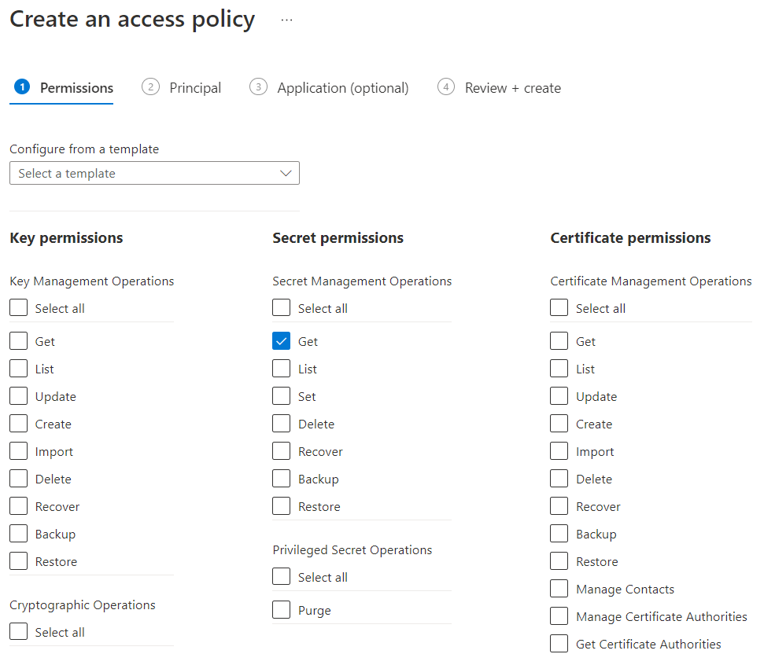

---
lab:
  az204Title: 'Lab 07: Access resource secrets more securely across services'
  az020Title: 'Lab 07: Access resource secrets more securely across services'
  az204Module: 'Module 07: Implement secure cloud solutions'
  az020Module: 'Module 07: Implement secure cloud solutions'
---

# <a name="lab-07-access-resource-secrets-more-securely-across-services"></a>Lab 07: Accedere ai segreti delle risorse in modo più sicuro tra i servizi

## <a name="microsoft-azure-user-interface"></a>Interfaccia utente di Microsoft Azure

Considerata la natura dinamica degli strumenti cloud di Microsoft, è possibile rilevare modifiche all'interfaccia utente di Azure apportate dopo lo sviluppo di questo contenuto per la formazione. È quindi possibile che le istruzioni e le procedure del lab non siano allineate correttamente.

Microsoft aggiorna questo corso di formazione quando la community segnala le modifiche necessarie. Poiché gli aggiornamenti cloud vengono apportati spesso, tuttavia, è possibile che si rilevino modifiche all'interfaccia utente prima degli aggiornamenti del contenuto per la formazione. **In questo caso, adattarsi alle modifiche e quindi eseguire le operazioni necessarie nei lab.**

## <a name="instructions"></a>Istruzioni

### <a name="before-you-start"></a>Prima di iniziare

#### <a name="sign-in-to-the-lab-environment"></a>Accedere all'ambiente lab

Accedere alla macchina virtuale Windows 10 usando le credenziali seguenti:

- Nome utente: **Admin**
- Password: **Pa55w.rd**

> **Nota**: il docente fornirà le istruzioni necessarie per la connessione all'ambiente lab virtuale.

#### <a name="review-the-installed-applications"></a>Esaminare le applicazioni installate

Trovare la barra delle applicazioni nel desktop di Windows 10. La barra delle applicazioni include le icone per le applicazioni che verranno usate nel lab, tra cui:

- Microsoft Edge
- Esplora file
- Terminale Windows
- Visual Studio Code

## <a name="architecture-diagram"></a>Diagramma dell'architettura


### <a name="exercise-1-create-azure-resources"></a>Esercizio 1: Creare risorse di Azure

#### <a name="task-1-open-the-azure-portal"></a>Attività 1: Aprire il portale di Azure

1. Sulla barra delle applicazioni selezionare l'icona di **Microsoft Edge**.

1. Nella finestra aperta del browser passare al portale di Azure (<https://portal.azure.com>) e quindi accedere con l'account che verrà usato per questo lab.

    > **Nota**: se si sta eseguendo l'accesso al portale di Azure per la prima volta, verrà visualizzata una presentazione del portale. Selezionare **Attività iniziali** per ignorare la presentazione e iniziare a usare il portale.

#### <a name="task-2-create-a-storage-account"></a>Attività 2: Creare un account di archiviazione

1. Nel portale di Azure usare la casella di testo **Cerca risorse, servizi e documentazione** per cercare **Account di archiviazione** e quindi nell'elenco di risultati selezionare **Account di archiviazione**.

1. Nel riquadro **Account di archiviazione** selezionare **+ Crea**.

1. Nella scheda **Informazioni di base** del pannello **Crea un account di archiviazione** eseguire le azioni seguenti e selezionare **Rivedi e crea**:

   | Impostazione | Azione |
   | -- | -- |
   | Elenco a discesa **Sottoscrizione** | Mantenere il valore predefinito |
   | Sezione **Gruppo di risorse** | Selezionare **Crea nuovo**, immettere **ConfidentialStack** e quindi selezionare **OK** |
   | Casella di testo **Nome account di archiviazione**  | Immettere **securestor** _[nomeutente]_ |
   | Elenco a discesa **Area** | Selezionare **(Stati Uniti) Stati Uniti orientali** |
   | Sezione **Prestazioni** | Selezionare l'opzione **Standard** |
   | Elenco a discesa **Ridondanza** | Selezionare **Archiviazione con ridondanza locale**. |

   Lo screenshot seguente mostra le impostazioni configurate nel pannello **Crea un account di archiviazione**.

   

1. Nella scheda **Rivedi e crea** esaminare le opzioni selezionate durante i passaggi precedenti.

1. Selezionare **Crea** per creare l'account di archiviazione usando la configurazione specificata.

    > **Nota**: prima di procedere con il lab, attendere il completamento dell'attività di creazione.

1. Nel pannello **Panoramica sulla distribuzione** selezionare **Vai alla risorsa**.

1. Nella sezione **Sicurezza e rete** del riquadro **Account di archiviazione** selezionare il collegamento **Chiavi di accesso** .

1. Nella sezione **Chiavi di accesso** selezionare **Mostra chiavi**.

1. Selezionare una delle chiavi e registrare il valore in una delle caselle **Stringa di connessione** . Questo valore verrà usato più avanti nel lab.

    > **Nota**: la stringa di connessione scelta è irrilevante. Sono intercambiabili.

#### <a name="task-3-create-an-azure-key-vault"></a>Attività 3: Creare un insieme di credenziali delle chiavi di Azure

1. Nel portale di Azure usare la casella di testo **Cerca risorse, servizi e documentazione** per cercare **Insiemi di credenziali delle chiavi** e quindi nell'elenco di risultati selezionare **Insiemi di credenziali delle chiavi**.

1. Nel pannello **Insiemi di credenziali delle chiavi** selezionare **Crea**.

1.  Nella scheda **Informazioni di base** del pannello **Crea insieme di credenziali delle chiavi** eseguire le azioni seguenti e selezionare **Rivedi e crea**:

   | Impostazione | Azione |
   | -- | -- |
   | Elenco a discesa **Sottoscrizione** | Mantenere il valore predefinito |
   | Elenco a discesa **Gruppo di risorse** | Selezionare **ConfidentialStack** nell'elenco |
   | Casella di testo **Nome insieme di credenziali delle chiavi**  | Immettere **securevault** _[nomeutente]_ |
   | Elenco a discesa **Area** | Selezionare **Stati Uniti orientali**. |
   | Elenco a discesa **Piano tariffario** | selezionare **Standard** |

   Lo screenshot seguente mostra le impostazioni configurate nel pannello **Crea insieme di credenziali delle chiavi**.

   

1. Nella scheda **Rivedi e crea** esaminare le opzioni selezionate durante i passaggi precedenti.

1. Selezionare **Crea** per creare l'insieme di credenziali delle chiavi usando la configurazione specificata.

    > **Nota**: prima di procedere con il lab, attendere il completamento dell'attività di creazione.

#### <a name="task-4-create-a-function-app"></a>Attività 4: Creare un'app per le funzioni

1. Nel portale di Azure usare la casella di testo **Cerca risorse, servizi e documentazione** per cercare **App per le funzioni** e quindi nell'elenco di risultati selezionare **App per le funzioni**.

1. Nel pannello **App per le funzioni** selezionare **Crea**.

1. Nella scheda **Informazioni di base** del pannello **Crea app per le funzioni** eseguire le azioni seguenti e selezionare **Avanti: Hosting**:

    | Impostazione | Azione |
    | -- | -- |
    | Elenco a discesa **Sottoscrizione** | Mantenere il valore predefinito |
    | Elenco a discesa **Gruppo di risorse** | Selezionare **ConfidentialStack** |
    | Casella di testo **Nome dell'app per le funzioni**  | Immettere **securefunc** _[nomeutente]_ |
    | Sezione **Pubblica** | Selezionare **Codice** |
    | Elenco a discesa **Stack di runtime** | Selezionare **.NET** |
    | Elenco a discesa **Versione** | Selezionare **6** |
    | Elenco a discesa **Area** | Selezionare l'area **Stati Uniti orientali** |
    | Sezione **Sistema operativo** | Selezionare **Linux**. |
    | Elenco a discesa **Tipo di piano** | Selezionare **Consumo (serverless)** |

    Lo screenshot seguente mostra le impostazioni configurate nel pannello **Crea app per le funzioni**.

    

1. Nella scheda **Hosting** eseguire le azioni seguenti e quindi selezionare **Rivedi e crea**:

    | Impostazione | Azione |
    | -- | -- |
    | Elenco a discesa **Account di archiviazione** | Selezionare l'account di archiviazione **securestor** _[nomeutente]_ |

1. Nella scheda **Rivedi e crea** esaminare le opzioni selezionate durante i passaggi precedenti.

1. Selezionare **Crea** per creare l'app per le funzioni usando la configurazione specificata.

    > **Nota**: prima di procedere con il lab, attendere il completamento dell'attività di creazione.

#### <a name="review"></a>Verifica

In questo esercizio sono state create tutte le risorse che verranno usate nel lab.

### <a name="exercise-2-configure-secrets-and-identities"></a>Esercizio 2: Configurare segreti e identità

#### <a name="task-1-configure-a-system-assigned-managed-service-identity"></a>Attività 1: Configurare un'identità del servizio gestito assegnata dal sistema

1. Nel riquadro di spostamento del portale di Azure selezionare il collegamento **Gruppi di risorse**.

1. Nel pannello **Gruppi di risorse** selezionare il gruppo di risorse **ConfidentialStack**.

1. Nel pannello **ConfidentialStack** selezionare l'app per le funzioni **securefunc** _[nomeutente]_ .

    > **Nota**: saranno presenti due risorse, un'app per le funzioni e una risorsa di Application Insights, con lo stesso nome. Assicurarsi di selezionare la risorsa di tipo app per le funzioni.

1. Nel pannello **App per le funzioni** selezionare l'opzione **Identità** dalla sezione **Impostazioni**.

1. Nella scheda **Assegnata dal sistema** del riquadro **Identità** impostare lo **Stato** su **On** e quindi selezionare **Salva**.

1. Selezionare **Sì** per confermare l'impostazione.

    > **Nota**: prima di procedere con questo lab, attendere il completamento della creazione dell'identità gestita assegnata dal sistema.

#### <a name="task-2-create-a-key-vault-secret"></a>Attività 2: Creare un segreto dell'insieme di credenziali delle chiavi

1. Nel riquadro di **spostamento** del portale di Azure selezionare il collegamento **Gruppi di risorse**.

1. Nel pannello **Gruppi di risorse** selezionare il gruppo di risorse **ConfidentialStack**.

1. Nel pannello **ConfidentialStack** selezionare l'insieme di credenziali delle chiavi **securevault** _[nomeutente]_ .

1. Nel pannello **Insieme di credenziali delle chiavi** selezionare il collegamento **Segreti** nella sezione **Oggetti**.

1. Nel riquadro **Segreti** selezionare **+ Genera/Importa**.

1. Nel pannello **Crea un segreto** eseguire le azioni seguenti e selezionare **Crea**:

    | Impostazione | Azione |
    | -- | -- |
    | Elenco a discesa **Opzioni di caricamento** | Selezionare **Manuale** |
    | Casella di testo **Nome** | Immettere **storagecredentials** |
    | Casella di testo **Valore** | Immettere la stringa di connessione dell'account di archiviazione registrata in precedenza in questo lab |
    | Casella di testo **Tipo di contenuto** | Lasciare vuoto |
    | Casella di controllo **Impostare la data di attivazione** | Non selezionato |
    | Casella di controllo **Impostare la data di scadenza** | Non selezionato |
    | Opzione **Abilitato** | Selezionare **Sì** |

    Lo screenshot seguente mostra le impostazioni configurate nel pannello **Crea un segreto**.

    

    > **Nota**: prima di procedere con questo lab, attendere il completamento della creazione del segreto.

1. Tornare al riquadro **Segreti** e quindi selezionare l'elemento **storagecredentials** dall'elenco.

1. Nel riquadro **Versioni** selezionare la versione più recente del segreto **storagecredentials**.

1. Nel riquadro **Versione del segreto** eseguire le azioni seguenti:

    1. Selezionare **Mostra il valore segreto** per trovare il valore del segreto.

    1. Registrare il valore della casella di testo **Identificatore del segreto** perché verrà usato più avanti nel lab.

    > **Nota**: si sta registrando il valore della casella di testo **Identificatore del segreto**, non della casella di testo **Valore segreto**.

#### <a name="task-3-configure-a-key-vault-access-policy"></a>Attività 3: Configurare un criterio di accesso di Key Vault

1. Nel riquadro di spostamento del portale di Azure selezionare il collegamento **Gruppi di risorse**.

1. Nel pannello **Gruppi di risorse** selezionare il gruppo di risorse **ConfidentialStack**.

1. Nel pannello **ConfidentialStack** selezionare l'insieme di credenziali delle chiavi **securevault[nomeutente]** .

1. Nel pannello **Insieme di credenziali delle chiavi** selezionare il collegamento **Criteri di accesso** nella sezione **Panoramica**.

1. Nel riquadro **Criteri di accesso** selezionare **Aggiungi un criterio di accesso**.

1. Nel pannello **Aggiungi criterio di accesso** eseguire le azioni seguenti e selezionare **Aggiungi**:

    | Impostazione | Azione |
    | -- | -- |
    | Elenco a discesa **Configure from template** (Configura da modello) | Lasciare vuoto |
    | Caselle di controllo **Autorizzazioni delle chiavi** | 0 selezionato |
    | Caselle di controllo **Autorizzazioni dei segreti** | Selezionare l'autorizzazione **GET** |
    | Caselle di controllo **Autorizzazioni del certificato** | 0 selezionato |
    | Collegamento **Selezionare un'entità** | Trovare e quindi selezionare l'entità servizio denominata **securefunc** _[nomeutente]_ . L'identità gestita assegnata dal sistema creata in precedenza in questo lab avrà lo stesso nome della risorsa di Funzioni di Azure |
    | Collegamento **Applicazione autorizzata** | Nessuna selezione |

    Lo screenshot seguente mostra le impostazioni configurate nel pannello **Aggiungi un criterio di accesso**.

    
    
    

1. Nel riquadro **Criteri di accesso** selezionare **Salva**.

    > **Nota**: prima di procedere con questo lab, attendere il completamento del salvataggio delle modifiche ai criteri di accesso.

#### <a name="task-4-create-a-key-vault-derived-application-setting"></a>Attività 4: Creare un'impostazione applicazione derivata dall'insieme di credenziali delle chiavi

1. Nel riquadro di spostamento del portale di Azure selezionare il collegamento **Gruppi di risorse**.

1. Nel pannello **Gruppi di risorse** selezionare il gruppo di risorse **ConfidentialStack**.

1. Nel pannello **ConfidentialStack** selezionare l'app per le funzioni **securefunc[nomeutente]** .

1. Nel pannello **App per le funzioni** selezionare l'opzione **Configurazione** dalla sezione **Impostazioni**.

1. Nella scheda **Impostazioni dell'applicazione** del riquadro **Configurazione** selezionare **Nuova impostazione applicazione**.

1. Nella finestra popup **Aggiungi/Modifica impostazione applicazione** nella casella di testo **Nome** immettere **StorageConnectionString**.

1. Nella casella di testo **Valore** costruire un valore usando la sintassi seguente: `@Microsoft.KeyVault(SecretUri=<Secret Identifier>)`, dove il segnaposto `<Secret Identifier>` rappresenta l'identificatore del segreto registrato in precedenza in questo esercizio.

    > **Nota**: se, ad esempio, l'identificatore del segreto è `https://securevaultstudent.vault.azure.net/secrets/storagecredentials/17b41386df3e4191b92f089f5efb4cbf`, il valore risultante sarà `@Microsoft.KeyVault(SecretUri=https://securevaultstudent.vault.azure.net/secrets/storagecredentials/17b41386df3e4191b92f089f5efb4cbf)`.

1. Lasciare impostato il valore predefinito per la casella di controllo **Impostazione slot di distribuzione** (non selezionata) e quindi selezionare **OK** per chiudere la finestra popup e tornare alla sezione **Configurazione**.

1. Selezionare **Salva** per salvare le impostazioni e quindi nella finestra di dialogo popup di conferma **Salva modifiche** selezionare **Continua**.

    > **Nota**: prima di procedere con questo lab, attendere il completamento del salvataggio delle impostazioni dell'applicazione.

#### <a name="review"></a>Verifica

In questo esercizio è stata creata un'identità del servizio gestita assegnata dal sistema per l'app per le funzioni e sono state quindi concesse all'identità le autorizzazioni appropriate per ottenere il valore di un segreto nell'insieme di credenziali delle chiavi. È stato infine creato un segreto a cui è stato fatto riferimento nelle impostazioni di configurazione dell'app per le funzioni.

### <a name="exercise-3-build-an-azure-functions-app"></a>Esercizio 3: Creare un'app per le funzioni

#### <a name="task-1-initialize-a-function-project"></a>Attività 1: Inizializzare un progetto di funzione

1. Sulla barra delle applicazioni selezionare l'icona di **Terminale Windows**.

1. Eseguire il comando seguente per cambiare la directory corrente selezionando la directory vuota **Allfiles (F):\\Allfiles\\Labs\\07\\Starter\\func**:

    ```powershell
    cd F:\Allfiles\Labs\07\Starter\func
    ```

    > **Nota**: in Esplora risorse rimuovere l'attributo di sola lettura dal file F:\Allfiles\Labs\07\Starter\func\.gitignore.

1. Eseguire il comando seguente per usare **Azure Functions Core Tools** per creare un nuovo progetto di funzione locale nella directory corrente usando il runtime **dotnet**:

    ```powershell
    func init --worker-runtime dotnet --force
    ```

    > **Nota**: è possibile esaminare la documentazione per [creare un nuovo progetto][azure-functions-core-tools-new-project] usando **Azure Functions Core Tools**.

1. Eseguire il comando seguente per **compilare** il progetto .NET 6:

    ```powershell
    dotnet build
    ```

#### <a name="task-2-create-an-http-triggered-function"></a>Attività 2: Creare una funzione attivata da HTTP

1. Eseguire il comando seguente per usare **Azure Functions Core Tools** per creare una nuova funzione denominata **FileParser** usando il modello **Trigger HTTP**:

    ```powershell
    func new --template "HTTP trigger" --name "FileParser"
    ```

    > **Nota**: è possibile esaminare la documentazione per [creare una nuova funzione][azure-functions-core-tools-new-function] usando **Azure Functions Core Tools**.

1. Chiudere l'applicazione **Terminale Windows** attualmente in esecuzione.

#### <a name="task-3-configure-and-read-an-application-setting"></a>Attività 3: Configurare e leggere un'impostazione applicazione

1. Nella schermata **Start** selezionare il riquadro **Visual Studio Code**.

1. Nel menu **File** selezionare **Apri cartella**.

1. Nella finestra **Esplora file** visualizzata passare a **Allfiles (F):\\Allfiles\\Labs\\07\\Starter\\func** e quindi selezionare **Seleziona cartella**.

1. Nel riquadro **Esplora risorse** della finestra di **Visual Studio Code** Aprire il file **local.settings.json**.

1. Prendere nota del valore corrente dell'oggetto **Values**:

    ```json
    "Values": {
        "AzureWebJobsStorage": "UseDevelopmentStorage=true",
        "FUNCTIONS_WORKER_RUNTIME": "dotnet"
    }
    ```

1. Aggiornare il valore dell'oggetto **Values** aggiungendo una nuova impostazione denominata **StorageConnectionString** e quindi assegnando a tale impostazione un valore di stringa pari a **[TEST VALUE]** :

    ```json
    "Values": {
        "AzureWebJobsStorage": "UseDevelopmentStorage=true",
        "FUNCTIONS_WORKER_RUNTIME": "dotnet",
        "StorageConnectionString": "[TEST VALUE]"
    }
    ```

1. Il file **local.settings.json** dovrebbe ora includere:

    ```json
    {
        "IsEncrypted": false,
        "Values": {
            "AzureWebJobsStorage": "UseDevelopmentStorage=true",
            "FUNCTIONS_WORKER_RUNTIME": "dotnet",
            "StorageConnectionString": "[TEST VALUE]"
        }
    }
    ```

1. Selezionare **Salva** per salvare le modifiche al file **local.settings.json**.

1. Nel riquadro **Esplora risorse** della finestra di **Visual Studio Code** aprire il file **FileParser.cs**.

1. Nell'editor di codice esaminare l'implementazione di esempio:

    ```csharp
    using System;
    using System.IO;
    using System.Threading.Tasks;
    using Microsoft.AspNetCore.Mvc;
    using Microsoft.Azure.WebJobs;
    using Microsoft.Azure.WebJobs.Extensions.Http;
    using Microsoft.AspNetCore.Http;
    using Microsoft.Extensions.Logging;
    using Newtonsoft.Json;
    namespace func
    {
        public static class FileParser
        {
            [FunctionName("FileParser")]
            public static async Task<IActionResult> Run(
                [HttpTrigger(AuthorizationLevel.Function, "get", "post", Route = null)] HttpRequest req,
                ILogger log)
            {
                log.LogInformation("C# HTTP trigger function processed a request.");
                string name = req.Query["name"];
                string requestBody = await new StreamReader(req.Body).ReadToEndAsync();
                dynamic data = JsonConvert.DeserializeObject(requestBody);
                name = name ?? data?.name;
                string responseMessage = string.IsNullOrEmpty(name)
                    ? "This HTTP triggered function executed successfully. Pass a name in the query string or in the request body for a personalized response."
                    : $"Hello, {name}. This HTTP triggered function executed successfully.";
                return new OkObjectResult(responseMessage);
            }
        }
    }
    ```

1. Eliminare tutto il contenuto nel file **FileParser.cs**.

1. Aggiungere le righe di codice seguenti per aggiungere **direttive using** per gli spazi dei nomi **Microsoft.AspNetCore.Mvc**, **Microsoft.Azure.WebJobs**, **Microsoft.AspNetCore.Http**, **System** e **System.Threading.Tasks**:

    ```csharp
    using Microsoft.AspNetCore.Mvc;
    using Microsoft.Azure.WebJobs;
    using Microsoft.AspNetCore.Http;
    using System;
    using System.Threading.Tasks;
    ```

1. Creare una nuova classe **public static** denominata **FileParser**:

    ```csharp
    public static class FileParser
    { }
    ```

1. Osservare di nuovo il file **FileParser.cs**, che dovrebbe ora includere:

    ```csharp
    using Microsoft.AspNetCore.Mvc;
    using Microsoft.Azure.WebJobs;
    using Microsoft.AspNetCore.Http;
    using System;
    using System.Threading.Tasks;
    public static class FileParser
    { }
    ```

1. Nella classe **FileParser** aggiungere il blocco di codice seguente per creare un nuovo metodo **public static** *asincrono* denominato **Run**. Questo metodo restituisce una variabile di tipo **Task\<IActionResult\>** e accetta inoltre una variabile di tipo **HttpRequest** denominata *request*:

    ```csharp
    public static async Task<IActionResult> Run(
        HttpRequest request)
    { }
    ```

1. Aggiungere il codice seguente per aggiungere un attributo alla fine del metodo **Run** di tipo **FunctionNameAttribute** con parametro **name** impostato su un valore **FileParser**:

    ```csharp
    [FunctionName("FileParser")]
    public static async Task<IActionResult> Run(
        HttpRequest request)
    { }
    ```

1. Aggiungere il codice seguente per aggiungere un attributo alla fine del parametro **request** di tipo **HttpTriggerAttribute** la cui matrice di parametri **methods** è impostata su un singolo valore **GET**:

    ```csharp
    [FunctionName("FileParser")]
    public static async Task<IActionResult> Run(
        [HttpTrigger("GET")] HttpRequest request)
    { }
    ```

1. Esaminare di nuovo il contenuto del file **FileParser.cs**, che ora dovrebbe includere:

    ```csharp
    using Microsoft.AspNetCore.Mvc;
    using Microsoft.Azure.WebJobs;
    using Microsoft.AspNetCore.Http;
    using System;
    using System.Threading.Tasks;
    public static class FileParser
    {
        [FunctionName("FileParser")]
        public static async Task<IActionResult> Run(
            [HttpTrigger("GET")] HttpRequest request)
        { }
    }
    ```

1. Nel metodo **Run** immettere la riga di codice seguente per recuperare il valore dell'impostazione applicazione **StorageConnectionString** usando il metodo **Environment.GetEnvironmentVariable** e per archiviare il risultato in una variabile **string** denominata **connectionString**:

    ```csharp
    string connectionString = Environment.GetEnvironmentVariable("StorageConnectionString");
    ```

1. Immettere la riga di codice seguente per restituire il valore della variabile **connectionString** come risposta HTTP:

    ```csharp
    return new OkObjectResult(connectionString);
    ```

1. Esaminare di nuovo il contenuto del file **FileParser.cs**, che ora dovrebbe includere:

    ```csharp
    using Microsoft.AspNetCore.Mvc;
    using Microsoft.Azure.WebJobs;
    using Microsoft.AspNetCore.Http;
    using System;
    using System.Threading.Tasks;
    public static class FileParser
    {
        [FunctionName("FileParser")]
        public static async Task<IActionResult> Run(
            [HttpTrigger("GET")] HttpRequest request)
        {
            string connectionString = Environment.GetEnvironmentVariable("StorageConnectionString");
            return new OkObjectResult(connectionString);
        }
    }
    ```

1. Selezionare **Salva** per salvare le modifiche al file **FileParser.cs**.

#### <a name="task-4-validate-the-local-function"></a>Attività 4: Convalidare la funzione locale

1. Sulla barra delle applicazioni selezionare l'icona di **Terminale Windows**.

1. Eseguire il comando seguente per cambiare la directory corrente selezionando la directory vuota **Allfiles (F):\\Allfiles\\Labs\\07\\Starter\\func**:

    ```powershell
    cd F:\Allfiles\Labs\07\Starter\func
    ```

1. Eseguire il comando seguente per avviare il progetto di app per le funzioni:

    ```powershell
    func start --build
    ```

    > **Nota**: è possibile esaminare la documentazione per [avviare localmente il progetto di app per le funzioni][azure-functions-core-tools-start-function] usando **Azure Functions Core Tools**.

1. Sulla barra delle applicazioni selezionare di nuovo l'icona di **Terminale Windows** per aprire una nuova istanza dell'applicazione **Terminale Windows**. Eseguire il comando seguente per cambiare la directory corrente selezionando la directory vuota **Allfiles (F):\\Allfiles\\Labs\\07\\Starter\\func**:

    ```powershell
    cd F:\Allfiles\Labs\07\Starter\func
    ```
    
1. Quando viene visualizzato il prompt dei comandi, eseguire il comando seguente per avviare lo strumento **httprepl**, impostando l'URI (Uniform Resource Identifier) di base su ``http://localhost:7071``:

    ```powershell
    httprepl http://localhost:7071
    ```

    > **Nota**: verrà visualizzato un messaggio di errore dallo strumento **httprepl**. Il messaggio viene visualizzato perché lo strumento cerca un file di definizione Swagger da usare per attraversare l'API. Poiché il progetto di funzione non produce alcun file di definizione Swagger, sarà necessario attraversare manualmente l'API.
1. Quando viene visualizzato il prompt dello strumento, eseguire il comando seguente per passare alla directory **api** relativa:

    ```powershell
    cd api
    ```

1. Eseguire il comando seguente per passare alla directory **fileparser** relativa:

    ```powershell
    cd fileparser
    ```

1. Eseguire il comando seguente per eseguire il comando **get**:

    ```powershell
    get
    ```

1. Osservare il valore **[TEST VALUE]** di **StorageConnectionString** restituito come risultato della richiesta HTTP:

    ```powershell
    HTTP/1.1 200 OK
    Content-Type: text/plain; charset=utf-8
    Date: Tue, 01 Sep 2020 23:35:39 GMT
    Server: Kestrel
    Transfer-Encoding: chunked
    [TEST VALUE]
    ```

1. Eseguire il comando seguente per chiudere lo strumento **httprepl**:

    ```powershell
    exit
    ```

1. Chiudere tutte le istanze dell'applicazione **Terminale Windows** attualmente in esecuzione.

#### <a name="task-5-deploy-the-function-using-the-azure-functions-core-tools"></a>Attività 5: Distribuire la funzione usando Azure Functions Core Tools

1. Sulla barra delle applicazioni selezionare l'icona di **Terminale Windows**.

1. Eseguire il comando seguente per cambiare la directory corrente selezionando la directory vuota **Allfiles (F):\\Allfiles\\Labs\\07\\Starter\\func**:

    ```powershell
    cd F:\Allfiles\Labs\07\Starter\func
    ```

1. Eseguire il comando seguente per accedere all'interfaccia della riga di comando di Azure:

    ```powershell
    az login
    ```

1. Nella finestra del browser **Microsoft Edge** immettere l'indirizzo di posta elettronica e la password per l'account Microsoft e quindi selezionare **Accedi**.

1. Tornare alla finestra **Terminale Windows** attualmente aperta. Attendere il completamento del processo di accesso.

1. Eseguire il comando seguente per pubblicare il progetto dell'app per le funzioni (sostituire il segnaposto `<function-app-name>` con il nome dell'app per le funzioni creata in precedenza in questo lab):

    ```powershell
    func azure functionapp publish <function-app-name>
    ```

    > **Nota**: se, ad esempio, il **Nome dell'app per le funzioni** è **securefuncstudent**, il comando sarà ``func azure functionapp publish securefuncstudent``. È possibile esaminare la documentazione per [pubblicare il progetto di app per le funzioni locale][azure-functions-core-tools-publish-azure] usando **Azure Functions Core Tools**.

1. Prima di procedere con il lab, attendere la finalizzazione della distribuzione.

1. Chiudere l'applicazione **Terminale Windows** attualmente in esecuzione.

#### <a name="task-6-test-the-key-vault-derived-application-setting"></a>Attività 6: Testare l'impostazione applicazione derivata dall'insieme di credenziali delle chiavi

1. Sulla barra delle applicazioni selezionare l'icona di **Microsoft Edge** e quindi selezionare la scheda contenente il portale di Azure (<https://portal.azure.com>).

1. Nel riquadro di spostamento del portale di Azure selezionare il collegamento **Gruppi di risorse**.

1. Nel pannello **Gruppi di risorse** selezionare il gruppo di risorse **ConfidentialStack**.

1. Nel pannello **ConfidentialStack** selezionare l'app per le funzioni **securefunc[nomeutente]** .

1. Nel pannello **App per le funzioni** selezionare l'opzione **Funzioni** nella sezione **Funzioni**.

1. Nel riquadro **Funzioni** selezionare la funzione **FileParser** esistente.

1. Nel pannello **Funzione** selezionare l'opzione **Codice e test** nella sezione **Sviluppatore**.

1. Nell'editor di funzioni selezionare **Test/Esegui**.

1. Nel riquadro visualizzato automaticamente selezionare **GET** nell'elenco **Metodo HTTP**.

1. Selezionare **Esegui** per testare la funzione.

1. Esaminare i risultati dell'esecuzione dei test. Il risultato dovrebbe essere la stringa di connessione di Archiviazione di Azure.

#### <a name="review"></a>Verifica

In questo esercizio è stata usata un'identità del servizio per leggere il valore di un segreto archiviato in Key Vault e tale valore è stato restituito come risultato di un'app per le funzioni.

### <a name="exercise-4-access-azure-blob-storage-data"></a>Esercizio 4: Accedere ai dati di Archiviazione BLOB di Azure

#### <a name="task-1-upload-a-sample-storage-blob"></a>Attività 1: Caricare un BLOB di archiviazione di esempio

1. Nel riquadro di spostamento del portale di Azure selezionare il collegamento **Gruppi di risorse**.

1. Nel pannello **Gruppi di risorse** selezionare il gruppo di risorse **ConfidentialStack**.

1. Nel pannello **ConfidentialStack** selezionare l'account di archiviazione **securestor** _[nomeutente]_ .

1. Nel pannello **Account di archiviazione** selezionare il collegamento **Contenitori** nella sezione **Archiviazione dati**.

1. Nella sezione **Contenitori** selezionare **+ Contenitore**.

1. Nella finestra popup **Nuovo contenitore** eseguire le azioni seguenti e quindi selezionare **Crea**:

    | Impostazione | Azione |
    | -- | -- |
    | Casella di testo **Nome** | Immettere **drop** |
    | Elenco a discesa **Livello di accesso pubblico** | Selezionare **BLOB (accesso in lettura anonimo solo per i BLOB)** |

1. Tornare alla sezione **Contenitori** e quindi selezionare il contenitore **drop** appena creato.

1. Nel pannello **Contenitore** selezionare **Carica**.

1. Nella finestra **Carica BLOB** eseguire le azioni seguenti e quindi selezionare **Carica**:

    | Impostazione | Azione |
    | -- | -- |
    | Sezione **File** | Selezionare l'icona **Cartella** |
    | Finestra **Esplora file**  | Passare ad **Allfiles (F):\\Allfiles\\Labs\\07\\Starter**, selezionare il file **records.json** e quindi selezionare **Apri** |
    | Casella di controllo **Sovrascrivi se i file esistono già** | Assicurarsi che questa casella di controllo sia selezionata |

    > **Nota**: prima di procedere con questo lab, attendere il completamento del caricamento del BLOB.

1. Tornare al pannello **Contenitore** e quindi selezionare il BLOB **records.json** nell'elenco di BLOB.

1. Nel pannello **BLOB** trovare i metadati del BLOB e quindi copiare l'URL per il BLOB.

1. Sulla barra delle applicazioni attivare il menu di scelta rapida per l'icona di **Microsoft Edge** e quindi selezionare **Nuova finestra**.

1. Nella nuova finestra del browser fare riferimento all'URL copiato per il BLOB.

1. Dovrebbero essere ora visualizzati i contenuti JSON (JavaScript Object Notation) del BLOB. Chiudere la finestra del browser con i contenuti JSON.

1. Tornare alla finestra del browser con il portale di Azure e quindi chiudere il pannello **BLOB**.

1. Tornare al pannello **Contenitore** e quindi selezionare **Modifica livello di accesso**.

1. Nella finestra popup **Modifica livello di accesso** eseguire le azioni seguenti:

    1. Nell'elenco a discesa **Livello di accesso pubblico** selezionare **Privato (nessun accesso anonimo)** .
    1. Selezionare **OK**.

1. Sulla barra delle applicazioni attivare il menu di scelta rapida per l'icona di **Microsoft Edge** e quindi selezionare **Nuova finestra**.

1. Nella nuova finestra del browser fare riferimento all'URL copiato per il BLOB.

1. Dovrebbe essere ora visualizzato un messaggio di errore che indica che la risorsa non è stata trovata.

    > **Nota**: se il messaggio di errore non viene visualizzato, è possibile che il browser abbia memorizzato il file nella cache. Selezionare CTRL+F5 per aggiornare la pagina fino alla visualizzazione del messaggio di errore.

#### <a name="task-2-pull-and-configure-the-azure-sdk-for-net"></a>Attività 2: Eseguire il pull e configurare Azure SDK per .NET

1. Sulla barra delle applicazioni selezionare l'icona di **Terminale Windows**.

1. Eseguire il comando seguente per cambiare la directory corrente selezionando la directory vuota **Allfiles (F):\\Allfiles\\Labs\\07\\Starter\\func**:

    ```powershell
    cd F:\Allfiles\Labs\07\Starter\func
    ```

1. Eseguire il comando seguente per aggiungere la versione **12.12.0** del pacchetto **Azure.Storage.Blobs** da NuGet:

    ```powershell
    dotnet add package Azure.Storage.Blobs --version 12.12.0
    ```

    > **Nota**: il pacchetto [Azure.Storage.Blobs](https://www.nuget.org/packages/Azure.Storage.Blobs) di NuGet fa riferimento al subset di Azure SDK per .NET necessario per scrivere codice per Archiviazione BLOB di Azure.

1. Chiudere l'applicazione **Terminale Windows** attualmente in esecuzione.

1. Nella schermata **Start** selezionare il riquadro **Visual Studio Code**.

1. Nel menu **File** selezionare **Apri cartella**.

1. Nella finestra **Esplora file** visualizzata passare a **Allfiles (F):\\Allfiles\\Labs\\07\\Starter\\func** e quindi selezionare **Seleziona cartella**.

1. Nel riquadro **Esplora risorse** della finestra di **Visual Studio Code** aprire il file **FileParser.cs**.

1. Aggiungere una **direttiva using** per lo spazio dei nomi **Azure.Storage.Blobs**:

    ```csharp
    using Azure.Storage.Blobs;
    ```

1. Esaminare il contenuto del file **FileParser.cs**, che ora dovrebbe includere:

    ```csharp
    using Azure.Storage.Blobs;
    using Microsoft.AspNetCore.Mvc;
    using Microsoft.Azure.WebJobs;
    using Microsoft.AspNetCore.Http;
    using System;
    using System.Threading.Tasks;   
    public static class FileParser
    {
        [FunctionName("FileParser")]
        public static async Task<IActionResult> Run(
            [HttpTrigger("GET")] HttpRequest request)
        {
            string connectionString = Environment.GetEnvironmentVariable("StorageConnectionString");
            return new OkObjectResult(connectionString);
        }
    }
    ```

#### <a name="task-3-write-azure-blob-storage-code-using-the-azure-sdk-for-net"></a>Attività 3: Scrivere codice di Archiviazione BLOB di Azure usando Azure SDK per .NET

1. Nel metodo **Run** della classe **FileParser** eliminare la riga di codice seguente:

    ```csharp
    return new OkObjectResult(connectionString);
    ```

1. Sempre nel metodo **Run** aggiungere il blocco di codice seguente per creare una nuova istanza della classe **BlobClient** passando la variabile*connectionString*, un valore di stringa ``"drop"`` e un valore di stringa ``"records.json"`` al costruttore:

    ```csharp
    BlobClient blob = new BlobClient(connectionString, "drop", "records.json");
    ```

1. Sempre nel metodo **Run** aggiungere il blocco di codice seguente per usare il metodo **BlobClient.DownloadAsync** per scaricare in modo asincrono i contenuti del BLOB di riferimento e quindi archiviare il risultato in una variabile denominata *response*:

    ```csharp
    var response = await blob.DownloadAsync();
    ```

1. Sempre nel metodo **Run** aggiungere il blocco di codice seguente per restituire il valore dei diversi contenuti archiviati nella variabile *content* usando il costruttore della classe **FileStreamResult**:

    ```csharp
    return new FileStreamResult(response?.Value?.Content, response?.Value?.ContentType);
    ```

1. Esaminare di nuovo il contenuto del file **FileParser.cs**, che ora dovrebbe includere:

    ```csharp
    using Azure.Storage.Blobs;
    using Microsoft.AspNetCore.Mvc;
    using Microsoft.Azure.WebJobs;
    using Microsoft.AspNetCore.Http;
    using System;
    using System.Threading.Tasks;
    public static class FileParser
    {
        [FunctionName("FileParser")]
        public static async Task<IActionResult> Run(
            [HttpTrigger("GET")] HttpRequest request)
        {
            string connectionString = Environment.GetEnvironmentVariable("StorageConnectionString");
            BlobClient blob = new BlobClient(connectionString, "drop", "records.json");
            var response = await blob.DownloadAsync();
            return new FileStreamResult(response?.Value?.Content, response?.Value?.ContentType);
        }
    }
    ```

1. Selezionare **Salva** per salvare le modifiche al file **FileParser.cs**.

#### <a name="task-4-deploy-and-validate-the-azure-functions-app"></a>Attività 4: Distribuire e convalidare l'app per le funzioni di Azure

1. Sulla barra delle applicazioni selezionare l'icona di **Terminale Windows**.

1. Eseguire il comando seguente per cambiare la directory corrente selezionando la directory vuota **Allfiles (F):\\Allfiles\\Labs\\07\\Starter\\func**:

    ```powershell
    cd F:\Allfiles\Labs\07\Starter\func
    ```

1. Eseguire il comando seguente per accedere all'interfaccia della riga di comando di Azure:

    ```powershell
    az login
    ```

1. Nella finestra del browser **Microsoft Edge** immettere l'indirizzo di posta elettronica e la password per l'account Microsoft e quindi selezionare **Accedi**.

1. Tornare alla finestra **Terminale Windows** attualmente aperta. Attendere il completamento del processo di accesso.

1. Eseguire di nuovo il comando seguente per pubblicare il progetto dell'app per le funzioni (sostituire il segnaposto `<function-app-name>` con il nome dell'app per le funzioni usata in precedenza in questo lab):

    ```powershell
    func azure functionapp publish <function-app-name>
    ```

    > **Nota**: se, ad esempio, il **Nome dell'app per le funzioni** è **securefuncstudent**, il comando sarà ``func azure functionapp publish securefuncstudent``. È possibile esaminare la documentazione per [pubblicare il progetto di app per le funzioni locale][azure-functions-core-tools-publish-azure] usando **Azure Functions Core Tools**.

1. Prima di procedere con il lab, attendere la finalizzazione della distribuzione.

1. Chiudere l'applicazione **Terminale Windows** attualmente in esecuzione.

1. Sulla barra delle applicazioni selezionare l'icona di **Microsoft Edge** e quindi fare riferimento al portale di Azure (<https://portal.azure.com>).

1. Nel riquadro di spostamento del portale di Azure selezionare il collegamento **Gruppi di risorse**.

1. Nel pannello **Gruppi di risorse** selezionare il gruppo di risorse **ConfidentialStack**.

1. Nel pannello **ConfidentialStack** selezionare l'app per le funzioni **securefunc[nomeutente]** .

1. Nel pannello **Servizio app** selezionare l'opzione **Funzioni** nella sezione **Funzioni**.

1. Nel riquadro **Funzioni** selezionare la funzione **FileParser** esistente.

1. Nel pannello **Funzione** selezionare l'opzione **Codice e test** nella sezione **Sviluppatore**.

1. Nell'editor di funzioni selezionare **Test/Esegui**.

1. Nel riquadro visualizzato automaticamente selezionare **GET** nell'elenco **Metodo HTTP**.

1. Selezionare **Esegui** per testare la funzione.

1. Esaminare i risultati dell'esecuzione dei test. L'output includerà il contenuto del BLOB **$/drop/records.json** archiviato nell'account di archiviazione di Azure.

#### <a name="review"></a>Verifica

In questo esercizio è stato usato codice C\# per accedere a un account di archiviazione e sono quindi stati scaricati i contenuti di un BLOB.

### <a name="exercise-5-clean-up-your-subscription"></a>Esercizio 5: Pulire la sottoscrizione

#### <a name="task-1-open-azure-cloud-shell"></a>Attività 1: Aprire Azure Cloud Shell

1. Nel portale di Azure selezionare l'icona di **Cloud Shell**  per aprire una nuova sessione di Bash. Se in Cloud Shell viene aperta per impostazione predefinita una sessione di PowerShell, selezionare **PowerShell** e nel menu a discesa selezionare **Bash**.

    > **Nota**: se è la prima volta che si avvia **Cloud Shell**, quando viene richiesto di selezionare **Bash** oppure **PowerShell** selezionare **PowerShell**. Quando viene visualizzato il messaggio **Non sono state montate risorse di archiviazione**, selezionare la sottoscrizione usata in questo lab e quindi selezionare **Crea risorsa di archiviazione**.

#### <a name="task-2-delete-a-resource-group"></a>Attività 2: Eliminare un gruppo di risorse

1. Nel riquadro **Cloud Shell** eseguire il comando seguente per eliminare il gruppo di risorse **ConfidentialStack**:

    ```bash
    az group delete --name ConfidentialStack --no-wait --yes
    ```

     > **Nota**: il comando viene eseguito in modo asincrono, in base a quanto determinato dal parametro *--no-wait*, quindi, sebbene sia possibile eseguire un altro comando dell'interfaccia della riga di comando di Azure immediatamente dopo nella stessa sessione di Bash, il gruppo di risorse verrà effettivamente rimosso dopo alcuni minuti.

1. Chiudere il riquadro **Cloud Shell** nel portale.

#### <a name="task-3-close-the-active-application"></a>Attività 3: Chiudere l'applicazione attiva

- Chiudere l'applicazione Microsoft Edge in esecuzione.

#### <a name="review"></a>Verifica

In questo esercizio è stata pulita la sottoscrizione mediante la rimozione dei gruppi di risorse usati in questo lab.
