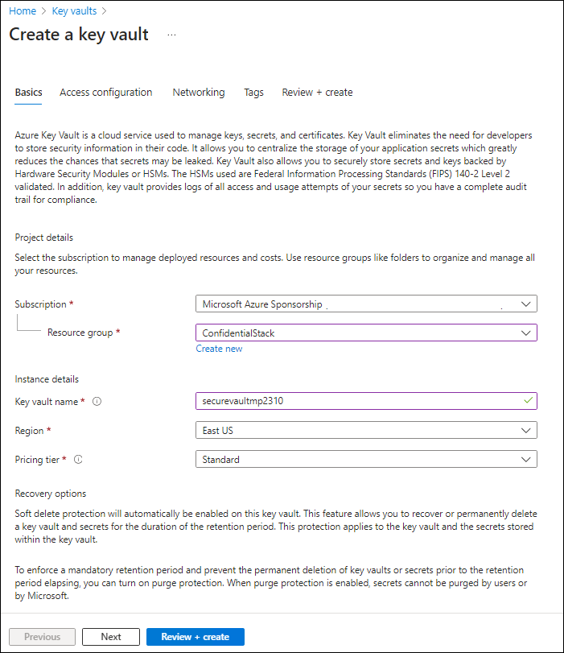

---
lab:
  az204Title: 'Lab 07: Access resource secrets more securely across services'
  az204Module: 'Learning Path 07: Implement secure Azure solutions'
---

# Lab 07: Accedere ai segreti delle risorse in modo più sicuro tra i servizi

## Interfaccia utente di Microsoft Azure

Considerata la natura dinamica degli strumenti cloud di Microsoft, è possibile rilevare modifiche all'interfaccia utente di Azure apportate dopo lo sviluppo di questo contenuto per la formazione. È quindi possibile che le istruzioni e le procedure del lab non siano allineate correttamente.

Microsoft aggiorna questo corso di formazione quando la community segnala le modifiche necessarie. Poiché gli aggiornamenti cloud vengono apportati spesso, tuttavia, è possibile che si rilevino modifiche all'interfaccia utente prima degli aggiornamenti del contenuto per la formazione. **In questo caso, adattarsi alle modifiche e quindi eseguire le operazioni necessarie nei lab.**

## Istruzioni

### Prima di iniziare

#### Accedere all'ambiente lab

Accedere alla macchina virtuale Windows 11 usando le credenziali seguenti:

- Nome utente: `Admin`
- Password: `Pa55w.rd`

> **Nota**: il docente fornirà le istruzioni necessarie per la connessione all'ambiente lab virtuale.

#### Esaminare le applicazioni installate

Trova la barra delle applicazioni sul desktop di Windows 11. La barra delle applicazioni include le icone per le applicazioni che verranno usate nel lab, tra cui:

- Microsoft Edge
- Esplora file
- Terminale
- Visual Studio Code

## Lab Scenario

In questo lab si creeranno un account di archiviazione e un'app per le funzioni di Azure che accederà all'account di archiviazione. Per illustrare l'archiviazione sicura delle informazioni di stringa di connessione, si eseguirà il provisioning di una risorsa di Key Vault e si gestiranno i segreti appropriati per archiviare le informazioni di stringa di connessione. Si gestirà anche l'identità del servizio per ottenere l'accesso sicuro alle informazioni di stringa di connessione per l'account di archiviazione.

## Diagramma dell'architettura


### Esercizio 1: Creare risorse di Azure

#### Attività 1: Aprire il portale di Azure

1. Sulla barra delle applicazioni selezionare l'icona di **Microsoft Edge**.

1. Nella finestra del browser aperta passare al portale di Azure in `https://portal.azure.com`e quindi accedere con l'account che verrà usato per questo lab.

   > **Nota**: se si sta eseguendo l'accesso al portale di Azure per la prima volta, verrà visualizzata una presentazione del portale. Selezionare **Attività iniziali** per ignorare la presentazione e iniziare a usare il portale.

#### Attività 2: Creare un account di archiviazione

1. Nel portale di Azure usare la casella di testo **Cerca risorse, servizi e documentazione** per cercare **Account di archiviazione** e quindi nell'elenco di risultati selezionare **Account di archiviazione**.

1. Nel riquadro **Account di archiviazione** selezionare **+ Crea**.

1. Nella scheda **Informazioni di base** del pannello **Crea un account di archiviazione** eseguire le azioni seguenti e selezionare **Rivedi**:

   | Impostazione                           | Azione                                                                     |
   | --------------------------------- | -------------------------------------------------------------------------- |
   | Elenco a discesa **Sottoscrizione**   | Mantenere il valore predefinito                                                   |
   | Sezione **Gruppo di risorse**        | Selezionare **Crea nuovo**, immettere **ConfidentialStack** e quindi selezionare **OK** |
   | Casella di testo **Nome account di archiviazione**  | Immettere **securestor**_[nomeutente]_                                           |
   | Elenco a discesa **Area**         | Selezionare **(Stati Uniti) Stati Uniti orientali**                                                    |
   | Sezione **Prestazioni**           | Selezionare l'opzione **Standard**                                             |
   | Elenco a discesa **Ridondanza**     | Selezionare **Archiviazione con ridondanza locale**.                                 |

   Lo screenshot seguente mostra le impostazioni configurate nel pannello **Crea un account di archiviazione**.

   

1. Nella scheda **Rivedi** esaminare le opzioni selezionate durante i passaggi precedenti.

1. Selezionare **Crea** per creare l'account di archiviazione usando la configurazione specificata.

   > **Nota**: prima di procedere con il lab, attendere il completamento dell'attività di creazione.

1. Nel pannello **Panoramica sulla distribuzione** selezionare **Vai alla risorsa**.

1. Nella sezione **Sicurezza e rete** del riquadro **Account di archiviazione** selezionare il collegamento **Chiavi di accesso** .

1. Nella sezione **Chiavi di accesso** selezionare **Mostra chiavi**.

1.  **Nel pannello Chiavi** di accesso esaminare una delle stringhe**di Connessione ion (usando **il pulsante Mostra**) e quindi registrare il valore di una **delle **caselle di stringa** Connessione ion in Blocco note. Le **chiavi**s sono chiavi di crittografia gestite dalla piattaforma e non** vengono **usate per questo lab.

   > **Nota**: la stringa di connessione scelta è irrilevante. Sono termini intercambiabili.

#### Attività 3: Creare un insieme di credenziali delle chiavi di Azure

1. Nel portale di Azure usare la casella di testo **Cerca risorse, servizi e documentazione** per cercare **Insiemi di credenziali delle chiavi** e quindi nell'elenco di risultati selezionare **Insiemi di credenziali delle chiavi**.

1. Nel pannello **Insiemi di credenziali delle chiavi** selezionare **Crea**.

1. Nel pannello **Crea insieme di credenziali delle chiavi** nella **scheda Informazioni di base** eseguire le azioni seguenti e quindi selezionare **Avanti** per passare alla **scheda Configurazione** di accesso:

   | Impostazione                           | Azione                                   |
   | --------------------------------- | ---------------------------------------- |
   | Elenco a discesa **Sottoscrizione**   | Mantenere il valore predefinito                 |
   | Elenco a discesa **Gruppo di risorse** | Selezionare **ConfidentialStack** nell'elenco |
   | Casella di testo **Nome insieme di credenziali delle chiavi**        | Immettere **securevault**_[nomeutente]_        |
   | Elenco a discesa **Area**         | Selezionare **Stati Uniti orientali**.                       |
   | Elenco a discesa **Piano tariffario**   | selezionare **Standard**                      |

   Lo screenshot seguente mostra le impostazioni configurate nel pannello **Crea insieme di credenziali delle chiavi**.

   

1. Nella **scheda Configurazione** di accesso modificare il modello di autorizzazione in Criteri di accesso** all'insieme **di credenziali e quindi selezionare **Rivedi e crea**.

1. Nella scheda **Rivedi e crea** esaminare le opzioni selezionate durante i passaggi precedenti.

1. Selezionare **Crea** per creare l'insieme di credenziali delle chiavi usando la configurazione specificata.

   > **Nota**: prima di procedere con il lab, attendere il completamento dell'attività di creazione.

#### Attività 4: Creare un'app per le funzioni

1. Nel portale di Azure usare la casella di testo **Cerca risorse, servizi e documentazione** per cercare **App per le funzioni** e quindi nell'elenco di risultati selezionare **App per le funzioni**.

1. Nel pannello **App per le funzioni** selezionare **Crea**.

1. Nel pannello **Crea app** per le funzioni **, nella **scheda Informazioni di base, eseguire le azioni seguenti e quindi selezionare **Avanti: Archiviazione**:

   | Impostazione                           | Azione                              |
   | --------------------------------- | ----------------------------------- |
   | Elenco a discesa **Sottoscrizione**   | Mantenere il valore predefinito            |
   | Elenco a discesa **Gruppo di risorse** | Selezionare **ConfidentialStack**        |
   | Casella di testo **Nome dell'app per le funzioni**     | Immettere **securefunc**_[nomeutente]_    |
   | Sezione **Pubblica**               | Selezionare **Codice**                     |
   | Elenco a discesa **Stack di runtime**  | Selezionare **.NET**                     |
   | Elenco a discesa **Versione**        | Selezionare **8 (LTS), modello di lavoro isolato**                        |
   | Elenco a discesa **Area**         | Selezionare l'area **Stati Uniti orientali**       |
   | Sezione **Sistema operativo**      | Selezionare **Linux**.                    |
   | **Elenco a discesa Hosting**        | Selezionare **Consumo (serverless)** |

   Lo screenshot seguente mostra le impostazioni configurate nel pannello **Crea app per le funzioni**.

   

1. **Nella scheda Archiviazione** eseguire le azioni seguenti e quindi selezionare **Rivedi e crea**:

   | Impostazione                            | Azione                                                |
   | ---------------------------------- | ----------------------------------------------------- |
   | Elenco a discesa **Account di archiviazione** | Selezionare l'account di archiviazione **securestor**_[nomeutente]_ |

1. Nella scheda **Rivedi e crea** esaminare le opzioni selezionate durante i passaggi precedenti.

1. Selezionare **Crea** per creare l'app per le funzioni usando la configurazione specificata.

   > **Nota**: prima di procedere con il lab, attendere il completamento dell'attività di creazione.

#### Revisione

In questo esercizio sono state create tutte le risorse che verranno usate nel lab.

### Esercizio 2: Configurare segreti e identità

#### Attività 1: Configurare un'identità del servizio gestito assegnata dal sistema

1. Nel riquadro di spostamento del portale di Azure selezionare il collegamento **Gruppi di risorse**.

1. Nel pannello **Gruppi di risorse** selezionare il gruppo di risorse **ConfidentialStack**.

1. Nel pannello **ConfidentialStack** selezionare l'app per le funzioni **securefunc**_[nomeutente]_.

   > **Nota**: saranno presenti due risorse, un'app per le funzioni e una risorsa di Application Insights, con lo stesso nome. Assicurarsi di selezionare la risorsa di tipo app per le funzioni.

1. Nel pannello **App per le funzioni** selezionare l'opzione **Identità** dalla sezione **Impostazioni**.

1. Nella scheda **Assegnata dal sistema** del riquadro **Identità** impostare lo **Stato** su **On** e quindi selezionare **Salva**.

1. Selezionare **Sì** per confermare l'impostazione.

   > **Nota**: prima di procedere con questo lab, attendere il completamento della creazione dell'identità gestita assegnata dal sistema.

#### Attività 2: Creare un segreto dell'insieme di credenziali delle chiavi

1. Nel riquadro di **spostamento** del portale di Azure selezionare il collegamento **Gruppi di risorse**.

1. Nel pannello **Gruppi di risorse** selezionare il gruppo di risorse **ConfidentialStack**.

1. Nel pannello **ConfidentialStack** selezionare l'insieme di credenziali delle chiavi **securevault**_[nomeutente]_.

1. Nel pannello **Insieme di credenziali delle chiavi** selezionare il collegamento **Segreti** nella sezione **Oggetti**.

1. Nel riquadro **Segreti** selezionare **+ Genera/Importa**.

1. Nel pannello **Crea un segreto** eseguire le azioni seguenti e selezionare **Crea**:

   | Impostazione                           | Azione                                                                               |
   | --------------------------------- | ------------------------------------------------------------------------------------ |
   | Elenco a discesa **Opzioni di caricamento** | Selezionare **Manuale**                                                                    |
   | Casella di testo **Nome**                 | Immettere **storagecredentials**                                                         |
   | **Casella di testo Valore** segreto         | Immettere la stringa di connessione dell'account di archiviazione registrata in precedenza in questo lab |
   | Casella di testo **Tipo di contenuto**         | Lasciare vuoto                                                                          |
   | Casella di controllo **Impostare la data di attivazione** | Non selezionato                                                                         |
   | Casella di controllo **Impostare la data di scadenza** | Non selezionato                                                                         |
   | Opzione **Abilitato**                | Selezionare **Sì**                                                                       |

   Lo screenshot seguente mostra le impostazioni configurate nel pannello **Crea un segreto**.

   

   > **Nota**: prima di procedere con questo lab, attendere il completamento della creazione del segreto.

1. Tornare al riquadro **Segreti** e quindi selezionare l'elemento **storagecredentials** dall'elenco.

1. Nel riquadro **Versioni** selezionare la versione più recente del segreto **storagecredentials**.

1. Nel riquadro **Versione del segreto** eseguire le azioni seguenti:

   1. Selezionare **Mostra il valore segreto** per trovare il valore del segreto.

   1. Registrare il valore della casella di testo **Identificatore del segreto** perché verrà usato più avanti nel lab.

   > **Nota**: si sta registrando il valore della casella di testo **Identificatore del segreto**, non della casella di testo **Valore segreto**.

#### Attività 3: Configurare un criterio di accesso di Key Vault

1. Nel riquadro di spostamento del portale di Azure selezionare il collegamento **Gruppi di risorse**.

1. Nel pannello **Gruppi di risorse** selezionare il gruppo di risorse **ConfidentialStack**.

1. Nel pannello **ConfidentialStack** selezionare l'insieme di credenziali delle chiavi **securevault[nomeutente]**.

1. Nel pannello **Insieme di credenziali delle chiavi** selezionare il collegamento **Criteri di accesso** nella sezione **Panoramica**.

1. Nel riquadro **Criteri di accesso** selezionare **+ Crea**.

1. **Nella sezione Permissons** del **pannello Crea criteri di accesso** effettuare le selezioni seguenti:

   | Impostazione                                      | Azione                        |
   | -------------------------------------------- | ----------------------------- |
   | Elenco a discesa **Configura da modello** | Lasciare vuoto                   |
   | Caselle di controllo **Autorizzazioni delle chiavi**               | 0 selezionato                    |
   | Caselle di controllo **Autorizzazioni dei segreti**            | Selezionare l'autorizzazione **GET** |
   | Caselle di controllo **Autorizzazioni del certificato**       | 0 selezionato                    |

1. Selezionare la **sezione Principal (Entità)** e effettuare le selezioni seguenti:

   | Impostazione                   | Azione                                                                                                                                                                                                      |
   | ------------------------- | ----------------------------------------------------------------------------------------------------------------------------------------------------------------------------------------------------------- |
   | Collegamento **Selezionare un'entità** | Trovare e quindi selezionare l'entità servizio denominata **securefunc**_[nomeutente]_. L'identità gestita assegnata dal sistema creata in precedenza in questo lab avrà lo stesso nome della risorsa di Funzioni di Azure |

1. Selezionare **Rivedi e crea** e selezionare **Crea**.

   > **Nota**: prima di procedere con questo lab, attendere il completamento del salvataggio delle modifiche ai criteri di accesso.

#### Attività 4: Creare un'impostazione applicazione derivata dall'insieme di credenziali delle chiavi

1. Nel riquadro di spostamento del portale di Azure selezionare il collegamento **Gruppi di risorse**.

1. Nel pannello **Gruppi di risorse** selezionare il gruppo di risorse **ConfidentialStack**.

1. Nel pannello **ConfidentialStack** selezionare l'app per le funzioni **securefunc[nomeutente]**.

1. Nel pannello **App per le funzioni** selezionare l'opzione **Configurazione** dalla sezione **Impostazioni**.

1. Se il **riquadro Configurazione** contiene la scheda **Impostazioni** applicazione, fare clic su di esso ed eseguire le operazioni seguenti:

   - Selezionare **+ Nuova impostazione applicazione**.
   - Nella finestra popup **Aggiungi/Modifica impostazione applicazione** nella casella di testo **Nome** immettere **StorageConnectionString**.
   - Nella casella di testo **Valore** costruire un valore usando la sintassi seguente: `@Microsoft.KeyVault(SecretUri=<Secret Identifier>)`, dove il segnaposto `<Secret Identifier>` rappresenta l'identificatore del segreto registrato in precedenza in questo esercizio.

   > **Nota**: se, ad esempio, l'identificatore del segreto è `https://securevaultstudent.vault.azure.net/secrets/storagecredentials/17b41386df3e4191b92f089f5efb4cbf`, il valore risultante sarà `@Microsoft.KeyVault(SecretUri=https://securevaultstudent.vault.azure.net/secrets/storagecredentials/17b41386df3e4191b92f089f5efb4cbf)`.

   - Lasciare impostato il valore predefinito per la casella di controllo **Impostazione slot di distribuzione** (non selezionata) e quindi selezionare **OK** per chiudere la finestra popup e tornare alla sezione **Configurazione**.
   - Selezionare **Salva** per salvare le impostazioni e quindi nella finestra di dialogo popup di conferma **Salva modifiche** selezionare **Continua**.

   > **Nota**: prima di procedere con questo lab, attendere il completamento del salvataggio delle impostazioni dell'applicazione.

1. Se il **riquadro Configurazione** non contiene la scheda **Impostazioni** applicazione, selezionare le **variabili** di ambiente nella **sezione Impostazioni** ed eseguire le operazioni seguenti:

   - Selezionare la **scheda Impostazioni** app.
   - Immettere **Archiviazione Connessione ionString** nella prima casella di testo disponibile nella colonna **Nome**.
   - Nella casella di testo disponibile a destra (nella colonna **Valore**) immettere un costrutto di valore usando la sintassi seguente: `@Microsoft.KeyVault(SecretUri=<Secret Identifier>)`, dove il `<Secret Identifier>` segnaposto rappresenta l'identificatore del segreto registrato in precedenza in questo esercizio.

   > **Nota**: se, ad esempio, l'identificatore del segreto è `https://securevaultstudent.vault.azure.net/secrets/storagecredentials/17b41386df3e4191b92f089f5efb4cbf`, il valore risultante sarà `@Microsoft.KeyVault(SecretUri=https://securevaultstudent.vault.azure.net/secrets/storagecredentials/17b41386df3e4191b92f089f5efb4cbf)`.

   - Lasciare la **casella di controllo impostazione** dello slot di distribuzione impostata sul valore predefinito (non selezionato), quindi selezionare **Applica** il valore immesso e fare clic su **Conferma** per confermare l'operazione.

   > **Nota**: prima di procedere con questo lab, attendere il completamento del salvataggio delle impostazioni dell'applicazione.
   
#### Revisione

In questo esercizio è stata creata un'identità del servizio gestita assegnata dal sistema per l'app per le funzioni e sono state quindi concesse all'identità le autorizzazioni appropriate per ottenere il valore di un segreto nell'insieme di credenziali delle chiavi. È stato infine creato un segreto a cui è stato fatto riferimento nelle impostazioni di configurazione dell'app per le funzioni.

### Esercizio 3: Creare un'app per le funzioni

#### Attività 1: Inizializzare un progetto di funzione

1. Sulla barra delle applicazioni selezionare l'icona **Terminale** .

1. Eseguire il comando seguente per cambiare la directory corrente selezionando la directory vuota **Allfiles (F):\\Allfiles\\Labs\\07\\Starter\\func**:

   ```powershell
   cd F:\Allfiles\Labs\07\Starter\func
   ```

   > **Nota**: in Esplora risorse rimuovere l'attributo di sola lettura dal file F:\Allfiles\Labs\07\Starter\func\.gitignore.

1. Eseguire il comando seguente per usare **Azure Functions Core Tools** per creare un nuovo progetto di funzione locale nella directory corrente usando il runtime **dotnet**:

   ```powershell
   func init --worker-runtime dotnet-isolated --target-framework net8.0 --force
   ```

   > **Nota**: è possibile esaminare la documentazione per [creare un nuovo progetto][azure-functions-core-tools-new-project] usando **Azure Functions Core Tools**.

1. Eseguire il comando seguente per **compilare** il progetto .NET 8:

   ```powershell
   dotnet build
   ```

#### Attività 2: Creare una funzione attivata da HTTP

1. Eseguire il comando seguente per usare **Azure Functions Core Tools** per creare una nuova funzione denominata **FileParser** usando il modello **Trigger HTTP**:

   ```powershell
   func new --template "HTTP trigger" --name "FileParser"
   ```

   > **Nota**: è possibile esaminare la documentazione per [creare una nuova funzione][azure-functions-core-tools-new-function] usando **Azure Functions Core Tools**.

1. Chiudere l'applicazione Terminale** attualmente in esecuzione**.

#### Attività 3: Configurare e leggere un'impostazione applicazione

1. Nella schermata **Start** selezionare il riquadro **Visual Studio Code**.

1. Nel menu **File** selezionare **Apri cartella**.

1. Nella finestra **Esplora file** visualizzata passare a **Allfiles (F):\\Allfiles\\Labs\\07\\Starter\\func** e quindi selezionare **Seleziona cartella**.

1. Nel riquadro **Esplora risorse** della finestra di **Visual Studio Code** Aprire il file **local.settings.json**.

1. Prendere nota del valore corrente dell'oggetto **Values**:

   ```json
   "Values": {
       "AzureWebJobsStorage": "UseDevelopmentStorage=true",
       "FUNCTIONS_WORKER_RUNTIME": "dotnet-isolated"
   }
   ```

1. Aggiornare il valore dell'oggetto **Values** aggiungendo una nuova impostazione denominata **StorageConnectionString** e quindi assegnando a tale impostazione un valore di stringa pari a **[TEST VALUE]**:

   ```json
   "Values": {
       "AzureWebJobsStorage": "UseDevelopmentStorage=true",
       "FUNCTIONS_WORKER_RUNTIME": "dotnet-isolated",
       "StorageConnectionString": "[TEST VALUE]"
   }
   ```

1. Il file **local.settings.json** dovrebbe ora includere:

   ```json
   {
     "IsEncrypted": false,
     "Values": {
       "AzureWebJobsStorage": "UseDevelopmentStorage=true",
       "FUNCTIONS_WORKER_RUNTIME": "dotnet-isolated",
       "StorageConnectionString": "[TEST VALUE]"
     }
   }
   ```

1. Selezionare **Salva** per salvare le modifiche al file **local.settings.json**.

1. Nel riquadro **Esplora risorse** della finestra di **Visual Studio Code** aprire il file **FileParser.cs**.

1. Nell'editor di codice sostituire il contenuto del codice generato automaticamente della funzione **FileParser** a partire dalla riga 18 con il codice seguente:

    ```csharp
           [Function("FileParser")]
            public HttpResponseData Run([HttpTrigger(AuthorizationLevel.Function, "get", "post")] HttpRequestData req)
            {
                _logger.LogInformation("C# HTTP trigger function processed a request.");

                var response = req.CreateResponse(HttpStatusCode.OK);
                response.Headers.Add("Content-Type", "text/plain; charset=utf-8");

                string connectionString = Environment.GetEnvironmentVariable("StorageConnectionString");
                response.WriteString(connectionString);

                return response;
            }
    ``` 

1. Ignorare gli avvisi relativi ai valori Null. 

1. Esaminare il codice risultante, che deve essere costituito dal contenuto seguente (questo codice restituisce il valore della variabile di ambiente Archiviazione Connessione ionString):

   ```csharp
   using System.Net;
   using Microsoft.Azure.Functions.Worker;
   using Microsoft.Azure.Functions.Worker.Http;
   using Microsoft.Extensions.Logging;

   namespace func
   {
       public class FileParser
       {
           private readonly ILogger _logger;

           public FileParser(ILoggerFactory loggerFactory)
           {
               _logger = loggerFactory.CreateLogger<FileParser>();
           }

           [Function("FileParser")]
           public HttpResponseData Run([HttpTrigger(AuthorizationLevel.Function, "get", "post")] HttpRequestData req)
           {
               _logger.LogInformation("C# HTTP trigger function processed a request.");

               var response = req.CreateResponse(HttpStatusCode.OK);
               response.Headers.Add("Content-Type", "text/plain; charset=utf-8");

               string connectionString = Environment.GetEnvironmentVariable("StorageConnectionString");
               response.WriteString(connectionString);

               return response;
           }
       }
   }
   ```

1. Selezionare **Salva** per salvare le modifiche al file **FileParser.cs**.

#### Attività 4: Convalidare la funzione locale

1. Sulla barra delle applicazioni selezionare l'icona **Terminale** .

1. Eseguire il comando seguente per cambiare la directory corrente selezionando la directory vuota **Allfiles (F):\\Allfiles\\Labs\\07\\Starter\\func**:

   ```powershell
   cd F:\Allfiles\Labs\07\Starter\func
   ```

1. Eseguire il comando seguente per avviare il progetto di app per le funzioni:

   ```powershell
   func start --build
   ```

   > **Nota**: è possibile esaminare la documentazione per [avviare localmente il progetto di app per le funzioni][azure-functions-core-tools-start-function] usando **Azure Functions Core Tools**.

1. Nel computer del lab avviare il **Prompt dei comandi**.

1. Eseguire il comando seguente per eseguire il test della chiamata ALL'API **REST GET** su `http://localhost:7071/api/FileParser`:

   ```powershell
   curl -X GET -i http://localhost:7071/api/FileParser
   ```

1. Osservare il valore **[TEST VALUE]** di **StorageConnectionString** restituito come risultato della richiesta HTTP:

   ```powershell
   HTTP/1.1 200 OK
   Content-Type: text/plain; charset=utf-8
   Date: Tue, 01 Sep 2020 23:35:39 GMT
   Server: Kestrel
   Transfer-Encoding: chunked

   [TEST VALUE]
   ```

1. Chiudere tutte le istanze attualmente in esecuzione dell'applicazione **Terminale** e l'applicazione **del prompt dei comandi** .

#### Attività 5: Distribuire la funzione usando Azure Functions Core Tools

1. Sulla barra delle applicazioni selezionare l'icona **Terminale** .

1. Eseguire il comando seguente per cambiare la directory corrente selezionando la directory vuota **Allfiles (F):\\Allfiles\\Labs\\07\\Starter\\func**:

   ```powershell
   cd F:\Allfiles\Labs\07\Starter\func
   ```

1. Eseguire il comando seguente per accedere all'interfaccia della riga di comando di Azure:

   ```powershell
   az login
   ```

1. Nella finestra del **browser Microsoft Edge** immettere le credenziali dell'account usato per accedere alla sottoscrizione di Azure e quindi selezionare **Accedi**.

1. Tornare alla finestra terminale** attualmente aperta**. Attendere il completamento del processo di accesso.

1. Eseguire il comando seguente per pubblicare il progetto dell'app per le funzioni (sostituire il segnaposto `<function-app-name>` con il nome dell'app per le funzioni creata in precedenza in questo lab):

   ```powershell
   func azure functionapp publish <function-app-name> --dotnet-version 8.0
   ```

   > **Nota**: se, ad esempio, il **Nome dell'app per le funzioni** è **securefuncstudent**, il comando sarà `func azure functionapp publish securefuncstudent --force`. È possibile esaminare la documentazione per [pubblicare il progetto di app per le funzioni locale][azure-functions-core-tools-publish-azure] usando **Azure Functions Core Tools**.

1. Prima di procedere con il lab, attendere la finalizzazione della distribuzione.

1. Chiudere l'applicazione Terminale** attualmente in esecuzione**.

#### Attività 6: Testare l'impostazione applicazione derivata dall'insieme di credenziali delle chiavi

1. Sulla barra delle applicazioni selezionare l'icona **di Microsoft Edge** e quindi selezionare la scheda contenente il portale di Azure.

1. Nel riquadro di spostamento del portale di Azure selezionare il collegamento **Gruppi di risorse**.

1. Nel pannello **Gruppi di risorse** selezionare il gruppo di risorse **ConfidentialStack**.

1. Nel pannello **ConfidentialStack** selezionare l'app per le funzioni **securefunc[nomeutente]**.

1. Nel pannello App** per le **funzioni selezionare l'opzione **Panoramica**.

1. **Nella scheda Funzioni** nella parte inferiore della pagina Panoramica selezionare la funzione FileParser** esistente**.

1. Nel pannello **Funzione** selezionare l'opzione **Codice e test** nella sezione **Sviluppatore**.

1. Nell'editor di funzioni selezionare **Test/Esegui**.

1. Nel riquadro visualizzato automaticamente selezionare **GET** nell'elenco **Metodo HTTP**.

1. Selezionare **Esegui** per testare la funzione.

1. Esaminare i risultati dell'esecuzione dei test. Il risultato dovrebbe essere la stringa di connessione di Archiviazione di Azure.

#### Revisione

In questo esercizio è stata usata un'identità del servizio per leggere il valore di un segreto archiviato in Key Vault e tale valore è stato restituito come risultato di un'app per le funzioni.

### Esercizio 4: Accedere ai dati di Archiviazione BLOB di Azure

#### Attività 1: Caricare un BLOB di archiviazione di esempio

1. Nel riquadro di spostamento del portale di Azure selezionare il collegamento **Gruppi di risorse**.

1. Nel pannello **Gruppi di risorse** selezionare il gruppo di risorse **ConfidentialStack**.

1. Nel pannello **ConfidentialStack** selezionare l'account di archiviazione **securestor**_[nomeutente]_.

1. Nel pannello **Account di archiviazione** selezionare il collegamento **Contenitori** nella sezione **Archiviazione dati**.

1. Nella sezione **Contenitori** selezionare **+ Contenitore**.

1. Nella finestra popup **Nuovo contenitore** eseguire le azioni seguenti e quindi selezionare **Crea**:

   | Impostazione                                | Azione                                   |
   | -------------------------------------- | ---------------------------------------- |
   | Casella di testo **Nome**                      | Immettere **drop**                           |

1. Tornare alla **sezione Contenitori** e quindi passare al contenitore di rilascio** appena creato**.

1. Nel pannello **Contenitore** selezionare **Carica**.

1. Nella finestra **Carica BLOB** eseguire le azioni seguenti e quindi selezionare **Carica**:

   | Impostazione                                        | Azione                                                                                                               |
   | ---------------------------------------------- | -------------------------------------------------------------------------------------------------------------------- |
   | Sezione **File**                              | Selezionare **Sfoglia per i file** o usare la funzionalità di trascinamento della selezione                                                         |
   | Finestra **Esplora file**                       | Passare ad **Allfiles (F):\\Allfiles\\Labs\\07\\Starter**, selezionare il file **records.json** e quindi selezionare **Apri** |
   | Casella di controllo **Sovrascrivi se i file esistono già** | Assicurarsi che questa casella di controllo sia selezionata                                                                               |

   > **Nota**: prima di procedere con questo lab, attendere il completamento del caricamento del BLOB.

1. Tornare al pannello **Contenitore** e quindi selezionare il BLOB **records.json** nell'elenco di BLOB.

1. Nel pannello **BLOB** trovare i metadati del BLOB e quindi copiare l'URL per il BLOB.

1. Sulla barra delle applicazioni attivare il menu di scelta rapida per l'icona di **Microsoft Edge** e quindi selezionare **Nuova finestra**.

1. Nella nuova finestra del browser fare riferimento all'URL copiato per il BLOB.

1. Dovrebbe essere ora visualizzato un messaggio di errore che indica che la risorsa non è stata trovata.

   > **Nota**: si prevede che l'accesso anonimo per i BLOB non sia abilitato.

#### Attività 2: Eseguire il pull e configurare Azure SDK per .NET

1. Sulla barra delle applicazioni selezionare l'icona **Terminale** .

1. Eseguire il comando seguente per cambiare la directory corrente selezionando la directory vuota **Allfiles (F):\\Allfiles\\Labs\\07\\Starter\\func**:

   ```powershell
   cd F:\Allfiles\Labs\07\Starter\func
   ```

1. Eseguire il comando seguente per aggiungere la **versione **12.18.0** di Azure.Archiviazione. ** Pacchetto BLOB da NuGet:

   ```powershell
   dotnet add package Azure.Storage.Blobs --version 12.18.0
   ```

   > **Nota**: il pacchetto [Azure.Storage.Blobs](https://www.nuget.org/packages/Azure.Storage.Blobs) di NuGet fa riferimento al subset di Azure SDK per .NET necessario per scrivere codice per Archiviazione BLOB di Azure.

1. Chiudere l'applicazione Terminale** attualmente in esecuzione**.

1. Nella schermata **Start** selezionare il riquadro **Visual Studio Code**.

1. Nel menu **File** selezionare **Apri cartella**.

1. Nella finestra **Esplora file** visualizzata passare a **Allfiles (F):\\Allfiles\\Labs\\07\\Starter\\func** e quindi selezionare **Seleziona cartella**.

1. Nel riquadro **Esplora risorse** della finestra di **Visual Studio Code** aprire il file **FileParser.cs**.

1. Aggiungere **direttive** using per azure.Archiviazione **. ** BLOB e **Azure.Archiviazione. Spazi dei nomi Blobs.Models**:

   ```csharp
   using Azure.Storage.Blobs;
   using Azure.Storage.Blobs.Models;
   ```

1. Sostituire il contenuto del metodo FileParser** corrente **a partire dalla riga 19 con il codice seguente:

    ```csharp
            [Function("FileParser")]
            public HttpResponseData Run([HttpTrigger(AuthorizationLevel.Function, "get", "post")] HttpRequestData req)
            {
                _logger.LogInformation("C# HTTP trigger function processed a request.");

                var response = req.CreateResponse(HttpStatusCode.OK);

                string connectionString = Environment.GetEnvironmentVariable("StorageConnectionString");

                /* Create a new instance of the BlobClient class by passing in your
                   connectionString variable, a  "drop" string value, and a
                   "records.json" string value to the constructor */
                BlobClient blob = new BlobClient(connectionString, "drop", "records.json");

                // Download the content of the referenced blob 
                BlobDownloadResult downloadResult = blob.DownloadContent();

                 // Retrieve the value of the downloaded blob and convert it to string
                response.WriteString(downloadResult.Content.ToString());
            
                //return the response
                return response;
            }
    ``` 

1. Ignorare l'avviso relativo ai valori Null.

1. Esaminare il codice risultante, che deve essere costituito dal contenuto seguente (questo codice restituisce il contenuto del BLOB scaricato dall'account di archiviazione designato dalla variabile di ambiente Archiviazione Connessione ionString):

   ```csharp
   namespace func
   {
       public class FileParser
       {
           private readonly ILogger _logger;

           public FileParser(ILoggerFactory loggerFactory)
           {
               _logger = loggerFactory.CreateLogger<FileParser>();
           }

           [Function("FileParser")]
           public HttpResponseData Run([HttpTrigger(AuthorizationLevel.Function, "get", "post")] HttpRequestData req)
           {
               _logger.LogInformation("C# HTTP trigger function processed a request.");

               var response = req.CreateResponse(HttpStatusCode.OK);

               string connectionString = Environment.GetEnvironmentVariable("StorageConnectionString");

               /* Create a new instance of the BlobClient class by passing in your
                  connectionString variable, a  "drop" string value, and a
                  "records.json" string value to the constructor */
               BlobClient blob = new BlobClient(connectionString, "drop", "records.json");

               // Download the content of the referenced blob 
               BlobDownloadResult downloadResult = blob.DownloadContent();

                // Retrieve the value of the downloaded blob and convert it to string
               response.WriteString(downloadResult.Content.ToString());
            
               //return the response
               return response;
           }
       }
   }
   ```

1. Selezionare **Salva** per salvare le modifiche al file **FileParser.cs**.

#### Attività 3: Distribuire e convalidare l'app Funzioni di Azure

1. Sulla barra delle applicazioni selezionare l'icona **Terminale** .

1. Eseguire il comando seguente per cambiare la directory corrente selezionando la directory vuota **Allfiles (F):\\Allfiles\\Labs\\07\\Starter\\func**:

   ```powershell
   cd F:\Allfiles\Labs\07\Starter\func
   ```

1. Eseguire il comando seguente per accedere all'interfaccia della riga di comando di Azure:

   ```powershell
   az login
   ```

1. Nella finestra del browser **Microsoft Edge** immettere l'indirizzo di posta elettronica e la password per l'account Microsoft e quindi selezionare **Accedi**.

1. Tornare alla finestra terminale** attualmente aperta**. Attendere il completamento del processo di accesso.

1. Eseguire di nuovo il comando seguente per pubblicare il progetto dell'app per le funzioni (sostituire il segnaposto `<function-app-name>` con il nome dell'app per le funzioni usata in precedenza in questo lab):

   ```powershell
   func azure functionapp publish <function-app-name> --dotnet-version 8.0
   ```

   > **Nota**: se, ad esempio, il **Nome dell'app per le funzioni** è **securefuncstudent**, il comando sarà `func azure functionapp publish securefuncstudent`. È possibile esaminare la documentazione per [pubblicare il progetto di app per le funzioni locale][azure-functions-core-tools-publish-azure] usando **Azure Functions Core Tools**.

1. Prima di procedere con il lab, attendere la finalizzazione della distribuzione.

1. Chiudere l'applicazione Terminale** attualmente in esecuzione**.

1. Sulla barra delle applicazioni selezionare l'icona **di Microsoft Edge** e quindi fare riferimento alla portale di Azure.

1. Nel riquadro di spostamento del portale di Azure selezionare il collegamento **Gruppi di risorse**.

1. Nel pannello **Gruppi di risorse** selezionare il gruppo di risorse **ConfidentialStack**.

1. Nel pannello **ConfidentialStack** selezionare l'app per le funzioni **securefunc[nomeutente]**.

1. Nel pannello App** per le **funzioni selezionare l'opzione **Panoramica**.

1. **Nella scheda Funzioni** della pagina Panoramica selezionare la funzione FileParser** esistente**.

1. Nel pannello **Funzione** selezionare l'opzione **Codice e test** nella sezione **Sviluppatore**.

1. Nell'editor di funzioni selezionare **Test/Esegui**.

1. Nel riquadro visualizzato automaticamente selezionare **GET** nell'elenco **Metodo HTTP**.

1. Selezionare **Esegui** per testare la funzione.

1. Esaminare i risultati dell'esecuzione dei test. L'output includerà il contenuto del BLOB **$/drop/records.json** archiviato nell'account di archiviazione di Azure.

#### Revisione

In questo esercizio è stato usato codice C\# per accedere a un account di archiviazione e sono quindi stati scaricati i contenuti di un BLOB.
