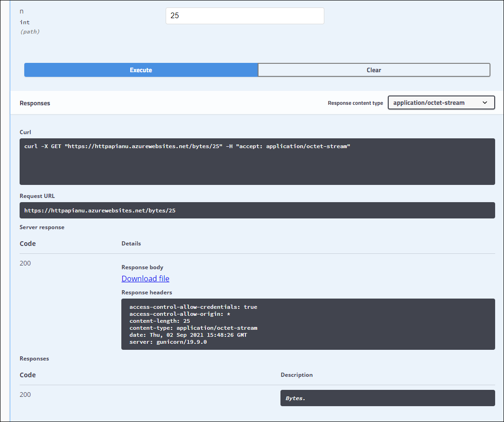

---
lab:
  az204Title: 'Lab 08: Create a multi-tier solution by using Azure services'
  az204Module: 'Learning Path 08: Implement API Management'
---

# Lab 08: Creare una soluzione multilivello usando i servizi di Azure

## Interfaccia utente di Microsoft Azure

Considerata la natura dinamica degli strumenti cloud di Microsoft, è possibile rilevare modifiche all'interfaccia utente di Azure apportate dopo lo sviluppo di questo contenuto per la formazione. È quindi possibile che le istruzioni e le procedure del lab non siano allineate correttamente.

Microsoft aggiorna questo corso di formazione quando la community segnala le modifiche necessarie. Poiché gli aggiornamenti cloud vengono apportati spesso, tuttavia, è possibile che si rilevino modifiche all'interfaccia utente prima degli aggiornamenti del contenuto per la formazione. **In questo caso, adattarsi alle modifiche e quindi eseguire le operazioni necessarie nei lab.**

## Istruzioni

### Prima di iniziare

#### Accedere all'ambiente lab

Accedere alla macchina virtuale Windows 11 usando le credenziali seguenti:

- Nome utente: `Admin`
- Password: `Pa55w.rd`

> **Nota**: il docente fornirà le istruzioni necessarie per la connessione all'ambiente lab virtuale.

#### Esaminare le applicazioni installate

Trova la barra delle applicazioni sul desktop di Windows 11. Questa barra delle applicazioni contiene le icone delle applicazioni che verranno usate in questo lab:
    
-   Microsoft Edge

## Lab Scenario

In questo modello di verifica si creerà un'applicazione in contenitori per ospitare un'app Web in Azure, come origine delle informazioni per l'API. Si creerà quindi un proxy API usando le funzionalità di Azure Gestione API per esporre e testare le API. Gli sviluppatori possono eseguire query sulle API per testare il servizio e convalidarne l'applicabilità.

## Diagramma dell'architettura


### Esercizio 1: Creare una risorsa di Servizio app di Azure usando un'immagine del contenitore Docker

#### Attività 1: Aprire il portale di Azure

1. Sulla barra delle applicazioni selezionare l'icona di **Microsoft Edge**.

1. Nella finestra del browser visualizzata passare al portale di Azure in `https://portal.azure.com`e quindi accedere con l'account che verrà usato per questo lab.

    > **Nota**: se si sta eseguendo l'accesso al portale di Azure per la prima volta, verrà visualizzata una presentazione del portale. Selezionare **Attività iniziali** per ignorare la presentazione e iniziare a usare il portale.

#### Attività 2: Creare un'app Web mediante la risorsa di Servizio app di Azure usando un'immagine del contenitore httpbin

1. Nel portale di Azure usare la casella di testo **Cerca risorse, servizi e documentazione** per cercare **Servizi app** e quindi nell'elenco dei risultati selezionare **Servizi app**.

1. Nel pannello **Servizi app** selezionare **+ Crea**.

1. Nella scheda **Informazioni di base** del pannello **Crea app Web** eseguire le azioni seguenti:
    
    | Impostazione | Azione |
    | -- | -- |
    | Elenco a discesa **Sottoscrizione** | Mantenere il valore predefinito |
    | Sezione **Gruppo di risorse** | Selezionare **Crea nuovo**, immettere **ApiService** e quindi selezionare **OK** |
    | Casella di testo **Nome** | Immettere **httpapi** *[nomeutente]* |
    | Sezione **Pubblica** | Selezionare **Contenitore Docker** |
    | Sezione **Sistema operativo** | Selezionare **Linux**. |
    | Elenco a discesa **Area** | Selezionare qualsiasi area di Azure in cui è possibile distribuire un'app Web di Azure |
    | Sezione **Piano Linux** | Selezionare **Crea nuovo**, immettere il valore **ApiPlan** nella casella di testo **Nome** e quindi selezionare **OK** |
    | Sezione **Piano tariffario** | Selezionare **Esplora piani** tariffari, nella **pagina Seleziona piano tariffario** servizio app selezionare **Basic B1** e quindi selezionare **Seleziona** |

1. Selezionare **Avanti: Docker >**.

1. Nella scheda **Docker** eseguire le azioni seguenti e quindi selezionare **Rivedi e crea**:

    | Impostazione | Azione |
    | -- | -- |
    | Elenco a discesa **Opzioni** | Selezionare **Contenitore singolo** |
    | Elenco a discesa **Origine immagine** | Selezionare **Docker Hub** |
    | Elenco a discesa **Tipo di accesso** | Selezionare **Pubblico** |
    | Casella di testo **Immagine e tag** | Immettere **kennethreitz/httpbin:latest** |

1. Nella scheda **Rivedi e crea** esaminare le opzioni selezionate durante i passaggi precedenti.

1. Selezionare **Crea** per creare l'app Web usando la configurazione specificata.

    > **Nota**: prima di procedere con il lab, attendere il completamento dell'attività di creazione.

#### Attività 3: Testare l'applicazione Web httpbin

1. Nel portale di Azure usare la casella di testo **Cerca risorse, servizi e documentazione** per cercare **Servizi app** e quindi nell'elenco dei risultati selezionare **Servizi app**.

1. Nel pannello **Servizi app** selezionare l'app Web appena creata.

1. Nel pannello che mostra le proprietà dell'app appena creata selezionare **Sfoglia**.

1. All'interno dell'applicazione Web eseguire le azioni seguenti:

    a.  Selezionare **Formati di risposta**.

    b.  Selezionare **GET /html**.

    c.  Selezionare **Prova**.

    Lo screenshot seguente mostra la sezione **Prova** dell'applicazione Web.

    

    d.  Seleziona **Execute**.

    e.  Esaminare il valore delle caselle di testo **Corpo della risposta** e **Intestazioni della risposta**.

    f.  Esaminare il valore della casella di testo **URL della richiesta**.

1. All'interno dell'applicazione Web eseguire le azioni seguenti:

    a.  Selezionare **Dati dinamici**.

    b.  Selezionare **GET /bytes/{n}**.

    c.  Selezionare **Prova**.

    d.  Nella casella di testo **n** immettere **25**.

    e.  Seleziona **Execute**.

    f.  Esaminare il valore delle caselle di testo **Corpo della risposta** e **Intestazioni della risposta**.

    g.  Selezionare **Scarica il file**. Al termine del download, aprire il file in Blocco note, esaminarne il contenuto e quindi chiuderlo.

    > **Nota**: il file contiene una sequenza di byte generati in modo casuale.

    Lo screenshot seguente mostra la sezione dei dati dinamici dell'applicazione Web.
  
    

1. All'interno dell'applicazione Web eseguire le azioni seguenti:

    a.  Selezionare **Codici di stato**.

    b.  Selezionare **GET /status/{codes}**.

    c.  Selezionare **Prova**.

    d.  Nella casella di testo **codici** immettere **404**.

    e.  Seleziona **Execute**.

    f.  Esaminare la sezione **Server response** (Risposta del server) e notare che include la voce **Error: NOT FOUND** (Errore: NON TROVATO).
     
1. Chiudere la finestra del browser in cui è visualizzata l'applicazione Web.

1. Tornare alla finestra del browser in cui è visualizzata l'app Web **httpapi**_[nomeutente]_.

1. **Nel pannello Panoramica** servizio app, in **Informazioni di** base, registrare il valore del **collegamento dominio predefinito**. Questo valore verrà usato più avanti nel lab per inviare richieste all'API corrispondente.

#### Revisione

In questo esercizio è stata creata una nuova app Web di Azure usando un'immagine del contenitore originata da Docker Hub.

### Esercizio 2: Creare un livello proxy API usando Gestione API di Azure

#### Attività 1: Creare una risorsa di Gestione API di Azure

1. Nel portale di Azure usare la casella di testo **Cerca risorse, servizi e documentazione** per cercare **Servizi Gestione API** e quindi nell'elenco dei risultati selezionare **Servizi Gestione API**.

1. Nel pannello **Servizi Gestione API** selezionare **+ Crea**.

1. Nel pannello **Installa gateway di gestione API** eseguire le azioni seguenti e quindi selezionare **Rivedi e crea**:

    
    | Impostazione | Azione |
    | -- | -- |
    | Elenco a discesa **Sottoscrizione** | Mantenere il valore predefinito. |
    | Sezione **Gruppo di risorse** | Selezionare il gruppo **ApiService** creato in precedenza nel lab |
    | Elenco **Area** | Selezionare la stessa area scelta nell'esercizio precedente |
    | Casella di testo **Nome della risorsa** | Immettere **proapi** *[nomeutente]* |
    | Casella di testo **Nome organizzazione** | Immettere **Contoso** |
    | Casella di testo **Indirizzo di posta elettronica dell'amministratore** | Immetti `admin@contoso.com` |
    | Elenco a discesa **Piano tariffario** | **Consumo (contratto di servizio del 99,95%)** |

    Lo screenshot seguente mostra le impostazioni configurate del pannello **Crea Gestione API** dell'applicazione Web.
    
    

1. Nella scheda **Rivedi e crea** esaminare l'opzione specificata nel passaggio precedente e quindi selezionare **Crea**.

    > **Nota**: prima di procedere con il lab, attendere il completamento dell'attività di creazione.

1. Nel pannello **Panoramica sulla distribuzione** selezionare **Vai alla risorsa**.

#### Attività 2: Definire una nuova API

1. Nel pannello **Servizio Gestione API** selezionare **API** nella sezione **API**.

1. Nella sezione **Define a new API** (Definisci una nuova API) selezionare **HTTP**.

1. Nella finestra **Crea un'API HTTP** eseguire le azioni seguenti e selezionare **Crea**:
    
    | Impostazione | Azione |
    | -- | -- |
    | Casella di testo **Nome visualizzato** | Immettere **HTTPBin API** |
    | Casella di testo **Nome** | Immettere **httpbin-api** |
    | Casella di testo **URL servizio Web** | Immettere l'URL dell'app Web copiato in precedenza in questo lab. **Nota**: assicurarsi che l'URL inizi con il prefisso https:// |
    | Casella di testo **Suffisso dell'URL dell'API** | Lasciare il campo vuoto |
 
    Lo screenshot seguente mostra le impostazioni configurate della finestra **Crea un'API vuota** dell'applicazione Web.

    

    > **Nota**: attendere il completamento della creazione della nuova API.

1. Nella scheda **Progettazione** selezionare **+ Aggiungi operazione**.

1. Nella sezione **Aggiungi operazione** eseguire le azioni seguenti e quindi selezionare **Salva**:


    | Impostazione | Azione |
    | -- | -- |
    | Casella di testo **Nome visualizzato** | Immettere **Echo Headers** |
    | Casella di testo **Nome** | Verificare che il valore sia impostato su **echo-headers** |
    | Elenco **URL** | Selezionare **GET** |
    | Casella di testo **URL** | Immetti **/** |

    Lo screenshot seguente mostra le impostazioni configurate della sezione **Aggiungi operazione**.
    
    

    
1. Sempre nella scheda **Progettazione** selezionare **Echo Headers** nell'elenco delle operazioni.

1. Nel riquadro **Elaborazione in ingresso** della sezione **Progettazione** selezionare **+ Aggiungi criteri**.

1. Nella sezione **Add inbound policy** (Aggiungi criteri in ingresso) selezionare il riquadro **Imposta intestazioni**.

1. Nella sezione **Imposta intestazioni** eseguire le azioni seguenti e quindi selezionare **Salva**:
    
    | Impostazione | Azione |
    | -- | -- |
    | Casella di testo **Nome**    | Immettere **source** |
    | Casella di testo **Valore** | Selezionare l'elenco, selezionare **Aggiungi valore** e quindi immettere **azure-api-mgmt** |
    | Elenco **Azione** | Selezionare **accoda** |

    Lo screenshot seguente mostra le impostazioni configurate della sezione **Progettazione**.

    

1. Sempre nella scheda **Progettazione** selezionare **Echo Headers** nell'elenco delle operazioni.

1. Nella sezione **Progettazione** per **Echo Headers** selezionare l'icona a forma di matita nel riquadro **Back-end.**

1. Nella sezione **Back-end** eseguire le azioni seguenti e quindi selezionare **Salva**:

    | Impostazione | Azione |
    | -- | -- |
    | Sezione **URL del servizio** | Selezionare la casella di controllo **Sostituzione** |
    | Casella di testo **URL servizio** | Accodare il valore **/headers** al valore corrente. **Nota**: ad esempio, se il valore corrente è `https://httpapi[yourname].azurewebsites.net`, il nuovo valore sarà `https://httpapi[yourname].azurewebsites.net/headers` |
    
1. Tornare alla scheda **Progettazione**, selezionare **Echo Headers** nell'elenco delle operazioni e quindi selezionare la scheda **Test**.

1. Nella sezione **Echo Headers** selezionare **Invia**.

    Lo screenshot seguente mostra le impostazioni configurate della sezione **Echo Headers**.

    
    
1. Esaminare i risultati della richiesta API.

    > **Nota**: verificare che nella risposta siano visualizzate molte intestazioni inviate come parte della richiesta. Dovrebbero includere la nuova intestazione **Source** creata come parte di questa attività.
     
    Lo screenshot seguente mostra la risposta alla richiesta **Echo Headers**.

    
     
1. Selezionare la scheda **Progettazione** per tornare all'elenco delle operazioni.

#### Attività 3: Modificare una risposta API

1. Nella scheda **Progettazione** selezionare **+ Aggiungi operazione**.

1. Nella sezione **Aggiungi operazione** eseguire le azioni seguenti e quindi selezionare **Salva**:

    | Impostazione | Azione |
    | -- | -- |
    | Casella di testo **Nome visualizzato** | Immettere **Get Legacy Data** |
    | Casella di testo **Nome** | Verificare che il valore sia impostato su **get-legacy-data** |
    | Elenco **URL** | Verificare che il valore sia impostato su **GET** |
    | Casella di testo **URL** | Immettere **/xml** |

1. Tornare alla scheda **Progettazione** e selezionare **Get Legacy Data** nell'elenco delle operazioni.

1. Selezionare la scheda **Test** e quindi selezionare **Invia**.

1. Esaminare i risultati della richiesta API.

    > **Nota**: a questo punto, i risultati dovrebbero essere in formato XML.

    Lo screenshot seguente mostra i risultati della richiesta API.
    
    

    
1. Selezionare la scheda **Progettazione** e quindi selezionare **Get Legacy Data**.

1. Nella sezione **Elaborazione in uscita** del riquadro **Progettazione** selezionare **Aggiungi criterio**.
    
    Lo screenshot seguente mostra la sezione **Elaborazione in uscita**.
    
    
    
1. Nella sezione **Add outbound policy** (Aggiungi criteri in uscita) selezionare il riquadro **Altri criteri**.

1. Nell'editor del codice dei criteri trovare il blocco di contenuto XML seguente:

    ```
    <outbound>
        <base />
    </outbound>
    ```

1. Sostituire il blocco di codice XML con il codice seguente:

    ```
    <outbound>
        <base />
        <xml-to-json kind="direct" apply="always" consider-accept-header="false" />
    </outbound>
    ```

1. Nell'editor di codice dei criteri selezionare **Salva**.

1. Tornare alla scheda **Progettazione**, selezionare **Get Legacy Data** nell'elenco delle operazioni e quindi selezionare **Test**.

1. Nella sezione **Get Legacy Data** selezionare **Invia**.

1. Esaminare i risultati della richiesta API.

    > **Nota**: i nuovi risultati sono in formato JSON (JavaScript Object Notation).

1. Nella sezione **Risposta HTTP** eseguire le azioni seguenti:

    1. Selezionare **Traccia**.

    1. Se richiesto, selezionare **Abilita traccia per un'ora**.

    1. Selezionare la **scheda Traccia** , esaminare il contenuto nelle **caselle di testo Back-end** e **In uscita** e notare che includono i dettagli delle operazioni API corrispondenti con le relative informazioni sulla tempistica.

#### Attività 4: Modificare una richiesta API

1. Nella scheda **Progettazione** selezionare **+ Aggiungi operazione**.

1. Nella sezione **Aggiungi operazione** eseguire le azioni seguenti e quindi selezionare **Salva**:

    | Impostazione  | Azione |
    | -- | -- |
    | Casella di testo **Nome visualizzato** | Immettere **Modify Status Code** |
    | Casella di testo **Nome** | Verificare che il valore sia impostato su **modify-status-code** |
    | Elenco **URL** | Selezionare **GET** |
    | Casella di testo **URL** | Immettere **/status/404** |

1. Tornare alla scheda **Progettazione** e selezionare **Modify Status Code** nell'elenco delle operazioni.

1. Nella sezione **Progettazione**, nel riquadro **Elaborazione in ingresso** selezionare **+ Aggiungi criteri**.

1. Nella sezione **Add inbound policy** (Aggiungi criteri in ingresso) selezionare il riquadro **Riscrivi URL.**

1. Nella sezione **Riscrivi URL** eseguire le azioni seguenti:
       
    a.  Nella casella di testo **Back-end** immettere **/status/200**.
    
    b.  Seleziona **Salva**.

1. Tornare alla scheda **Progettazione**, selezionare **Modify Status Code** nell'elenco delle operazioni e quindi selezionare la scheda **Test**.
    
1. Nella sezione **Modify Status Code** selezionare **Invia**.

1. Esaminare i risultati della richiesta API.

    > **Nota**: verificare che la richiesta abbia restituito la risposta **HTTP/1.1 200 OK**.
   
#### Revisione

In questo esercizio è stato creato un livello proxy tra la risorsa del servizio app e gli sviluppatori che vogliono eseguire query sull'API corrispondente.
