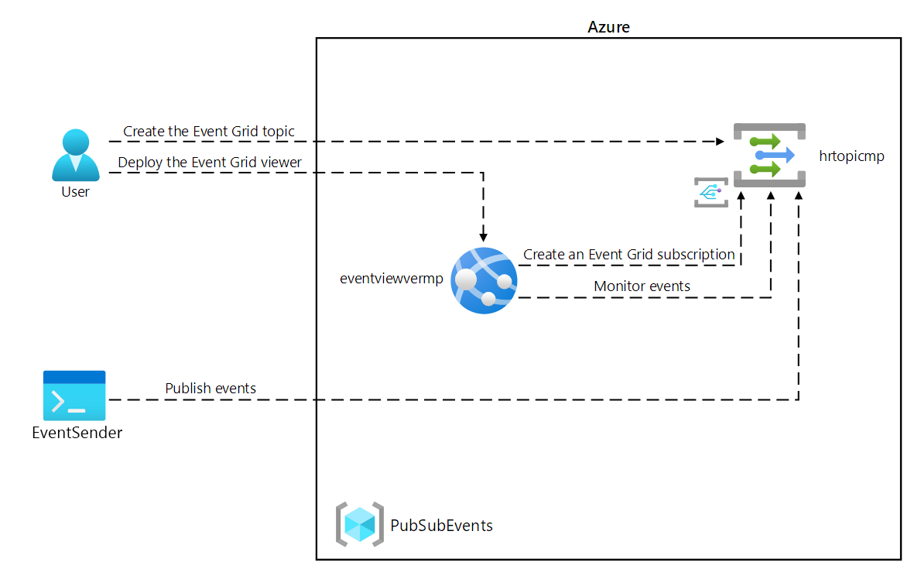

---
lab:
  az204Title: 'Lab 09: Publish and subscribe to Event Grid events'
  az204Module: 'Learning Path 09: Develop event-based solutions'
---

# Lab 09: Pubblicare e sottoscrivere eventi di Griglia di eventi

## Interfaccia utente di Microsoft Azure

Considerata la natura dinamica degli strumenti cloud di Microsoft, è possibile rilevare modifiche all'interfaccia utente di Azure apportate dopo lo sviluppo di questo contenuto per la formazione. È quindi possibile che le istruzioni e le procedure del lab non siano allineate correttamente.

Microsoft aggiorna questo corso di formazione quando la community segnala le modifiche necessarie. Poiché gli aggiornamenti cloud vengono apportati spesso, tuttavia, è possibile che si rilevino modifiche all'interfaccia utente prima degli aggiornamenti del contenuto per la formazione. **In questo caso, adattarsi alle modifiche e quindi eseguire le operazioni necessarie nei lab.**

## Istruzioni

### Prima di iniziare

#### Accedere all'ambiente lab

Accedere alla macchina virtuale Windows 10 usando le credenziali seguenti:

- Nome utente: `Admin`
- Password: `Pa55w.rd`

> **Nota**: il docente fornirà le istruzioni necessarie per la connessione all'ambiente lab virtuale.

#### Esaminare le applicazioni installate

Trovare la barra delle applicazioni nel desktop di Windows 10. La barra delle applicazioni include le icone per le applicazioni che verranno usate nel lab, tra cui:

- Microsoft Edge
- Microsoft Visual Studio Code

## Lab Scenario

In questo lab si inizierà con un'app Web proof-of-concept, ospitata in un contenitore, che verrà usata per sottoscrivere griglia di eventi. Questa app ti consentirà di inviare eventi e ricevere messaggi di conferma che gli eventi hanno avuto esito positivo.

## Diagramma dell'architettura



### Esercizio 1: Creare risorse di Azure

#### Attività 1: Aprire il portale di Azure

1. Sulla barra delle applicazioni selezionare l'icona di **Microsoft Edge**.

1. Nella finestra del browser aperta passare al portale di Azure in `https://portal.azure.com`e quindi accedere con l'account che verrà usato per questo lab.

    > **Nota**: se si sta eseguendo l'accesso al portale di Azure per la prima volta, verrà visualizzata una presentazione del portale. Selezionare **Attività iniziali** per ignorare la presentazione e iniziare a usare il portale.

#### Attività 2: Aprire Azure Cloud Shell

1. Nel portale di Azure selezionare l'icona di **Cloud Shell**  per aprire una nuova sessione di Bash. Se in Cloud Shell viene aperta per impostazione predefinita una sessione di PowerShell, selezionare **PowerShell** e nel menu a discesa selezionare **Bash**.

    > **Nota**: se è la prima volta che si avvia **Cloud Shell**, quando viene richiesto di selezionare **Bash** o **PowerShell** selezionare **Bash**. Quando viene visualizzato il messaggio **Non sono state montate risorse di archiviazione**, selezionare la sottoscrizione usata in questo lab, quindi selezionare **Crea risorsa di archiviazione**.

1. Nel portale di Azure, al prompt dei comandi di **Cloud Shell** eseguire il comando seguente per ottenere la versione dello strumento dell'interfaccia della riga di comando di Azure:

    ```bash
    az --version
    ```

#### Attività 3: Esaminare la registrazione del provider Microsoft.EventGrid

1. Nel **riquadro Cloud Shell** eseguire il comando seguente per verificare se il provider di risorse "Microsoft.EventGrid" è stato registrato:

    ```bash
    az provider show --namespace Microsoft.EventGrid --query "registrationState"
    ```

1. Si noti che il provider **Microsoft.EventGrid** è stato registrato.

1. Chiudere il riquadro **Cloud Shell**.

#### Attività 4: Creare un argomento di Griglia di eventi personalizzato

1. Nel riquadro di spostamento del portale di Azure selezionare **Crea una risorsa**.

1. Nel pannello **Crea una risorsa**, nella casella di testo **Cerca servizi e marketplace** immettere **Argomento di Griglia di eventi** e quindi premere INVIO.

1. Nel pannello dei risultati della ricerca **Marketplace** selezionare il risultato **Argomento di Griglia di eventi** e quindi selezionare **Crea**.

1. Nella scheda **Informazioni di base** del pannello **Crea argomento** eseguire le azioni seguenti e selezionare la scheda **Avanzate**:

    | Impostazione | Azione |
    | -- | -- |
    | Elenco a discesa **Sottoscrizione**  | Mantenere il valore predefinito |
    | Elenco a discesa **Gruppo di risorse** | Selezionare **Crea nuovo**, immettere **PubSubEvents** e quindi scegliere **OK** |
    | Casella di testo **Nome** | Immettere **hrtopic**_[nomeutente]_ |
    | Elenco a discesa **Area** | Selezionare **Stati Uniti orientali**. |

   Lo screenshot seguente mostra le impostazioni configurate nella scheda **Informazioni di base**.

   

1. Nell'elenco **a discesa Schema eventi della **scheda Avanzate** verificare che sia selezionata la **voce Schema**** griglia di eventi e quindi selezionare **Rivedi e crea**.

1. Nella scheda **Rivedi e crea** esaminare le opzioni selezionate durante i passaggi precedenti.

1. Selezionare **Crea** per creare l'argomento della griglia eventi usando la configurazione specificata.
  
    > **Nota**: attendere che Azure completi la creazione dell'argomento prima di continuare con il lab. Al termine della creazione dell'argomento si riceverà una notifica.

#### Attività 5: Distribuire il visualizzatore Griglia di eventi di Azure in un'app Web

1. Nel riquadro di spostamento del portale di Azure selezionare **Crea una risorsa**.

1. Nel pannello **Crea una risorsa**, nella casella di testo **Cerca servizi e marketplace**, immettere **App Web** e quindi premere INVIO.

1. Nel pannello dei risultati della ricerca **Marketplace** selezionare il risultato **App Web** e quindi selezionare **Crea**.

1. Nella scheda **Informazioni di base** del pannello **Crea app Web** eseguire le azioni seguenti e selezionare **Avanti: Docker**:

   | Impostazione | Azione |
   | -- | -- |
   | Elenco a discesa **Sottoscrizione** | Mantenere il valore predefinito |
   | Elenco a discesa **Gruppo di risorse** | Selezionare **PubSubEvents** nell'elenco |
   | Casella di testo **Nome**  | Immettere **eventviewer**_[nome]_ |
   | Sezione **Pubblica** | Selezionare **Contenitore Docker** |
   | Sezione **Sistema operativo** | Selezionare **Linux**. |
   | Elenco a discesa **Area** | Selezionare **Stati Uniti orientali**. |
   | Sezione **Piano Linux (Stati Uniti orientali)** | Selezionare **Crea nuovo**, immettere **EventPlan** nella casella di testo **Nome** e scegliere **OK** |
   | Sezione **Piano tariffario** | Mantenere il valore predefinito |

   Lo screenshot seguente mostra le impostazioni configurate nel pannello **Crea app Web**.

   

1. Nella scheda **Docker** eseguire le azioni seguenti e selezionare **Rivedi e crea**:

    | Impostazione | Azione |
    | -- | -- |
    | Elenco a discesa **Opzioni** | Selezionare **Contenitore singolo** |
    | Elenco a discesa **Origine immagine** | Selezionare **Docker Hub** |
    | Elenco a discesa **Tipo di accesso** | Selezionare **Pubblico** |
    | Casella di testo **Immagine e tag** | Immettere **microsoftlearning/azure-event-grid-viewer:latest** |

   Lo screenshot seguente mostra le impostazioni configurate nella scheda **Docker**.

   

1. Nella scheda **Rivedi e crea** esaminare le opzioni selezionate durante i passaggi precedenti.

1. Selezionare **Crea** per creare l'app Web usando la configurazione specificata.
  
    > **Nota**: attendere che Azure completi la creazione dell'app Web prima di continuare con il lab. Al termine della creazione dell'app si riceverà una notifica.

#### Revisione

In questo esercizio sono stati creati l'argomento di Griglia di eventi e un'app Web che verrà usata nel resto del lab.

### Esercizio 2: Creare una sottoscrizione di Griglia di eventi

#### Attività 1: Accedere all'applicazione Web visualizzatore Griglia di eventi

1. Nel riquadro di spostamento del portale di Azure selezionare **Gruppi di risorse**.

1. Nel pannello **Gruppi di risorse** selezionare il gruppo di risorse **PubSubEvents**.

1. Nel pannello PubSubEvents** selezionare l'app **Web eventviewer_**[nome]_, verrà visualizzata la **sezione Panoramica**.**

1. **Nella sezione Panoramica** registrare il valore del **dominio** predefinito nel riquadro Informazioni di base. Questo valore verrà utilizzato più avanti nel lab.

1. Fare clic sul **pulsante Sfoglia** mentre si è ancora nella **sezione Panoramica** .

1. Osservare l'applicazione Web **visualizzatore Griglia di eventi di Azure** attualmente in esecuzione. Lasciare l'applicazione Web in esecuzione per il resto del lab.

    > **Nota**: questa applicazione Web verrà aggiornata in tempo reale man mano che gli eventi vengono inviati all'endpoint. Si userà l'applicazione per monitorare gli eventi in tutto il lab.

1. Tornare alla finestra del browser attualmente aperta che visualizza il portale di Azure.

#### Attività 2: Creare una nuova sottoscrizione

1. Nel riquadro di spostamento del portale di Azure selezionare **Gruppi di risorse**.

1. Nel pannello **Gruppi di risorse** selezionare il gruppo di risorse **PubSubEvents** creato in precedenza in questo lab.

1. Nel pannello **PubSubEvents** selezionare l'argomento **hrtopic**_[nomeutente]_ di Griglia di eventi creato in precedenza in questo lab.

1. Nel pannello ** Argomento di Griglia di eventi** selezionare **+ Sottoscrizione di eventi.**

1. Nel pannello **Crea sottoscrizione di eventi** eseguire le azioni seguenti e selezionare **Crea**:

    | Impostazione | Azione |
    | -- | -- |
    | Casella di testo **Nome**  | Immettere **basicsub** |
    | Elenco a discesa **Schema evento** | Selezionare **Schema griglia di eventi** |
    | Elenco a discesa **Tipo di endpoint** | Selezionare **Webhook** |
    | **Endpoint** | Selezionare **Configura un endpoint**. Nella casella di testo **Endpoint sottoscrittore** immettere il valore di **URL dell'app Web** registrato in precedenza, assicurarsi che usi un prefisso **https://**, aggiungere il suffisso **/api/updates**e quindi selezionare **Conferma selezione**. Ad esempio, se il valore di **URL dell'app Web** è ``http://eventviewerstudent.azurewebsites.net/``, il valore di **Endpoint sottoscrittore** sarà ``https://eventviewerstudent.azurewebsites.net/api/updates`` |

   Lo screenshot seguente mostra le impostazioni configurate nel pannello **Crea sottoscrizione di eventi**.

   

    > **Nota**: attendere che Azure completi la creazione della sottoscrizione prima di continuare con il lab. Al termine della creazione della sottoscrizione si riceverà una notifica.

#### Attività 3: Osservare l'evento di convalida della sottoscrizione

1. Tornare alla finestra del browser che mostra l'app Web **visualizzatore di Griglia di eventi di Azure**.

1. Esaminare l'evento **Microsoft.EventGrid.SubscriptionValidationEvent** creato nell'ambito del processo di creazione della sottoscrizione.

1. Selezionare l'evento ed esaminarne il contenuto JSON.

1. Tornare alla finestra del browser attualmente aperta con il portale di Azure.

#### Attività 4: Registrare le credenziali della sottoscrizione

1. Nel riquadro di spostamento del portale di Azure selezionare **Gruppi di risorse**.

1. Nel pannello **Gruppi di risorse** selezionare il gruppo di risorse **PubSubEvents** creato in precedenza in questo lab.

1. Nel pannello **PubSubEvents** selezionare l'argomento **hrtopic**_[nomeutente]_ di Griglia di eventi creato in precedenza in questo lab.

1. Nel pannello **Argomento di Griglia di eventi** registrare il valore del campo **Endpoint argomento**. Questo valore verrà utilizzato più avanti nel lab.

1. Nella categoria **Impostazioni** selezionare il collegamento **Chiavi di accesso**.

1. Nella sezione **Chiavi di accesso** registrare il valore della casella di testo **Chiave 1**. Questo valore verrà utilizzato più avanti nel lab.

#### Revisione

In questo esercizio è stata creata una nuova sottoscrizione, ne è stata convalidata la registrazione e quindi sono state registrate le credenziali necessarie per pubblicare un nuovo evento nell'argomento.

### Esercizio 3: Pubblicare eventi di Griglia di eventi da .NET

#### Attività 1: Creare un progetto .NET

1. Nella schermata **Start** selezionare il riquadro **Visual Studio Code**.

1. Nel menu **File** selezionare **Apri cartella**.

1. Nella finestra **Esplora file** visualizzata passare a **Allfiles (F):\\Allfiles\\Labs\\09\\Starter\\EventPublisher** e quindi selezionare **Seleziona cartella**.

1. Nella barra dei menu superiore nella finestra di **Visual Studio Code** passare al menu **Terminale** e selezionare **Nuovo terminale**.

1. Al prompt del terminale eseguire il comando seguente per creare un nuovo progetto .NET denominato **EventPublisher** nella cartella corrente:

    ```powershell
    dotnet new console --framework net8.0 --name EventPublisher --output . 
    ```

    > **Nota**: il comando **dotnet new** creerà un nuovo progetto **console** in una cartella con lo stesso nome del progetto.

1. Eseguire il comando seguente per importare la versione 4.11.0 di **Azure.Messaging.EventGrid** da NuGet:

    ```powershell
    dotnet add package Azure.Messaging.EventGrid --version 4.11.0
    ```
    

    > **Nota**: il comando **dotnet add package** aggiungerà il pacchetto **Microsoft.Azure.EventGrid** da NuGet. Per altre informazioni, passare a [Microsoft.Azure.EventGrid](https://www.nuget.org/packages/Azure.Messaging.EventGrid/4.11.0).


1. Eseguire il comando seguente per compilare l'applicazione Web .NET:

    ```powershell
    dotnet build
    ```

1. Selezionare **Termina il terminale** o l'icona del **Cestino** per chiudere il terminale aperto e tutti i processi associati.

#### Attività 2: Modificare la classe Program in modo da connettersi a Griglia di eventi

1. Nel riquadro **Esplora risorse**  della finestra di **Visual Studio Code** aprire il file **Program.cs**.

1. Nella scheda dell'editor di codice per il file  **Program.cs** eliminare tutto il codice nel file esistente.
  
1. Aggiungere il codice seguente:

    ```csharp
    using Azure;
    using Azure.Messaging.EventGrid;
    using System;
    using System.Threading.Tasks;    
    public class Program
    {
        private const string topicEndpoint = "<topic-endpoint>";
        /* Update the topicEndpoint string constant by setting its value to the Topic
           Endpoint of the Event Grid topic that you recorded previously in this lab. */
        private const string topicKey = "<topic-key>";   
        /* Update the topicKey string constant by setting its value to the Key of the Event Grid topic that you recorded previously in this lab. */     
        public static async Task Main(string[] args)
        {
            //Add Main code here
        }
    }
    ```
1. Nella riga 7 sostituire il `<topic-endpoint>` segnaposto con il valore dell'endpoint dell'argomento griglia di eventi registrato in precedenza in questo lab.

1. Nella riga 10 sostituire il `<topic-key>` segnaposto con il valore della chiave di accesso dell'argomento di Griglia di eventi registrata in precedenza in questo lab.

#### Attività 3: Pubblicare nuovi eventi

1. Aggiungere il codice seguente nel **metodo Main** del **file Program.cs** :
   
    ```csharp
    public static async Task Main(string[] args)
    {   
        /* To create a new variable named "endpoint" of type "Uri", 
           using the "topicEndpoint" string constant as a constructor parameter */
        Uri endpoint = new Uri(topicEndpoint);

        /* To create a new variable named "credential" of type "AzureKeyCredential",
           use the "topicKey" string constant as a constructor parameter. */
        AzureKeyCredential credential = new AzureKeyCredential(topicKey);

        /* To create a new variable named "client" of type "EventGridPublisherClient", 
           using the "endpoint" and "credential" variables as constructor parameters */
        EventGridPublisherClient client = new EventGridPublisherClient(endpoint, credential);

        /* To create a new variable named "firstEvent" of type "EventGridEvent",
           and populate that variable with sample data */        
        EventGridEvent firstEvent = new EventGridEvent(
            subject: $"New Employee: Alba Sutton",
            eventType: "Employees.Registration.New",
            dataVersion: "1.0",
            data: new
            {
                FullName = "Alba Sutton",
                Address = "4567 Pine Avenue, Edison, WA 97202"
            }
        );

        /* To create a new variable named "secondEvent" of type "EventGridEvent",
           and populate that variable with sample data */
        EventGridEvent secondEvent = new EventGridEvent(
            subject: $"New Employee: Alexandre Doyon",
            eventType: "Employees.Registration.New",
            dataVersion: "1.0",
            data: new
            {
                FullName = "Alexandre Doyon",
                Address = "456 College Street, Bow, WA 98107"
            }
        );

        /* To asynchronously invoke the "EventGridPublisherClient.SendEventAsync"
           method using the "firstEvent" variable as a parameter */
        await client.SendEventAsync(firstEvent);
        Console.WriteLine("First event published");

        /* To asynchronously invoke the "EventGridPublisherClient.SendEventAsync"
           method using the "secondEvent" variable as a parameter */
        await client.SendEventAsync(secondEvent);
        Console.WriteLine("Second event published");
    }
    ```
    > **Nota**: per altre informazioni su **[AzureKeyCredential](https://docs.microsoft.com/dotnet/api/azure.azurekeycredential)**
  
    > **Nota**: per altre informazioni su Griglia di eventi, fare clic sui collegamenti seguenti: 
    - **[EventGridPublisherClient](https://learn.microsoft.com/dotnet/api/azure.messaging.eventgrid.eventgridpublisherclient)**
    
    - **[EventGridEvent](https://learn.microsoft.com/dotnet/api/azure.messaging.eventgrid.eventgridevent)**

    - **[EventGridPublisherClient.SendEventAsync](https://learn.microsoft.com/dotnet/api/azure.messaging.eventgrid.eventgridpublisherclient.sendeventasync)**


1. Salvare il file **Program.cs** .

1. Nella finestra di **Visual Studio Code**, nella barra dei menu, selezionare **Terminale** e quindi **Nuovo terminale**.

1. Eseguire il comando seguente per eseguire l'applicazione Web .NET:

    ```powershell
    dotnet run
    ```

    > **Nota**: se si verificano errori di compilazione, esaminare il file **Program.cs** nella cartella **Allfiles (F):\\Allfiles\\Labs\\09\\Solution\\EventPublisher**.

1. Osservare l'output del messaggio di esito positivo dell'applicazione console attualmente in esecuzione.

1. Selezionare **Termina il terminale** o l'icona del **Cestino** per chiudere il terminale aperto e tutti i processi associati.

#### Attività 4: Osservare gli eventi pubblicati

1. Tornare alla finestra del browser con l'app Web **visualizzatore di Griglia di eventi di Azure**.

1. Esaminare gli eventi **Employees.Registration.New** creati dall'applicazione console.

1. Selezionare uno degli eventi ed esaminarne il contenuto JSON.

1. Tornare al portale di Azure.

#### Revisione

In questo esercizio sono stati pubblicati nuovi eventi nell'argomento di Griglia di eventi usando un'applicazione console .NET.
