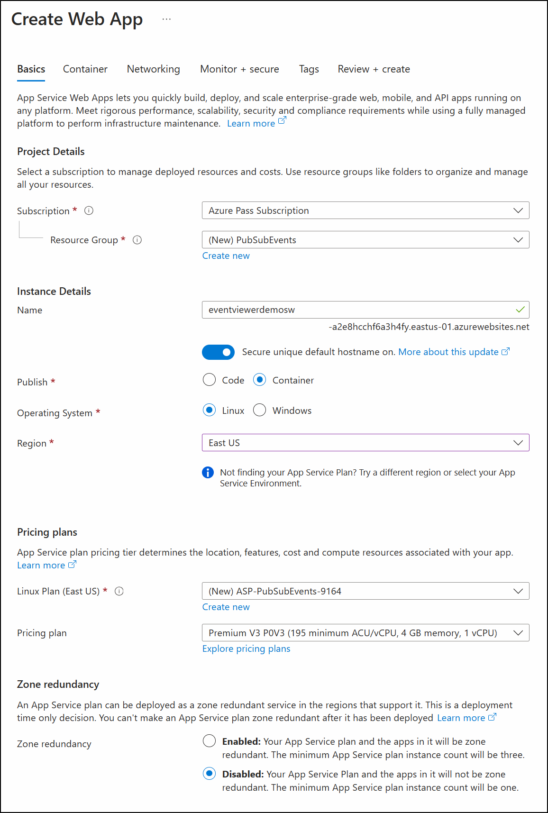

---
lab:
  az204Title: 'Lab 09: Publish and subscribe to Event Grid events'
  az020Title: 'Lab 09: Publish and subscribe to Event Grid events'
  az204Module: 'Module 09: Develop event-based solutions'
  az020Module: 'Module 09: Develop event-based solutions'
ms.openlocfilehash: 2b8fca1499b7f404ae7f95401a898caf55881bd9
ms.sourcegitcommit: 71681d2734c5590e91fdac8529669b3606953a3f
ms.translationtype: HT
ms.contentlocale: it-IT
ms.lasthandoff: 03/01/2022
ms.locfileid: "139251587"
---
# <a name="lab-09-publish-and-subscribe-to-event-grid-events"></a>Lab 09: Pubblicare e sottoscrivere eventi di Griglia di eventi

## <a name="microsoft-azure-user-interface"></a>Interfaccia utente di Microsoft Azure

Considerata la natura dinamica degli strumenti cloud di Microsoft, è possibile rilevare modifiche all'interfaccia utente di Azure apportate dopo lo sviluppo di questo contenuto per la formazione. È quindi possibile che le istruzioni e le procedure del lab non siano allineate correttamente.

Microsoft aggiorna questo corso di formazione quando la community segnala le modifiche necessarie. Poiché gli aggiornamenti cloud vengono apportati spesso, tuttavia, è possibile che si rilevino modifiche all'interfaccia utente prima degli aggiornamenti del contenuto per la formazione. **In questo caso, adattarsi alle modifiche e quindi eseguire le operazioni necessarie nei lab.**

## <a name="instructions"></a>Istruzioni

### <a name="before-you-start"></a>Prima di iniziare

#### <a name="sign-in-to-the-lab-environment"></a>Accedere all'ambiente lab

Accedere alla macchina virtuale Windows 10 usando le credenziali seguenti:

- Nome utente: **Admin**

- Password: **Pa55w.rd**

> **Nota**: il docente fornirà le istruzioni necessarie per la connessione all'ambiente lab virtuale.

#### <a name="review-the-installed-applications"></a>Esaminare le applicazioni installate

Trovare la barra delle applicazioni nel desktop di Windows 10. La barra delle applicazioni include le icone per le applicazioni che verranno usate nel lab, tra cui:

- Microsoft Edge

- Microsoft Visual Studio Code

## <a name="architecture-diagram"></a>Diagramma dell'architettura


### <a name="exercise-1-create-azure-resources"></a>Esercizio 1: Creare risorse di Azure

#### <a name="task-1-open-the-azure-portal"></a>Attività 1: Aprire il portale di Azure

1. Sulla barra delle applicazioni selezionare l'icona di **Microsoft Edge**.

1. Nella finestra aperta del browser passare al portale di Azure (<https://portal.azure.com>) e quindi accedere con l'account che verrà usato per questo lab.

    > **Nota**: se si sta eseguendo l'accesso al portale di Azure per la prima volta, verrà visualizzata una presentazione del portale. Selezionare **Attività iniziali** per ignorare la presentazione e iniziare a usare il portale.

#### <a name="task-2-open-azure-cloud-shell"></a>Attività 2: Aprire Azure Cloud Shell

1. Nel portale di Azure selezionare l'icona di **Cloud Shell**  per aprire una nuova sessione di Bash. Se in Cloud Shell viene aperta per impostazione predefinita una sessione di PowerShell, selezionare **PowerShell** e nel menu a discesa selezionare **Bash**.

    > **Nota**: se è la prima volta che si avvia **Cloud Shell**, quando viene richiesto di selezionare **Bash** o **PowerShell** selezionare **Bash**. Quando viene visualizzato il messaggio **Non sono state montate risorse di archiviazione**, selezionare la sottoscrizione usata in questo lab, quindi selezionare **Crea risorsa di archiviazione**.

1. Nel portale di Azure, al prompt dei comandi di **Cloud Shell** eseguire il comando seguente per ottenere la versione dello strumento dell'interfaccia della riga di comando di Azure:

    ```bash
    az --version
    ```

#### <a name="task-3-review-the-microsofteventgrid-provider-registration"></a>Attività 3: Esaminare la registrazione del provider Microsoft.EventGrid

1. Nel **riquadro Cloud Shell** eseguire il comando seguente per ottenere un elenco di sottogruppi e comandi a livello di radice dell'interfaccia della riga di comando di Azure:

```bash
az --help
```

1. Nel **riquadro Cloud Shell** eseguire il comando seguente per ottenere un elenco dei comandi disponibili per i provider di risorse:

```bash
az provider --help
```

1. Nel **riquadro Cloud Shell** eseguire il comando seguente per elencare tutti i provider attualmente registrati:

```bash
az provider list
```

1. Nel **riquadro Cloud Shell** eseguire il comando seguente per elencare solo gli spazi dei nomi dei provider attualmente registrati:

```bash
az provider list --query "[].namespace"
```

1. Nel **riquadro Cloud Shell** esaminare l'elenco di provider attualmente registrati. Si noti che il provider **Microsoft.EventGrid** è attualmente incluso nell'elenco dei provider.

1. Chiudere il riquadro **Cloud Shell**.

#### <a name="task-4-create-a-custom-event-grid-topic"></a>Attività 4: Creare un argomento di Griglia di eventi personalizzato

1. Nel riquadro di spostamento del portale di Azure selezionare **Crea una risorsa**.

1. Nel pannello **Crea una risorsa**, nella casella di testo **Cerca servizi e marketplace** immettere **Argomento di Griglia di eventi** e quindi premere INVIO.

1. Nel pannello dei risultati della ricerca **Marketplace** selezionare il risultato **Argomento di Griglia di eventi** e quindi selezionare **Crea**.

1. Nella scheda **Informazioni di base** del pannello **Crea argomento** eseguire le azioni seguenti e selezionare la scheda **Avanzate**:

    | Impostazione                           | Azione                                                       |
    | --------------------------------- | ------------------------------------------------------------ |
    | Elenco a discesa **Sottoscrizione**   | Mantenere il valore predefinito.                                    |
    | Elenco a discesa **Gruppo di risorse** | Selezionare **Crea nuovo**, immettere **PubSubEvents** e quindi scegliere **OK**. |
    | Casella di testo **Nome**                 | Immettere **hrtopic** _[nomeutente]_ .                               |
    | Elenco a discesa **Area**         | Selezionare **Stati Uniti orientali**.                                          |

   Lo screenshot seguente mostra le impostazioni configurate nella scheda **Informazioni di base**.

   

1. Nell'elenco a discesa **Schema evento** della scheda **Avanzate** selezionare **Schema griglia di eventi** e quindi **Rivedi e crea**.

1. Nella scheda **Rivedi e crea** esaminare le opzioni selezionate durante i passaggi precedenti.

1. Selezionare **Crea** per creare l'argomento della griglia eventi usando la configurazione specificata.
  
    > **Nota**: attendere che Azure completi la creazione dell'argomento prima di continuare con il lab. Al termine della creazione dell'argomento si riceverà una notifica.

#### <a name="task-5-deploy-the-azure-event-grid-viewer-to-a-web-app"></a>Attività 5: Distribuire il visualizzatore Griglia di eventi di Azure in un'app Web

1. Nel riquadro di spostamento del portale di Azure selezionare **Crea una risorsa**.

1. Nel pannello **Crea una risorsa**, nella casella di testo **Cerca servizi e marketplace**, immettere **App Web** e quindi premere INVIO.

1. Nel pannello dei risultati della ricerca **Marketplace** selezionare il risultato **App Web** e quindi selezionare **Crea**.

1. Nella scheda **Informazioni di base** del pannello **Crea app Web** eseguire le azioni seguenti e selezionare **Avanti: Docker**:

   | Impostazione                           | Azione                                                       |
   | --------------------------------- | ------------------------------------------------------------ |
   | Elenco a discesa **Sottoscrizione**   | Mantenere il valore predefinito.                                    |
   | Elenco a discesa **Gruppo di risorse** | Selezionare **PubSubEvents** nell'elenco.                         |
   | Casella di testo **Nome**                 | Immettere **eventviewer** _[nome]_ .                           |
   | Sezione **Pubblica**               | Selezionare **Contenitore Docker**.                                 |
   | Sezione **Sistema operativo**      | Selezionare **Linux**.                                            |
   | Elenco a discesa **Area**         | Selezionare **Stati Uniti orientali**.                                          |
   | Sezione **Piano Linux (Stati Uniti orientali)**  | Selezionare **Crea nuovo**, nella casella di testo **Nome** immettere **EventPlan** e scegliere **OK**. |
   | Sezione **SKU e dimensioni**          | Mantenere il valore predefinito.                                    |

   Lo screenshot seguente mostra le impostazioni configurate nel pannello **Crea app Web**.

   

1. Nella scheda **Docker** eseguire le azioni seguenti e selezionare **Rivedi e crea**:

    | Impostazione                         | Azione                                                      |
    | ------------------------------- | ----------------------------------------------------------- |
    | Elenco a discesa **Opzioni**      | Selezionare **Contenitore singolo**.                                |
    | Elenco a discesa **Origine immagine** | Selezionare **Docker Hub**.                                      |
    | Elenco a discesa **Tipo di accesso**  | Selezionare **Pubblica**.                                          |
    | Casella di testo **Immagine e tag**      | Immettere **microsoftlearning/azure-event-grid-viewer:latest**. |

   Lo screenshot seguente mostra le impostazioni configurate nella scheda **Docker**.

   

1. Nella scheda **Rivedi e crea** esaminare le opzioni selezionate durante i passaggi precedenti.

1. Selezionare **Crea** per creare l'app Web usando la configurazione specificata.
  
    > **Nota**: attendere che Azure completi la creazione dell'app Web prima di continuare con il lab. Al termine della creazione dell'app si riceverà una notifica.

#### <a name="review"></a>Verifica

In questo esercizio sono stati creati l'argomento di Griglia di eventi e un'app Web che verrà usata nel resto del lab.

### <a name="exercise-2-create-an-event-grid-subscription"></a>Esercizio 2: Creare una sottoscrizione di Griglia di eventi

#### <a name="task-1-access-the-event-grid-viewer-web-application"></a>Attività 1: Accedere all'applicazione Web visualizzatore Griglia di eventi

1. Nel riquadro di spostamento del portale di Azure selezionare **Gruppi di risorse**.

1. Nel pannello **Gruppi di risorse** selezionare il gruppo di risorse **PubSubEvents**.

1. Nel pannello **PubSubEvents** selezionare l'app Web **eventviewer** _[nomeutente]._

1. Nel pannello **Servizio app**, nella categoria **Impostazioni**, selezionare il collegamento **Proprietà**.

1. Nella sezione **Proprietà** registrare il valore del collegamento **URL**. Questo valore verrà utilizzato più avanti nel lab.

1. Selezionare **Panoramica** e quindi **Sfoglia**.

1. Osservare l'applicazione Web **visualizzatore Griglia di eventi di Azure** attualmente in esecuzione. Lasciare l'applicazione Web in esecuzione per il resto del lab.

    > **Nota**: questa applicazione Web verrà aggiornata in tempo reale man mano che gli eventi vengono inviati all'endpoint. Si userà l'applicazione per monitorare gli eventi in tutto il lab.

1. Tornare alla finestra del browser attualmente aperta che visualizza il portale di Azure.

#### <a name="task-2-create-a-new-subscription"></a>Attività 2: Creare una nuova sottoscrizione

1. Nel riquadro di spostamento del portale di Azure selezionare **Gruppi di risorse**.

1. Nel pannello **Gruppi di risorse** selezionare il gruppo di risorse **PubSubEvents** creato in precedenza in questo lab.

1. Nel pannello **PubSubEvents** selezionare l'argomento **hrtopic** _[nomeutente]_ di Griglia di eventi creato in precedenza in questo lab.

1. Nel pannello  **Argomento di Griglia di eventi** selezionare **+ Sottoscrizione di eventi.**

1. Nel pannello **Crea sottoscrizione di eventi** eseguire le azioni seguenti e selezionare **Crea**:

    | Impostazione                          | Azione                                                       |
    | -------------------------------- | ------------------------------------------------------------ |
    | Casella di testo **Nome**                | Immettere **basicsub**.                                          |
    | Elenco a discesa **Schema evento**  | Selezionare **Schema griglia di eventi**.                                |
    | Elenco a discesa **Tipo di endpoint** | Selezionare **Webhook**.                                         |
    | **Endpoint**                     | Selezionare **Seleziona endpoint**. Nella casella di testo **Endpoint sottoscrittore** immettere il valore **URL dell'app Web** registrato in precedenza, assicurarsi che usi un prefisso **https://** , aggiungere il suffisso **/api/updates** e quindi selezionare **Conferma selezione**. Ad esempio, se il valore **URL dell'app Web** è ``http://eventviewerstudent.azurewebsites.net/``, l'**Endpoint sottoscrittore** sarà ``https://eventviewerstudent.azurewebsites.net/api/updates``. |

   Lo screenshot seguente mostra le impostazioni configurate nel pannello **Crea sottoscrizione di eventi**.

   

    > **Nota**: attendere che Azure completi la creazione della sottoscrizione prima di continuare con il lab. Al termine della creazione della sottoscrizione si riceverà una notifica.

#### <a name="task-3-observe-the-subscription-validation-event"></a>Attività 3: Osservare l'evento di convalida della sottoscrizione

1. Tornare alla finestra del browser che mostra l'app Web **visualizzatore di Griglia di eventi di Azure**.

1. Esaminare l'evento **Microsoft.EventGrid.SubscriptionValidationEvent** creato nell'ambito del processo di creazione della sottoscrizione.

1. Selezionare l'evento ed esaminarne il contenuto JSON.

1. Tornare alla finestra del browser attualmente aperta con il portale di Azure.

#### <a name="task-4-record-subscription-credentials"></a>Attività 4: Registrare le credenziali della sottoscrizione

1. Nel riquadro di spostamento del portale di Azure selezionare **Gruppi di risorse**.

1. Nel pannello **Gruppi di risorse** selezionare il gruppo di risorse **PubSubEvents** creato in precedenza in questo lab.

1. Nel pannello **PubSubEvents** selezionare l'argomento **hrtopic** _[nomeutente]_ di Griglia di eventi creato in precedenza in questo lab.

1. Nel pannello **Argomento di Griglia di eventi** registrare il valore del campo **Endpoint argomento**. Questo valore verrà utilizzato più avanti nel lab.

1. Nella categoria **Impostazioni** selezionare il collegamento **Chiavi di accesso**.

1. Nella sezione **Chiavi di accesso** registrare il valore della casella di testo **Chiave 1**. Questo valore verrà utilizzato più avanti nel lab.

#### <a name="review"></a>Verifica

In questo esercizio è stata creata una nuova sottoscrizione, ne è stata convalidata la registrazione e quindi sono state registrate le credenziali necessarie per pubblicare un nuovo evento nell'argomento.

### <a name="exercise-3-publish-event-grid-events-from-net"></a>Esercizio 3: Pubblicare eventi di Griglia di eventi da .NET

#### <a name="task-1-create-a-net-project"></a>Attività 1: Creare un progetto .NET

1. Nella schermata **Start** selezionare il riquadro **Visual Studio Code**.

1. Nel menu **File** selezionare **Apri cartella**.

1. Nella finestra **Esplora file** visualizzata passare a **Allfiles (F):\\Allfiles\\Labs\\09\\Starter\\EventPublisher** e quindi selezionare **Seleziona cartella**.

1. Nella finestra di **Visual Studio Code** attivare il menu di scelta rapida per il riquadro **Esplora risorse** e quindi selezionare **Apri nel terminale integrato**.

1. Al prompt del terminale eseguire il comando seguente per creare un nuovo progetto .NET denominato **EventPublisher** nella cartella corrente:

    ```powershell
    dotnet new console --name EventPublisher --output .
    ```

    > **Nota**: il comando **dotnet new** creerà un nuovo progetto **console** in una cartella con lo stesso nome del progetto.

1. Eseguire il comando seguente per importare la versione 4.1.0 di **Azure.Messaging.EventGrid** da NuGet:

    ```powershell
    dotnet add package Azure.Messaging.EventGrid --version 4.1.0
    ```

    > **Nota**: il comando **dotnet add package** aggiungerà il pacchetto **Microsoft.Azure.EventGrid** da NuGet. Per altre informazioni, passare a [Microsoft.Azure.EventGrid](https://www.nuget.org/packages/Azure.Messaging.EventGrid/4.1.0).

1. Eseguire il comando seguente per compilare l'applicazione Web .NET:

    ```powershell
    dotnet build
    ```

1. Selezionare **Termina il terminale** o l'icona del **Cestino** per chiudere il terminale aperto e tutti i processi associati.

#### <a name="task-2-modify-the-program-class-to-connect-to-event-grid"></a>Attività 2: Modificare la classe Program in modo da connettersi a Griglia di eventi

1. Nel riquadro **Esplora risorse** della finestra di **Visual Studio Code** aprire il file **Program.cs**.

1. Nella scheda dell'editor di codice per il file **Program.cs** eliminare tutto il codice nel file esistente.

1. Aggiungere la riga di codice seguente per importare gli spazi dei nomi **Azure** e **Azure.Messaging.EventGrid** dal pacchetto **Azure.Messaging.EventGrid** importato da NuGet:

    ```csharp
    using Azure;
    using Azure.Messaging.EventGrid;
    ```

1. Aggiungere le righe di codice seguenti per aggiungere direttive **using** per gli spazi dei nomi predefiniti che verranno usati in questo file:

    ```csharp
    using System;
    using System.Threading.Tasks;
    ```

1. Immettere il codice seguente per creare una nuova classe **Program**:

    ```csharp
    public class Program
    {
    }
    ```

1. Nella classe **Program** immettere la riga di codice seguente per creare una nuova costante di tipo stringa denominata **topicEndpoint**:

    ```csharp
    private const string topicEndpoint = "";
    ```

1. Aggiornare la costante stringa **topicEndpoint** impostandone il valore sull'**Endpoint argomento** dell'argomento di Griglia di eventi registrato in precedenza in questo lab.

1. Nella classe **Program** immettere la riga di codice seguente per creare una nuova costante stringa denominata **topicKey**:

    ```csharp
    private const string topicKey = "";
    ```

1. Aggiornare la costante stringa **topicKey** impostandone il valore su quello della **Chiave** dell'argomento di Griglia di eventi registrato in precedenza in questo lab.

1. Nella classe **Program** immettere il codice seguente per creare un nuovo metodo **Main** asincrono:

    ```csharp
    public static async Task Main(string[] args)
    {
    }
    ```

1. Osservare il file **Program.cs,** che ora dovrebbe includere le righe di codice seguenti:

    ```csharp
    using System;
    using System.Threading.Tasks;
    using Azure;
    using Azure.Messaging.EventGrid;
    
    public class Program
    {
        private const string topicEndpoint = "<topic-endpoint>";
        private const string topicKey = "<topic-key>";
        
        public static async Task Main(string[] args)
        {
        }
    }
    ```

#### <a name="task-3-publish-new-events"></a>Attività 3: Pubblicare nuovi eventi

1. Nel metodo **Main** eseguire le azioni seguenti per pubblicare un elenco di eventi nell'endpoint dell'argomento:

    a. Aggiungere la riga di codice seguente per creare una nuova variabile denominata **endpoint** di tipo **Uri**, usando la costante stringa **topicEndpoint** come parametro del costruttore:

    ```csharp
    Uri endpoint = new Uri(topicEndpoint); 
    ```

    b. Aggiungere la riga di codice seguente per creare una nuova variabile denominata **credential** di tipo **[AzureKeyCredential](https://docs.microsoft.com/dotnet/api/azure.azurekeycredential)** , usando la costante stringa **topicKey** come parametro del costruttore:

    ```csharp
    AzureKeyCredential credential = new AzureKeyCredential(topicKey);
    ```

    c. Aggiungere la riga di codice seguente per creare una nuova variabile denominata **client** di tipo **[EventGridPublisherClient](https://docs.microsoft.com/dotnet/api/azure.messaging.eventgrid.eventgridpublisherclient)** , usando le variabili **endpoint** e **credential** come parametri del costruttore:

    ```csharp
    EventGridPublisherClient client = new EventGridPublisherClient(endpoint, credential);
    ```

    d. Aggiungere il blocco di codice seguente per creare una nuova variabile di tipo **[EventGridEvent](https://docs.microsoft.com/dotnet/api/azure.messaging.eventgrid.eventgridevent)** denominata **firstEvent** e popolarla con dati di esempio:

    ```csharp
    EventGridEvent firstEvent = new EventGridEvent(
        subject: $"New Employee: Alba Sutton",
        eventType: "Employees.Registration.New",
        dataVersion: "1.0",
        data: new
        {
            FullName = "Alba Sutton",
            Address = "4567 Pine Avenue, Edison, WA 97202"
         }
     );
     ```

    e. Aggiungere il blocco di codice seguente per creare una nuova variabile di tipo **[EventGridEvent](https://docs.microsoft.com/dotnet/api/azure.messaging.eventgrid.eventgridevent)** denominata **secondEvent** e popolarla con dati di esempio:

     ```csharp
        EventGridEvent secondEvent = new EventGridEvent(
            subject: $"New Employee: Alexandre Doyon",
            eventType: "Employees.Registration.New",
            dataVersion: "1.0",
            data: new
            {
                FullName = "Alexandre Doyon",
                Address = "456 College Street, Bow, WA 98107"
            }
        );
     ```

    f. Aggiungere la riga di codice seguente per richiamare in modo asincrono il metodo **[EventGridPublisherClient.SendEventAsync](https://docs.microsoft.com/dotnet/api/azure.messaging.eventgrid.eventgridpublisherclient.sendeventasync)** usando la variabile **firstEvent** come parametro:

     ```csharp
     await client.SendEventAsync(firstEvent);
     ```

    g. Aggiungere la riga di codice seguente per eseguire il rendering del messaggio **"First event published"** nella console:

     ```csharp
     Console.WriteLine("First event published");
     ```

    h. Aggiungere la riga di codice seguente per richiamare in modo asincrono il metodo **[EventGridPublisherClient.SendEventAsync](https://docs.microsoft.com/dotnet/api/azure.messaging.eventgrid.eventgridpublisherclient.sendeventasync)** usando la variabile **secondEvent** come parametro:

     ```csharp
     await client.SendEventAsync(secondEvent);
     ```

    i. Aggiungere la riga di codice seguente per eseguire il rendering **del messaggio "Secondo** evento pubblicato" nella console:

     ```csharp
     Console.WriteLine("Second event published");
     ```

1. Esaminare il metodo **Main**, che ora dovrebbe includere:

    ```csharp
    public static async Task Main(string[] args)
    {
        Uri endpoint = new Uri(topicEndpoint);
        AzureKeyCredential credential = new AzureKeyCredential(topicKey);
        EventGridPublisherClient client = new EventGridPublisherClient(endpoint, credential);
        
        EventGridEvent firstEvent = new EventGridEvent(
            subject: $"New Employee: Alba Sutton",
            eventType: "Employees.Registration.New",
            dataVersion: "1.0",
            data: new
            {
                FullName = "Alba Sutton",
                Address = "4567 Pine Avenue, Edison, WA 97202"
            }
        );

        EventGridEvent secondEvent = new EventGridEvent(
            subject: $"New Employee: Alexandre Doyon",
            eventType: "Employees.Registration.New",
            dataVersion: "1.0",
            data: new
            {
                FullName = "Alexandre Doyon",
                Address = "456 College Street, Bow, WA 98107"
            }
        );

        await client.SendEventAsync(firstEvent);
        Console.WriteLine("First event published");

        await client.SendEventAsync(secondEvent);
        Console.WriteLine("Second event published");
    }
    ```

1. Salvare il file **Program.cs**.

1. Nella finestra di **Visual Studio Code** attivare il menu di scelta rapida per il riquadro **Esplora risorse** e quindi selezionare **Apri nel terminale integrato**.

1. Eseguire il comando seguente per eseguire l'applicazione Web .NET:

    ```powershell
    dotnet run
    ```

    > **Nota**: se si verificano errori di compilazione, esaminare il file **Program.cs** nella cartella **Allfiles (F):\\Allfiles\\Labs\\09\\Solution\\EventPublisher**.

1. Osservare l'output del messaggio di esito positivo dell'applicazione console attualmente in esecuzione.

1. Selezionare **Termina il terminale** o l'icona del **Cestino** per chiudere il terminale aperto e tutti i processi associati.

#### <a name="task-4-observe-published-events"></a>Attività 4: Osservare gli eventi pubblicati

1. Tornare alla finestra del browser con l'app Web **visualizzatore di Griglia di eventi di Azure**.

1. Esaminare gli eventi **Employees.Registration.New** creati dall'applicazione console.

1. Selezionare uno degli eventi ed esaminarne il contenuto JSON.

1. Tornare al portale di Azure.

#### <a name="review"></a>Verifica

In questo esercizio sono stati pubblicati nuovi eventi nell'argomento di Griglia di eventi usando un'applicazione console .NET.

### <a name="exercise-4-clean-up-your-subscription"></a>Esercizio 4: Pulire la sottoscrizione

#### <a name="task-1-open-azure-cloud-shell"></a>Attività 1: Aprire Azure Cloud Shell

1. Nel portale di Azure selezionare l'icona di **Cloud Shell**  per aprire una nuova sessione di Bash. Se in Cloud Shell viene aperta per impostazione predefinita una sessione di PowerShell, selezionare **PowerShell** e nel menu a discesa selezionare **Bash**.

    > **Nota**: se è la prima volta che si avvia **Cloud Shell**, quando viene richiesto di selezionare **Bash** o **PowerShell** selezionare **PowerShell**. Quando viene visualizzato il messaggio **Non sono state montate risorse di archiviazione**, selezionare la sottoscrizione usata in questo lab e selezionare **Crea risorsa di archiviazione**.

#### <a name="task-2-delete-a-resource-group"></a>Attività 2: Eliminare un gruppo di risorse

1. Nel riquadro **Cloud Shell** eseguire il comando seguente per eliminare il gruppo di risorse **PubSubEvents**:

    ```bash
    az group delete --name PubSubEvents --no-wait --yes
    ```

     > **Nota**: il comando viene eseguito in modo asincrono, in base a quanto determinato dal parametro *--no-wait*, quindi, sebbene sia possibile eseguire un altro comando dell'interfaccia della riga di comando di Azure immediatamente dopo nella stessa sessione di Bash, il gruppo di risorse verrà effettivamente rimosso dopo alcuni minuti.

1. Chiudere il riquadro **Cloud Shell** nel portale.

#### <a name="task-3-close-the-active-applications"></a>Attività 3: Chiudere le applicazioni attive

1. Chiudere l'applicazione Microsoft Edge in esecuzione.

1. Chiudere l'applicazione Visual Studio Code in esecuzione.

#### <a name="review"></a>Verifica

In questo esercizio è stata pulita la sottoscrizione mediante la rimozione dei gruppi di risorse usati in questo lab.
