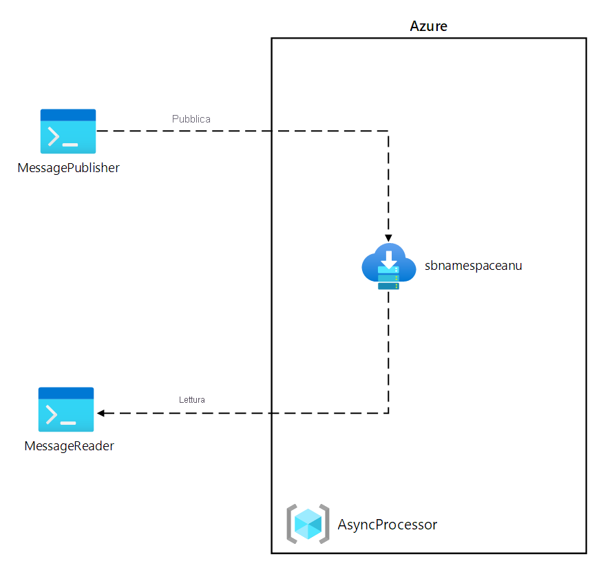
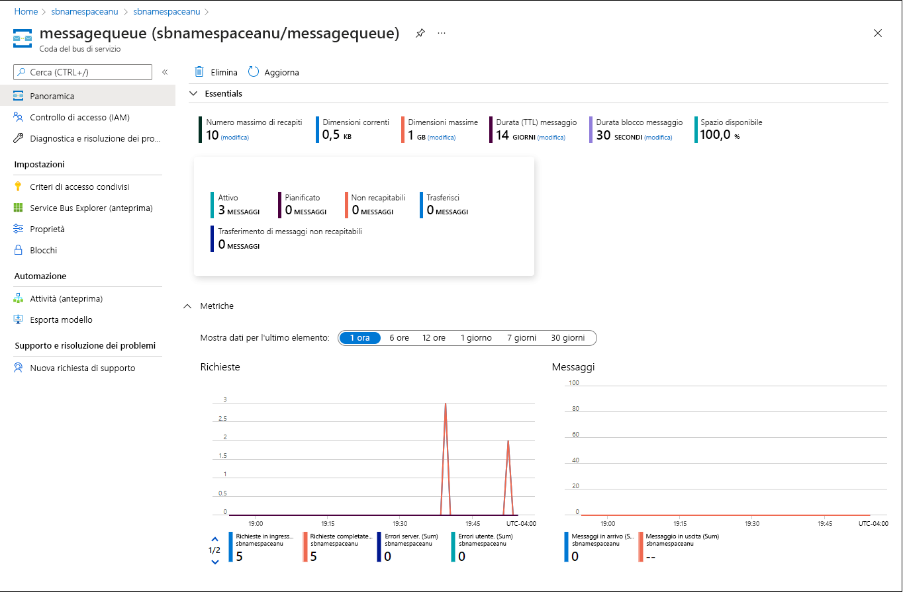
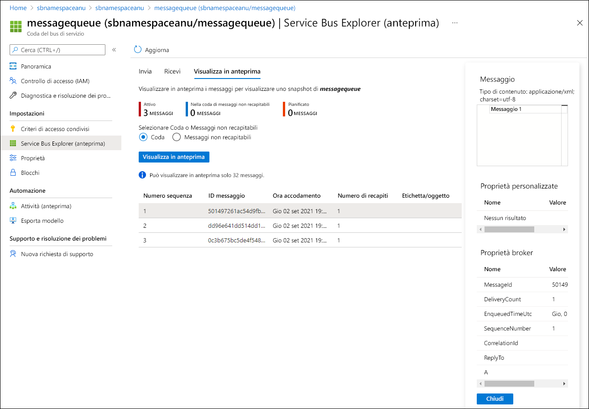

---
lab:
  az204Title: 'Lab 10: Asynchronously process messages by using Azure Service Bus Queues'
  az020Title: 'Lab 10: Asynchronously process messages by using Azure Service Bus Queues'
  az204Module: 'Module 10: Develop message-based solutions'
  az020Module: 'Module 10: Develop message-based solutions'
---

# <a name="lab-10-asynchronously-process-messages-by-using-azure-service-bus-queues"></a>Lab 10: Elaborare messaggi in modo asincrono usando code del bus di servizio di Azure

## <a name="microsoft-azure-user-interface"></a>Interfaccia utente di Microsoft Azure

Given the dynamic nature of Microsoft cloud tools, you might experience Azure UI changes that occur after the development of this training content. As a result, the lab instructions and lab steps might not align correctly.

Microsoft updates this training course when the community alerts us to needed changes. However, cloud updates occur frequently, so you might encounter UI changes before this training content updates. <bpt id="p1">**</bpt>If this occurs, adapt to the changes, and then work through them in the labs as needed.<ept id="p1">**</ept>

## <a name="instructions"></a>Istruzioni

### <a name="before-you-start"></a>Prima di iniziare

#### <a name="sign-in-to-the-lab-environment"></a>Accedere all'ambiente lab

Accedere alla macchina virtuale Windows 10 usando le credenziali seguenti:
    
-   Nome utente: **Admin**

-   Password: **Pa55w.rd**

> **Nota**: il docente fornirà le istruzioni necessarie per la connessione all'ambiente lab virtuale.

#### <a name="review-the-installed-applications"></a>Esaminare le applicazioni installate

Find the taskbar on your Windows 10 desktop. The taskbar contains the icons for the applications that you'll use in this lab, including:
    
-   Microsoft Edge

-   Visual Studio Code

## <a name="architecture-diagram"></a>Diagramma dell'architettura



### <a name="exercise-1-create-azure-resources"></a>Esercizio 1: Creare risorse di Azure

#### <a name="task-1-open-the-azure-portal"></a>Attività 1: Aprire il portale di Azure

1.  Sulla barra delle applicazioni selezionare l'icona di **Microsoft Edge**.

1.  Nella finestra del browser passare al portale di Azure ([portal.azure.com](https://portal.azure.com)) e accedere con l'account che si userà per questo lab.

    > Considerata la natura dinamica degli strumenti cloud di Microsoft, è possibile rilevare modifiche all'interfaccia utente di Azure apportate dopo lo sviluppo di questo contenuto per la formazione.

#### <a name="task-2-create-an-azure-service-bus-queue"></a>Attività 2: Creare una coda del bus di servizio di Azure

1.  Nel portale di Azure usare la casella di testo **Cerca risorse, servizi e documentazione** per cercare **Bus di servizio** e quindi nell'elenco di risultati selezionare **Bus di servizio**.

1.  Nel pannello **Bus di servizio** selezionare **+ Crea**.

1.  Nella scheda **Informazioni di base** del pannello **Crea spazio dei nomi** eseguire le azioni seguenti e selezionare **Rivedi e crea**:
        
    | Impostazione | Azione |
    | -- | -- |
    | Elenco a discesa **Sottoscrizione** |Mantenere il valore predefinito |
    | Sezione **Gruppo di risorse**  | Selezionare **Crea nuovo**, immettere **AsyncProcessor** e quindi selezionare **OK** |
    | Casella di testo **Nome spazio dei nomi**  | Immettere **sbnamespace** _[nomeutente]_ |
    | Elenco a discesa **Area**  | Selezionare qualsiasi area di Azure in cui è possibile distribuire un'istanza del bus di servizio di Azure |
    | Elenco a discesa **Piano tariffario**  | Selezionare **Basic** |

    Lo screenshot seguente mostra le impostazioni configurate nella scheda **Informazioni di base** del pannello **Crea spazio dei nomi**.
    
       
     
1.  Nella scheda **Rivedi e crea** esaminare le opzioni selezionate durante i passaggi precedenti.

1.  Selezionare **Crea** per creare lo **Spazio dei nomi del bus di servizio** usando la configurazione specificata.

    > **Nota**: prima di procedere con il lab, attendere il completamento dell'attività di creazione.

1.  Nel pannello **Distribuzione** selezionare il pulsante **Vai alla risorsa** per passare al pannello **Spazio dei nomi del bus di servizio** appena creato.

1.  Nella sezione  **Impostazioni** del pannello **Bus di servizio** selezionare **Criteri di accesso condiviso**.

1.  Nell'elenco dei criteri selezionare **RootManageSharedAccessKey**.

1.  È quindi possibile che le istruzioni e le procedure del lab non siano allineate correttamente.

    > <bpt id="p1">**</bpt>Note<ept id="p1">**</ept>: It doesn't matter which of the two available keys you choose. They are interchangeable.

1.  Nel pannello  **Bus di servizio**, nella sezione **Entità**, selezionare **Code**  e quindi **+ Coda**.

1.  Nel pannello **Crea coda** esaminare le impostazioni disponibili, nella casella di testo **Nome** immettere **messagequeue**e quindi selezionare **Crea**.

1.  Selezionare **messagequeue** per visualizzare le proprietà della coda **Bus di servizio**.

1.  Microsoft aggiorna questo corso di formazione quando la community segnala le modifiche necessarie.

#### <a name="review"></a>Verifica

In questo esercizio sono stati creati uno spazio dei nomi del **bus di servizio** di Azure e una coda del **bus di servizio** da usare nel resto del lab.

### <a name="exercise-2-create-a-net-core-project-to-publish-messages-to-a-service-bus-queue"></a>Esercizio 2: Creare un progetto .NET Core per pubblicare messaggi in una coda del bus di servizio

#### <a name="task-1-create-a-net-core-project"></a>Attività 1: Creare un progetto .NET Core

1.  Dal computer del lab avviare Visual Studio Code.

1.  In Visual Studio Code scegliere **Apri cartella** dal menu **File**.

1.  Nella finestra **Apri cartella** passare a**Allfiles (F):\\Allfiles\\Labs\\10\\Starter\\MessagePublisher** e quindi selezionare **Seleziona cartella**.

1.  Nella finestra di **Visual Studio Code** attivare il menu di scelta rapida e quindi selezionare **Apri nel terminale integrato**.

1.  Al prompt del terminale eseguire il comando seguente per creare un nuovo progetto .NET denominato **MessagePublisher** nella cartella corrente:

    ```
    dotnet new console --framework net6.0 --name MessagePublisher --output .
    ```

    > **Nota**: il comando **dotnet new** creerà un nuovo progetto **console** in una cartella con lo stesso nome del progetto.

1.  Eseguire il comando seguente per importare la versione 7.8.1 del pacchetto **Azure.Messaging.ServiceBus** da NuGet:

    ```
    dotnet add package Azure.Messaging.ServiceBus --version 7.8.1
    ```

    > Poiché gli aggiornamenti cloud vengono apportati spesso, tuttavia, è possibile che si rilevino modifiche all'interfaccia utente prima degli aggiornamenti del contenuto per la formazione.

1.  Al prompt del terminale eseguire il comando seguente per compilare l'applicazione console .NET Core:

    ```
    dotnet build
    ```

1.  Selezionare **Termina il terminale** (l'icona del **Cestino**) per chiudere il riquadro del terminale e tutti i processi associati.

#### <a name="task-2-publish-messages-to-an-azure-service-bus-queue"></a>Attività 2: Pubblicare messaggi in una coda del bus di servizio di Azure

1.  Nel riquadro **Esplora risorse** della finestra di **Visual Studio Code** aprire il file **Program.cs**.

1.  Nella scheda dell'editor di codice per il file  **Program.cs** eliminare tutto il codice nel file esistente.

1.  Aggiungere le righe di codice seguenti per facilitare l'uso degli spazi dei nomi predefiniti a cui verrà fatto riferimento in questo file:

    ```csharp
    using System;
    using System.Threading.Tasks;
    ```

1.  Aggiungere il codice seguente per importare lo spazio dei nomi **Azure.Messaging.ServiceBus** incluso nel pacchetto **Azure.Storage.Queues** importato da NuGet:

    ```csharp
    using Azure.Messaging.ServiceBus;
    ```
    
1.  Immettere il codice seguente per creare una nuova classe **Program** nello spazio dei nomi MessagePublisher:

    ```csharp
    namespace MessagePublisher
    {
       public class Program
       {
       }
    }
    ```

1.  Nella classe **Program** immettere il codice seguente per creare una costante di tipo stringa denominata **storageConnectionString**:

    ```csharp
    private const string storageConnectionString = "";
    ```

1.  Aggiornare la costante stringa **storageConnectionString** impostandone il valore su **Stringa di connessione primaria** per lo spazio dei nomi del bus di servizio registrato in precedenza in questo lab.

1.  Immettere il codice seguente per creare una costante stringa denominata **queueName** con un valore **messagequeue**, corrispondente al nome della coda del bus di servizio creata in precedenza in questo esercizio.

    ```csharp
    private const string queueName = "messagequeue";
    ```

1.  Immettere il codice seguente per creare una costante integer che archivia il numero di messaggi da inviare alla coda di destinazione:

    ```csharp
    private const int numOfMessages = 3;
    ```

1.  Immettere il codice seguente per creare un client del bus di servizio che sarà proprietario della connessione alla coda di destinazione:

    ```csharp
    static ServiceBusClient client;
    ```

1.  Immettere il codice seguente per creare un mittente del bus di servizio che sarà proprietario della connessione alla coda di destinazione:

    ```csharp
    static ServiceBusSender sender;
    ```

1.  Immettere il codice seguente per creare un metodo **Main asincrono**:

    ```csharp
    public static async Task Main(string[] args)
    {
    }
    ```

1.  **In questo caso, adattarsi alle modifiche e quindi eseguire le operazioni necessarie nei lab.**

    ```csharp
    using System;
    using System.Threading.Tasks;
    using Azure.Messaging.ServiceBus;
    namespace MessagePublisher
    {
        public class Program
        {
            private const string storageConnectionString = "<storage-connection-string>";
            private const string queueName = "messagequeue";
            private const int numOfMessages = 3;
            static ServiceBusClient client = default!;
            static ServiceBusSender sender = default!;
            public static async Task Main(string[] args)
            {
            }
        }
    }
    ```

1.  Nel metodo **Main** aggiungere il codice seguente per inizializzare il *client* di tipo **ServiceBusClient** che fornirà connettività allo spazio dei nomi del bus di servizio e il **mittente** che sarà responsabile dell'invio di messaggi:

    ```csharp
    client = new ServiceBusClient(storageConnectionString);
    sender = client.CreateSender(queueName);  
    ```

    > <bpt id="p1">**</bpt>Note<ept id="p1">**</ept>: The Service Bus client is safe to cache and use as a singleton for the lifetime of the application. This is considered one of the best practices when publishing and reading messages on a regular basis.

1.  Nel metodo **Main** aggiungere il codice seguente per creare un oggetto **ServiceBusMessageBatch** che consentirà di combinare più messaggi in un batch usando il metodo **TryAddMessage**:

    ```csharp
    using ServiceBusMessageBatch messageBatch = await sender.CreateMessageBatchAsync();
    ```

1.  Nel metodo **Main** aggiungere le righe di codice seguenti per aggiungere messaggi a un batch e generare un'eccezione se le dimensioni di un messaggio superano i limiti supportati dal batch:

    ```csharp
    for (int i = 1; i <= numOfMessages; i++)
    {
        if (!messageBatch.TryAddMessage(new ServiceBusMessage($"Message {i}")))
        {
            throw new Exception($"The message {i} is too large to fit in the batch.");
        }
    }
    ```

1.  Nel metodo **Main** aggiungere le righe di codice seguenti per creare un blocco try, con l'oggetto mittente **sender** che pubblica in modo asincrono i messaggi nel batch nella coda di destinazione:

    ```csharp
    try
    {
        await sender.SendMessagesAsync(messageBatch);
        Console.WriteLine($"A batch of {numOfMessages} messages has been published to the queue.");
    }
    ```

1.  Nel metodo **Main** aggiungere le righe di codice seguenti per creare un blocco finally che elimina in modo asincrono gli oggetti **sender** e **client**, rilasciando tutte le risorse di rete e non gestite:

    ```csharp
    finally
    {
        await sender.DisposeAsync();
        await client.DisposeAsync();
    }
    ```

1.  Esaminare il metodo **Main**, che ora dovrebbe essere costituito dal codice seguente: 

    ```csharp
    public static async Task Main(string[] args)
    {
        client = new ServiceBusClient(storageConnectionString);
        sender = client.CreateSender(queueName);
        using ServiceBusMessageBatch messageBatch = await sender.CreateMessageBatchAsync();
        for (int i = 1; i <= numOfMessages; i++)
        {
            if (!messageBatch.TryAddMessage(new ServiceBusMessage($"Message {i}")))
            {
                throw new Exception($"The message {i} is too large to fit in the batch.");
            }
        }
        try
        {
            await sender.SendMessagesAsync(messageBatch);
            Console.WriteLine($"A batch of {numOfMessages} messages has been published to the queue.");
        }
        finally
        {
            await sender.DisposeAsync();
            await client.DisposeAsync();
        }
    }
    ```

1.  Salvare il file **Program.cs** .

1.  Nella finestra di **Visual Studio Code** attivare il menu di scelta rapida e quindi selezionare **Apri nel terminale integrato**.

1.  Al prompt del terminale eseguire il comando seguente per avviare l'app console .NET Core:

    ```
    dotnet run
    ```

    > **Nota**: se si verificano errori, esaminare il file **Program.cs** nella cartella **Allfiles (F):\\Allfiles\\Labs\\10\\Solution\\MessagePublisher**.

1.  Verificare che il messaggio della console visualizzato nel prompt del terminale indichi che un batch di tre messaggi è stato pubblicato nella coda.

1.  Selezionare **Termina il terminale** (l'icona del **Cestino**) per chiudere il riquadro del terminale e tutti i processi associati.

1.  Passare al browser Microsoft Edge che visualizza la coda del bus di servizio **messagequeue** nel portale di Azure.

1.  Esaminare il riquadro **Informazioni di base** e notare che la coda contiene tre messaggi attivi.

    Lo screenshot seguente mostra le metriche della coda del bus di servizio e il numero di messaggi.
     
       
     
1.  Selezionare il pannello **Service Bus Explorer (anteprima)** .

1.  Nell'intestazione della scheda **Modalità anteprima** e nella scheda **Coda** selezionare il pulsante **Visualizza in anteprima dall'inizio**.

1.  Verificare che la coda contenga tre messaggi.

1.  Selezionare il primo messaggio ed esaminarne il contenuto nel riquadro **Messaggio**.

    Lo screenshot seguente mostra il contenuto del primo messaggio.
         
       

1.  Chiudere il riquadro **Messaggio**.

#### <a name="review"></a>Verifica

In questo esercizio è stato configurato un progetto .NET che ha pubblicato messaggi in una coda del bus di servizio di Azure.

### <a name="exercise-3-create-a-net-core-project-to-read-messages-from-a-service-bus-queue"></a>Esercizio 3: Creare un progetto .NET Core per leggere i messaggi da una coda del bus di servizio

#### <a name="task-1-create-a-net-project"></a>Attività 1: Creare un progetto .NET

1.  Dal computer del lab avviare Visual Studio Code.

1.  In Visual Studio Code scegliere **Apri cartella** dal menu **File**.

1.  Nella finestra **Apri cartella** passare ad **Allfiles (F):\\Allfiles\\Labs\\10\\Starter\\MessageReader** e quindi selezionare **Seleziona cartella**.

1.  Nella finestra di **Visual Studio Code** attivare il menu di scelta rapida e quindi selezionare **Apri nel terminale integrato**.

1.  Al prompt del terminale eseguire il comando seguente per creare un nuovo progetto .NET denominato **MessageReader** nella cartella corrente:

    ```
    dotnet new console --framework net6.0 --name MessageReader --output .
    ```

1.  Eseguire il comando seguente per importare la versione 7.8.1 del pacchetto **Azure.Messaging.ServiceBus** da NuGet:

    ```
    dotnet add package Azure.Messaging.ServiceBus --version 7.8.1
    ```

1.  Al prompt del terminale eseguire il comando seguente per compilare l'applicazione console .NET Core:

    ```
    dotnet build
    ```

1.  Selezionare **Termina il terminale** (l'icona del **Cestino**) per chiudere il riquadro del terminale e tutti i processi associati.

#### <a name="task-2-read-messages-from-an-azure-service-bus-queue"></a>Attività 2: Leggere i messaggi da una coda del bus di servizio Azure

1.  Nel riquadro **Esplora risorse** della finestra di **Visual Studio Code** aprire il file **Program.cs**.

1.  Nella scheda dell'editor di codice per il file  **Program.cs** eliminare tutto il codice nel file esistente.

1.  Aggiungere lo stesso codice incluso nel file Program.cs per consentire l'interazione con le code del bus di servizio di Azure, ma impostare lo spazio dei nomi su **MessageReader**:

    ```csharp
    using System;
    using System.Threading.Tasks;
    using Azure.Messaging.ServiceBus;  
    namespace MessageReader
    {
       public class Program
       {
          private const string storageConnectionString = "";
          static string queueName = "messagequeue";
          static ServiceBusClient client = default!;
       }
    }
    ```

1.  Come prima, aggiornare la costante stringa **storageConnectionString** impostandone il valore su **Stringa di connessione primaria** per lo spazio dei nomi del **bus di servizio registrato** in precedenza in questo lab.

1.  Immettere il codice seguente per creare un oggetto ServiceBusProcessor che verrà usato per elaborare i messaggi dalla coda:

    ```csharp
    static ServiceBusProcessor processor = default!;
    ```

1.  Immettere il codice seguente per creare un'attività **MessageHandler** asincrona statica che visualizza il corpo dei messaggi nella coda durante l'elaborazione e li elimina al termine dell'elaborazione:

    ```csharp
    static async Task MessageHandler(ProcessMessageEventArgs args)
    {
        string body = args.Message.Body.ToString();
        Console.WriteLine($"Received: {body}");
        await args.CompleteMessageAsync(args.Message);
    }
    ```

1.  Immettere il codice seguente per creare un'attività **ErrorHandler** asincrona statica che gestisce tutte le eccezioni riscontrate durante l'elaborazione dei messaggi:

    ```csharp
    static Task ErrorHandler(ProcessErrorEventArgs args)
    {
        Console.WriteLine(args.Exception.ToString());
        return Task.CompletedTask;
    }
    ```

1.  Immettere il codice seguente per creare un metodo **Main asincrono**:

    ```csharp
    static async Task Main(string[] args)
    {
    }
    ```

1.  Review the <bpt id="p1">**</bpt>Program.cs<ept id="p1">**</ept> file, which should now include the following code. The <ph id="ph1">`&lt;storage-connection-string&gt;`</ph> placeholder represents the connection string to the target Azure Service Bus namespace:

    ```csharp
    using System;
    using System.Threading.Tasks;
    using Azure.Messaging.ServiceBus;
    namespace MessageReader
    {
        class Program
        {
            static string storageConnectionString = "<storage-connection-string>`";
            static string queueName = "messagequeue";
            static ServiceBusClient client;
            static ServiceBusProcessor processor;
            static async Task MessageHandler(ProcessMessageEventArgs args)
            {
                string body = args.Message.Body.ToString();
                Console.WriteLine($"Received: {body}");
                await args.CompleteMessageAsync(args.Message);
            }
            static Task ErrorHandler(ProcessErrorEventArgs args)
            {
                Console.WriteLine(args.Exception.ToString());
                return Task.CompletedTask;
            }
            static async Task Main()
            {
            }
        }
    }
    ```

1.  Nel metodo **Main** aggiungere il codice seguente per inizializzare il *client* di tipo **ServiceBusClient** che fornirà connettività allo spazio dei nomi del bus di servizio e il **processore** che sarà responsabile dell'invio di messaggi:

    ```csharp
    client = new ServiceBusClient(storageConnectionString);
    processor = client.CreateProcessor(queueName, new ServiceBusProcessorOptions());
    ```

    > <bpt id="p1">**</bpt>Note<ept id="p1">**</ept>: As mentioned earlier, the Service Bus client is safe to cache and use as a singleton for the lifetime of the application. This is considered one of the best practices when publishing and reading messages on a regular basis.

1.  Nel metodo **Main** aggiungere le righe di codice seguenti per creare un blocco try, che per prima cosa implementa un gestore di elaborazione di messaggi ed errori, avvia l'elaborazione dei messaggi e interrompe l'elaborazione a seguito di un input dell'utente:

    ```csharp
    try
    {
        processor.ProcessMessageAsync += MessageHandler;
        processor.ProcessErrorAsync += ErrorHandler;
        await processor.StartProcessingAsync();
        Console.WriteLine("Wait for a minute and then press any key to end the processing");
        Console.ReadKey();
        Console.WriteLine("\nStopping the receiver...");
        await processor.StopProcessingAsync();
        Console.WriteLine("Stopped receiving messages");
    }
    ```

1.  Nel metodo **Main** aggiungere le righe di codice seguenti per creare un blocco finally che elimina in modo asincrono gli oggetti **processor** e **client**, rilasciando tutte le risorse di rete e non gestite:

    ```csharp
    finally
    {
        await processor.DisposeAsync();
        await client.DisposeAsync();
    }
    ```

1.  Esaminare il metodo **Main**, che ora dovrebbe essere costituito dal codice seguente:

    ```csharp
    static async Task Main()
    {
        client = new ServiceBusClient(storageConnectionString);
        processor = client.CreateProcessor(queueName, new ServiceBusProcessorOptions());
        try
        {
            processor.ProcessMessageAsync += MessageHandler;
            processor.ProcessErrorAsync += ErrorHandler;

            await processor.StartProcessingAsync();
            Console.WriteLine("Wait for a minute and then press any key to end the processing");
            Console.ReadKey();

            Console.WriteLine("\nStopping the receiver...");
            await processor.StopProcessingAsync();
            Console.WriteLine("Stopped receiving messages");
        }
        finally
        {
            await processor.DisposeAsync();
            await client.DisposeAsync();
        }
    }
    ```

1.  Salvare il file **Program.cs** .

1.  Nella finestra di **Visual Studio Code** attivare il menu di scelta rapida e quindi selezionare **Apri nel terminale integrato**.

1.  Al prompt del terminale eseguire il comando seguente per avviare l'app console .NET Core:

    ```
    dotnet run
    ```

    > **Nota**: se si verificano errori, esaminare il file **Program.cs** nella cartella **Allfiles (F):\\Allfiles\\Labs\\10\\Solution\\MessageReader**.

1.  Verificare che il messaggio della console visualizzato nel prompt del terminale indichi che ognuno dei tre messaggi nella coda è stato ricevuto.

1.  Al prompt del terminale premere un tasto qualsiasi per arrestare il ricevitore e terminare l'esecuzione dell'app.

1.  Selezionare **Termina il terminale** (l'icona del **Cestino**) per chiudere il riquadro del terminale e tutti i processi associati.

1.  Tornare al browser Microsoft Edge che visualizza la coda del bus di servizio **messagequeue** nel portale di Azure.

1.  Nel pannello **Service Bus Explorer (anteprima)** selezionare **Visualizza in anteprima dall'inizio** e notare che il numero di messaggi attivi nella coda è cambiato in **0**.

#### <a name="review"></a>Verifica

In questo esercizio sono stati letti ed eliminati messaggi dalla coda del bus di servizio di Azure usando la libreria .NET.

### <a name="exercise-4-clean-up-your-subscription"></a>Esercizio 4: Pulire la sottoscrizione

#### <a name="task-1-open-azure-cloud-shell"></a>Attività 1: Aprire Azure Cloud Shell

1.  In the Azure portal, select the <bpt id="p1">**</bpt>Cloud Shell<ept id="p1">**</ept> icon <ph id="ph1"></ph> to open a new Bash session. If Cloud Shell defaults to a PowerShell session, select <bpt id="p1">**</bpt>PowerShell<ept id="p1">**</ept> and, in the drop-down menu, select <bpt id="p2">**</bpt>Bash<ept id="p2">**</ept>.

    > <bpt id="p1">**</bpt>Note<ept id="p1">**</ept>: If this is the first time you are starting <bpt id="p2">**</bpt>Cloud Shell<ept id="p2">**</ept>, when prompted to select either <bpt id="p3">**</bpt>Bash<ept id="p3">**</ept> or <bpt id="p4">**</bpt>PowerShell<ept id="p4">**</ept>, select <bpt id="p5">**</bpt>PowerShell<ept id="p5">**</ept>. When you are presented with the <bpt id="p1">**</bpt>You have no storage mounted<ept id="p1">**</ept> message, select the subscription you are using in this lab, and select <bpt id="p2">**</bpt>Create storage<ept id="p2">**</ept>.

#### <a name="task-2-delete-resource-groups"></a>Attività 2: Eliminare i gruppi di risorse

1.  Nel riquadro **Cloud Shell** eseguire il comando seguente per eliminare il gruppo di risorse **AsyncProcessor**:

    ```
    az group delete --name AsyncProcessor --no-wait --yes
    ```
    
     > **Nota**: il comando viene eseguito in modo asincrono, in base a quanto determinato dal parametro *--no-wait*, quindi, sebbene sia possibile eseguire un altro comando dell'interfaccia della riga di comando di Azure immediatamente dopo nella stessa sessione Bash, il gruppo di risorse verrà effettivamente rimosso dopo alcuni minuti.
  
1.  Chiudere il riquadro **Cloud Shell** nel portale.

#### <a name="task-3-close-the-active-applications"></a>Attività 3: Chiudere le applicazioni attive

1.  Chiudere l'applicazione Microsoft Edge in esecuzione.

1.  Chiudere l'applicazione Visual Studio Code in esecuzione.

#### <a name="review"></a>Verifica

In questo esercizio è stata pulita la sottoscrizione mediante la rimozione dei gruppi di risorse usati in questo lab.
