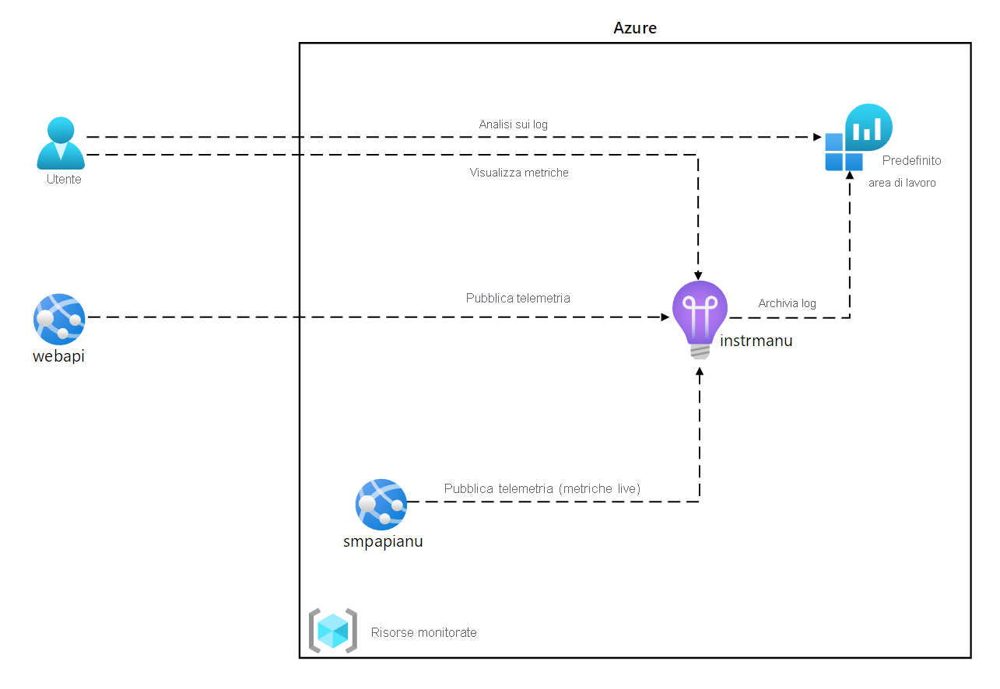
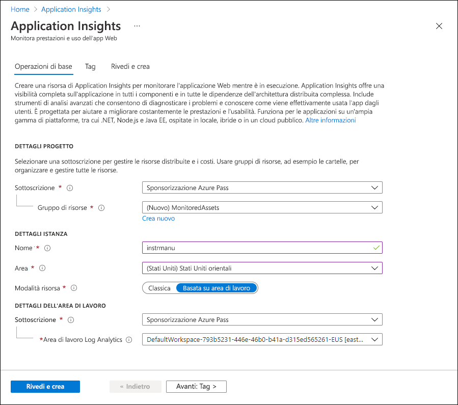
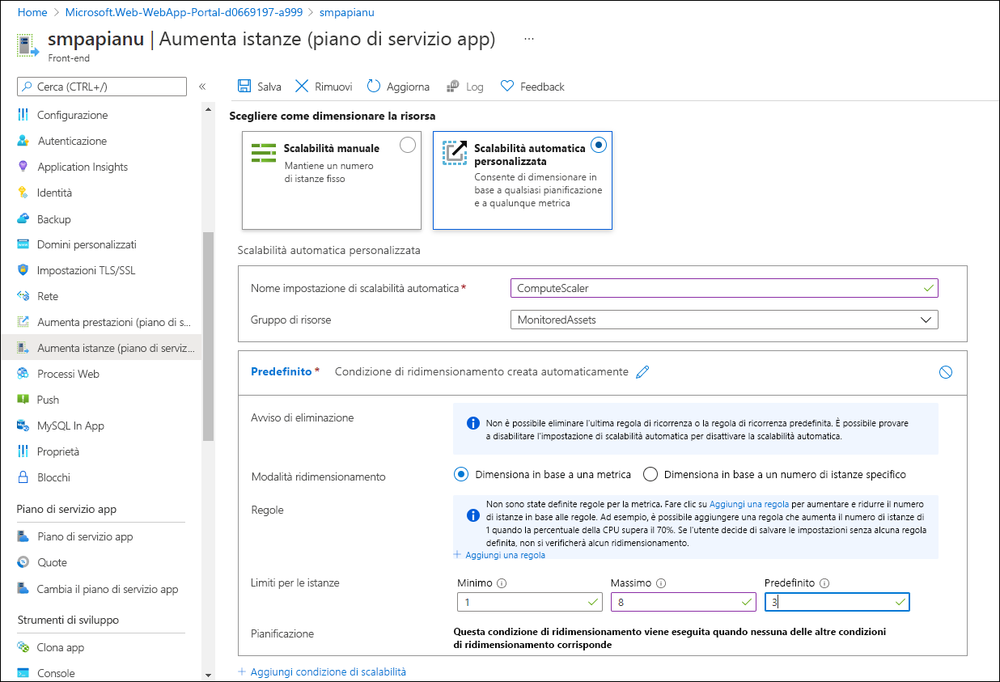
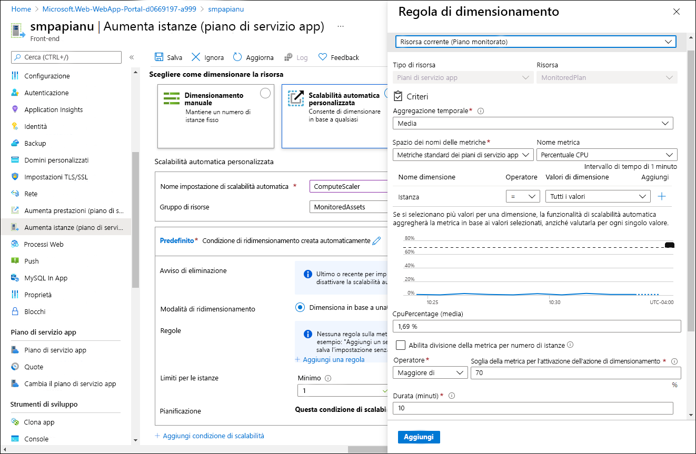
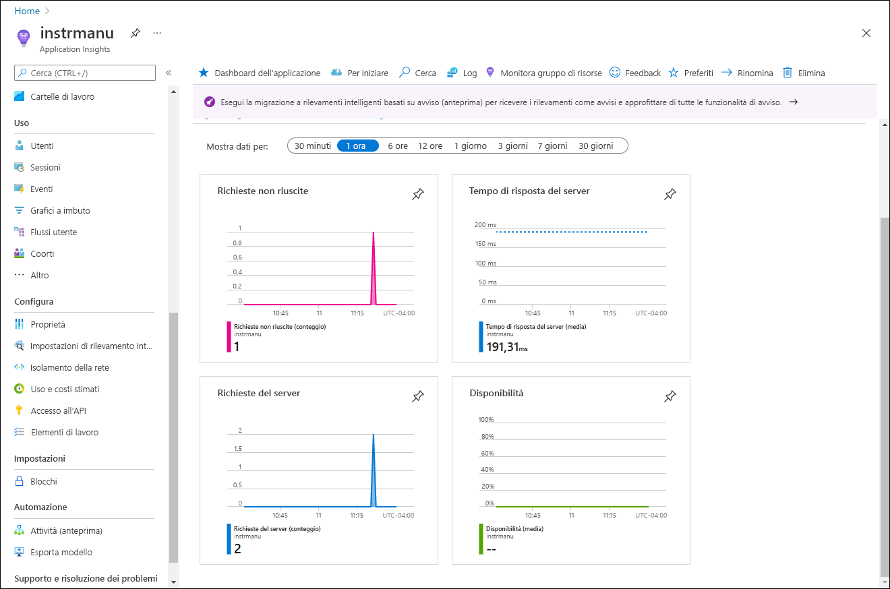
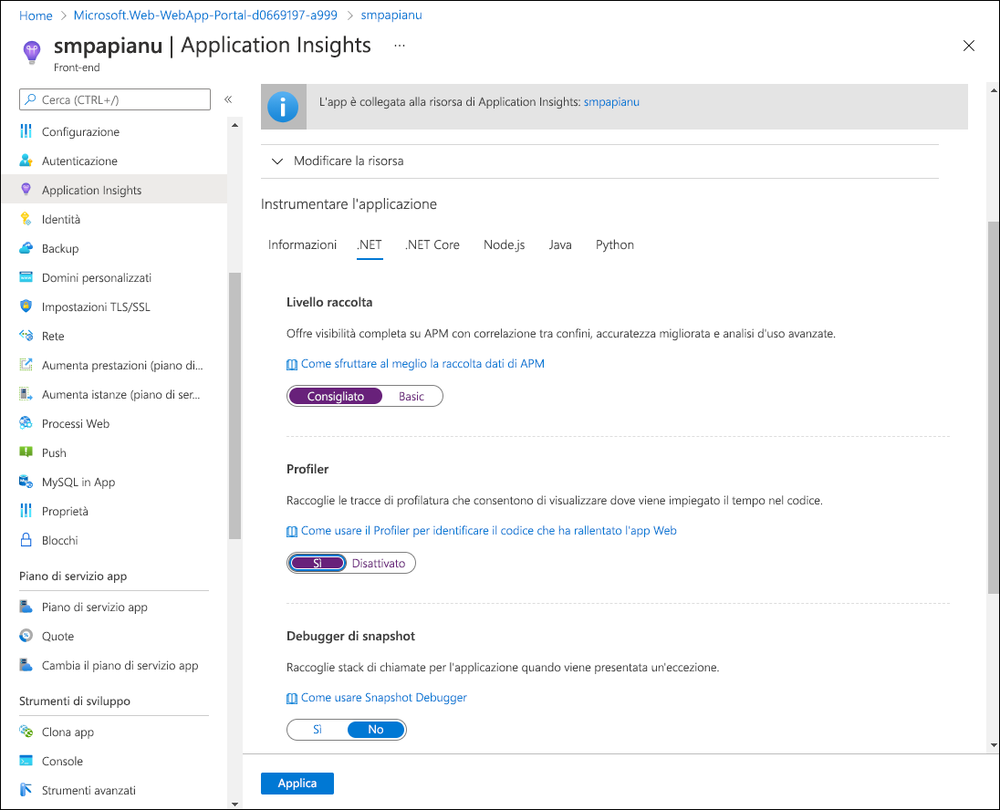
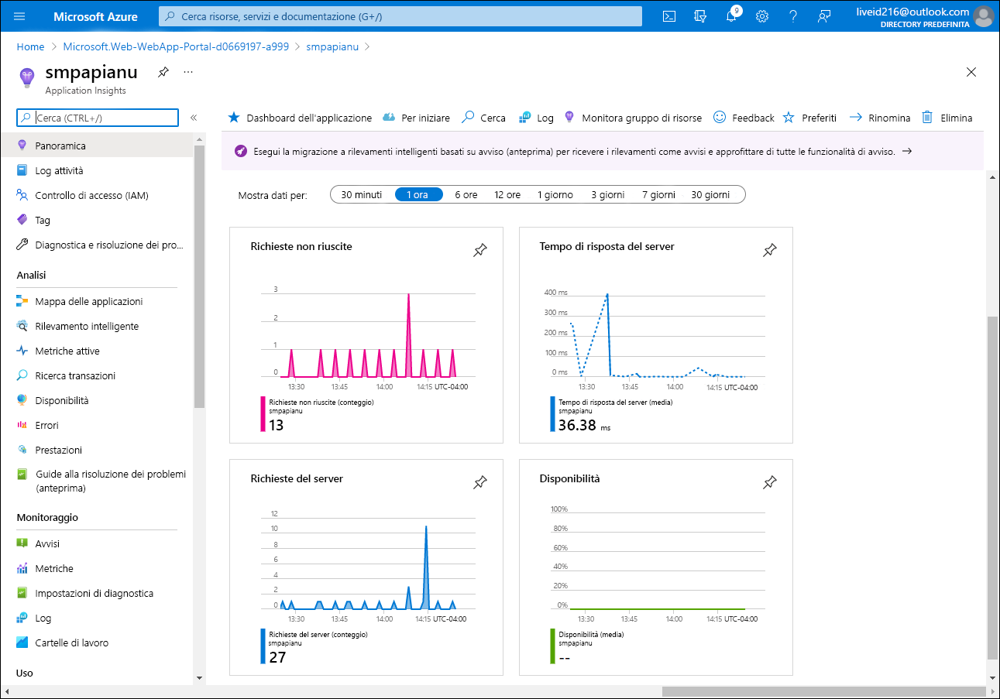
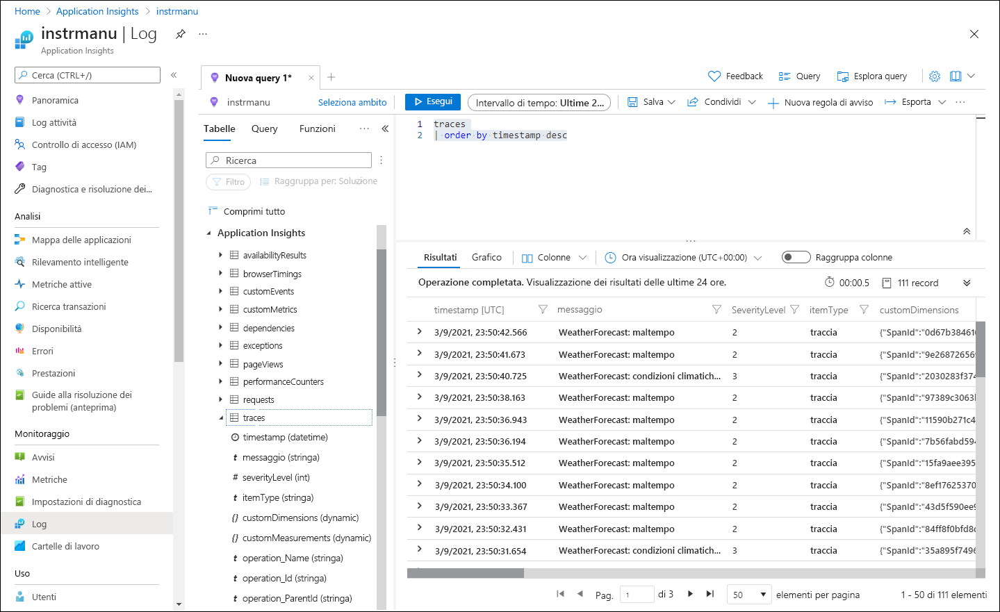

---
lab:
  az204Title: 'Lab 11: Monitor services that are deployed to Azure'
  az020Title: 'Lab 11: Monitor services that are deployed to Azure'
  az204Module: 'Module 11: Monitor and optimize Azure solutions'
  az020Module: 'Module 11: Monitor and optimize Azure solutions'
ms.openlocfilehash: 9e67ee08cf92c3aafb608c76257199fd9602ba92
ms.sourcegitcommit: 71681d2734c5590e91fdac8529669b3606953a3f
ms.translationtype: HT
ms.contentlocale: it-IT
ms.lasthandoff: 03/01/2022
ms.locfileid: "139251593"
---
# <a name="lab-11-monitor-services-that-are-deployed-to-azure"></a>Lab 11: Monitorare i servizi distribuiti in Azure

## <a name="microsoft-azure-user-interface"></a>Interfaccia utente di Microsoft Azure

Considerata la natura dinamica degli strumenti cloud di Microsoft, è possibile rilevare modifiche all'interfaccia utente di Azure apportate dopo lo sviluppo di questo contenuto per la formazione. È quindi possibile che le istruzioni e le procedure del lab non siano allineate correttamente.

Microsoft aggiorna questo corso di formazione quando la community segnala le modifiche necessarie. Poiché gli aggiornamenti cloud vengono apportati spesso, tuttavia, è possibile che si rilevino modifiche all'interfaccia utente prima degli aggiornamenti del contenuto per la formazione. **In questo caso, adattarsi alle modifiche e quindi eseguire le operazioni necessarie nei lab.**

## <a name="instructions"></a>Istruzioni

### <a name="before-you-start"></a>Prima di iniziare

#### <a name="sign-in-to-the-lab-environment"></a>Accedere all'ambiente lab

Accedere alla macchina virtuale Windows 10 usando le credenziali seguenti:
    
-   Nome utente: **Admin**

-   Password: **Pa55w.rd**

> **Nota**: il docente fornirà le istruzioni necessarie per la connessione all'ambiente lab virtuale.

#### <a name="review-the-installed-applications"></a>Esaminare le applicazioni installate

Trovare la barra delle applicazioni nel desktop di Windows 10. La barra delle applicazioni include le icone per le applicazioni che verranno usate nel lab, tra cui:
    
-   Microsoft Edge

-   Esplora file

-   Visual Studio Code

-   Azure PowerShell

## <a name="architecture-diagram"></a>Diagramma dell'architettura



### <a name="exercise-1-create-and-configure-azure-resources"></a>Esercizio 1 - Creare e configurare le risorse di Azure

#### <a name="task-1-open-the-azure-portal"></a>Attività 1: Aprire il portale di Azure

1.  Sulla barra delle applicazioni selezionare l'icona di **Microsoft Edge**.

1.  Nella finestra del browser passare al portale di Azure ([portal.azure.com](https://portal.azure.com)) e quindi accedere con l'account che si userà per questo lab.

    > **Nota**: se si sta eseguendo l'accesso al portale di Azure per la prima volta, verrà visualizzata una presentazione del portale. Selezionare **Attività iniziali** per ignorare la presentazione e iniziare a usare il portale.

#### <a name="task-2-create-an-application-insights-resource"></a>Attività 2 : Creare una risorsa di Application Insights

1.  Nel portale di Azure usare la casella di testo **Cerca risorse, servizi e documentazione** nella parte superiore della pagina per cercare **Application Insights** e quindi nell'elenco dei risultati selezionare **Application Insights**.

1.  Nel pannello **Application Insights** selezionare **+ Crea**.

1.  Nel pannello **Application Insights**, nella scheda **Dati principali**, eseguire le azioni seguenti e selezionare **Rivedi e crea**:
    
    | Impostazione                         | Azione                                                       |
    | ------------------------------- | ------------------------------------------------------------ |
    | Elenco a discesa **Sottoscrizione** | Mantenere il valore predefinito.                                    |
    | Sezione **Gruppo di risorse**      | Selezionare **Crea nuovo**, immettere **MonitoredAssets** e quindi selezionare **OK**. |
    | Casella di testo **Nome**     | **instrm** _[nomeutente]_ .                           |
    | Elenco a discesa **Area**       | Selezionare qualsiasi area di Azure in cui è possibile distribuire un'istanza del bus di servizio di Azure. |
    | Sezione **Modalità risorsa** | Selezionare l'opzione **Basata su area di lavoro**.|
    | Sezione **DETTAGLI DELL'AREA DI LAVORO** | Mantenere i valori predefiniti per gli elenchi a discesa **Sottoscrizione** e **Area di lavoro Log Analytics**.|
    
    Lo screenshot seguente mostra le impostazioni configurate nel pannello **Application Insights**.

       
     
1.  Nella scheda **Rivedi e crea** esaminare le opzioni selezionate durante i passaggi precedenti.

1.  Selezionare **Crea** per creare l'istanza di **Application Insights** usando la configurazione specificata.

    > **Nota**: prima di procedere con il lab, attendere il completamento dell'attività di creazione.

1.  Nel pannello **Microsoft.AppInsights \| Panoramica** selezionare il pulsante **Vai alla risorsa** per passare al pannello della risorsa di **Application Insights** appena creata.

1.  Nella sezione **Configura** del pannello **Application Insights** selezionare il collegamento **Proprietà**.

1.  Nel pannello **Proprietà**, accanto alla voce **Chiave di strumentazione**, selezionare il pulsante **Copia negli Appunti** e quindi registrare il valore copiato. Verrà usato più avanti in questo lab.

    > **Nota**: la chiave viene usata dalle applicazioni client per connettersi a una risorsa specifica di **Application Insights**.

### <a name="task-3-create-an-azure-web-api-resource"></a>Attività 3: Creare una risorsa API Web di Azure

1.  Nel portale di Azure usare la casella di testo **Cerca risorse, servizi e documentazione** nella parte superiore della pagina per cercare **Servizi app** e quindi nell'elenco dei risultati selezionare **Servizi app**.

1.  Nel pannello **Servizi app** selezionare **+ Crea**.
    
1.  Nella scheda **Dati principali** del pannello **Crea app Web** eseguire le azioni seguenti e selezionare **Avanti: Distribuzione**:

    | Impostazione                         | Azione                                                       |
    | ------------------------------- | ------------------------------------------------------------ |
    | Elenco a discesa **Sottoscrizione** | Mantenere il valore predefinito.                                    |
    | Elenco a discesa **Gruppo di risorse**      |Selezionare **MonitoredAssets**. |
    | Casella di testo **Nome**     | Immettere **smpapi** _[nomeutente]_ .                           |
    | Sezione **Pubblica**       | Selezionare **Codice**. |
    | Elenco a discesa **Stack di runtime** | Selezionare **.NET Core 3.1 (LTS)** .|
    | Sezione **Sistema operativo** |  Selezionare **Windows**.|
    | Elenco a discesa **Area** |  Selezionare la stessa area scelta come posizione della risorsa **Istanza dell'applicazione**. |
    | Sezione **Piano di servizio app** |  Selezionare **Crea nuovo**. |
    | Casella di testo **Nome** |  Immettere **MonitoredPlan** e quindi selezionare **OK**.|
    |  Sezione **SKU e dimensioni** |  Mantenere il valore predefinito. |
    
1.  Nella scheda **Distribuzione** selezionare **Avanti: Monitoraggio**.

1.  Nella scheda **Monitoraggio** eseguire le azioni seguenti e quindi selezionare **Rivedi e crea**:
    
    | Impostazione                         | Azione                                                       |
    | ------------------------------- | ------------------------------------------------------------ |
    | Sezione **Abilita Application Insights** | Assicurarsi che sia selezionata l'opzione **Sì**.                                    |
    | Elenco a discesa **Application Insights**     | Selezionare la risorsa **instrm** _[nomeutente]_ di Application Insights creata precedentemente in questo lab.|
    
1.  Nella scheda **Rivedi e crea** esaminare le opzioni selezionate durante i passaggi precedenti.

1.  Selezionare **Crea** per creare l'API Web usando la configurazione specificata.

    > **Nota**: prima di procedere con il lab, attendere il completamento dell'attività di creazione.

1.  Nel pannello **Panoramica** della distribuzione selezionare il pulsante **Vai alla risorsa** per passare al pannello dell'API Web di Azure appena creata.

1.  Nel pannello **Servizio app**, nella sezione **Impostazioni**, selezionare il collegamento **Configurazione**.

1.  Nella sezione **Configurazione** eseguire le azioni seguenti:
    
    a.  Nella scheda **Impostazioni applicazione** selezionare **Mostra valori** per visualizzare i segreti associati all'API Web.

    b.  Si noti il valore che rappresenta la chiave **APPINSIGHTS\_INSTRUMENTATIONKEY**. Questo valore è stato impostato automaticamente durante la creazione della risorsa API Web.

1.  Nel pannello **Servizio app**, nella sezione **Impostazioni**, selezionare il collegamento **Proprietà**.

1.  Nella sezione **Proprietà** registrare il valore del collegamento **URL**. Questo valore verrà utilizzato più avanti nel lab per inviare richieste all'API Web.

#### <a name="task-4-configure-web-api-autoscale-options"></a>Attività 4: Configurare le opzioni di scalabilità automatica dell'API Web

1.  Nel pannello **Servizio app**, nella sezione **Impostazioni**, selezionare il collegamento **Scale Out (piano di servizio app)** .

1.  Nella sezione **Aumenta istanze** eseguire le azioni seguenti e quindi selezionare **Salva**:
    
    | Impostazione                         | Azione                                                       |
    | ------------------------------- | ------------------------------------------------------------ |
    | Sezione **Aumenta istanze** | Selezionare **Scalabilità automatica personalizzata**.|
    | Casella di testo **Nome impostazione di scalabilità automatica**     | Immettere **ComputeScaler**.|
    | Elenco a discesa **Gruppo di risorse**     |Selezionare **MonitoredAssets**. |
    | Sezione **Modalità ridimensionamento**      | Selezionare **Ridimensiona in base a una metrica**. |
    | Casella di testo **Minimo** nella sezione **Limiti per le istanze** | Immettere **2**.|
    | Casella di testo **Massimo** nella sezione **Limiti per le istanze** | Immettere **8**.|
    | Casella di testo **Predefinito** nella sezione **Limiti per le istanze** | immettere **3**. |
   
    Lo screenshot seguente mostra le impostazioni configurate nella sezione **Aumenta istanze** del pannello **Servizio app**.
    
       

    | Impostazione                         | Azione                                                       |
    | ------------------------------- | ------------------------------------------------------------ |
    | Sezione **Regole** |  Selezionare **Aggiungi una regola**.|
    | Pannello **Regola di ridimensionamento** | Mantenere i valori predefiniti per tutte le impostazioni e quindi selezionare **Aggiungi**.|

    Lo screenshot seguente mostra le altre impostazioni nella sezione **Aumenta istanze** del pannello **Servizio app**.

       

    > **Nota**: prima di continuare con il lab, attendere il completamento dell'attività di salvataggio.

#### <a name="review"></a>Verifica

In questo esercizio sono state create le risorse di Azure che verranno usate per il resto del lab.

### <a name="exercise-2-monitor-a-local-web-api-by-using-application-insights"></a>Esercizio 2: Monitorare un'API Web locale usando Application Insights

#### <a name="task-1-build-a-net-web-api-project"></a>Attività 1: Compilare un progetto API Web .NET

1.  Dal computer del lab avviare **Visual Studio Code**.

1.  In Visual Studio Code scegliere **Apri cartella** dal menu **File**.

1.  Nella finestra **Apri cartella** passare a **Allfiles (F):\\Allfiles\\Labs\\11\\Starter\\Api** e quindi scegliere **Seleziona cartella**.

1.  Nella finestra di **Visual Studio Code** attivare il menu di scelta rapida e quindi selezionare **Apri nel terminale integrato**.

1.  Al prompt del terminale eseguire il comando seguente per creare una nuova applicazione API Web .NET denominata **SimpleApi** nella directory corrente:

    ```
    dotnet new webapi --output . --name SimpleApi
    ```

1.  Eseguire il comando seguente per importare la versione 2.18.0 di **Microsoft.ApplicationInsights** da NuGet nel progetto corrente:

    ```
    dotnet add package Microsoft.ApplicationInsights --version 2.18.0
    ```

    > **Nota**: il comando **dotnet add package** aggiungerà il pacchetto **Microsoft.ApplicationInsights** da NuGet. Per altre informazioni, vedere [Microsoft.ApplicationInsights](https://www.nuget.org/packages/Microsoft.ApplicationInsights/).

1.  Eseguire il comando seguente per importare la versione 2.18.0 di **Microsoft.ApplicationInsights.AspNetCore** da NuGet:

    ```
    dotnet add package Microsoft.ApplicationInsights.AspNetCore --version 2.18.0
    ```

    > **Nota**: il comando **dotnet add package** aggiungerà il pacchetto **Microsoft.ApplicationInsights.AspNetCore** da NuGet. Per altre informazioni, vedere [Microsoft.ApplicationInsights.AspNetCore](https://www.nuget.org/packages/Microsoft.ApplicationInsights.AspNetCore).

1.  Nel prompt del terminale eseguire il comando seguente per importare la versione 2.18.0 di **Microsoft.ApplicationInsights.PerfCounterCollector** da NuGet nel progetto corrente:

    ```
    dotnet add package Microsoft.ApplicationInsights.PerfCounterCollector --version 2.18.0
    ```

    > **Nota**: il comando **dotnet add package** aggiungerà il pacchetto **Microsoft.ApplicationInsights.PerfCounterCollector** da NuGet. Per altre informazioni, vedere [Microsoft.ApplicationInsights.PerfCounterCollector](https://www.nuget.org/packages/Microsoft.ApplicationInsights.PerfCounterCollector/).

1.  Dal prompt del terminale eseguire il comando seguente per compilare l'API Web .NET:

    ```
    dotnet build
    ```
    
#### <a name="task-2-update-app-code-to-disable-https-and-use-application-insights"></a>Attività 2: Aggiornare il codice dell'app per disabilitare HTTPS e usare Application Insights

1.  Nella finestra **Visual Studio Code**, nel riquadro **Esplora risorse**, selezionare il file **Startup.cs** per aprire il file nel riquadro dell'**editor**.

1.  Nella classe **Startup** del riquadro dell'**editor** trovare ed eliminare il codice seguente nella riga 39:

    ```csharp
    app.UseHttpsRedirection();
    ```

    > **Nota**: questa riga di codice impone all'API Web di usare HTTPS. Per questo lab, questa operazione non è necessaria.

1.  All'inizio della definizione della classe **Startup** aggiungere una nuova costante stringa statica denominata **INSTRUMENTATION_KEY** con il valore impostato sulla chiave di strumentazione della risorsa di Application Insights registrata in precedenza in questo lab:

    ```csharp
    private const string INSTRUMENTATION_KEY = "instrumentation_key";
    ```

    > **Nota**: ad esempio, se la chiave di strumentazione è `d2bb0eed-1342-4394-9b0c-8a56d21aaa43`, la riga di codice sarà `private const string INSTRUMENTATION_KEY = "d2bb0eed-1342-4394-9b0c-8a56d21aaa43";`

1.  Trovare il metodo **ConfigureServices** nella classe **Startup**:

    ```csharp
    public void ConfigureServices(IServiceCollection services)
    {
        services.AddControllers();
    }
    ```

1.  Partendo da una nuova riga, aggiungere il codice seguente alla fine del metodo **ConfigureServices** per configurare Application Insights usando la chiave di strumentazione fornita:

    ```csharp
    services.AddApplicationInsightsTelemetry(INSTRUMENTATION_KEY);
    ```

1.  Esaminare il metodo **ConfigureServices**, che dovrebbe ora contenere il codice seguente:

    ```csharp
    public void ConfigureServices(IServiceCollection services)
    {
        services.AddControllers();
        services.AddApplicationInsightsTelemetry(INSTRUMENTATION_KEY);        
    }
    ```

1.  Salvare il file **Startup.cs**.

1.  Dal prompt del terminale eseguire il comando seguente per compilare l'API Web .NET.

    ```
    dotnet build
    ```

#### <a name="task-3-test-an-api-application-locally"></a>Attività 3: Testare un'applicazione API in locale

1.  Al prompt del terminale eseguire il comando seguente e quindi premere **INVIO** per creare un certificato. Selezionare **SÌ** per l'opzione richiesta.

    ```
    dotnet dev-certs https --trust
    ```

1.  Dal prompt del terminale eseguire il comando seguente per avviare l'API Web .NET.

    ```
    dotnet run
    ```

1.  Dalla barra delle applicazioni aprire il menu di scelta rapida per **Microsoft Edge** e quindi aprire una nuova finestra del browser.

1.  Nella finestra del browser visualizzata passare alla pagina in cui l'URL contiene il percorso relativo **/weatherforecast** dell'API Web, che a questo punto è ospitata in **localhost** sulla porta **5000**.
    
    > **Nota**: l'URL completo è `http://localhost:5000/weatherforecast`.

    > **Nota**: la pagina deve contenere un output nel formato seguente:

    ```
    [{"date":"2021-09-04T10:15:04.0969996-07:00","temperatureC":54,"temperatureF":129,"summary":"Sweltering"},{"date":"2021-09-05T10:15:04.0972401-07:00","temperatureC":44,"temperatureF":111,"summary":"Balmy"},{"date":"2021-09-06T10:15:04.0976549-07:00","temperatureC":41,"temperatureF":105,"summary":"Scorching"},{"date":"2021-09-07T10:15:04.0976613-07:00","temperatureC":-4,"temperatureF":25,"summary":"Freezing"},{"date":"2021-09-08T10:15:04.0976618-07:00","temperatureC":33,"temperatureF":91,"summary":"Balmy"}]
    ```

1.  Chiudere la finestra del browser che visualizza la pagina generata da `http://localhost:5000/weatherforecast`.

1.  In Visual Studio Code selezionare **Termina il terminale** (l'icona del **Cestino**) per chiudere il riquadro del **terminale** e tutti i processi associati.

#### <a name="task-4-review-metrics-in-application-insights"></a>Attività 4: Esaminare le metriche in Application Insights

1.  Nel computer del lab passare alla finestra del browser **Microsoft Edge** in cui è visualizzato il portale di Azure.

1.  Nel portale di Azure tornare al pannello della risorsa **instrm** _[nomeutente]_ di Application Insights creata in precedenza in questo lab.

1.  Nel pannello **Application Insights**, nei riquadri al centro del pannello, trovare le metriche visualizzate. In particolare, trovare il numero di richieste del server che si sono verificate e il tempo medio di risposta del server.

    Lo screenshot seguente mostra le metriche **Application Insights** dell'app Web locale.

       

    > **Nota**: possono essere necessari fino a cinque minuti per osservare le richieste nei grafici delle metriche Application Insights.

#### <a name="review"></a>Verifica

In questo esercizio è stata creata un'app per le API usando ASP.NET ed è stata configurata per trasmettere le metriche dell'applicazione ad Application Insights. È stato quindi usato il dashboard di Application Insights per esaminare i dettagli sulle prestazioni dell'API.

### <a name="exercise-3-monitor-a-web-api-using-application-insights"></a>Esercizio 3: Monitorare un'API Web usando Application Insights

#### <a name="task-1-deploy-an-application-to-the-web-api"></a>Attività 1: Distribuire un'applicazione nell'API Web

1.  Nel computer del lab passare a Visual Studio Code.

1.  Nella finestra **Visual Studio Code**, nel riquadro **Esplora risorse**, passare alla directory **bin\Debug\netcoreapp3.1**.

    > **Nota**: per verificare di essere nella directory **bin\Debug\netcoreapp3.1**, in Visual Studio Code scegliere Apri cartella dal menu File e passare ad **Allfiles (F):\\Allfiles\\Labs\\11\\Starter\\Api\\bin\\Debug\\netcoreapp3.1**, quindi selezionare **Seleziona cartella**.

1.  Aggiungere un file denominato **web.config** alla directory.

1.  Aprire il file **web.config** e aggiungere il contenuto seguente:

    ```
    <?xml version="1.0" encoding="utf-8"?>
    <configuration>
      <location path="." inheritInChildApplications="false">
        <system.webServer>
          <handlers>
            <add name="aspNetCore" path="*" verb="*" modules="AspNetCoreModuleV2" resourceType="Unspecified" />
          </handlers>
          <aspNetCore processPath="dotnet" arguments=".\SimpleApi.dll" stdoutLogEnabled="false" stdoutLogFile=".\logs\stdout" hostingModel="inprocess" />
        </system.webServer>
      </location>
    </configuration>
    ```

1.  Salvare e chiudere il file.

1.  Nella finestra di **Visual Studio Code** attivare il menu di scelta rapida e quindi selezionare **Apri nel terminale integrato**.

1.  Al prompt del terminale eseguire il comando seguente per assicurarsi che la directory corrente sia impostata su **Allfiles (F):\\Allfiles\\Labs\\11\\Starter\\Api\\bin\\Debug\\netcoreapp3.1**, in cui si trovano i file di distribuzione:

    ```
    cd F:\Allfiles\Labs\11\Starter\Api\bin\Debug\netcoreapp3.1
    ```

1.  Eseguire il comando seguente per creare un file ZIP contenente il progetto iniziale che verrà distribuito accanto all'API Web di Azure:

    ```powershell
    Compress-Archive -Path * -DestinationPath api.zip
    ```

1.  Al prompt del terminale eseguire il comando seguente per accedere alla sottoscrizione di Azure usando Azure PowerShell:

    ```powershell
    Connect-AzAccount
    ```

1.  Seguire le istruzioni visualizzate al prompt del terminale passando al browser Microsoft Edge che visualizza il portale di Azure, aprendo un'altra scheda nella finestra del browser, passando a `https://microsoft.com/devicelogin`, quando richiesto, immettendo il codice fornito e quindi accedendo con l'account che verrà utilizzato per questo lab.

    > **Nota**: attendere il completamento della procedura di accesso.

1.  Chiudere la scheda del browser appena aperta e tornare al prompt del terminale nella finestra di Visual Studio Code.

1.  Eseguire il comando seguente per visualizzare l'elenco di tutte le app Web nel gruppo di risorse **MonitoredAssets**:

    ```powershell
    Get-AzWebApp -ResourceGroupName MonitoredAssets
    ```

1.  Eseguire il comando seguente per visualizzare l'elenco di tutte le app Web nel gruppo di risorse **MonitoredAssets** il cui nome inizia con **smpapi\*** :

    ```powershell
    Get-AzWebApp -ResourceGroupName MonitoredAssets | Where-Object {$_.Name -like 'smpapi*'}
    ```

1.  Eseguire i comandi seguenti per visualizzare il nome della prima delle app Web identificate nel passaggio precedente e archiviarlo in una variabile denominata **$webAppName**:

    ```powershell
    Get-AzWebApp -ResourceGroupName MonitoredAssets | Where-Object {$_.Name -like 'smpapi*'} | Select-Object -ExpandProperty Name
    $webAppName = (Get-AzWebApp -ResourceGroupName MonitoredAssets | Where-Object {$_.Name -like 'smpapi*'})[0] | Select-Object -ExpandProperty Name
    ```

1.  Eseguire il comando seguente per distribuire il file **api.zip** creato in precedenza in questa attività all'API Web il cui nome è stato identificato nel passaggio precedente:

    ```powershell
    az webapp deployment source config-zip --resource-group MonitoredAssets --src api.zip --name $webAppName
    ```
    > **Nota**: se viene richiesto di eseguire l'autenticazione, eseguire `az login` e seguire le istruzioni per completare il processo di accesso.

    > **Nota**: prima di continuare con il lab, attendere il completamento dell'attività di distribuzione.

    > **Nota**: esaminare l'output del comando e verificare che `provisioningState` sia impostato su `Succeeded`. L'output del comando deve avere il formato seguente:

    ```
    Getting scm site credentials for zip deployment
    Starting zip deployment. This operation can take a while to complete ...
    Deployment endpoint responded with status code 202
    {
      "active": true,
      "author": "N/A",
      "author_email": "N/A",
      "complete": true,
      "deployer": "ZipDeploy",
      "end_time": "2021-09-03T17:02:18.124062Z",
      "id": "f5fb8ef6a11d4f8387f09dc47628007e",
      "is_readonly": true,
      "is_temp": false,
      "last_success_end_time": "2021-09-03T17:02:18.124062Z",
      "log_url": "https://smpapianu.scm.azurewebsites.net/api/deployments/latest/log",
      "message": "Created via a push deployment",
      "progress": "",
      "provisioningState": "Succeeded",
      "received_time": "2021-09-03T17:02:11.942626Z",
      "site_name": "smpapianu",
      "start_time": "2021-09-03T17:02:12.1613438Z",
      "status": 4,
      "status_text": "",
      "url": "https://smpapianu.scm.azurewebsites.net/api/deployments/latest"
    }
    ```

1.  Nel computer del lab avviare un'altra finestra del browser Microsoft Edge.

1.  Nella finestra del browser passare all'app per le API Web di Azure in cui è stata distribuita l'app per le API in precedenza in questa attività aggiungendo al relativo URL (registrato in precedenza in questo lab) il suffisso **/weatherforecast**.

    > **Nota**: ad esempio, se l'URL è `https://smpapianu.azurewebsites.net`, il nuovo URL sarà `https://smpapianu.azurewebsites.net/weatherforecast`.

1.  Verificare che l'output sia simile a quello generato quando si esegue l'app per le API in locale.

    > **Nota**: l'output includerà valori diversi, ma deve avere lo stesso formato.

    > **Nota**: se si riceve un'eccezione, assicurarsi che il contenuto del file **web.config** corrisponda all'esempio illustrato in precedenza in questa attività. Se non corrisponde, apportare le modifiche necessarie e rigenerare il file **api.zip**, quindi ridistribuirlo.

#### <a name="task-2-configure-in-depth-metric-collection-for-web-apps"></a>Attività 2: Configurare la raccolta approfondita delle metriche per le app Web

1.  Nel computer del lab passare alla finestra del browser **Microsoft Edge** in cui è visualizzato il portale di Azure.

1.  Nel portale di Azure tornare al pannello della risorsa per l'app Web **smpapi** _[nomeutente]_ creata in precedenza in questo lab.

1.  Nel pannello **Servizio app** selezionare **Application Insights**.

1.  Nel pannello **Application Insights** eseguire le azioni seguenti, selezionare **Applica** e quindi nella finestra di dialogo di conferma selezionare **Sì**:

    | Impostazione                         | Azione                                                       |
    | ------------------------------- | ------------------------------------------------------------ |
    | Dispositivo di scorrimento **Application Insights** | Assicurarsi che sia impostato su **Abilita**.|
    | Sezione **Instrumentare l'applicazione**    | Selezionare la scheda  **NET Core**.|
    | Sezione **Livello raccolta**    | Selezionare **Consigliato**. |
    | Sezione **Profiler**      | Selezionare **Attivato**.|
    | Sezione **Debugger di snapshot** | selezionare **No**.|
    | Sezione **Comandi SQL** | selezionare **No**.|

    
    Lo screenshot seguente mostra le impostazioni **Application Insights** dell'API Web di Azure.
    
       

1.  Passare alla scheda del browser aperta nell'attività precedente per visualizzare i risultati della distribuzione dell'app per le API nell'app per le API di Azure di destinazione (incluso il percorso relativo **/weatherforecast** nell'URL di destinazione) e aggiornare la pagina del browser più volte.

1.  Esaminare l'output in formato JSON generato dall'API.

1.  Registrare l'URL usato per accedere all'output in formato JSON.

    > **Nota**: l'URL deve essere nel formato `https://smpapianu.azurewebsites.net/weatherforecast` se **smpapianu** è il nome del sito creato in precedenza.

#### <a name="task-3-get-updated-metrics-in-application-insights"></a>Attività 3: Ottenere metriche aggiornate in Application Insights

1.  Tornare alla finestra del browser che visualizza l'app Web di Azure nel portale di Azure.

1.  Nel pannello **Application Insights** dell'app Web selezionare il collegamento **Visualizza i dati di Application Insights**.

1.  Nel pannello **Application Insights** esaminare le metriche raccolte nei riquadri al centro del pannello, inclusi il numero di richieste server che si sono verificate e il tempo medio di risposta del server.
 
    Lo screenshot seguente mostra le metriche **Application Insights** dell'app Web di Azure nel portale di Azure.
     
       

    > **Nota**: possono essere necessari fino a cinque minuti per visualizzare le metriche aggiornate nei grafici delle metriche Application Insights.

#### <a name="task-4-view-real-time-metrics-in-application-insights"></a>Attività 4: Visualizzare le metriche in tempo reale in Application Insights

1.  Nel pannello **Application Insights**, nella sezione **Ricerca causa**, selezionare **Metriche attive**.

1.  Tornare alla finestra del browser in cui è visualizzata l'app per le API di destinazione in esecuzione nell'app Web di Azure di destinazione (che ha come destinazione il percorso relativo **/weatherforecast** nell'URL di destinazione) e quindi aggiornare la pagina del browser più volte.

1.  Passare alla finestra del browser che visualizza il pannello **Metriche attive** ed esaminarne il contenuto.

    > **Nota**: la sezione **Richieste in ingresso** dovrebbe aggiornarsi entro pochi secondi, mostrando le richieste effettuate all'API Web.

### <a name="exercise-4-application-insights-logging-with-net-core"></a>Esercizio 4: Registrazione Application Insights con .NET Core

#### <a name="task-1-configure-logging-for-a-net-core-api-app"></a>Attività 1: Configurare la registrazione per un'app per le API .NET Core

1.  Tornare alla finestra di **Visual Studio Code**.

1.  Al prompt del terminale eseguire il comando seguente per impostare la directory corrente su **Allfiles (F):\\Allfiles\\Labs\\11\\Starter\\Api**, in cui si trovano i file di distribuzione:

    ```
    cd F:\Allfiles\Labs\11\Starter\Api
    ```

1.  Eseguire il comando seguente per importare la versione 2.18.0 di **Microsoft.Extensions.Logging.ApplicationInsights** da NuGet nel progetto corrente:

    ```
    dotnet add package Microsoft.Extensions.Logging.ApplicationInsights --version 2.18.0
    ```

    > **Nota**: il comando **dotnet add package** aggiungerà il pacchetto **Microsoft.ApplicationInsights** da NuGet. Per altre informazioni, vedere [Microsoft.Extensions.Logging.ApplicationInsights](https://www.nuget.org/packages/Microsoft.Extensions.Logging.ApplicationInsights).

1.  Nella finestra **Visual Studio Code**, nel riquadro **Esplora risorse**, passare alla directory **Controllers** e quindi aprire il file **WeatherForecastController.cs**.

1.  Esaminare il contenuto del file e notare che include la direttiva `using Microsoft.Extensions.Logging` e un inserimento del costruttore per l'interfaccia ILogger <WeatherForecastController> generica.

    ```csharp
    using System;
    using System.Collections.Generic;
    using System.Linq;
    using System.Threading.Tasks;
    using Microsoft.AspNetCore.Mvc;
    using Microsoft.Extensions.Logging;

    namespace SimpleApi.Controllers
    {
        [ApiController]
        [Route("[controller]")]
        public class WeatherForecastController : ControllerBase
        {
            private static readonly string[] Summaries = new[]
            {
                "Freezing", "Bracing", "Chilly", "Cool", "Mild", "Warm", "Balmy", "Hot", "Sweltering", "Scorching"
            };

            private readonly ILogger<WeatherForecastController> _logger;

            public WeatherForecastController(ILogger<WeatherForecastController> logger)
            {
                _logger = logger;
            }

            [HttpGet]
            public IEnumerable<WeatherForecast> Get()
            {
                var rng = new Random();
                return Enumerable.Range(1, 5).Select(index => new WeatherForecast
                {
                    Date = DateTime.Now.AddDays(index),
                    TemperatureC = rng.Next(-20, 55),
                    Summary = Summaries[rng.Next(Summaries.Length)]
                })
                .ToArray();
            }
        }
    }
    ```

    > **Nota**: questa configurazione verrà sfruttata per implementare la registrazione personalizzata. Attualmente, il costruttore visualizza un gruppo di cinque previsioni meteo generate in modo casuale. Si modificherà il controller per visualizzare una previsione alla volta. Per ogni previsione verrà generata una voce di log in forma informativo, di avviso o di errore che indica il tipo di meteo (lieve, grave ed estremo). Dopo che queste voci di log sono state registrate da Application Insights nell'area di lavoro Log Analytics corrispondente, a ogni voce verrà assegnato automaticamente un livello di gravità 1, 2 o 3. 

1.  Trovare la riga `var rng = new Random();` nel metodo `public IEnumerable<WeatherForecast> Get()` del file **WeatherForecastController.cs**, quindi aggiungere il codice seguente a partire dalla riga successiva:

    ```csharp
            int temperatureC = rng.Next(-20, 55);
            var summaryId = rng.Next(Summaries.Length);

            switch (summaryId)
            {
                case 0: case 9:
                _logger.LogError("WeatherForecast: extreme weather");
                break;
                case 1: case 2: case 7: case 8:
                _logger.LogWarning("WeatherForecast: severe weather");
                break;
                default:
                _logger.LogInformation("WeatherForecast: mild weather");
                break;
            }
    ```

1.  Modificare l'istruzione `return` in modo che abbia il contenuto seguente:

    ```csharp
            return Enumerable.Range(1, 1).Select(index => new WeatherForecast
            {
                Date = DateTime.Now.AddDays(index),
                TemperatureC = temperatureC,
                Summary = Summaries[summaryId]
            })
            .ToArray();
    ```

1.   Salvare e chiudere il file.

1.  Dal prompt del terminale eseguire il comando seguente per compilare l'API Web .NET:

    ```
    dotnet build
    ```

#### <a name="task-2-test-logging-of-a-net-core-api-app"></a>Attività 2: Testare la registrazione di un'app per le API .NET Core

1.  Eseguire il comando seguente per avviare l'API Web .NET.

    ```
    dotnet run
    ```

    > **Nota**: mantenere l'API Web in esecuzione e monitorare l'output del riquadro **terminale** di Visual Studio Code mentre si eseguono i passaggi successivi di questa attività.

1.  Nel computer del lab, dalla barra delle applicazioni aprire il menu di scelta rapida per **Microsoft Edge** e quindi aprire una nuova finestra del browser.

    > **Nota**: posizionare la finestra del browser in modo che non blocchi il **terminale** di Visual Studio Code.

1.  Nella finestra del browser aperta passare a `http://localhost:5000/weatherforecast` e quindi aggiornare la pagina più volte.
    
    > **Nota**: ogni volta che si aggiorna la pagina, verrà visualizzata una previsione meteo diversa nel formato seguente.

    ```
    [{"date":"2021-09-04T14:35:29.0789168-07:00","temperatureC":2,"temperatureF":35,"summary":"Sweltering"}]
    ```

    > **Nota**: ogni aggiornamento della pagina comporterà la visualizzazione di un messaggio informativo, di avviso o di errore al prompt del terminale nel formato seguente:

    ```
    warn: SimpleApi.Controllers.WeatherForecastController[0]
      WeatherForecast: severe weather
    ```

    > **Nota**: aggiornare la pagina più volte per assicurarsi di aver generato almeno un messaggio di ogni tipo (**info**, **warn** e **fail**).

1.  Lasciare l'app per le API in esecuzione.

#### <a name="task-3-review-the-application-insights-logging"></a>Attività 3: Esaminare la registrazione Application Insights

1.  Nel computer del lab passare alla finestra del browser **Microsoft Edge** in cui è visualizzato il portale di Azure.

1.  Nel portale di Azure tornare al pannello della risorsa **instrm** _[nomeutente]_ di Application Insights creata in precedenza in questo lab.

1.  Nel pannello **Application Insights**, nella sezione **Monitoraggio**, selezionare **Log**.

1.  Se necessario, chiudere il riquadro **Benvenuto in Log Analytics** e il riquadro **Query**.

1.  In riquadro **Nuova query** digitare la query seguente e selezionare **Esegui**:

    ```
    traces
    | order by timestamp desc
    ```

1.  Esaminare i risultati della query.

    > **Nota**: i risultati devono includere voci di log corrispondenti ai messaggi di avviso e di errore generati dall'app per le API .NET Core, con i rispettivi livelli di gravità (2 e 3).

    > **Nota**: possono essere necessari fino a cinque minuti per osservare le richieste nei grafici delle metriche Application Insights.

    Lo screenshot seguente mostra i risultati della query di log nel pannello **Application Insights**.

       

    > **Nota**: è possibile distribuire l'app per le API aggiornata in un'app Web di Azure per raccogliere i log usando Application Insights in modo equivalente.

    > **Nota**: è possibile estendere il livello di registrazione Application Insights in modo da includere eventi informativi modificando il file **appsettings.Development.json** o **appsettings.json** come illustrato nell'elenco codici seguente. È tuttavia necessario tenere presente che questo aumenterà notevolmente il volume dei log, con potenziali implicazioni in termini di prestazioni di rete e prezzi:

    ```
    {
      "Logging": {
        "LogLevel": {
          "Default": "Information",
          "Microsoft": "Warning",
          "Microsoft.Hosting.Lifetime": "Information"
        },
        "ApplicationInsights": {
          "LogLevel": {
            "Microsoft": "Information"
          }
        }
      }
    }
    ```

1.  Chiudere la finestra del browser con l'output dell'app per le API.

1.  Passare alla finestra di **Visual Studio Code** e quindi selezionare **Termina il terminale** (l'icona del **Cestino**) per chiudere il riquadro del **terminale** e tutti i processi associati.

#### <a name="review"></a>Verifica

In questo esercizio è stata configurata e testata la registrazione Application Insights dell'app per le API Web.

### <a name="exercise-5-clean-up-your-subscription"></a>Esercizio 5: Pulire la sottoscrizione

#### <a name="task-1-open-azure-cloud-shell"></a>Attività 1: Aprire Azure Cloud Shell

1.  Nel portale di Azure selezionare l'icona di **Cloud Shell**  per aprire una nuova sessione di PowerShell. Se in Cloud Shell viene aperta per impostazione predefinita una sessione di PowerShell, selezionare **PowerShell** e nel menu a discesa selezionare **Bash**.

    > **Nota**: se è la prima volta che si avvia **Cloud Shell**, quando viene richiesto di selezionare **Bash** o **PowerShell** selezionare **Bash**. Quando viene visualizzato il messaggio **Non sono state montate risorse di archiviazione**, selezionare la sottoscrizione in uso in questo lab e quindi **Crea risorsa di archiviazione**.

#### <a name="task-2-delete-resource-groups"></a>Attività 2: Eliminare i gruppi di risorse

1.  Nel riquadro **Cloud Shell** eseguire il comando seguente per eliminare il gruppo di risorse **MonitoredAssets**:

    ```
    az group delete --name MonitoredAssets --no-wait --yes
    ```

     > **Nota**: il comando viene eseguito in modo asincrono, in base a quanto determinato dal parametro *--no-wait*, quindi, sebbene sia possibile eseguire un altro comando dell'interfaccia della riga di comando di Azure immediatamente dopo nella stessa sessione Bash, il gruppo di risorse verrà effettivamente rimosso dopo alcuni minuti.

1.  Chiudere il riquadro **Cloud Shell** nel portale.

#### <a name="task-3-close-the-active-applications"></a>Attività 3: Chiudere le applicazioni attive

1.  Chiudere l'applicazione Microsoft Edge in esecuzione.

1.  Chiudere l'applicazione Visual Studio Code in esecuzione.

#### <a name="review"></a>Verifica

In questo esercizio è stata pulita la sottoscrizione mediante la rimozione dei gruppi di risorse usati in questo lab.
