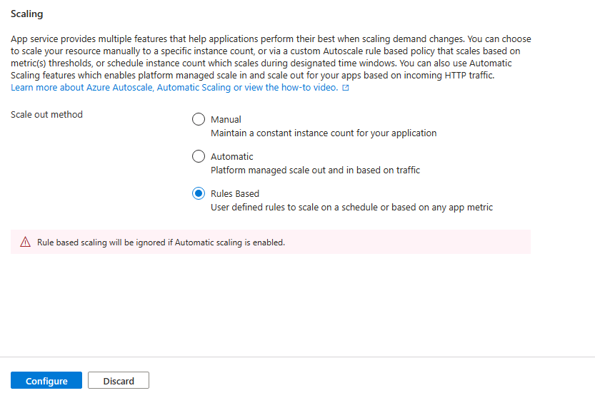

---
lab:
  az204Title: 'Lab 11: Monitor services that are deployed to Azure'
  az204Module: 'Learning Path 11: Troubleshoot solutions by using Application Insights'
---

# Lab 11: Monitorare i servizi distribuiti in Azure

## Interfaccia utente di Microsoft Azure

Considerata la natura dinamica degli strumenti cloud di Microsoft, è possibile rilevare modifiche all'interfaccia utente di Azure apportate dopo lo sviluppo di questo contenuto per la formazione. È quindi possibile che le istruzioni e le procedure del lab non siano allineate correttamente.

Microsoft aggiorna questo corso di formazione quando la community segnala le modifiche necessarie. Poiché gli aggiornamenti cloud vengono apportati spesso, tuttavia, è possibile che si rilevino modifiche all'interfaccia utente prima degli aggiornamenti del contenuto per la formazione. **In questo caso, adattarsi alle modifiche e quindi eseguire le operazioni necessarie nei lab.**

## Istruzioni

### Prima di iniziare

#### Accedere all'ambiente lab

Accedere alla macchina virtuale Windows 11 usando le credenziali seguenti:

- Nome utente: `Admin`
- Password: `Pa55w.rd`

> **Nota**: il docente fornirà le istruzioni necessarie per la connessione all'ambiente lab virtuale.

#### Esaminare le applicazioni installate

Trovare la barra delle applicazioni nel desktop di Windows 11. La barra delle applicazioni include le icone per le applicazioni che verranno usate nel lab, tra cui:
    
-   Microsoft Edge
-   Esplora file
-   Visual Studio Code
-   Azure PowerShell

## Scenario del lab

In questo lab si creerà una risorsa di Application Insights in Azure che verrà usata per monitorare e registrare i dati di Application Insights per una revisione successiva. L'API verrà impostata per la scalabilità automatica se la domanda aumenta fino a una determinata soglia e la registrazione dei dati consentirà di determinare come viene usato il servizio.

## Diagramma dell'architettura


### Esercizio 1 - Creare e configurare le risorse di Azure

#### Attività 1: Aprire il portale di Azure

1. Sulla barra delle applicazioni selezionare l'icona di **Microsoft Edge**.

1. Nella finestra del browser passare al portale di Azure in `https://portal.azure.com` e quindi accedere con l'account che verrà usato per questo lab.

    > **Nota**: se si sta eseguendo l'accesso al portale di Azure per la prima volta, verrà visualizzata una presentazione del portale. Selezionare **Attività iniziali** per ignorare la presentazione e iniziare a usare il portale.

#### Attività 2 : Creare una risorsa di Application Insights

1. Nel portale di Azure usare la casella di testo **Cerca risorse, servizi e documentazione** nella parte superiore della pagina per cercare **Application Insights** e quindi nell'elenco dei risultati selezionare **Application Insights**.

1. Nel pannello **Application Insights** selezionare **+ Crea**.

1. Nel pannello **Application Insights**, nella scheda **Dati principali**, eseguire le azioni seguenti e selezionare **Rivedi e crea**:
    
    | Impostazione | Azione |
    | -- | -- |
    | Elenco a discesa **Sottoscrizione** | Mantenere il valore predefinito |
    | Sezione **Gruppo di risorse** | Selezionare **Crea nuovo**, immettere **MonitoredAssets** e quindi selezionare **OK** |
    | Casella di testo **Nome**  | **instrm**_[nomeutente]_ |
    | Elenco a discesa **Area** | Selezionare un'area di Azure in cui è possibile distribuire una risorsa di Application Insights |
    | Sezione **Modalità risorsa** | Selezionare l'opzione **Basata su area di lavoro** |
    | Sezione **DETTAGLI DELL'AREA DI LAVORO** | Mantenere i valori predefiniti per gli elenchi a discesa **Sottoscrizione** e **Area di lavoro Log Analytics** |
    
    Lo screenshot seguente mostra le impostazioni configurate nel pannello **Application Insights**.

    
     
1. Nella scheda **Rivedi e crea** esaminare le opzioni selezionate durante i passaggi precedenti.

1. Selezionare **Crea** per creare l'istanza di **Application Insights** usando la configurazione specificata.

    > **Nota**: prima di procedere con il lab, attendere il completamento dell'attività di creazione.

1. Nel pannello **Microsoft.AppInsights \| Panoramica** selezionare il pulsante **Vai alla risorsa** per passare al pannello della risorsa di **Application Insights** appena creata.

1. Nella sezione **Configura** del pannello **Application Insights** selezionare il collegamento **Proprietà**.

1. Nel pannello **Proprietà**, accanto alla voce **Chiave di strumentazione**, selezionare il pulsante **Copia negli Appunti** e quindi registrare il valore copiato. Verrà usato più avanti in questo lab.

    > **Nota**: la chiave viene usata dalle applicazioni client per connettersi a una risorsa specifica di **Application Insights**.

### Attività 3: Creare una risorsa API Web di Azure

1. Nel portale di Azure usare la casella di testo **Cerca risorse, servizi e documentazione** nella parte superiore della pagina per cercare **Servizi app** e quindi nell'elenco dei risultati selezionare **Servizi app**.

1. Nel pannello servizio app selezionare **+ Crea** e quindi + **App** Web.** **
    
1. Nel pannello **Crea app** Web, nella **scheda Informazioni di base** , eseguire le azioni seguenti e quindi selezionare la **scheda Monitoraggio e protezione** :

    | Impostazione | Azione |
    | -- | -- |
    | Elenco a discesa **Sottoscrizione** | Mantenere il valore predefinito |
    | Elenco a discesa **Gruppo di risorse** |Selezionare **MonitoredAssets** |
    | Casella di testo **Nome**  | Immettere **smpapi**_[nomeutente]_ |
    | Sezione **Pubblica** | Selezionare **Codice** |
    | Elenco a discesa **Stack di runtime** | Selezionare **.NET 8 (LTS)** |
    | Sezione **Sistema operativo** |  selezionare **Windows** |
    | Elenco a discesa **Area**  |  Selezionare la stessa area scelta come località della risorsa di **Application Insights** |
    | Sezione **Piano Windows (Stati Uniti orientali)** | Selezionare **Crea nuovo**, nella casella di testo **Nome** immettere **MonitoredPlan** e quindi selezionare **OK** |
    | Sezione **Piano tariffario** |  Mantenere il valore predefinito |

1. Nella **scheda Monitoraggio e sicurezza** eseguire le azioni seguenti e quindi selezionare **Rivedi e crea**:
    
    | Impostazione | Azione |
    | -- | -- |
    | Sezione **Abilita Application Insights** | Assicurarsi che sia selezionata l'opzione **Sì** |
    | Elenco a discesa **Application Insights** | Selezionare la risorsa **instrm**_[nomeutente]_ di Application Insights creata precedentemente in questo lab |
    
1. Nella **scheda Crea app** Web esaminare le opzioni selezionate durante i passaggi precedenti.

1. Selezionare **Crea** per creare l'API Web usando la configurazione specificata.

    > **Nota**: prima di procedere con il lab, attendere il completamento dell'attività di creazione.

1. Nel pannello **Panoramica** della distribuzione selezionare il pulsante **Vai alla risorsa** per passare al pannello dell'API Web di Azure appena creata.

1. **Nel pannello servizio app** selezionare il **collegamento Variabili** di ambiente nella **sezione Impostazioni**.

1. **Nella sezione Variabili** di ambiente eseguire le azioni seguenti:
    
    a.  Nella **scheda Impostazioni** app selezionare Mostra valori** per visualizzare **i segreti associati all'API Web.

    b.  Si noti il valore che rappresenta la chiave **APPLICATIONINSIGHTS_CONNECTION_STRING**. Questo valore è stato impostato automaticamente durante la creazione della risorsa API Web.

1. Nel pannello **servizio app** selezionare **Panoramica** nella parte superiore del menu del servizio.

1. Nella sezione Informazioni di base del **pannello servizio app **** registrare il valore del **collegamento dominio predefinito**.** Questo valore verrà utilizzato più avanti nel lab per inviare richieste all'API Web.

#### Attività 4: Configurare le opzioni di scalabilità automatica dell'API Web

1. Nel pannello **Servizio app**, nella sezione **Impostazioni**, selezionare il collegamento **Scale Out (piano di servizio app)**.

1. Scorrere verso il basso fino a visualizzare il **metodo** Scale out. Selezionare l'opzione **Basata su** regole, quindi selezionare **Configura**.



1. Nella sezione **Aumenta istanze** eseguire le azioni seguenti e quindi selezionare **Salva**:
    
    | Impostazione | Azione |
    | -- | -- |
    | Sezione **Aumenta istanze** | Selezionare **Scalabilità automatica personalizzata** |
    | Casella di testo **Nome impostazione di scalabilità automatica** | Immettere **ComputeScaler** |
    | Elenco a discesa **Gruppo di risorse** |Selezionare **MonitoredAssets** |
    | Sezione **Modalità ridimensionamento** | Selezionare **Ridimensiona in base a una metrica** |
    | Casella di testo **Minimo** nella sezione **Limiti per le istanze** | Immettere **1** |
    | Casella di testo **Massimo** nella sezione **Limiti per le istanze** | Immettere **8** |
    | Casella di testo **Predefinito** nella sezione **Limiti per le istanze** | Immettere **3** |
   
    Lo screenshot seguente mostra le impostazioni configurate nella sezione **Aumenta istanze** del pannello **Servizio app**.
    
    

    | Impostazione | Azione |
    | -- | -- |
    | Sezione **Regole** | Selezionare **Aggiungi una regola** |
    | Pannello **Regola di ridimensionamento** | Mantenere i valori predefiniti per tutte le impostazioni e quindi selezionare **Aggiungi** |

    Lo screenshot seguente mostra le altre impostazioni nella sezione **Aumenta istanze** del pannello **Servizio app**.

   

    > **Nota**: prima di continuare con il lab, attendere il completamento dell'attività di salvataggio.

#### Revisione

In questo esercizio sono state create le risorse di Azure che verranno usate per il resto del lab.

### Esercizio 2: Monitorare un'API Web locale usando Application Insights

#### Attività 1: Compilare un progetto API Web .NET

1. Dal computer del lab avviare **Visual Studio Code**.

1. In Visual Studio Code scegliere **Apri cartella** dal menu **File**.

1. Nella finestra **Apri cartella** passare a **Allfiles (F):\\Allfiles\\Labs\\11\\Starter\\Api** e quindi scegliere **Seleziona cartella**.

1. Nella finestra di **Visual Studio Code**, nella barra dei menu, selezionare **Terminale** e quindi **Nuovo Terminale***.

1. Al prompt del terminale eseguire il comando seguente per creare una nuova applicazione API Web .NET denominata **SimpleApi** nella directory corrente:

    ```
    dotnet new webapi --output . --name SimpleApi --framework net8.0
    ```

1. Eseguire il comando seguente per importare la versione 2.21.0 di **Microsoft.ApplicationInsights** da NuGet nel progetto corrente:

    ```
    dotnet add package Microsoft.ApplicationInsights --version 2.21.0
    ```

    > **Nota**: il comando **dotnet add package** aggiungerà il pacchetto **Microsoft.ApplicationInsights** da NuGet. Per altre informazioni, vedere [Microsoft.ApplicationInsights](https://www.nuget.org/packages/Microsoft.ApplicationInsights/).

1. Eseguire il comando seguente per importare la versione 2.21.0 di **Microsoft.ApplicationInsights.AspNetCore** da NuGet:

    ```
    dotnet add package Microsoft.ApplicationInsights.AspNetCore --version 2.21.0
    ```

    > **Nota**: il comando **dotnet add package** aggiungerà il pacchetto **Microsoft.ApplicationInsights.AspNetCore** da NuGet. Per altre informazioni, vedere [Microsoft.ApplicationInsights.AspNetCore](https://www.nuget.org/packages/Microsoft.ApplicationInsights.AspNetCore).

1. Nel prompt del terminale eseguire il comando seguente per importare la versione 2.21.0 di **Microsoft.ApplicationInsights.PerfCounterCollector** da NuGet nel progetto corrente:

    ```
    dotnet add package Microsoft.ApplicationInsights.PerfCounterCollector --version 2.21.0
    ```

    > **Nota**: il comando **dotnet add package** aggiungerà il pacchetto **Microsoft.ApplicationInsights.PerfCounterCollector** da NuGet. Per altre informazioni, vedere [Microsoft.ApplicationInsights.PerfCounterCollector](https://www.nuget.org/packages/Microsoft.ApplicationInsights.PerfCounterCollector/).

1. Nel prompt del terminale eseguire il comando seguente per importare la versione 2.4.0 di **Microsoft.ApplicationInsights.Profiler.AspNetCore** da NuGet nel progetto corrente:

    ```
    dotnet add package Microsoft.ApplicationInsights.Profiler.AspNetCore --version 2.4.0
    ```

    > **Nota**: il comando **dotnet add package** aggiungerà il pacchetto **Microsoft.ApplicationInsights.Profiler.AspNetCore** da NuGet. Per altre informazioni, vedere [Microsoft.ApplicationInsights.Profiler.AspNetCore](https://www.nuget.org/packages/Microsoft.ApplicationInsights.Profiler.AspNetCore/).

1. Dal prompt del terminale eseguire il comando seguente per compilare l'API Web .NET:

    ```
    dotnet build
    ```
    
#### Attività 2: Aggiornare il codice dell'app per disabilitare HTTPS e usare Application Insights

1. Nel riquadro **Explorer** della finestra di **Visual Studio Code** selezionare il file **Program.cs** per aprire il file nel riquadro dell'**editor**.

1. Nel riquadro dell'**editor** trovare ed eliminare il codice seguente nella riga 17:

    ```csharp
    app.UseHttpsRedirection();
    ```

    > **Nota**: questa riga di codice impone all'API Web di usare HTTPS. Per questo lab, questa operazione non è necessaria.

1. Nel file **Program.cs** aggiungere le due righe seguenti a partire dalla riga 7 per abilitare il profiler registrandolo insieme ad Application Insights nella raccolta Servizi:

    ```csharp
    builder.Services.AddApplicationInsightsTelemetry();
    builder.Services.AddServiceProfiler();
    ```

1. Salvare le modifiche e chiudere il file **Program.cs**.

1. Nel riquadro **Explorer** della finestra di **Visual Studio Code** selezionare il file **appsettings.json** per aprire il file nel riquadro dell'**editor**.

1. Aggiungere al file **appsettings.json** l'elemento seguente subito dopo l'elemento **Logging**, sostituendo il segnaposto `instrumentation-key` con il valore della chiave di strumentazione della risorsa di Application Insights registrata in precedenza in questo lab:

    ```json
       "ApplicationInsights":
       {
          "InstrumentationKey": "instrumentation-key"
       },
    ```

    > **Nota**: se la sezione che si aggiunge è l'ultimo elemento del file, rimuovere la virgola finale.

1. Il file appsettings.json dovrebbe ora essere simile alla struttura seguente:

    ```json
    {
        "Logging":{
            "LogLevel": {
                "Default": "Information",
                "Microsoft.AspNetCore": "Warning"
            }
        },
       "ApplicationInsights":
       {
          "InstrumentationKey": "instrumentation-key"
       },
       "AllowedHosts": "*"
    }
    ```

    > **Nota** Assicurarsi di aver sostituito il segnaposto con la propria chiave di strumentazione registrata in precedenza.

1. Salvare le modifiche apportate al file **appsettings.json** e chiuderlo.

1. Dal prompt del terminale eseguire il comando seguente per compilare l'API Web .NET.

    ```
    dotnet publish -c Release -r win-x86 --self-contained -p:PublishReadyToRun=true .\SimpleApi.csproj
    ```

#### Attività 3: Testare un'applicazione API in locale

1. Dal prompt del terminale eseguire il comando seguente per avviare l'API Web .NET.

    ```
    dotnet run
    ```

1. Esaminare l'output del comando e notare l'URL HTTP su cui il sito è in ascolto.

1. Dalla barra delle applicazioni aprire il menu di scelta rapida per **Microsoft Edge** e quindi aprire una nuova finestra del browser.

1. Nella finestra del browser visualizzata passare all'URL `http://localhost` e aggiungere il percorso relativo **/weatherforecast** dell'API Web.
    
    > **Nota**: l'URL completo è `http://localhost:[port-number]/weatherforecast`, dove il `[port-number]` segnaposto identifica il numero di porta in corrispondenza del quale l'app Web è accessibile tramite il protocollo HTTP.

    > **Nota**: la pagina deve contenere un output nel formato seguente. I valori **effettivi saranno** diversi. 

    ```json
    [
        {
            "date": "2023-10-29",
            "temperatureC": -8,
            "summary": "Sweltering",
            "temperatureF": 18
        },
        {
            "date": "2023-10-30",
            "temperatureC": -12,
            "summary": "Hot",
            "temperatureF": 11
        },
        {
            "date": "2023-10-31",
            "temperatureC": 50,
            "summary": "Chilly",
            "temperatureF": 121
        },
        {
            "date": "2023-11-01",
            "temperatureC": 51,
            "summary": "Chilly",
            "temperatureF": 123
        },
        {
            "date": "2023-11-02",
            "temperatureC": 29,
            "summary": "Balmy",
            "temperatureF": 84
        }
    ]
    ```

1. Aggiornare la pagina del browser diverse volte per simulare alcune risposte.

1. Chiudere la finestra del browser che visualizza la pagina generata da `http://localhost:[port-number]/weatherforecast`.

1. In Visual Studio Code selezionare **Termina il terminale** (l'icona del **Cestino**) per chiudere il riquadro del **terminale** e tutti i processi associati.

#### Attività 4: Esaminare le metriche in Application Insights

1. Nel computer del lab passare alla finestra del browser **Microsoft Edge** in cui è visualizzato il portale di Azure.

1. Nel portale di Azure tornare al pannello della risorsa **instrm**_[nomeutente]_ di Application Insights creata in precedenza in questo lab.

1. Nel pannello **Application Insights**, nei riquadri al centro del pannello, trovare le metriche visualizzate. In particolare, trovare il numero di richieste del server che si sono verificate e il tempo medio di risposta del server.

    Lo screenshot seguente mostra le metriche **Application Insights** dell'app Web locale.

    

    > **Nota**: possono essere necessari fino a cinque minuti per osservare le richieste nei grafici delle metriche Application Insights.

#### Revisione

In questo esercizio è stata creata un'app per le API usando ASP.NET ed è stata configurata per trasmettere le metriche dell'applicazione ad Application Insights. È stato quindi usato il dashboard di Application Insights per esaminare i dettagli sulle prestazioni dell'API.

### Esercizio 3: Monitorare un'API Web usando Application Insights

#### Attività 1: Distribuire un'applicazione nell'API Web

1. Nel computer del lab passare a Visual Studio Code.

1. Nella finestra di **Visual Studio Code**, nella barra dei menu, selezionare **Terminale** e quindi **Nuovo terminale**.

1. Al prompt del terminale eseguire il comando seguente per assicurarsi che la directory corrente sia impostata sul **Allfiles (F):\\Allfiles\\Labs\\11\\Starter\\Api\\bin\\Release\\net8.0\\net8.0\\win-x86\\publish**, dove risiedono i file di distribuzione:

    ```
    cd F:\Allfiles\Labs\11\Starter\Api\bin\Release\net8.0\win-x86\publish\
    ```

1. Eseguire il comando seguente per creare un file ZIP contenente il progetto iniziale che verrà distribuito accanto all'API Web di Azure:

    ```powershell
    Compress-Archive -Path * -DestinationPath api.zip
    ```

1. Al prompt del terminale eseguire il comando seguente per accedere alla sottoscrizione di Azure usando Azure PowerShell:

    ```powershell
    Connect-AzAccount
    ```

1. Quando richiesto, eseguire l'autenticazione specificando le credenziali per accedere alla sottoscrizione di Azure usata per questo lab.

    > **Nota**: attendere il completamento della procedura di accesso.

1. Eseguire il comando seguente per visualizzare l'elenco di tutte le app Web nel gruppo di risorse **MonitoredAssets**:

    ```powershell
    Get-AzWebApp -ResourceGroupName MonitoredAssets
    ```

1. Eseguire il comando seguente per visualizzare l'elenco di tutte le app Web nel gruppo di risorse **MonitoredAssets** il cui nome inizia con **smpapi\***:

    ```powershell
    Get-AzWebApp -ResourceGroupName MonitoredAssets | Where-Object {$_.Name -like 'smpapi*'}
    ```

1. Eseguire i comandi seguenti per visualizzare il nome della prima delle app Web identificate nel passaggio precedente e archiviarlo in una variabile denominata **$webAppName**:

    ```powershell
    Get-AzWebApp -ResourceGroupName MonitoredAssets | Where-Object {$_.Name -like 'smpapi*'} | Select-Object -ExpandProperty Name
    $webAppName = (Get-AzWebApp -ResourceGroupName MonitoredAssets | Where-Object {$_.Name -like 'smpapi*'})[0] | Select-Object -ExpandProperty Name
    ```

1. Eseguire il comando seguente per distribuire il file **api.zip** creato in precedenza in questa attività all'API Web il cui nome è stato identificato nel passaggio precedente:

    ```powershell
    Publish-AzWebApp -ResourceGroupName MonitoredAssets -Name $webAppName -ArchivePath "F:\Allfiles\Labs\11\Starter\Api\bin\Release\net8.0\win-x86\publish\api.zip" -force
    ```

    > **Nota**: prima di continuare con il lab, attendere il completamento dell'attività di distribuzione.

1. Nel computer del lab avviare un'altra finestra del browser Microsoft Edge.

1. Nella finestra del browser passare all'app per le API Web di Azure in cui è stata distribuita l'app per le API in precedenza in questa attività aggiungendo al relativo URL (registrato in precedenza in questo lab) il suffisso **/weatherforecast**.

    > **Nota**: ad esempio, se l'URL è `https://smpapianu.azurewebsites.net`, il nuovo URL sarà `https://smpapianu.azurewebsites.net/weatherforecast`.

1. Verificare che l'output sia simile a quello generato quando si esegue l'app per le API in locale.

    > **Nota**: l'output includerà valori diversi, ma deve avere lo stesso formato.

#### Attività 2: Configurare la raccolta approfondita delle metriche per le app Web

1. Nel computer del lab passare alla finestra del browser **Microsoft Edge** in cui è visualizzato il portale di Azure.

1. Nel portale di Azure tornare al pannello della risorsa per l'app Web **smpapi**_[nomeutente]_ creata in precedenza in questo lab.

1. Nel pannello **Servizio app** selezionare **Application Insights**.

1. Nel pannello **Application Insights** eseguire le azioni seguenti, selezionare **Applica** e quindi nella finestra di dialogo di conferma selezionare **Sì**:

    | Impostazione | Azione |
    | -- | -- |
    | Dispositivo di scorrimento **Application Insights** | Assicurarsi che sia impostato su **Abilita** |
    | Sezione **Instrumentare l'applicazione** | Fare clic sulla scheda **.NET** |
    | Sezione **Livello raccolta** | Selezionare **Consigliato** |
    | Sezione **Profiler** | Selezionare **Attivato** |
    | Sezione **Debugger di snapshot** | Selezionare **Disattivato** |
    | Sezione **Comandi SQL** | Selezionare **Disattivato** |

    
    Lo screenshot seguente mostra le impostazioni **Application Insights** dell'API Web di Azure.
    
    

1. Passare alla scheda del browser aperta nell'attività precedente per visualizzare i risultati della distribuzione dell'app per le API nell'app per le API di Azure di destinazione (incluso il percorso relativo **/weatherforecast** nell'URL di destinazione) e aggiornare la pagina del browser più volte.

1. Esaminare l'output in formato JSON generato dall'API.

1. Registrare l'URL usato per accedere all'output in formato JSON.

    > **Nota**: l'URL deve essere nel formato `https://smpapianu.azurewebsites.net/weatherforecast` se **smpapianu** è il nome del sito creato in precedenza.

#### Attività 3: Ottenere metriche aggiornate in Application Insights

1. Tornare alla finestra del browser che visualizza l'app Web di Azure nel portale di Azure.

1. Nel pannello **Application Insights** dell'app Web selezionare il collegamento **Visualizza i dati di Application Insights**.

1. Nel pannello **Application Insights** esaminare le metriche raccolte nei riquadri al centro del pannello, inclusi il numero di richieste server che si sono verificate e il tempo medio di risposta del server.
 
    Lo screenshot seguente mostra le metriche **Application Insights** dell'app Web di Azure nel portale di Azure.
     
    

    > **Nota**: possono essere necessari fino a cinque minuti per visualizzare le metriche aggiornate nei grafici delle metriche Application Insights.

#### Attività 4: Visualizzare le metriche in tempo reale in Application Insights

1. Nel pannello **Application Insights**, nella sezione **Ricerca causa**, selezionare **Metriche attive**.

1. Tornare alla finestra del browser in cui è visualizzata l'app per le API di destinazione in esecuzione nell'app Web di Azure di destinazione (che ha come destinazione il percorso relativo **/weatherforecast** nell'URL di destinazione) e quindi aggiornare la pagina del browser più volte.

1. Passare alla finestra del browser che visualizza il pannello **Metriche attive** ed esaminarne il contenuto.

    > **Nota**: la sezione **Richieste in ingresso** dovrebbe aggiornarsi entro pochi secondi, mostrando le richieste effettuate all'API Web.

#### Revisione

In questo esercizio è stata configurata e testata la registrazione di Application Insights dell'app per le API Web e sono state visualizzate informazioni in tempo reale sulle richieste effettuate.
