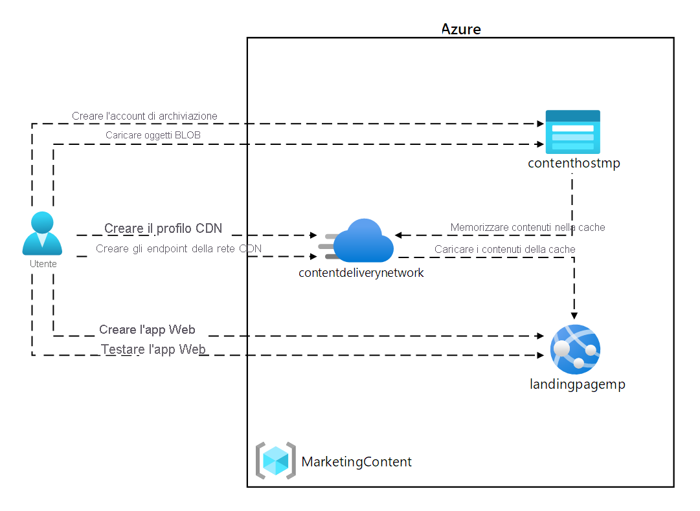
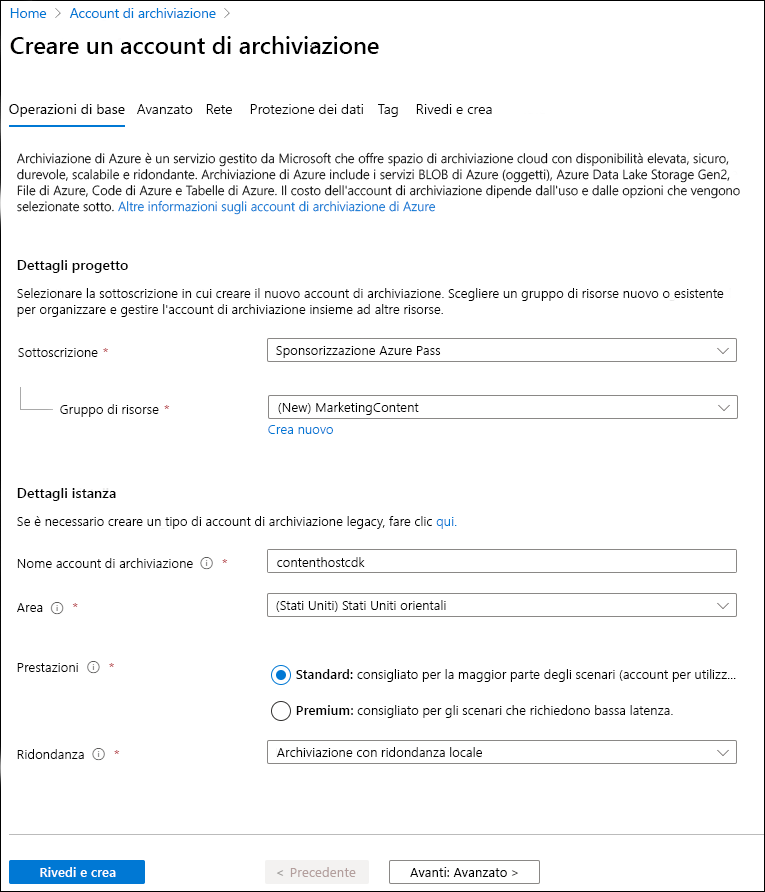
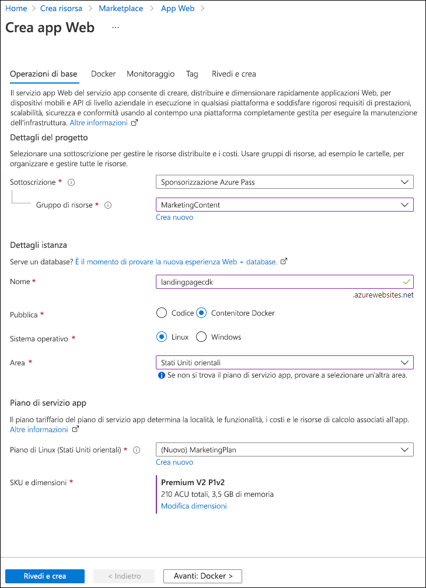
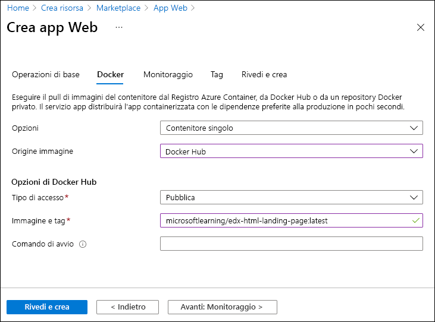
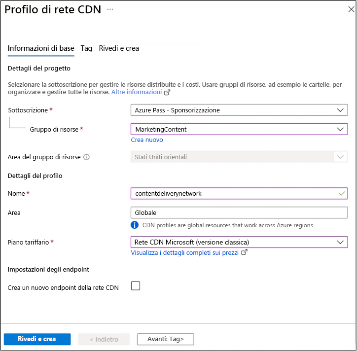
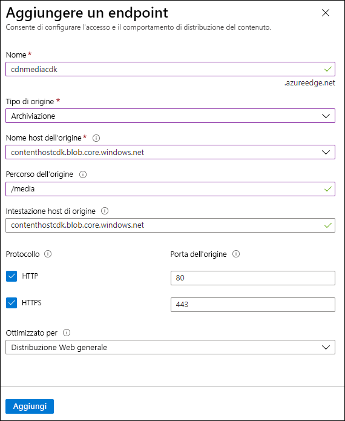
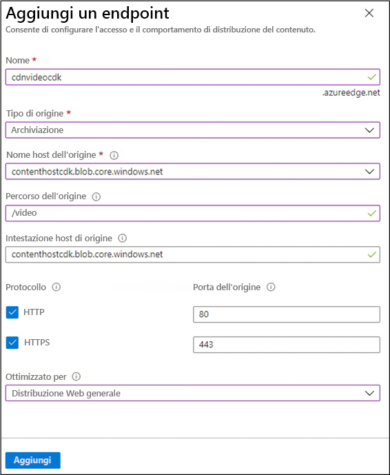
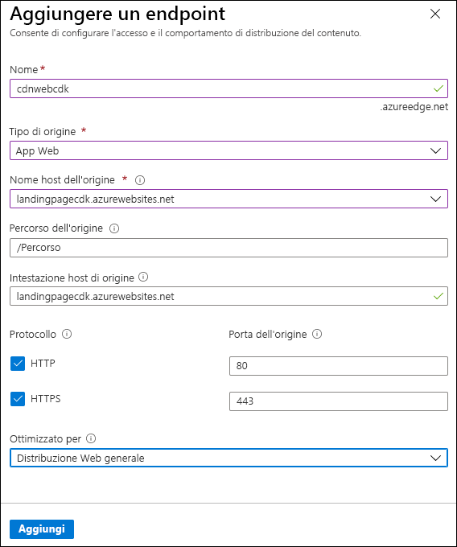

---
lab:
  az204Title: 'Lab 12: Enhance a web application by using the Azure Content Delivery Network'
  az204Module: 'Learning Path 12: Implement caching for solutions'
---

# Lab 12: Migliorare un'applicazione Web usando Rete di distribuzione dei contenuti di Azure

## Interfaccia utente di Microsoft Azure

Considerata la natura dinamica degli strumenti cloud di Microsoft, è possibile rilevare modifiche all'interfaccia utente di Azure apportate dopo lo sviluppo di questo contenuto per la formazione. È quindi possibile che le istruzioni e le procedure del lab non siano allineate correttamente.

Microsoft aggiorna questo corso di formazione quando la community segnala le modifiche necessarie. Poiché gli aggiornamenti cloud vengono apportati spesso, tuttavia, è possibile che si rilevino modifiche all'interfaccia utente prima degli aggiornamenti del contenuto per la formazione. **In questo caso, adattarsi alle modifiche e quindi eseguire le operazioni necessarie nei lab.**

## Istruzioni

### Prima di iniziare

#### Accedere all'ambiente lab

Accedere alla macchina virtuale Windows 10 usando le credenziali seguenti:

- Nome utente: `Admin`
- Password: `Pa55w.rd`

> **Nota**: il docente fornirà le istruzioni necessarie per la connessione all'ambiente lab virtuale.

#### Esaminare le applicazioni installate

Trovare la barra delle applicazioni nel desktop di Windows 10. Questa barra delle applicazioni contiene l'icona dell'applicazione che verrà usata in questo lab:

- Microsoft Edge

## Lab Scenario

In questo lab si implementeranno le funzionalità di Azure rete per la distribuzione di contenuti per fornire una soluzione di memorizzazione nella cache basata sulle posizioni dei clienti. Il lab configura un account di archiviazione per i file di immagine e video, che sono interessati maggiormente dai problemi di latenza. Si userà l'rete per la distribuzione di contenuti di Azure per implementare la soluzione di memorizzazione nella cache per ridurre la latenza per questi file di immagine e video.

## Diagramma dell'architettura



### Esercizio 1: Creare risorse di Azure

#### Attività 1: Aprire il portale di Azure

1. Sulla barra delle applicazioni selezionare l'icona di **Microsoft Edge**.

1. Nella finestra del browser aperta passare al portale di Azure in `https://portal.azure.com`e quindi accedere con l'account che verrà usato per questo lab.

   > **Nota**: se si sta eseguendo l'accesso al portale di Azure per la prima volta, verrà visualizzata una presentazione del portale. Selezionare **Attività iniziali** per ignorare la presentazione e iniziare a usare il portale.

#### Attività 2: Creare un account di archiviazione

1. Nel portale di Azure usare la casella di testo **Cerca risorse, servizi e documentazione** per cercare **Account di archiviazione** e quindi nell'elenco di risultati selezionare **Account di archiviazione**.

1. Nel pannello **Account di archiviazione** selezionare **+ Crea**.

1. Nel pannello **Crea un account** di archiviazione eseguire le azioni seguenti nella **scheda Informazioni di base** .

   | Impostazione | Azione |
   | -- | -- |
   | Elenco a discesa **Sottoscrizione** | Mantenere il valore predefinito |
   | Sezione **Gruppo di risorse** | Selezionare **Crea nuovo**, immettere **MarketingContent** e quindi selezionare **OK** |
   | Casella di testo **Nome account di archiviazione** | Immettere **contenthost**_[nomeutente]_ |
   | Elenco a discesa **Area** | Selezionare **(Stati Uniti) Stati Uniti orientali** |
   | Sezione **Prestazioni** | Selezionare l'opzione **Standard** |
   | Elenco a discesa **Ridondanza** | Selezionare **Archiviazione con ridondanza locale**. |

    Lo screenshot seguente mostra le impostazioni configurate nel pannello **Crea un account di archiviazione**.

    

1. Nella scheda Avanzate** verificare che **l'opzione **Consenti l'abilitazione dell'accesso pubblico nei singoli contenitori** sia abilitata. Selezionare la casella se non è abilitata.

1. Nella scheda **Rivedi** esaminare le opzioni selezionate durante i passaggi precedenti.

1. Selezionare **Crea** per creare l'account di archiviazione usando la configurazione specificata.

    > **Nota**: prima di procedere con il lab, attendere il completamento dell'attività di creazione.

#### Attività 3: Creare un'app Web usando Servizio app di Azure

1. Nel riquadro di spostamento del portale di Azure selezionare **Crea una risorsa**.

1. Nel pannello **Crea una risorsa**, nella casella di testo **Cerca servizi e marketplace**, immettere **App Web** e quindi premere INVIO.

1. Nel pannello dei risultati della ricerca selezionare il risultato **App Web** e quindi selezionare **Crea**.

1. Nella scheda **Informazioni di base** del pannello **Crea app Web** eseguire le azioni seguenti e selezionare **Avanti: Docker**:

   | Impostazione | Azione |
   | -- | -- |
   | Elenco a discesa **Sottoscrizione** | Mantenere il valore predefinito |
   | Elenco a discesa **Gruppo di risorse** | Selezionare **MarketingContent** nell'elenco |
   | Casella di testo **Nome** | Immettere **landingpage**_[nomeutente]_ |
   | Sezione **Pubblica** | Selezionare **Contenitore Docker** |
   | Sezione **Sistema operativo** | Selezionare **Linux**. |
   | Elenco a discesa **Area** | Selezionare **Stati Uniti orientali**. |
   | Sezione **Piano Linux (Stati Uniti orientali)** | Selezionare **Crea nuovo**. Nella casella di testo **Nome** immettere **MarketingPlan** e quindi selezionare **OK** |
   | Sezione **Piano tariffario** | Mantenere il valore predefinito |

   Lo screenshot seguente mostra le impostazioni configurate nel pannello **Crea app Web**.

   

1. Nella scheda **Docker** eseguire le azioni seguenti e quindi selezionare **Rivedi e crea**:

   | Impostazione | Azione |
   | -- | -- |
   | Elenco a discesa **Opzioni** | Selezionare **Contenitore singolo** |
   | Elenco a discesa **Origine immagine** | Selezionare **Docker Hub** |
   | Elenco a discesa **Tipo di accesso** | Selezionare **Pubblico** |
   | Casella di testo **Immagine e tag** | Immettere **microsoftlearning/edx-html-landing-page:latest** |

   Lo screenshot seguente mostra le impostazioni configurate nella scheda **Docker**.

   

1. Nella scheda **Rivedi e crea** esaminare le opzioni selezionate durante i passaggi precedenti.

1. Selezionare **Crea** per creare l'app Web usando la configurazione specificata.

    > **Nota**: prima di procedere con il lab, attendere il completamento dell'attività di creazione.

1. Nel pannello **Distribuzione** selezionare **Vai alla risorsa**.

1. **Nel pannello Panoramica** servizio app, in **Informazioni di** base, registrare il valore del **collegamento dominio predefinito**. Questo valore verrà utilizzato più avanti nel lab.

#### Revisione

In questo esercizio sono stati creati un account di archiviazione di Azure e un'app Web di Azure che verranno usati più avanti in questo lab.

### Esercizio 2: Configurare Rete di distribuzione dei contenuti e gli endpoint

#### Attività 1: Aprire Azure Cloud Shell

1. Nel portale di Azure selezionare l'icona di **Cloud Shell**  per aprire una nuova sessione di Bash. Se in Cloud Shell viene aperta per impostazione predefinita una sessione di PowerShell, selezionare **PowerShell** e nel menu a discesa selezionare **Bash**.

    > **Nota**: se è la prima volta che si avvia **Cloud Shell**, quando viene richiesto di selezionare **Bash** o **PowerShell** selezionare **Bash**. Quando viene visualizzato il messaggio **Non sono state montate risorse di archiviazione**, selezionare la sottoscrizione in uso in questo lab e quindi **Crea risorsa di archiviazione**.

1. Nel portale di Azure, nel prompt dei comandi di **Cloud Shell** eseguire il comando seguente per ottenere la versione dello strumento dell'interfaccia della riga di comando di Azure:

    ```bash
    az --version
    ```

#### Attività 2: Registrare il provider Microsoft.CDN

1. Al prompt dei comandi di **Cloud Shell** nel portale eseguire le azioni seguenti:

    a.  Immettere il comando seguente per verificare se il provider Microsoft.CDN è stato registrato. Proseguire con il passaggio 2. Se il provider Microsoft.CDN è già stato registrato:

    ```bash
    az provider show --namespace Microsoft.CDN --query "registrationState"
    ```

    b.  Se il provider Microsoft.CDN non è stato registrato. Immettere il comando seguente e quindi premere INVIO per registrare lo spazio dei nomi **Microsoft.CDN** con la sottoscrizione corrente:

    ```bash
    az provider register --namespace Microsoft.CDN
    ```

1. Chiudere il riquadro **Cloud Shell** nel portale.

#### Attività 3: Creare un profilo di Rete di distribuzione dei contenuti

1. Nel riquadro di spostamento del portale di Azure selezionare **Crea una risorsa**.

1. Nel pannello **Crea una risorsa**, nella casella di testo **Cerca servizi e marketplace**, immettere **CDN** e quindi premere INVIO.

1. Nel pannello dei risultati della ricerca nel **Marketplace** selezionare il risultato **Profili Frontdoor e CDN** e quindi selezionare **Crea**.

1. Nella pagina **Confronta offerte** selezionare **Esplora altre offerte** e quindi selezionare **Rete CDN di Azure Standard di Microsoft (versione classica)** e quindi selezionare **Continua**.

1. Nella scheda **Profilo CDN** del pannello **Informazioni principali** eseguire le azioni seguenti e selezionare **Rivedi e crea**:

   | Impostazione | Azione |
   | -- | -- |
   | Elenco a discesa **Sottoscrizione** | Mantenere il valore predefinito |
   | Elenco a discesa **Gruppo di risorse** | Selezionare **MarketingContent** nell'elenco |
   | Casella di testo **Nome** | Immettere **contentdeliverynetwork** |
   | Casella di testo **Area** | Mantenere il valore **predefinito Global** |
   | Elenco a discesa **Piano tariffario** | Mantenere il valore **predefinito Microsoft rete CDN (versione classica)** |
   | **Casella di controllo Crea un nuovo endpoint** rete CDN | Non selezionato |

   Lo screenshot seguente mostra le impostazioni configurate nel pannello **Profilo CDN**.

   

1. Nella scheda **Rivedi e crea** esaminare le opzioni selezionate durante i passaggi precedenti.

1. Selezionare **Crea** per creare il profilo CDN usando la configurazione specificata.
  
    > **Nota**: attendere che Azure finisca di creare il profilo CDN prima di procedere con il lab. Si riceverà una notifica al momento della creazione del profilo.

#### Attività 4: Configurare Contenitori di archiviazione

1. Nel riquadro di spostamento del portale di Azure selezionare **Gruppi di risorse**.

1. Nel pannello **Gruppi di risorse** selezionare il gruppo di risorse **MarketingContent** creato in precedenza in questo lab.

1. Nel pannello **MarketingContent** selezionare l'account di archiviazione **contenthost**_[nomeutente]_ creato in precedenza in questo lab.

1. Nel pannello **Account di archiviazione** selezionare il collegamento **Contenitori** nella sezione **Archiviazione dati**.

1. Nella sezione **Contenitori** selezionare **+ Contenitore**.

1. Nella finestra popup **Nuovo contenitore** eseguire le azioni seguenti e quindi selezionare **Crea**:

   | Impostazione | Azione |
   | -- | -- |
   | Casella di testo **Nome** | Immettere **media** |
   | Elenco a discesa **Livello di accesso pubblico** | Selezionare **BLOB (accesso in lettura anonimo solo per i BLOB)** |

1. Nella sezione **Contenitori** selezionare di nuovo **+ Contenitore**.

1. Nella finestra popup **Nuovo contenitore** eseguire le azioni seguenti e quindi selezionare **Crea**:

   | Impostazione | Azione |
   | -- | -- |
   | Casella di testo **Nome** | Immettere **video** |
   | Elenco a discesa **Livello di accesso pubblico** | Selezionare **BLOB (accesso in lettura anonimo solo per i BLOB)** |

1. Osservare l'elenco dei contenitori aggiornato e verificare che siano elencati i contenitori **media** e **video**.

#### Attività 5: Creare endpoint di Rete di distribuzione dei contenuti di Azure

1. Nel riquadro di spostamento del portale di Azure selezionare il collegamento **Gruppi di risorse**.

1. Nel pannello **Gruppi di risorse** selezionare il gruppo di risorse **MarketingContent** creato in precedenza in questo lab.

1. Nel pannello **MarketingContent** selezionare il profilo CDN **contentdeliverynetwork** creato in precedenza in questo lab.

1. Nel pannello **Profilo CDN** selezionare **+ Endpoint**.

1. Nella finestra di dialogo popup **Aggiungi un endpoint** eseguire le azioni seguenti e quindi selezionare **Aggiungi**:

   | Impostazione | Azione |
   | -- | -- |
   | Casella di testo **Nome** | Immettere **cdnmedia**_[nomeutente]_ |
   | Elenco a discesa **Tipo di origine** | Selezionare **Archiviazione** |
   | Elenco a discesa **Nome host dell'origine** | Selezionare l'opzione **contenthost *[nomeutente]*.blob.core.windows.net** per l'account di archiviazione creato in precedenza in questo lab |
   | Casella di testo **Percorso dell'origine** | Immettere **/media** |
   | Casella di testo **Intestazione host dell'origine** | Mantenere il valore predefinito |
   | Sezioni **Protocollo** e **Porta dell'origine** | Mantenere i valori predefiniti |
   | Elenco a discesa **Ottimizzato per** | Selezionare **Distribuzione Web generale** |

   Lo screenshot seguente mostra le impostazioni configurate nella finestra di dialogo **Aggiungi un endpoint**.

   

1. Nel pannello **Profilo CDN** selezionare di nuovo **+ Endpoint**.

1. Nella finestra di dialogo popup **Aggiungi un endpoint** eseguire le azioni seguenti e quindi selezionare **Aggiungi**:

   | Impostazione | Azione |
   | -- | -- |
   | Casella di testo **Nome** | Immettere **cdnvideo**_[nomeutente]_ |
   | Elenco a discesa **Tipo di origine** | Selezionare **Archiviazione** |
   | Elenco a discesa **Nome host dell'origine** | Selezionare l'opzione **contenthost *[nomeutente]*.blob.core.windows.net** per l'account di archiviazione creato in precedenza in questo lab |
   | Casella di testo **Percorso dell'origine** | Immettere **/video** |
   | Casella di testo **Intestazione host dell'origine** | Mantenere il valore predefinito |
   | Sezioni **Protocollo** e **Porta dell'origine** | Mantenere i valori predefiniti |
   | Elenco a discesa **Ottimizzato per** | Selezionare **Distribuzione Web generale** |

   Lo screenshot seguente mostra le impostazioni configurate nella finestra di dialogo **Aggiungi un endpoint**.

   

1. Nel pannello **Profilo CDN** selezionare di nuovo **+ Endpoint**.

1. Nella finestra di dialogo popup **Aggiungi un endpoint** eseguire le azioni seguenti e quindi selezionare **Aggiungi**:

   | Impostazione | Azione |
   | -- | -- |
   | Casella di testo **Nome** | Immettere **cdnweb**_[nomeutente]_ |
   | Elenco a discesa **Tipo di origine** | Selezionare **App Web** |
   | Elenco a discesa **Nome host dell'origine** | Selezionare l'opzione **landingpage *[nomeutente]*.azurewebsites.net** per l'app Web creata in precedenza in questo lab |
   | Casella di testo **Percorso dell'origine** | Mantenere il valore predefinito |
   | Casella di testo **Intestazione host dell'origine** | Mantenere il valore predefinito |
   | Sezioni **Protocollo** e **Porta dell'origine** | Mantenere i valori predefiniti |
   | Elenco a discesa **Ottimizzato per** | Selezionare **Distribuzione Web generale** |

   Lo screenshot seguente mostra le impostazioni configurate nella finestra di dialogo **Aggiungi un endpoint**.

   

#### Revisione

In questo esercizio è stato registrato il provider di risorse per rete per la distribuzione di contenuti (rete CDN) e quindi il provider è stato usato per creare sia un profilo CDN che le risorse endpoint.

### Esercizio 3: Caricare e configurare contenuto Web statico

#### Attività 1: Osservare la pagina di destinazione

1. Nel riquadro di spostamento del portale di Azure selezionare **Gruppi di risorse**.

1. Nel pannello **Gruppi di risorse** selezionare il gruppo di risorse **MarketingContent** creato in precedenza in questo lab.

1. Nel pannello **MarketingContent** selezionare l'app Web **landingpage**_[nomeutente]_ creata in precedenza in questo lab.

1. Nel pannello **Servizio app** selezionare **Sfoglia**. Si aprirà una nuova scheda del browser che restituisce il sito Web corrente. Osservare il messaggio di errore visualizzato sullo schermo. Il sito Web non funzionerà fino a quando non si configureranno le impostazioni specificate per fare riferimento al contenuto multimediale.

1. Tornare alla finestra del browser attualmente aperta che visualizza il portale di Azure.

#### Attività 2: Caricare BLOB di archiviazione

1. Nel riquadro di spostamento del portale di Azure selezionare **Gruppi di risorse**.

1. Nel pannello **Gruppi di risorse** selezionare il gruppo di risorse **MarketingContent** creato in precedenza in questo lab.

1. Nel pannello **MarketingContent** selezionare l'account di archiviazione **contenthost**_[nomeutente]_ creato in precedenza in questo lab.

1. Nel pannello **Account di archiviazione** selezionare il collegamento **Contenitori** nella sezione **Archiviazione dati**.

1. Nella sezione **Contenitori** selezionare il contenitore **media** e quindi selezionare **Carica**.

1. Nella finestra popup **Carica BLOB** eseguire le azioni seguenti:

    a.  **Nella sezione File** selezionare **Sfoglia per i file** o usare la funzionalità di trascinamento della selezione.

    b.  Nella finestra **Esplora file** passare ad **Allfiles (F):\\Allfiles\\Labs\\12\\Starter**, selezionare i file seguenti e quindi **Apri**:

    - **campus.jpg**

    - **conference.jpg**

    - **poster.jpg**

    c.  Assicurarsi che sia selezionata l'opzione **Sovrascrivi se i file esistono già** e quindi selezionare **Carica**.  

    > **Nota**: prima di procedere con questo lab, attendere il completamento del caricamento del BLOB.

1. Nel pannello **Contenitore** selezionare **Proprietà** nella sezione **Impostazioni**.

1. Registrare il valore nella casella di testo **URL**. Questo valore verrà utilizzato più avanti nel lab.

1. Chiudere il pannello **Contenitore**.

1. Nel pannello **Contenitori** selezionare il contenitore **video** e quindi selezionare **Carica**.

1. Nella finestra popup **Carica BLOB** eseguire le azioni seguenti:

    a.  **Nella sezione File** selezionare **Sfoglia per i file** o usare la funzionalità di trascinamento della selezione.

    b.  Nella finestra **Esplora file** passare ad **Allfiles (F):\\Allfiles\\Labs\\12\\Starter**, selezionare il file **welcome.mp4** e quindi **Apri**:

    c.  Assicurarsi che sia selezionata l'opzione **Sovrascrivi se i file esistono già** e quindi selezionare **Carica**.  

    > **Nota**: prima di procedere con questo lab, attendere il completamento del caricamento del BLOB.

1. Nel pannello **Contenitore** selezionare **Proprietà** nella sezione **Impostazioni**.

1. Registrare il valore nella casella di testo **URL**. Questo valore verrà utilizzato più avanti nel lab.

#### Attività 3: Configurare le impostazioni dell'app Web

1. Nel riquadro di spostamento del portale di Azure selezionare **Gruppi di risorse**.

1. Nel pannello **Gruppi di risorse** selezionare il gruppo di risorse **MarketingContent** creato in precedenza in questo lab.

1. Nel pannello **MarketingContent** selezionare l'app Web **landingpage**_[nomeutente]_ creata in precedenza in questo lab.

1. Nel pannello **Servizio app**, nella categoria **Impostazioni**, selezionare il collegamento **Configurazione**.

1. Nella scheda **Impostazioni dell'applicazione** della sezione **Configurazione** selezionare **Nuova impostazione applicazione**.

1. Nella finestra popup **Aggiungi/Modifica impostazione applicazione** configurare le impostazioni seguenti e quindi selezionare **OK**.

   | Impostazione | Azione |
   | -- | -- |
   | Casella di testo **Nome** | Immettere **CDNMediaEndpoint** |
   | Casella di testo **Valore** | Immettere il valore **URI** del contenitore **media** nell'account di archiviazione **contenthost**_[nomeutente]_ registrato in precedenza in questo lab |
   | Casella di controllo **Impostazione slot di distribuzione** | Non selezionare |

1. Tornare alla sezione **Configurazione** e quindi selezionare **Nuova impostazione applicazione**.

1. Nella finestra popup **Aggiungi/Modifica impostazione applicazione** configurare le impostazioni seguenti e quindi selezionare **OK**.

   | Impostazione | Azione |
   | -- | -- |
   | Casella di testo **Nome** | Immettere **CDNVideoEndpoint** |
   | Casella di testo **Valore** | Immettere il valore **URI** del contenitore **video** nell'account di archiviazione **contenthost**_[nomeutente]_ registrato in precedenza in questo lab |
   | Casella di controllo **Impostazione slot di distribuzione** | Non selezionare |

1. Tornare alla sezione **Configurazione** e quindi selezionare **Salva**. Selezionare **Continua** per confermare le modifiche.

   > **Nota**: prima di procedere con questo lab, attendere il completamento del salvataggio delle impostazioni dell'applicazione.

#### Attività 4: Convalidare la pagina di destinazione corretta

1. Nel riquadro di spostamento del portale di Azure selezionare **Gruppi di risorse**.

1. Nel pannello **Gruppi di risorse** selezionare il gruppo di risorse **MarketingContent** creato in precedenza in questo lab.

1. Nel pannello **MarketingContent** selezionare l'app Web **landingpage**_[nomeutente]_ creata in precedenza in questo lab.

1. Nel pannello **Servizio app** selezionare **Riavvia** e quindi **Sì** per confermare il processo di riavvio dell'app.

   > **Nota**: prima di procedere con il lab, attendere il completamento dell'attività di riavvio. Al termine dell'operazione, si riceverà una notifica.

1. Nel pannello **Servizio app** selezionare **Sfoglia**. Si aprirà una nuova finestra o scheda del browser e verrà visualizzato il sito Web corrente. Osservare il sito Web aggiornato che esegue il rendering di contenuto multimediale di vari tipi.

1. Tornare alla finestra del browser attualmente aperta che visualizza il portale di Azure.

#### Revisione

In questo esercizio il contenuto multimediale è stato caricato come BLOB in contenitori di archiviazione e quindi è stata aggiornata l'app Web in modo che punti direttamente ai BLOB di archiviazione.

### Esercizio 4: endpoint di Rete di distribuzione dei contenuti di Azure

#### Attività 1: Recuperare gli URI (Uniform Resource Identifier) dell'endpoint

1. Nel riquadro di spostamento del portale di Azure selezionare il collegamento **Gruppi di risorse**.

1. Nel pannello **Gruppi di risorse** selezionare il gruppo di risorse **MarketingContent** creato in precedenza in questo lab.

1. Nel pannello **MarketingContent** selezionare il profilo CDN **contentdeliverynetwork** creato in precedenza in questo lab.

1. Nel pannello **Profilo CDN** selezionare l'endpoint **cdnmedia**_[nomeutente]_.

1. Nel pannello **Endpoint** copiare il valore del collegamento **Nome host dell'endpoint**. Questo valore verrà utilizzato più avanti nel lab.

1. Chiudere il pannello **Endpoint**.

1. Nel pannello **Profilo CDN** selezionare l'endpoint **cdnvideo**_[nomeutente]_.

1. Nel pannello **Endpoint** copiare il valore del collegamento **Nome host dell'endpoint**. Questo valore verrà utilizzato più avanti nel lab.

1. Chiudere il pannello **Endpoint**.

#### Attività 2: Testare il contenuto multimediale

1. Creare un URL per la risorsa **campus.jpg** combinando l'URL del **nome host** dell'endpoint **cdnmedia**_[nomeutente]_ copiato in precedenza in questo lab con il percorso relativo di **/campus.jpg**.

    > **Nota**: ad esempio, se l'URL del **nome host dell'endpoint** è `https://cdnmediastudent.azureedge.net/`, il nuovo URL creato sarà `https://cdnmediastudent.azureedge.net/campus.jpg`.

1. Creare un URL per la risorsa **conference.jpg** combinando l'URL del **nome host** dell'endpoint **cdnmedia**_[nomeutente]_ copiato in precedenza in questo lab con il percorso relativo di **/conference.jpg**.

    > **Nota**: ad esempio, se l'URL del **nome host dell'endpoint** è `https://cdnmediastudent.azureedge.net/`, il nuovo URL creato sarà `https://cdnmediastudent.azureedge.net/conference.jpg`.

1. Creare un URL per la risorsa **poster.jpg** combinando l'URL del **nome host** dell'endpoint **cdnmedia**_[nomeutente]_ copiato in precedenza in questo lab con il percorso relativo di **/poster.jpg**.

    > **Nota**: ad esempio, se l'URL del **nome host dell'endpoint** è `https://cdnmediastudent.azureedge.net/`, il nuovo URL creato sarà `https://cdnmediastudent.azureedge.net/poster.jpg`.

1. Creare un URL per la risorsa **welcome.mp4** combinando l'URL del **nome host** dell'endpoint **cdnvideo**_[nomeutente]_ copiato in precedenza in questo lab con il percorso relativo di **/welcome.mp4**.

    > **Nota**: ad esempio, se l'URL del **nome host dell'endpoint** è `https://cdnvideostudent.azureedge.net/`, il nuovo URL creato sarà `https://cdnvideostudent.azureedge.net/welcome.mp4`.

1. Sulla barra delle applicazioni attivare il menu di scelta rapida per l'icona di **Microsoft Edge** e quindi selezionare **Nuova finestra**.

1. Nella nuova finestra del browser fare riferimento all'URL creato per la risorsa multimediale **campus.jpg** e quindi verificare che la risorsa sia stata trovata correttamente.

    > **Nota**: se il contenuto non è ancora disponibile, l'endpoint CDN è ancora in fase di inizializzazione. Questo processo di inizializzazione può richiedere da 5 a 15 minuti.

1. Fare riferimento all'URL creato per la risorsa multimediale **conference.jpg** e quindi verificare che la risorsa sia stata trovata correttamente.

1. Fare riferimento all'URL creato per la risorsa multimediale **poster.jpg** e quindi verificare che la risorsa sia stata trovata correttamente.

1. Fare riferimento all'URL creato per la risorsa video **welcome.mp4** e quindi verificare che la risorsa sia stata trovata correttamente.

1. Chiudere la finestra del browser creata in questa attività.

#### Attività 3: Aggiornare le impostazioni dell'app Web

1. Nel riquadro di spostamento del portale di Azure selezionare **Gruppi di risorse**.

1. Nel pannello **Gruppi di risorse** selezionare il gruppo di risorse **MarketingContent** creato in precedenza in questo lab.

1. Nel pannello **MarketingContent** selezionare l'app Web **landingpage**_[nomeutente]_ creata in precedenza in questo lab.

1. Nel pannello **Servizio app**, nella categoria **Impostazioni**, selezionare il collegamento **Configurazione**.

1. Nella sezione **Configurazione** selezionare la scheda **Impostazioni applicazione**.

1. Selezionare l'impostazione dell'applicazione **CDNMediaEndpoint** esistente.

1. Nella finestra di dialogo popup **Aggiungi/Modifica impostazione applicazione** aggiornare la casella di testo **Valore** immettendo l'URL **nome host** dell'endpoint **cdnmedia**_[nomeutente]_ copiato in precedenza nel lab, quindi selezionare **OK**.

1. Selezionare l'impostazione dell'applicazione **CDNVideoEndpoint** esistente.

1. Nella finestra di dialogo popup **Aggiungi/Modifica impostazione applicazione** aggiornare la casella di testo **Valore** immettendo l'URL **nome host** dell'endpoint **cdnvideo**_[nomeutente]_ copiato in precedenza nel lab, quindi selezionare **OK**.

1. Selezionare **Salva** e quindi **Continua** per confermare le modifiche.  

   > **Nota**: prima di procedere con questo lab, attendere il completamento del salvataggio delle impostazioni dell'applicazione.

1. Nella sezione **Configurazione** selezionare **Panoramica**.

1. Nella sezione **Panoramica** selezionare **Riavvia** e quindi **Sì** per confermare il processo di riavvio dell'app.

   > **Nota**: prima di procedere con il lab, attendere il completamento dell'attività di riavvio. Al termine dell'operazione, si riceverà una notifica.

#### Attività 4: Testare il contenuto Web

1. Nel riquadro di spostamento del portale di Azure selezionare il collegamento **Gruppi di risorse**.

1. Nel pannello **Gruppi di risorse** selezionare il gruppo di risorse **MarketingContent** creato in precedenza in questo lab.

1. Nel pannello **MarketingContent** selezionare il profilo CDN **contentdeliverynetwork** creato in precedenza in questo lab.

1. Nel pannello **Profilo CDN** selezionare l'endpoint **cdnweb**_[nomeutente]_.

1. Nel pannello **Endpoint** copiare il valore del collegamento **Nome host dell'endpoint**.

1. Sulla barra delle applicazioni attivare il menu di scelta rapida per l'icona di **Microsoft Edge** e quindi selezionare **Nuova finestra**.

1. Nella nuova finestra del browser fare riferimento all'URL **nome host** per l'endpoint **cdnweb**_[nomeutente]_.

1. Osservare il sito Web e il contenuto multimediale che vengono tutti gestiti usando Rete di distribuzione dei contenuti.

#### Revisione

In questo esercizio l'app Web è stata aggiornata per usare Rete di distribuzione dei contenuti per gestire contenuto multimediale e per gestire l'applicazione Web stessa.
