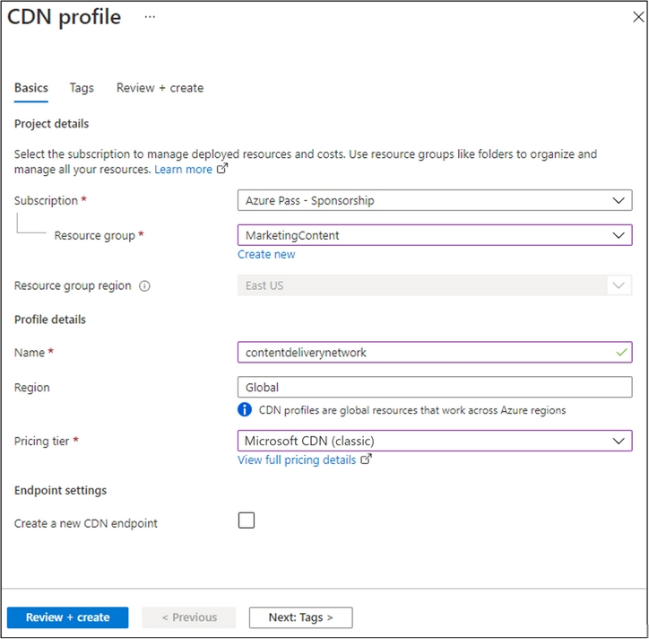
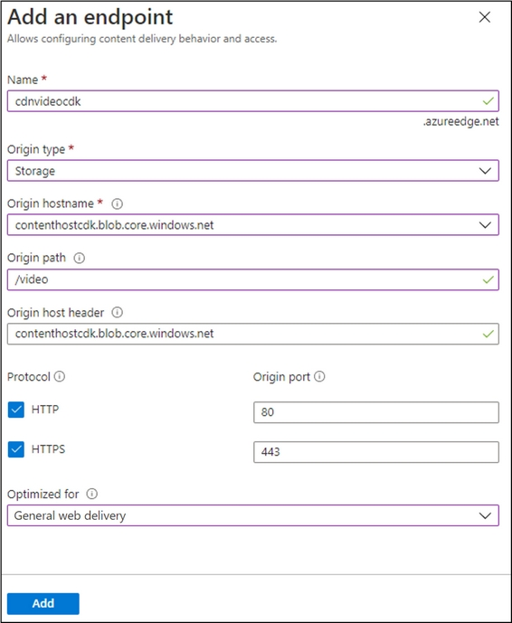

---
lab:
  az204Title: 'Lab 12: Enhance a web application by using the Azure Content Delivery Network'
  az204Module: 'Module 12: Integrate caching and content delivery within solutions'
---

# <a name="lab-12-enhance-a-web-application-by-using-the-azure-content-delivery-network"></a>Lab 12: Migliorare un'applicazione Web usando Rete di distribuzione dei contenuti di Azure

## <a name="microsoft-azure-user-interface"></a>Interfaccia utente di Microsoft Azure

Given the dynamic nature of Microsoft cloud tools, you might experience Azure UI changes that occur after the development of this training content. As a result, the lab instructions and lab steps might not align correctly.

Microsoft updates this training course when the community alerts us to needed changes. However, cloud updates occur frequently, so you might encounter UI changes before this training content updates. <bpt id="p1">**</bpt>If this occurs, adapt to the changes, and then work through them in the labs as needed.<ept id="p1">**</ept>

## <a name="instructions"></a>Istruzioni

### <a name="before-you-start"></a>Prima di iniziare

#### <a name="sign-in-to-the-lab-environment"></a>Accedere all'ambiente lab

Accedere alla macchina virtuale Windows 10 usando le credenziali seguenti:

- Nome utente: **Admin**

- Password: **Pa55w.rd**

> **Nota**: il docente fornirà le istruzioni necessarie per la connessione all'ambiente lab virtuale.

#### <a name="review-the-installed-applications"></a>Esaminare le applicazioni installate

Find the taskbar on your Windows 10 desktop. The taskbar contains the icon for the application that you'll use in this lab:

- Microsoft Edge

## <a name="architecture-diagram"></a>Diagramma dell'architettura


### <a name="exercise-1-create-azure-resources"></a>Esercizio 1: Creare risorse di Azure

#### <a name="task-1-open-the-azure-portal"></a>Attività 1: Aprire il portale di Azure

1. Sulla barra delle applicazioni selezionare l'icona di **Microsoft Edge**.

1. Nella finestra aperta del browser passare al portale di Azure (<https://portal.azure.com>) e quindi accedere con l'account che verrà usato per questo lab.

   > Considerata la natura dinamica degli strumenti cloud di Microsoft, è possibile rilevare modifiche all'interfaccia utente di Azure apportate dopo lo sviluppo di questo contenuto per la formazione.

#### <a name="task-2-create-a-storage-account"></a>Attività 2: Creare un account di archiviazione

1. Nel portale di Azure usare la casella di testo **Cerca risorse, servizi e documentazione** per cercare **Account di archiviazione** e quindi nell'elenco di risultati selezionare **Account di archiviazione**.

1. Nel pannello  **Account di archiviazione** selezionare **+ Crea**.

1. Nella scheda **Dati principali** del pannello **Crea un account di archiviazione** eseguire le azioni seguenti e selezionare **Rivedi e crea**:

   | Impostazione | Azione |
   | -- | -- |
   | Elenco a discesa **Sottoscrizione** | Mantenere il valore predefinito |
   | Sezione **Gruppo di risorse** | Selezionare **Crea nuovo**, immettere **MarketingContent** e quindi selezionare **OK** |
   | Casella di testo **Nome account di archiviazione**  | Immettere **contenthost** _[nomeutente]_ |
   | Elenco a discesa **Area** | Selezionare **(Stati Uniti) Stati Uniti orientali** |
   | Sezione **Prestazioni** | Selezionare l'opzione **Standard** |
   | Elenco a discesa **Ridondanza** | Selezionare **Archiviazione con ridondanza locale**. |

    Lo screenshot seguente mostra le impostazioni configurate nel pannello **Crea un account di archiviazione**.

    

1. Nella scheda **Rivedi e crea** esaminare le opzioni selezionate durante i passaggi precedenti.

1. Selezionare **Crea** per creare l'account di archiviazione usando la configurazione specificata.

    > **Nota**: prima di procedere con il lab, attendere il completamento dell'attività di creazione.

#### <a name="task-3-create-a-web-app-by-using-azure-app-service"></a>Attività 3: Creare un'app Web usando Servizio app di Azure

1. Nel riquadro di spostamento del portale di Azure selezionare **Crea una risorsa**.

1. Nel pannello **Crea una risorsa**, nella casella di testo **Cerca servizi e marketplace**, immettere **App Web** e quindi premere INVIO.

1. Nel pannello dei risultati della ricerca selezionare il risultato **App Web** e quindi selezionare **Crea**.

1. Nella scheda **Informazioni di base** del pannello **Crea app Web** eseguire le azioni seguenti e selezionare **Avanti: Docker**:

   | Impostazione | Azione |
   | -- | -- |
   | Elenco a discesa **Sottoscrizione** | Mantenere il valore predefinito |
   | Elenco a discesa **Gruppo di risorse** | Selezionare **MarketingContent** nell'elenco |
   | Casella di testo **Nome**  | Immettere **landingpage** _[nomeutente]_ |
   | Sezione **Pubblica** | Selezionare **Contenitore Docker** |
   | Sezione **Sistema operativo** | Selezionare **Linux**. |
   | Elenco a discesa **Area** | Selezionare **Stati Uniti orientali**. |
   | Sezione **Piano Linux (Stati Uniti orientali)** | È quindi possibile che le istruzioni e le procedure del lab non siano allineate correttamente. |
   | Sezione **SKU e dimensioni** | Mantenere il valore predefinito |

   Lo screenshot seguente mostra le impostazioni configurate nel pannello **Crea app Web**.

   

1. Nella scheda **Docker** eseguire le azioni seguenti e quindi selezionare **Rivedi e crea**:

   | Impostazione | Azione |
   | -- | -- |
   | Elenco a discesa **Opzioni** | Selezionare **Contenitore singolo** |
   | Elenco a discesa **Origine immagine** | Selezionare **Docker Hub** |
   | Elenco a discesa **Tipo di accesso** | Selezionare **Pubblico** |
   | Casella di testo **Immagine e tag** | Immettere **microsoftlearning/edx-html-landing-page:latest** |

   Lo screenshot seguente mostra le impostazioni configurate nella scheda **Docker**.

   

1. Nella scheda **Rivedi e crea** esaminare le opzioni selezionate durante i passaggi precedenti.

1. Selezionare **Crea** per creare l'app Web usando la configurazione specificata.

    > **Nota**: prima di procedere con il lab, attendere il completamento dell'attività di creazione.

1. Nel pannello **Distribuzione** selezionare **Vai alla risorsa**.

1. On the <bpt id="p1">**</bpt>App Service Overview<ept id="p1">**</ept> blade, in the <bpt id="p2">**</bpt>Essentials<ept id="p2">**</ept>, record the value of the <bpt id="p3">**</bpt>URL<ept id="p3">**</ept> link. You'll use this value later in the lab.

#### <a name="review"></a>Verifica

In questo esercizio sono stati creati un account di archiviazione di Azure e un'app Web di Azure che verranno usati più avanti in questo lab.

### <a name="exercise-2-configure-content-delivery-network-and-endpoints"></a>Esercizio 2: Configurare Rete di distribuzione dei contenuti e gli endpoint

#### <a name="task-1-open-azure-cloud-shell"></a>Attività 1: Aprire Azure Cloud Shell

1. Microsoft aggiorna questo corso di formazione quando la community segnala le modifiche necessarie.

    > Poiché gli aggiornamenti cloud vengono apportati spesso, tuttavia, è possibile che si rilevino modifiche all'interfaccia utente prima degli aggiornamenti del contenuto per la formazione.

1. Nel portale di Azure, nel prompt dei comandi di **Cloud Shell** eseguire il comando seguente per ottenere la versione dello strumento dell'interfaccia della riga di comando di Azure:

    ```bash
    az --version
    ```

#### <a name="task-2-register-the-microsoftcdn-provider"></a>Attività 2: Registrare il provider Microsoft.CDN

1. Al prompt dei comandi di **Cloud Shell** nel portale eseguire le azioni seguenti:

    **In questo caso, adattarsi alle modifiche e quindi eseguire le operazioni necessarie nei lab.**

    ```bash
    az --help
    ```

    b.  Enter the following command, and then select Enter to get a list of the commands that are available for resource providers:

    ```bash
    az provider --help
    ```

    c.  Enter the following command, and then select Enter to list all currently registered providers:

     ```bash
     az provider list
     ```

    d.  Enter the following command, and then select Enter to list only the namespaces of the currently registered providers:

     ```bash
     az provider list --query "[?registrationState=='Registered'].namespace"
     ```

    e.  Observe the list of currently registered providers. The <bpt id="p1">**</bpt>Microsoft.CDN<ept id="p1">**</ept> provider isn't currently in the list of providers.

    f.  Enter the following command, and then select Enter to get the required flags to register a new provider:

     ```bash
     az provider register --help
     ```

    g.  Enter the following command, and then select Enter to register the <bpt id="p1">**</bpt>Microsoft.CDN<ept id="p1">**</ept> namespace with your current subscription:

     ```bash
     az provider register --namespace Microsoft.CDN
     ```

1. Chiudere il riquadro **Cloud Shell** nel portale.

#### <a name="task-3-create-a-content-delivery-network-profile"></a>Attività 3: Creare un profilo di Rete di distribuzione dei contenuti

1. Nel riquadro di spostamento del portale di Azure selezionare **Crea una risorsa**.

1. Nel pannello **Crea una risorsa**, nella casella di testo **Cerca servizi e marketplace**, immettere **CDN** e quindi premere INVIO.

1. Nel pannello dei risultati della ricerca nel **Marketplace** selezionare il risultato **Profili Frontdoor e CDN** e quindi selezionare **Crea**.

1. Nella pagina **Confronta offerte** selezionare **Esplora altre offerte** e quindi selezionare **Rete CDN di Azure Standard da Akamai** e quindi selezionare **Continua**.

1. Nella scheda **Profilo CDN** del pannello **Informazioni principali** eseguire le azioni seguenti e selezionare **Rivedi e crea**:

   | Impostazione | Azione |
   | -- | -- |
   | Elenco a discesa **Sottoscrizione** | Mantenere il valore predefinito |
   | Elenco a discesa **Gruppo di risorse** | Selezionare **MarketingContent** nell'elenco |
   | Casella di testo **Nome**  | Immettere **contentdeliverynetwork** |
   | Casella di testo **Area** | Mantenere il valore predefinito (Globale) |
   | Elenco a discesa **Piano tariffario** | Selezionare **Akamai Standard** |
   | Casella di controllo **Crea un nuovo endpoint rete CDN ora** | Non selezionato |

   Lo screenshot seguente mostra le impostazioni configurate nel pannello **Profilo CDN**.

   

1. Nella scheda **Rivedi e crea** esaminare le opzioni selezionate durante i passaggi precedenti.

1. Selezionare **Crea** per creare il profilo CDN usando la configurazione specificata.
  
    > <bpt id="p1">**</bpt>Note<ept id="p1">**</ept>: Wait for Azure to finish creating the CDN profile before you move forward with the lab. You'll receive a notification when the app is created.

#### <a name="task-4-configure-storage-containers"></a>Attività 4: Configurare Contenitori di archiviazione

1. Nel riquadro di spostamento del portale di Azure selezionare **Gruppi di risorse**.

1. Nel pannello **Gruppi di risorse** selezionare il gruppo di risorse **MarketingContent** creato in precedenza in questo lab.

1. Nel pannello **MarketingContent** selezionare l'account di archiviazione **contenthost** _[nomeutente]_ creato in precedenza in questo lab.

1. Nel pannello **Account di archiviazione** selezionare il collegamento **Contenitori** nella sezione **Archiviazione dati**.

1. Nella sezione **Contenitori** selezionare **+ Contenitore**.

1. Nella finestra popup **Nuovo contenitore** eseguire le azioni seguenti e quindi selezionare **Crea**:

   | Impostazione | Azione |
   | -- | -- |
   | Casella di testo **Nome**  | Immettere **media** |
   | Elenco a discesa **Livello di accesso pubblico** | Selezionare **BLOB (accesso in lettura anonimo solo per i BLOB)** |

1. Nella sezione **Contenitori** selezionare di nuovo **+ Contenitore**.

1. Nella finestra popup **Nuovo contenitore** eseguire le azioni seguenti e quindi selezionare **Crea**:

   | Impostazione | Azione |
   | -- | -- |
   | Casella di testo **Nome**  | Immettere **video** |
   | Elenco a discesa **Livello di accesso pubblico** | Selezionare **BLOB (accesso in lettura anonimo solo per i BLOB)** |

1. Osservare l'elenco dei contenitori aggiornato e verificare che siano elencati i contenitori **media** e **video**.

#### <a name="task-5-create-content-delivery-network-endpoints"></a>Attività 5: Creare endpoint di Rete di distribuzione dei contenuti di Azure

1. Nel riquadro di spostamento del portale di Azure selezionare il collegamento **Gruppi di risorse**.

1. Nel pannello **Gruppi di risorse** selezionare il gruppo di risorse **MarketingContent** creato in precedenza in questo lab.

1. Nel pannello **MarketingContent** selezionare il profilo CDN **contentdeliverynetwork** creato in precedenza in questo lab.

1. Nel pannello **Profilo CDN** selezionare **+ Endpoint**.

1. Nella finestra di dialogo popup **Aggiungi un endpoint** eseguire le azioni seguenti e quindi selezionare **Aggiungi**:

   | Impostazione | Azione |
   | -- | -- |
   | Casella di testo **Nome**  | Immettere **cdnmedia** _[nomeutente]_ |
   | Elenco a discesa **Tipo di origine** | Selezionare **Archiviazione** |
   | Elenco a discesa **Nome host dell'origine** | Selezionare l'opzione **contenthost *[nomeutente]* .blob.core.windows.net** per l'account di archiviazione creato in precedenza in questo lab |
   | Casella di testo **Percorso dell'origine** | Immettere **/media** |
   | Casella di testo **Intestazione host dell'origine** | Mantenere il valore predefinito |
   | Sezioni **Protocollo** e **Porta dell'origine** | Mantenere i valori predefiniti |
   | Elenco a discesa **Ottimizzato per** | Selezionare **Distribuzione Web generale** |

   Lo screenshot seguente mostra le impostazioni configurate nella finestra di dialogo **Aggiungi un endpoint**.

   

1. Nel pannello **Profilo CDN** selezionare di nuovo **+ Endpoint**.

1. Nella finestra di dialogo popup **Aggiungi un endpoint** eseguire le azioni seguenti e quindi selezionare **Aggiungi**:

   | Impostazione | Azione |
   | -- | -- |
   | Casella di testo **Nome**  | Immettere **cdnvideo** _[nomeutente]_ |
   | Elenco a discesa **Tipo di origine** | Selezionare **Archiviazione** |
   | Elenco a discesa **Nome host dell'origine** | Selezionare l'opzione **contenthost *[nomeutente]* .blob.core.windows.net** per l'account di archiviazione creato in precedenza in questo lab |
   | Casella di testo **Percorso dell'origine** | Immettere **/video** |
   | Casella di testo **Intestazione host dell'origine** | Mantenere il valore predefinito |
   | Sezioni **Protocollo** e **Porta dell'origine** | Mantenere i valori predefiniti |
   | Elenco a discesa **Ottimizzato per** | Selezionare **Streaming multimediale video on demand** |

   Lo screenshot seguente mostra le impostazioni configurate nella finestra di dialogo **Aggiungi un endpoint**.

   

1. Nel pannello **Profilo CDN** selezionare di nuovo **+ Endpoint**.

1. Nella finestra di dialogo popup **Aggiungi un endpoint** eseguire le azioni seguenti e quindi selezionare **Aggiungi**:

   | Impostazione | Azione |
   | -- | -- |
   | Casella di testo **Nome**  | Immettere **cdnweb** _[nomeutente]_ |
   | Elenco a discesa **Tipo di origine** | Selezionare **App Web** |
   | Elenco a discesa **Nome host dell'origine** | Selezionare l'opzione **landingpage *[nomeutente]* .azurewebsites.net** per l'app Web creata in precedenza in questo lab |
   | Casella di testo **Percorso dell'origine** | Mantenere il valore predefinito |
   | Casella di testo **Intestazione host dell'origine** | Mantenere il valore predefinito |
   | Sezioni **Protocollo** e **Porta dell'origine** | Mantenere i valori predefiniti |
   | Elenco a discesa **Ottimizzato per** | Selezionare **Distribuzione Web generale** |

   Lo screenshot seguente mostra le impostazioni configurate nella finestra di dialogo **Aggiungi un endpoint**.

   

#### <a name="review"></a>Verifica

In questo esercizio è stato registrato il provider di risorse per rete per la distribuzione di contenuti (rete CDN) e quindi il provider è stato usato per creare sia un profilo CDN che le risorse endpoint.

### <a name="exercise-3-upload-and-configure-static-web-content"></a>Esercizio 3: Caricare e configurare contenuto Web statico

#### <a name="task-1-observe-the-landing-page"></a>Attività 1: Osservare la pagina di destinazione

1. Nel riquadro di spostamento del portale di Azure selezionare **Gruppi di risorse**.

1. Nel pannello **Gruppi di risorse** selezionare il gruppo di risorse **MarketingContent** creato in precedenza in questo lab.

1. Nel pannello **MarketingContent** selezionare l'app Web **landingpage** _[nomeutente]_ creata in precedenza in questo lab.

1. On the <bpt id="p1">**</bpt>App Service<ept id="p1">**</ept> blade, select <bpt id="p2">**</bpt>Browse<ept id="p2">**</ept>. A new browser tab opens and returns the current website. Observe the error message displayed on the screen. The website won't work until you configure the specified settings to reference multimedia content.

1. Tornare alla finestra del browser attualmente aperta che visualizza il portale di Azure.

#### <a name="task-2-upload-storage-blobs"></a>Attività 2: Caricare BLOB di archiviazione

1. Nel riquadro di spostamento del portale di Azure selezionare **Gruppi di risorse**.

1. Nel pannello **Gruppi di risorse** selezionare il gruppo di risorse **MarketingContent** creato in precedenza in questo lab.

1. Nel pannello **MarketingContent** selezionare l'account di archiviazione **contenthost** _[nomeutente]_ creato in precedenza in questo lab.

1. Nel pannello **Account di archiviazione** selezionare il collegamento **Contenitori** nella sezione **Archiviazione dati**.

1. Nella sezione **Contenitori** selezionare il contenitore **media** e quindi selezionare **Carica**.

1. Nella finestra popup **Carica BLOB** eseguire le azioni seguenti:

    a.  In the <bpt id="p1">**</bpt>Files<ept id="p1">**</ept> section, select the <bpt id="p2">**</bpt>Folder<ept id="p2">**</ept> icon.

    Trovare la barra delle applicazioni nel desktop di Windows 10.

    - **campus.jpg**

    - **conference.jpg**

    - **poster.jpg**

    Questa barra delle applicazioni contiene l'icona dell'applicazione che verrà usata in questo lab:  

    > **Nota**: prima di procedere con questo lab, attendere il completamento del caricamento del BLOB.

1. Nel pannello **Contenitore** selezionare **Proprietà** nella sezione **Impostazioni**.

1. Record the value in the <bpt id="p1">**</bpt>URL<ept id="p1">**</ept> text box. You'll use this value later in the lab.

1. Chiudere il pannello **Contenitore**.

1. Nel pannello **Contenitori** selezionare il contenitore **video** e quindi selezionare **Carica**.

1. Nella finestra popup **Carica BLOB** eseguire le azioni seguenti:

    a.  In the <bpt id="p1">**</bpt>Files<ept id="p1">**</ept> section, select the <bpt id="p2">**</bpt>Folder<ept id="p2">**</ept> icon.

    b.  In the <bpt id="p1">**</bpt>File Explorer<ept id="p1">**</ept> window, browse to <bpt id="p2">**</bpt>Allfiles (F):<ph id="ph1">\\</ph>Allfiles<ph id="ph2">\\</ph>Labs<ph id="ph3">\\</ph>12<ph id="ph4">\\</ph>Starter<ept id="p2">**</ept>, select the <bpt id="p3">**</bpt>welcome.mp4<ept id="p3">**</ept> file, and then select <bpt id="p4">**</bpt>Open<ept id="p4">**</ept>.

    c.  Ensure that <bpt id="p1">**</bpt>Overwrite if files already exist<ept id="p1">**</ept> is selected, and then select <bpt id="p2">**</bpt>Upload<ept id="p2">**</ept>.  

    > **Nota**: prima di procedere con questo lab, attendere il completamento del caricamento del BLOB.

1. Nel pannello **Contenitore** selezionare **Proprietà** nella sezione **Impostazioni**.

1. Record the value in the <bpt id="p1">**</bpt>URL<ept id="p1">**</ept> text box. You'll use this value later in the lab.

#### <a name="task-3-configure-web-app-settings"></a>Attività 3: Configurare le impostazioni dell'app Web

1. Nel riquadro di spostamento del portale di Azure selezionare **Gruppi di risorse**.

1. Nel pannello **Gruppi di risorse** selezionare il gruppo di risorse **MarketingContent** creato in precedenza in questo lab.

1. Nel pannello **MarketingContent** selezionare l'app Web **landingpage** _[nomeutente]_ creata in precedenza in questo lab.

1. Nel pannello **Servizio app**, nella categoria **Impostazioni**, selezionare il collegamento **Configurazione**.

1. Nella scheda **Impostazioni dell'applicazione** della sezione **Configurazione** selezionare **Nuova impostazione applicazione**.

1. Nella finestra popup **Aggiungi/Modifica impostazione applicazione** configurare le impostazioni seguenti e quindi selezionare **OK**.

   | Impostazione | Azione |
   | -- | -- |
   | Casella di testo **Nome**  | Immettere **CDNMediaEndpoint** |
   | Casella di testo **Valore** | Immettere il valore **URI** del contenitore **media** nell'account di archiviazione **contenthost** _[nomeutente]_ registrato in precedenza in questo lab |
   | Casella di controllo **Impostazione slot di distribuzione** | Non selezionare |

1. Tornare alla sezione **Configurazione** e quindi selezionare **Nuova impostazione applicazione**.

1. Nella finestra popup **Aggiungi/Modifica impostazione applicazione** configurare le impostazioni seguenti e quindi selezionare **OK**.

   | Impostazione | Azione |
   | -- | -- |
   | Casella di testo **Nome**  | Immettere **CDNVideoEndpoint** |
   | Casella di testo **Valore** | Immettere il valore **URI** del contenitore **video** nell'account di archiviazione **contenthost** _[nomeutente]_ registrato in precedenza in questo lab |
   | Casella di controllo **Impostazione slot di distribuzione** | Non selezionare |

1. Return to the <bpt id="p1">**</bpt>Configuration<ept id="p1">**</ept> section, and then select <bpt id="p2">**</bpt>Save<ept id="p2">**</ept>. Select <bpt id="p1">**</bpt>Continue<ept id="p1">**</ept> to confirm your changes.

   > **Nota**: prima di procedere con questo lab, attendere il completamento del salvataggio delle impostazioni dell'applicazione.

#### <a name="task-4-validate-the-corrected-landing-page"></a>Attività 4: Convalidare la pagina di destinazione corretta

1. Nel riquadro di spostamento del portale di Azure selezionare **Gruppi di risorse**.

1. Nel pannello **Gruppi di risorse** selezionare il gruppo di risorse **MarketingContent** creato in precedenza in questo lab.

1. Nel pannello **MarketingContent** selezionare l'app Web **landingpage** _[nomeutente]_ creata in precedenza in questo lab.

1. Nel pannello **Servizio app** selezionare **Riavvia** e quindi **Sì** per confermare il processo di riavvio dell'app.

   > <bpt id="p1">**</bpt>Note<ept id="p1">**</ept>: Wait for the restart operation to complete before you move forward with the lab. You'll receive a notification when the operation is done.

1. On the <bpt id="p1">**</bpt>App Service<ept id="p1">**</ept> blade, select <bpt id="p2">**</bpt>Browse<ept id="p2">**</ept>. A new browser window or tab will open and return to the current website. Observe the updated website rendering multimedia content of various types.

1. Tornare alla finestra del browser attualmente aperta che visualizza il portale di Azure.

#### <a name="review"></a>Verifica

In questo esercizio il contenuto multimediale è stato caricato come BLOB in contenitori di archiviazione e quindi è stata aggiornata l'app Web in modo che punti direttamente ai BLOB di archiviazione.

### <a name="exercise-4-use-content-delivery-network-endpoints"></a>Esercizio 4: endpoint di Rete di distribuzione dei contenuti di Azure

#### <a name="task-1-retrieve-endpoint-uniform-resource-identifiers-uris"></a>Attività 1: Recuperare gli URI (Uniform Resource Identifier) dell'endpoint

1. Nel riquadro di spostamento del portale di Azure selezionare il collegamento **Gruppi di risorse**.

1. Nel pannello **Gruppi di risorse** selezionare il gruppo di risorse **MarketingContent** creato in precedenza in questo lab.

1. Nel pannello **MarketingContent** selezionare il profilo CDN **contentdeliverynetwork** creato in precedenza in questo lab.

1. Nel pannello **Profilo CDN** selezionare l'endpoint **cdnmedia** _[nomeutente]_ .

1. **Nota**: se si sta eseguendo l'accesso al portale di Azure per la prima volta, verrà visualizzata una presentazione del portale.

1. Chiudere il pannello **Endpoint**.

1. Nel pannello **Profilo CDN** selezionare l'endpoint **cdnvideo** _[nomeutente]_ .

1. Selezionare **Attività iniziali** per ignorare la presentazione e iniziare a usare il portale.

1. Chiudere il pannello **Endpoint**.

#### <a name="task-2-test-multimedia-content"></a>Attività 2: Testare il contenuto multimediale

1. Creare un URL per la risorsa **campus.jpg** combinando l'URL del **nome host** dell'endpoint **cdnmedia** _[nomeutente]_ copiato in precedenza in questo lab con il percorso relativo di **/campus.jpg**.

    > **Nota**: ad esempio, se l'URL del **nome host dell'endpoint** è `https://cdnmediastudent.azureedge.net/`, il nuovo URL creato sarà `https://cdnmediastudent.azureedge.net/campus.jpg`.

1. Creare un URL per la risorsa **conference.jpg** combinando l'URL del **nome host** dell'endpoint **cdnmedia** _[nomeutente]_ copiato in precedenza in questo lab con il percorso relativo di **/conference.jpg**.

    > **Nota**: ad esempio, se l'URL del **nome host dell'endpoint** è `https://cdnmediastudent.azureedge.net/`, il nuovo URL creato sarà `https://cdnmediastudent.azureedge.net/conference.jpg`.

1. Creare un URL per la risorsa **poster.jpg** combinando l'URL del **nome host** dell'endpoint **cdnmedia** _[nomeutente]_ copiato in precedenza in questo lab con il percorso relativo di **/poster.jpg**.

    > **Nota**: ad esempio, se l'URL del **nome host dell'endpoint** è `https://cdnmediastudent.azureedge.net/`, il nuovo URL creato sarà `https://cdnmediastudent.azureedge.net/poster.jpg`.

1. Creare un URL per la risorsa **welcome.mp4** combinando l'URL del **nome host** dell'endpoint **cdnvideo** _[nomeutente]_ copiato in precedenza in questo lab con il percorso relativo di **/welcome.mp4**.

    > **Nota**: ad esempio, se l'URL del **nome host dell'endpoint** è `https://cdnvideostudent.azureedge.net/`, il nuovo URL creato sarà `https://cdnvideostudent.azureedge.net/welcome.mp4`.

1. Sulla barra delle applicazioni attivare il menu di scelta rapida per l'icona di **Microsoft Edge** e quindi selezionare **Nuova finestra**.

1. Nella nuova finestra del browser fare riferimento all'URL creato per la risorsa multimediale **campus.jpg** e quindi verificare che la risorsa sia stata trovata correttamente.

    > <bpt id="p1">**</bpt>Note<ept id="p1">**</ept>: If the content isn't available yet, the CDN endpoint is still initializing. This initialization process can take anywhere from 5 to 15 minutes.

1. Fare riferimento all'URL creato per la risorsa multimediale **conference.jpg** e quindi verificare che la risorsa sia stata trovata correttamente.

1. Fare riferimento all'URL creato per la risorsa multimediale **poster.jpg** e quindi verificare che la risorsa sia stata trovata correttamente.

1. Fare riferimento all'URL creato per la risorsa video **welcome.mp4** e quindi verificare che la risorsa sia stata trovata correttamente.

1. Chiudere la finestra del browser creata in questa attività.

#### <a name="task-3-update-the-web-app-settings"></a>Attività 3: Aggiornare le impostazioni dell'app Web

1. Nel riquadro di spostamento del portale di Azure selezionare **Gruppi di risorse**.

1. Nel pannello **Gruppi di risorse** selezionare il gruppo di risorse **MarketingContent** creato in precedenza in questo lab.

1. Nel pannello **MarketingContent** selezionare l'app Web **landingpage** _[nomeutente]_ creata in precedenza in questo lab.

1. Nel pannello **Servizio app**, nella categoria **Impostazioni**, selezionare il collegamento **Configurazione**.

1. Nella sezione **Configurazione** selezionare la scheda **Impostazioni applicazione**.

1. Selezionare l'impostazione dell'applicazione **CDNMediaEndpoint** esistente.

1. Nella finestra di dialogo popup **Aggiungi/Modifica impostazione applicazione** aggiornare la casella di testo **Valore** immettendo l'URL **nome host** dell'endpoint **cdnmedia** _[nomeutente]_ copiato in precedenza nel lab, quindi selezionare **OK**.

1. Selezionare l'impostazione dell'applicazione **CDNVideoEndpoint** esistente.

1. Nella finestra di dialogo popup **Aggiungi/Modifica impostazione applicazione** aggiornare la casella di testo **Valore** immettendo l'URL **nome host** dell'endpoint **cdnvideo** _[nomeutente]_ copiato in precedenza nel lab, quindi selezionare **OK**.

1. Selezionare **Salva** e quindi **Continua** per confermare le modifiche.  

   > **Nota**: prima di procedere con questo lab, attendere il completamento del salvataggio delle impostazioni dell'applicazione.

1. Nella sezione **Configurazione** selezionare **Panoramica**.

1. Nella sezione **Panoramica** selezionare **Riavvia** e quindi **Sì** per confermare il processo di riavvio dell'app.

   > <bpt id="p1">**</bpt>Note<ept id="p1">**</ept>: Wait for the restart operation to complete before you continue with the lab. You'll receive a notification when the operation is done.

#### <a name="task-4-test-the-web-content"></a>Attività 4: Testare il contenuto Web

1. Nel riquadro di spostamento del portale di Azure selezionare il collegamento **Gruppi di risorse**.

1. Nel pannello **Gruppi di risorse** selezionare il gruppo di risorse **MarketingContent** creato in precedenza in questo lab.

1. Nel pannello **MarketingContent** selezionare il profilo CDN **contentdeliverynetwork** creato in precedenza in questo lab.

1. Nel pannello **Profilo CDN** selezionare l'endpoint **cdnweb** _[nomeutente]_.

1. Nel pannello **Endpoint** copiare il valore del collegamento **Nome host dell'endpoint**.

1. Sulla barra delle applicazioni attivare il menu di scelta rapida per l'icona di **Microsoft Edge** e quindi selezionare **Nuova finestra**.

1. Nella nuova finestra del browser fare riferimento all'URL **nome host** per l'endpoint **cdnweb** _[nomeutente]_.

1. Osservare il sito Web e il contenuto multimediale che vengono tutti gestiti usando Rete di distribuzione dei contenuti.

#### <a name="review"></a>Verifica

In questo esercizio l'app Web è stata aggiornata per usare Rete di distribuzione dei contenuti per gestire contenuto multimediale e per gestire l'applicazione Web stessa.

### <a name="exercise-5-clean-up-your-subscription"></a>Esercizio 5: Pulire la sottoscrizione

#### <a name="task-1-open-azure-cloud-shell"></a>Attività 1: Aprire Azure Cloud Shell

1. In the Azure portal, select the <bpt id="p1">**</bpt>Cloud Shell<ept id="p1">**</ept> icon <ph id="ph1"></ph> to open a new Bash session. If Cloud Shell defaults to a PowerShell session, select <bpt id="p1">**</bpt>PowerShell<ept id="p1">**</ept>, and then in the drop-down menu, select <bpt id="p2">**</bpt>Bash<ept id="p2">**</ept>.

    > <bpt id="p1">**</bpt>Note<ept id="p1">**</ept>: If this is the first time you're starting <bpt id="p2">**</bpt>Cloud Shell<ept id="p2">**</ept>, when prompted to select either <bpt id="p3">**</bpt>Bash<ept id="p3">**</ept> or <bpt id="p4">**</bpt>PowerShell<ept id="p4">**</ept>, select <bpt id="p5">**</bpt>PowerShell<ept id="p5">**</ept>. When you're presented with the <bpt id="p1">**</bpt>You have no storage mounted<ept id="p1">**</ept> message, select the subscription you're using in this lab, and select <bpt id="p2">**</bpt>Create storage<ept id="p2">**</ept>.

#### <a name="task-2-delete-a-resource-group"></a>Attività 2: Eliminare un gruppo di risorse

1. Nel riquadro **Cloud Shell** eseguire il comando seguente per eliminare il gruppo di risorse **MarketingContent**:

    ```bash
    az group delete --name MarketingContent --no-wait --yes
    ```

     > **Nota**: il comando viene eseguito in modo asincrono, in base a quanto determinato dal parametro *--no-wait*, quindi, sebbene sia possibile eseguire un altro comando dell'interfaccia della riga di comando di Azure immediatamente dopo nella stessa sessione di Bash, il gruppo di risorse verrà effettivamente rimosso dopo alcuni minuti.

1. Chiudere il riquadro **Cloud Shell** nel portale.

#### <a name="task-3-close-the-active-application"></a>Attività 3: Chiudere l'applicazione attiva

1. Chiudere l'applicazione Microsoft Edge in esecuzione.

#### <a name="review"></a>Verifica

In questo esercizio è stata pulita la sottoscrizione mediante la rimozione del gruppo di risorse usato in questo lab.
